# 数组

## [704. 二分查找](https://leetcode.cn/problems/binary-search/)

题解:https://leetcode.cn/problems/binary-search/solutions/8337/er-fen-cha-zhao-xiang-jie-by-labuladong/

找最左侧的target

```java
class Solution {
    public int search(int[] nums, int target) {
        int left = 0;
        int right = nums.length-1;
        //退出的结果是 left = right + 1
        while(left <= right){
            int mid = left + (right-left)/2;
            if(nums[mid] < target)// 搜索区间变为 [mid+1, right]
                left = mid + 1;
            else if(nums[mid] > target)// 搜索区间变为 [left, mid-1]
                right = mid - 1;
            else
                right = mid - 1;// 收缩右侧边界
        }
        //最终的left就是要插入的位置或者找到的第一个位置
        if(left == nums.length || nums[left] != target) return -1;
        return left;
    }
}
```


找最右侧target

```java
class Solution {
    public int search(int[] nums, int target) {
        int left = 0;
        int right = nums.length-1;
        //退出的结果是 left = right + 1
        while(left <= right){
            int mid = left + (right-left)/2;
            if(nums[mid] < target)// 搜索区间变为 [mid+1, right]
                left = mid + 1;
            else if(nums[mid] > target)// 搜索区间变为 [left, mid-1]
                right = mid - 1;
            else
                left = mid + 1;
        }
        if(right < 0 || nums[right] != target) return -1;
        return right;
    }
}
```

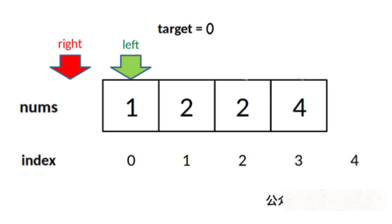

## [34. 在排序数组中查找元素的第一个和最后一个位置](https://leetcode.cn/problems/find-first-and-last-position-of-element-in-sorted-array/)

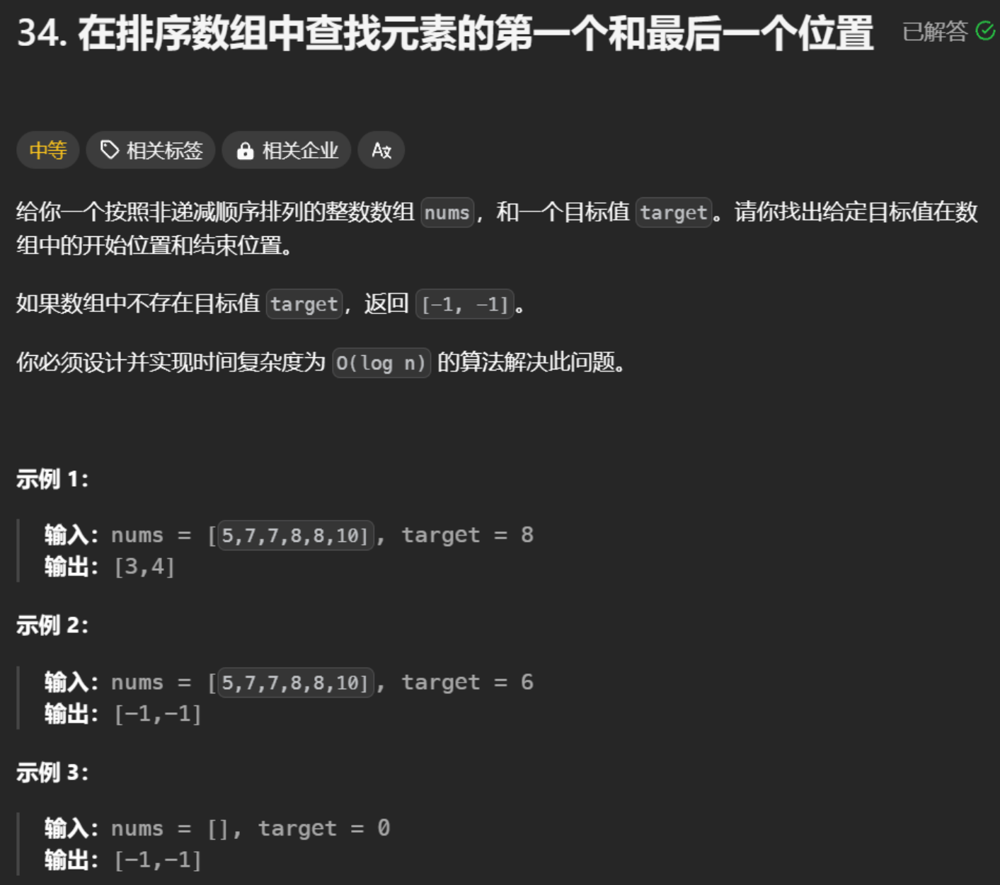

```java
class Solution {
    public int[] searchRange(int[] nums, int target) {
        int[] res = new int[2];
        Arrays.fill(res,-1);
        if(nums == null || nums.length == 0) return res;

        int left = 0;
        int right = nums.length-1;
        while(left <= right){
            int mid = left + (right-left)/2;
            if(nums[mid] < target)
                left = mid + 1;
            else
                right = mid - 1;
        }
        //如果没找到，left就是插入的位置
        if(left == nums.length || nums[left] != target)//重要重要重要！！！
            return res;
        res[0] = left;

        left = 0;
        right = nums.length-1;
        while(left <= right){
            int mid = left + (right-left)/2;
            if(nums[mid] <= target)
                left = mid + 1;
            else
                right = mid - 1;
        }
        //如果没找到，right在插入位置的上一个
        res[1] = right;
        
        return res;
    }
}
```

## [33. 搜索旋转排序数组](https://leetcode.cn/problems/search-in-rotated-sorted-array/)

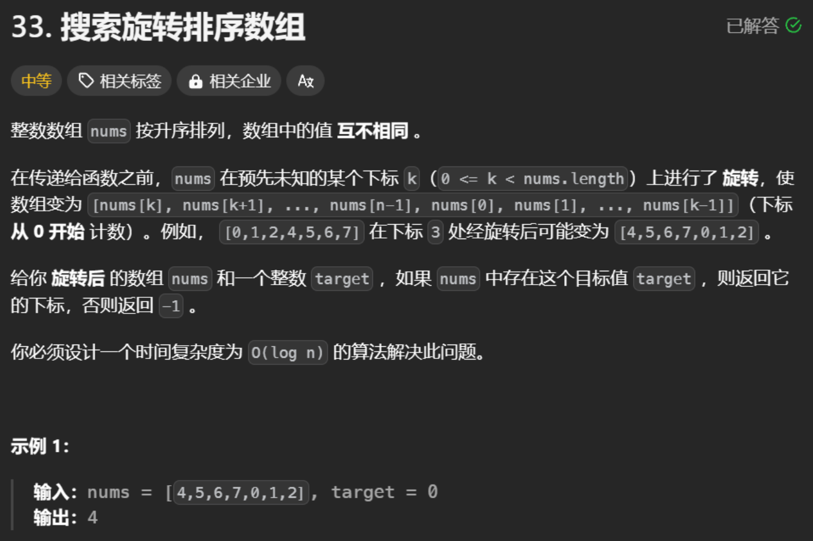

```java
class Solution {
    public int search(int[] nums, int target) {
        int left = 0;
        int right = nums.length-1;
        while(left <= right){
            int mid = left + (right-left)/2;
            if(nums[mid] == target)
                return mid;
            
            //前半段有序
            if(nums[left] <= nums[mid]){//注意有等于号，否则有的用例过不了！！！
                if(target >= nums[left] && target < nums[mid])
                    right = mid - 1;
                else
                    left = mid + 1;
            }else if(nums[left] > nums[mid]){//后半段有序
                if(target > nums[mid] && target <= nums[right])
                    left = mid + 1;
                else
                    right = mid - 1;
            }
        }
        return -1;
    }
}
```

## [LCR 128. 库存管理 I](https://leetcode.cn/problems/xuan-zhuan-shu-zu-de-zui-xiao-shu-zi-lcof/)

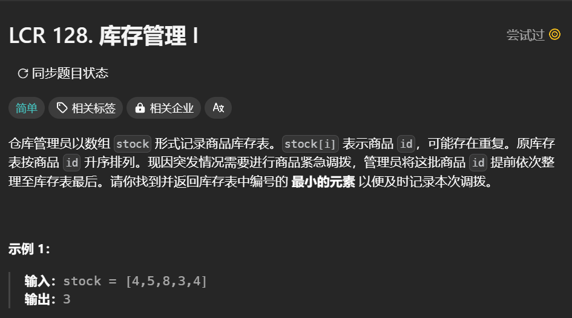

```java
class Solution {
    public int inventoryManagement(int[] stock) {
        int left = 0;
        int right = stock.length-1;
        while(left <= right){
            int mid = left + (right-left)/2;
            if(stock[mid] > stock[right]){
                left = mid + 1;
            }else if(stock[mid] < stock[right]){
                right = mid;
            }else{
                right--;
            }
        }
        return stock[left];
    }
}
```

```java
public int minArray(int[] numbers) {
    int left = 0, right = numbers.length - 1;
    while (left < right) {
        //找出left和right中间值的索引
        int mid = left + (right - left) / 2;
        if (numbers[mid] > numbers[right]) {
            //如果中间值大于最右边的值，说明旋转之后最小的
            //数字肯定在mid的右边，比如[3, 4, 5, 6, 7, 1, 2]
            left = mid + 1;
        } else if (numbers[mid] < numbers[right]) {
            //如果中间值小于最右边的值，说明旋转之后最小的
            //数字肯定在mid的前面，比如[6, 7, 1, 2, 3, 4, 5],
            //注意这里mid是不能减1的，比如[3，1，3]，我们这里只是
            //证明了numbers[mid]比numbers[right]小，但有可能
            //numbers[mid]是最小的，所以我们不能把它给排除掉
            right = mid;
        } else {
            //如果中间值等于最后一个元素的值，我们是没法确定最小值是
            // 在mid的前面还是后面，但我们可以缩小查找范围，让right
            // 减1，因为即使right指向的是最小值，但因为他的值和mid
            // 指向的一样，我们这里并没有排除mid，所以结果是不会有影响的。
            //比如[3，1，3，3，3，3，3]和[3，3，3，3，3，1，3],中间的值
            //等于最右边的值，但我们没法确定最小值是在左边还是右边
            right--;
        }
    }
    return numbers[left];
}
```

## [378. 有序矩阵中第 K 小的元素](https://leetcode.cn/problems/kth-smallest-element-in-a-sorted-matrix/)

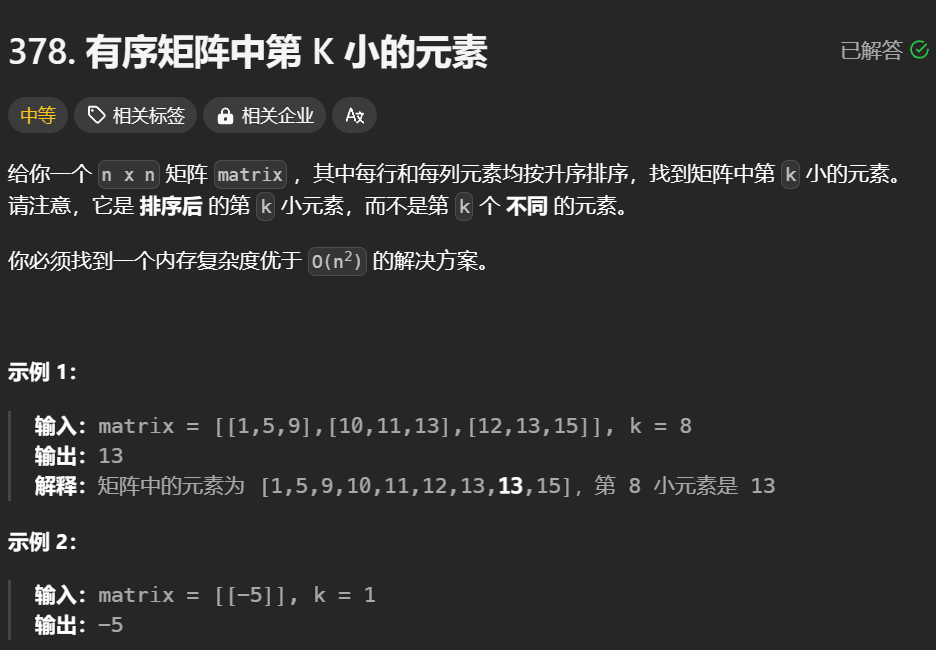

```java
class Solution {
    public int kthSmallest(int[][] matrix, int k) {
        int n = matrix.length;
        
        int left = matrix[0][0];
        int right = matrix[n-1][n-1];

        int target = 0;
        while(left <= right){
            int mid = left + (right-left)/2;
            int count = getCount(matrix,mid);
            if(count < k)
                left = mid + 1;
            else
                right = mid -1;
        }
        return left;
    }


    public int getCount(int[][] matrix,int num){
        int i = matrix.length-1;
        int j = 0;
        int count = 0;

        while(i >= 0 && j < matrix[0].length){
            if(matrix[i][j] <= num){
                count += i+1;
                j++;
            }else{
                i--;
            }
        }
        return count;
    }
}
```

上面写的二分是找到第一个符合条件的数，那么无疑就是数组中的数，比如案例中13,14都符合，但是13是第一个符合的数，所以选13

## [27. 移除元素](https://leetcode.cn/problems/remove-element/)

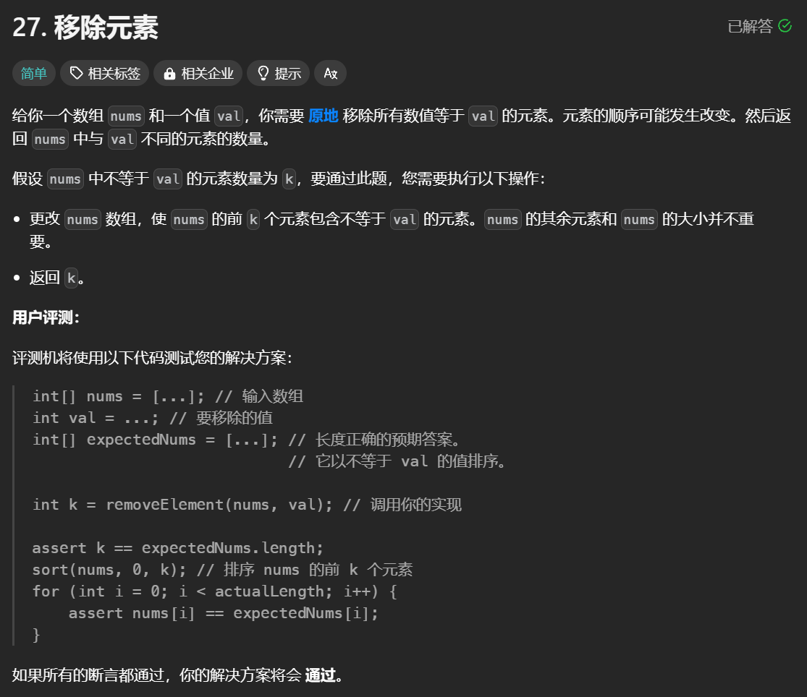

```java
class Solution {
    public int removeElement(int[] nums, int val) {
        int j = 0;
        for(int i = 0; i < nums.length; i++){
            if(nums[i] != val)  
                nums[j++] = nums[i];
        }
        return j;
    }
}
```

## [977. 有序数组的平方](https://leetcode.cn/problems/squares-of-a-sorted-array/)

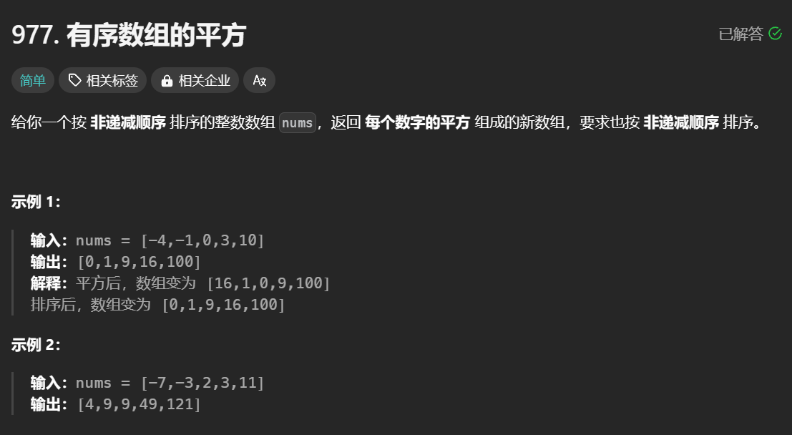

```java
class Solution {
    public int[] sortedSquares(int[] nums) {
        int[] res = new int[nums.length];
        int left = 0;
        int right = nums.length-1;
        int i = nums.length-1;
        while(left <= right){
            if(nums[left]*nums[left] >= nums[right]*nums[right]){
                 res[i--] = nums[left]*nums[left];
                 left++;
            }
            else{
                res[i--] = nums[right]*nums[right];
                right--;
            }
                
        }
        return res;
    }
}
```

## [209. 长度最小的子数组](https://leetcode.cn/problems/minimum-size-subarray-sum/)

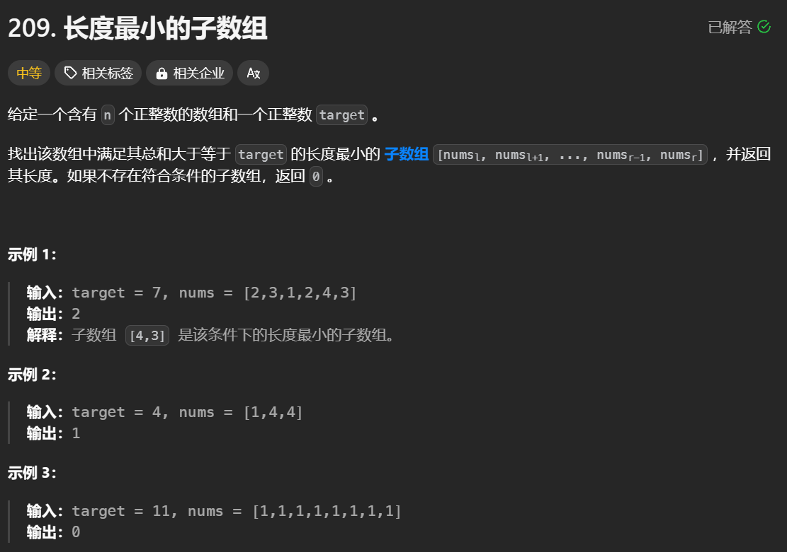

```java
class Solution {
    public int minSubArrayLen(int target, int[] nums) {
        int sum = 0;
        int min = Integer.MAX_VALUE;
        int left = 0;
        for(int right = 0; right < nums.length; right++){
            sum += nums[right];
            while(sum >= target){
                min = Math.min(min,right-left+1);

                sum -= nums[left];
                left++;
            }
        }
        return min == Integer.MAX_VALUE ? 0 : min;
    }
}
```

## [59. 螺旋矩阵 II](https://leetcode.cn/problems/spiral-matrix-ii/)

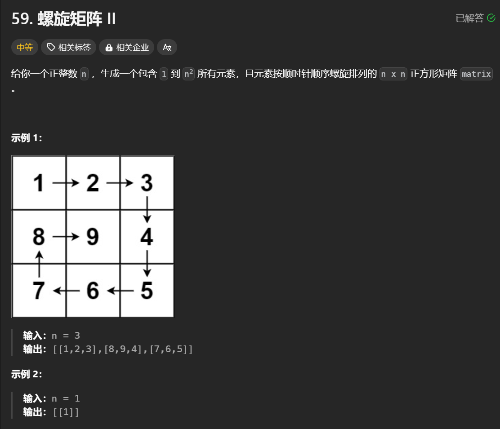

```java
class Solution {
    public int[][] generateMatrix(int n) {
        int[][] nums = new int[n][n];
        int count = 0;
        int x = 0,y = 0;
        int i = 1;
        while(count < n/2){
            //从左到右
            for(; y <  n-count - 1; y++){
                nums[x][y] = i++;
            }
            //从上到下
            for(; x < n-count - 1; x++){
                nums[x][y] = i++;
            }
            //从右到左
            for(;y > count; y--){
                nums[x][y] = i++;
            }
            //从下到上
            for(;x > count; x--){
                nums[x][y] = i++;
            }
            count++;
            x++;
            y++;
        }
        if(n % 2 != 0) nums[n/2][n/2] = i;
        return nums;
    }
}
```

## [58. 区间和（第九期模拟笔试） (kamacoder.com)](https://kamacoder.com/problempage.php?pid=1070)

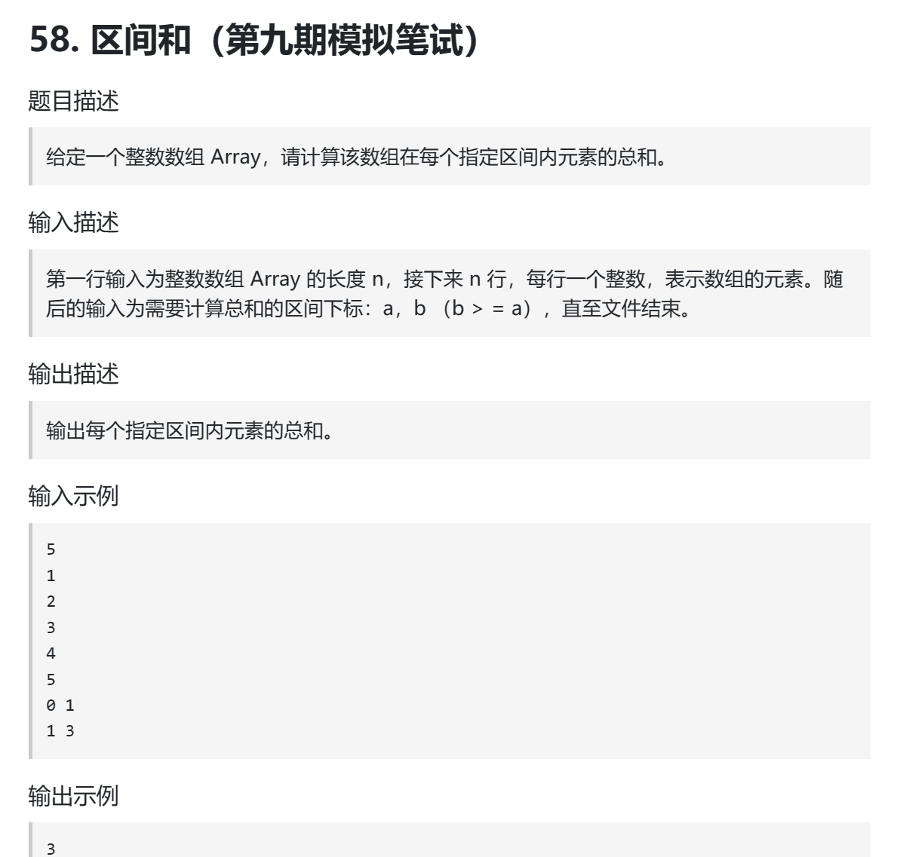

```java
import java.util.*;
public class Main{
    public static void main(String[] args){
        Scanner in = new Scanner(System.in);
        int n = in.nextInt();
        int[] nums = new int[n];
        for(int i = 0; i < nums.length; i++)
            nums[i] = in.nextInt();
        
        for(int i = 1; i < nums.length; i++)
            nums[i] += nums[i-1];
        while(in.hasNext()){
            int a = in.nextInt();
            int b = in.nextInt();
            if(a == 0){
                System.out.println(nums[b]);
            }else{
                System.out.println(nums[b] - nums[a-1]);
            }
        }
    }
}
```

## [44. 开发商购买土地（第五期模拟笔试） (kamacoder.com)](https://kamacoder.com/problempage.php?pid=1044)

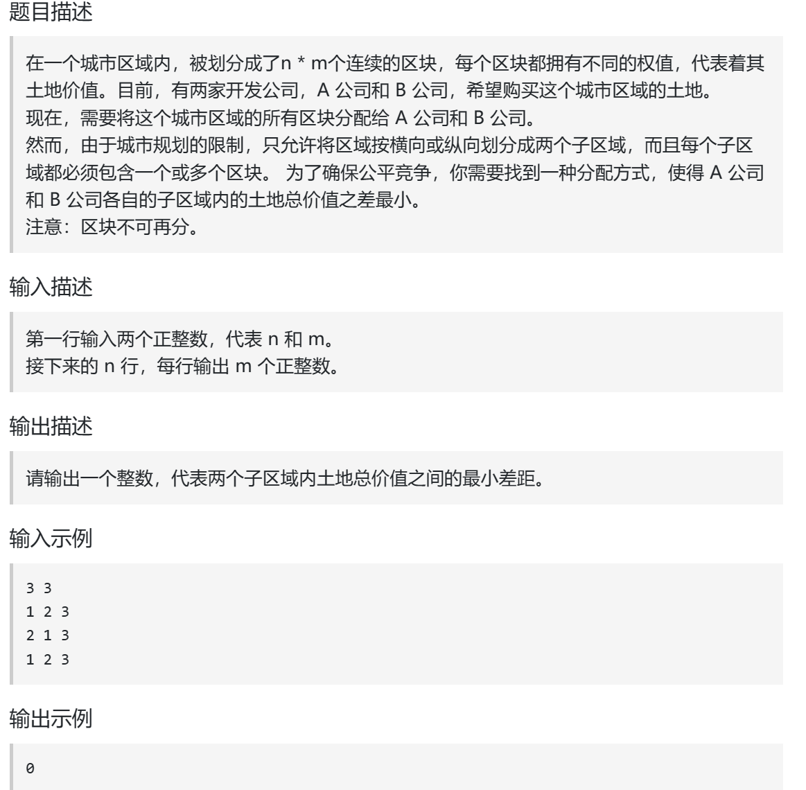

```java
import java.util.*;
public class Main{
    public static void main(String[] args){
        Scanner in = new Scanner(System.in);
        int n = in.nextInt();
        int m = in.nextInt();
        int[][] nums = new int[n][m];
        for(int i = 0; i < n; i++){
            for(int j = 0; j < m; j++)
                nums[i][j] = in.nextInt();
        }
        //数据处理完成
        int[] heng = new int[m];
        int[] zong = new int[n];
        for(int i = 0; i < n; i++){
            for(int j = 0; j < m; j++){
                heng[j] += nums[i][j];
                zong[i] += nums[i][j];
            }
        }
        //计算前缀和
        for(int i = 1; i < heng.length; i++)
            heng[i] += heng[i-1];
        for(int i = 1; i < zong.length; i++)
            zong[i] += zong[i-1];

        int min = Integer.MAX_VALUE;
        for(int i = 0; i < heng.length; i++)
            min = Math.min(min,Math.abs(heng[heng.length-1] - 2*heng[i]));
        for(int i = 0; i < zong.length; i++)
            min = Math.min(min,Math.abs(zong[zong.length-1] - 2*zong[i]));

        System.out.println(min);
    }
}

```

## [287. 寻找重复数](https://leetcode.cn/problems/find-the-duplicate-number/)

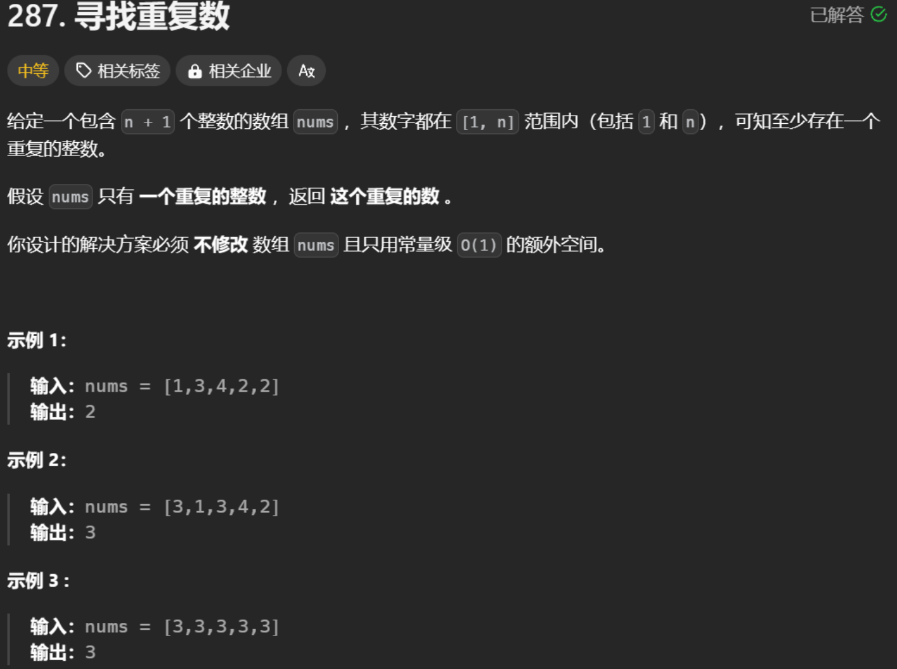

```java
class Solution {
    public int findDuplicate(int[] nums) {
        int slow = nums[0];
        int fast = nums[nums[0]];
        
        while(slow != fast){
            slow = nums[slow];
            fast = nums[nums[fast]];
        }

        slow = 0;
        while(slow != fast){
            slow = nums[slow];
            fast = nums[fast];
        }

        return slow;
    }
}
```

## [283. 移动零](https://leetcode.cn/problems/move-zeroes/)

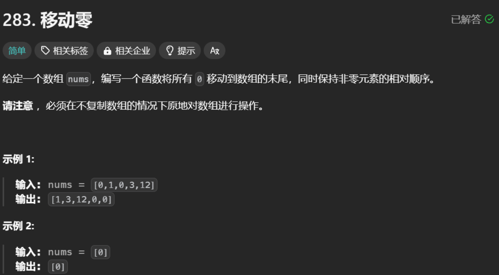

```java
class Solution {
    public void moveZeroes(int[] nums) {
        int left = 0;
        for(int right = 0; right < nums.length; right++){
            if(nums[right] != 0)
                nums[left++] = nums[right];
        }
        while(left<nums.length)
            nums[left++] = 0;
    }
}
```

## [136. 只出现一次的数字](https://leetcode.cn/problems/single-number/)

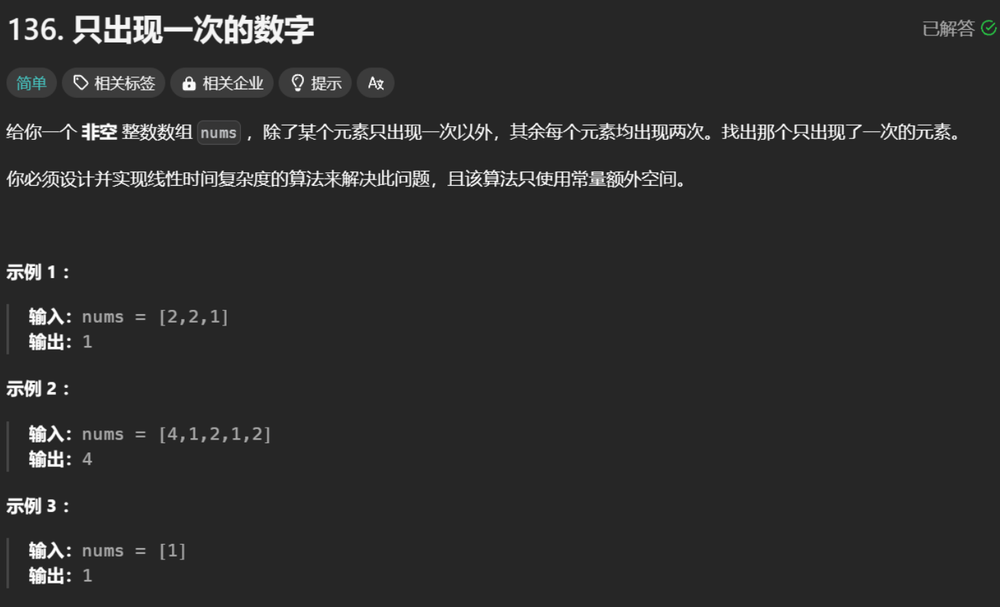

```java
class Solution {
    public int singleNumber(int[] nums) {
        int x = 0;
        for(int n : nums){
            x ^= n;
        }
        return x;
    }
}
```

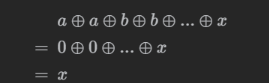

## [169. 多数元素](https://leetcode.cn/problems/majority-element/)

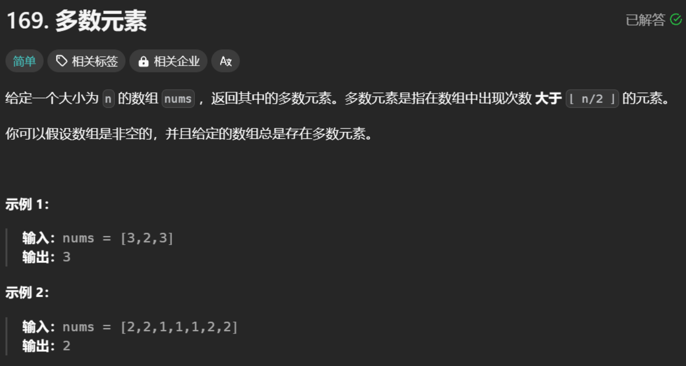

```java
class Solution {
    public int majorityElement(int[] nums) {
        int res = nums[0];
        int count = 1;
        for(int i = 1; i < nums.length; i++){
            if(count == 0){
                res = nums[i];
                count = 1;
            }else if(nums[i] == res)
                count++;
            else
                count--;
        }
        return res;
    }
}
```

推论一： 若记 众数 的票数为 +1 ，非众数 的票数为 −1 ，则一定有所有数字的 票数和 >0 。

推论二： 若数组的前 a 个数字的 票数和 =0 ，则 数组剩余 (n−a) 个数字的 票数和一定仍 >0 ，即后 (n−a) 个数字的 众数仍为 x 。

作者：Krahets
链接：https://leetcode.cn/problems/majority-element/solutions/2362000/169-duo-shu-yuan-su-mo-er-tou-piao-qing-ledrh/

## [448. 找到所有数组中消失的数字](https://leetcode.cn/problems/find-all-numbers-disappeared-in-an-array/)

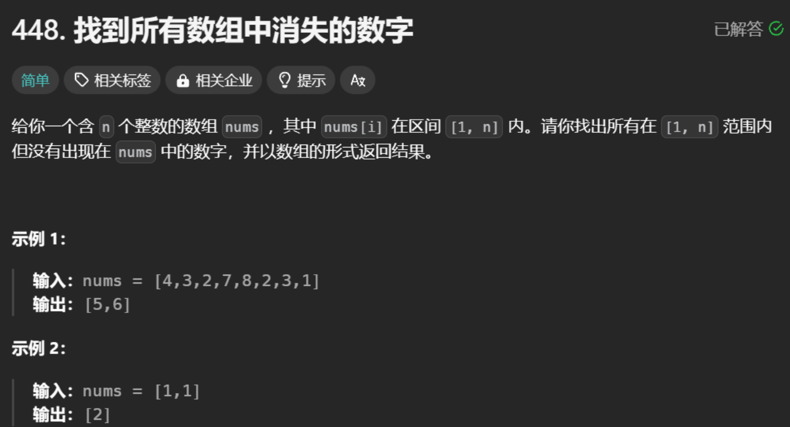

```java
class Solution {
    public List<Integer> findDisappearedNumbers(int[] nums) {
        List<Integer> list = new ArrayList<>();

        for(int i = 0; i < nums.length; i++){
            if(nums[Math.abs(nums[i])-1] > 0)
                nums[Math.abs(nums[i])-1] *= -1;
        }
        for(int i = 0; i < nums.length; i++){
            if(nums[i] > 0)
                list.add(i+1);
        }
        return list;
    }
}
```

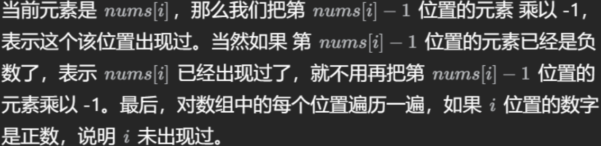

## [238. 除自身以外数组的乘积](https://leetcode.cn/problems/product-of-array-except-self/)

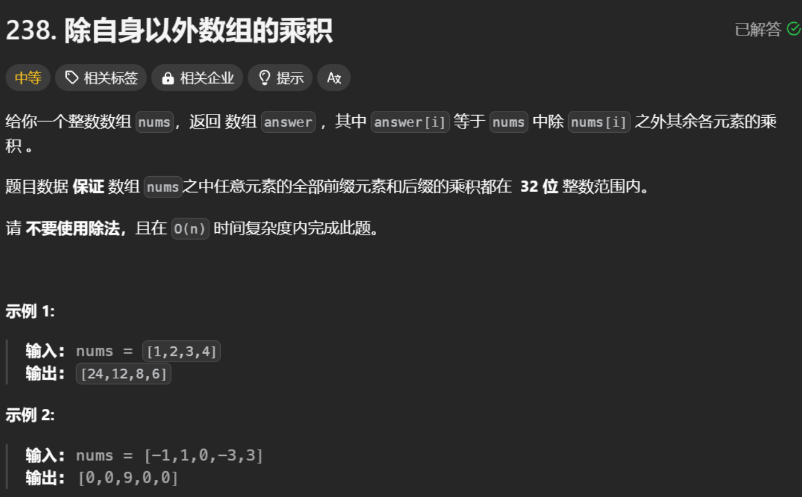

```java
class Solution {
    public int[] productExceptSelf(int[] nums) {
        int[] res = new int[nums.length];
        res[0] = 1;
        for(int i = 1; i < nums.length; i++){
            res[i] = nums[i-1] * res[i-1];
        }
        int temp = 1;
        for(int i = nums.length-2; i >= 0; i--){
            temp = temp * nums[i+1];
            res[i] *= temp;
        }
        return res;
    }
}
```

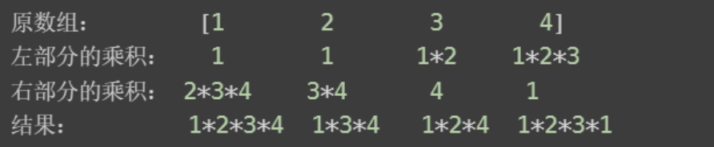

## [152. 乘积最大子数组](https://leetcode.cn/problems/maximum-product-subarray/)

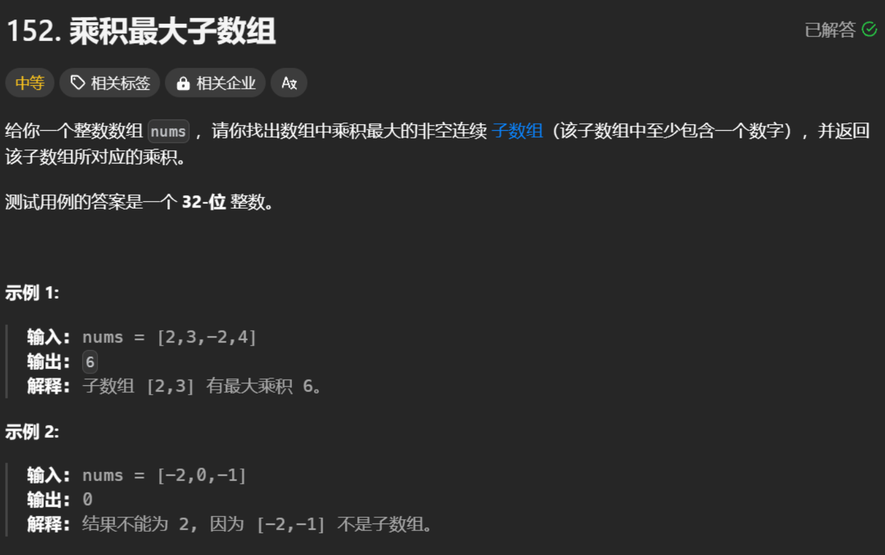

```java
class Solution {
    public int maxProduct(int[] nums) {
        int min = nums[0];
        int max = nums[0];
        int res = max;
        for(int i = 1; i <nums.length; i++){
            int temp = min;
            min = Math.min(nums[i],Math.min(min*nums[i],max*nums[i]));
            max = Math.max(nums[i],Math.max(temp*nums[i],max*nums[i]));
            res = Math.max(res,max);
        }
        return res;
    }
}
```

## [128. 最长连续序列](https://leetcode.cn/problems/longest-consecutive-sequence/)

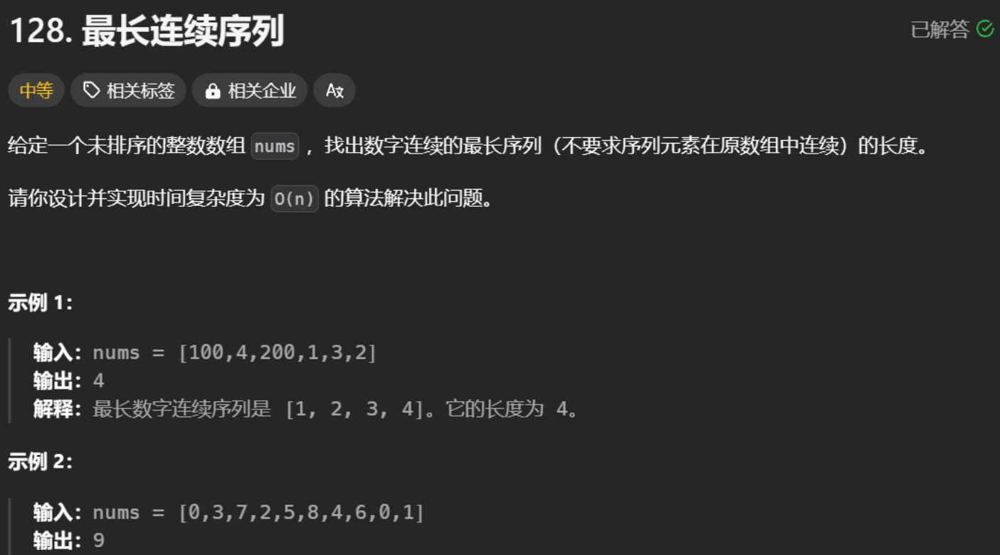

```java
class Solution {
    public int longestConsecutive(int[] nums) {
        Set<Integer> set = new HashSet<>();
        for(int num : nums)
            set.add(num);
        int cur = 0;
        int max = 0;
        for(int num : set){//一定要注意这里用 set遍历，时间复杂度会快很多！！！
            if(!set.contains(num-1)){
                cur = 1;
                while(set.contains(++num)){
                    cur++;
                }
                max = Math.max(max,cur);
            }
        }
        return max;
    }
}
```

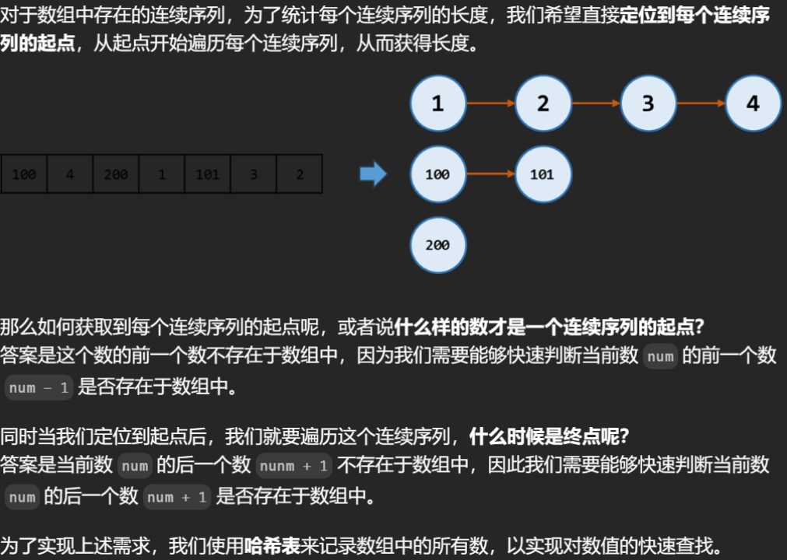

## [240. 搜索二维矩阵 II](https://leetcode.cn/problems/search-a-2d-matrix-ii/)

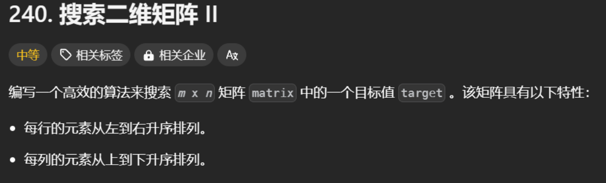

```java
class Solution {
    public boolean searchMatrix(int[][] matrix, int target) {
        int m = matrix.length;
        int n = matrix[0].length;

        int i = m-1;
        int j = 0;
        while(i >= 0 && j < n){
            if(matrix[i][j] == target)
                return true;
            if(matrix[i][j] < target)
                j++;
            else
                i--;
        }
        return false;
    }
}
```

## [48. 旋转图像](https://leetcode.cn/problems/rotate-image/)

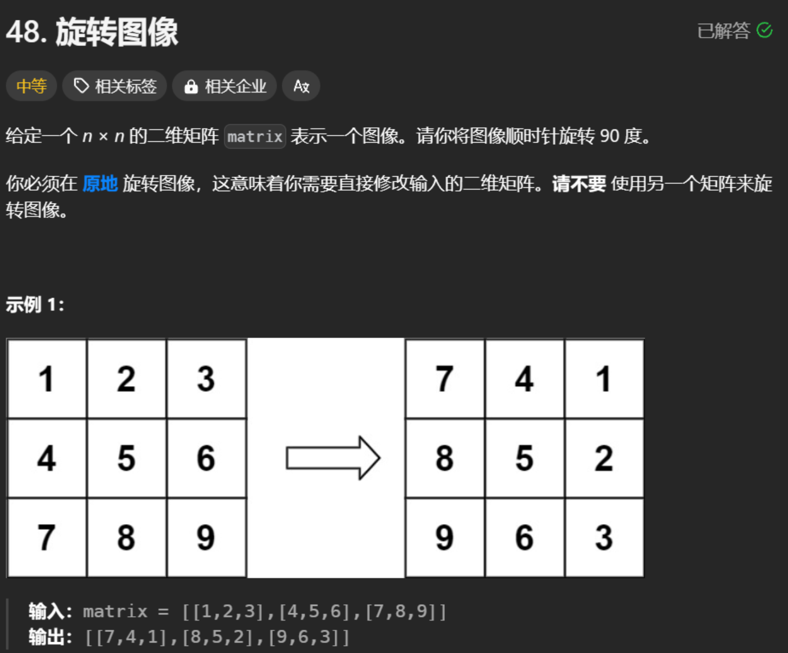

```java、
class Solution {
    public void rotate(int[][] matrix) {
        int n = matrix.length;
        for(int i = 0; i < n/2; i++){
            for(int j = 0; j < n/2 + n%2; j++){
                int temp = matrix[i][j];
                matrix[i][j] = matrix[n-1-j][i];
                matrix[n-1-j][i] = matrix[n-1-i][n-1-j];
                matrix[n-1-i][n-1-j] = matrix[j][n-1-i];
                matrix[j][n-1-i] = temp;
            }
        }
    }
}
```

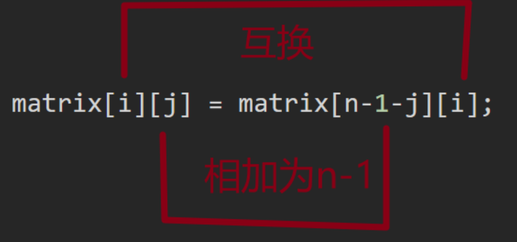

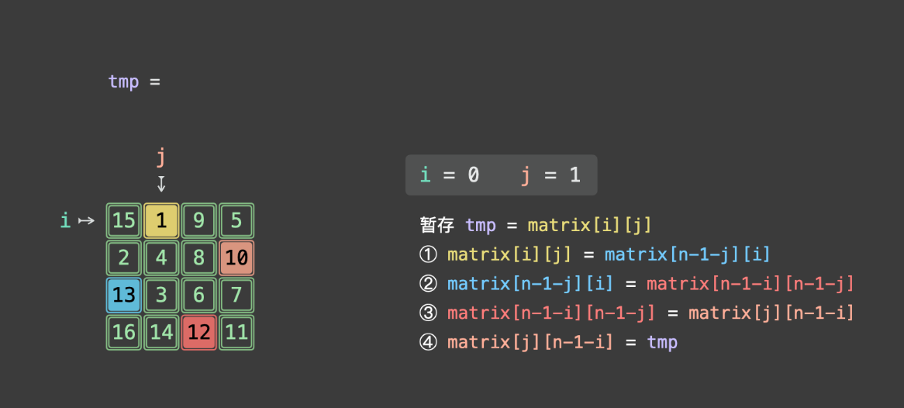

## [31. 下一个排列](https://leetcode.cn/problems/next-permutation/)

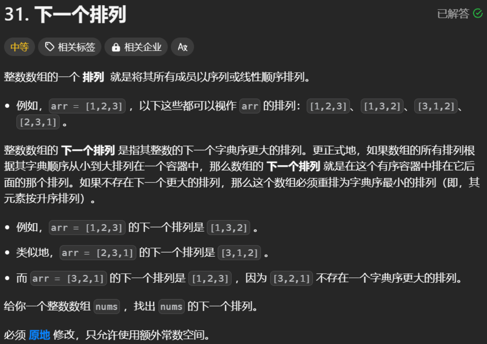

```java
class Solution {
    public void nextPermutation(int[] nums) {
        int left = nums.length - 2;
        while(left >= 0 && nums[left] >= nums[left+1]) left--;//一定要注意又等于号
        if(left < 0){
            reverse(nums,0,nums.length-1);
            return;
        }
        int right = nums.length - 1;
        while(nums[right] <= nums[left]) right--;//一定要注意有等于号，不然找不到更大的，在相等点就停了！！！
        swap(nums,left,right);
        reverse(nums,left+1,nums.length-1);
    }

    public void reverse(int[] nums,int left,int right){
        while(left < right){
            int temp = nums[left];
            nums[left] = nums[right];
            nums[right] = temp;
            left++;
            right--;
        }
    }

    public void swap(int[] nums, int left, int right){
        int temp = nums[left];
        nums[left] = nums[right];
        nums[right] = temp;
    }
}
```

链接：https://leetcode.cn/problems/next-permutation/solutions/80560/xia-yi-ge-pai-lie-suan-fa-xiang-jie-si-lu-tui-dao-/

## [75. 颜色分类](https://leetcode.cn/problems/sort-colors/)

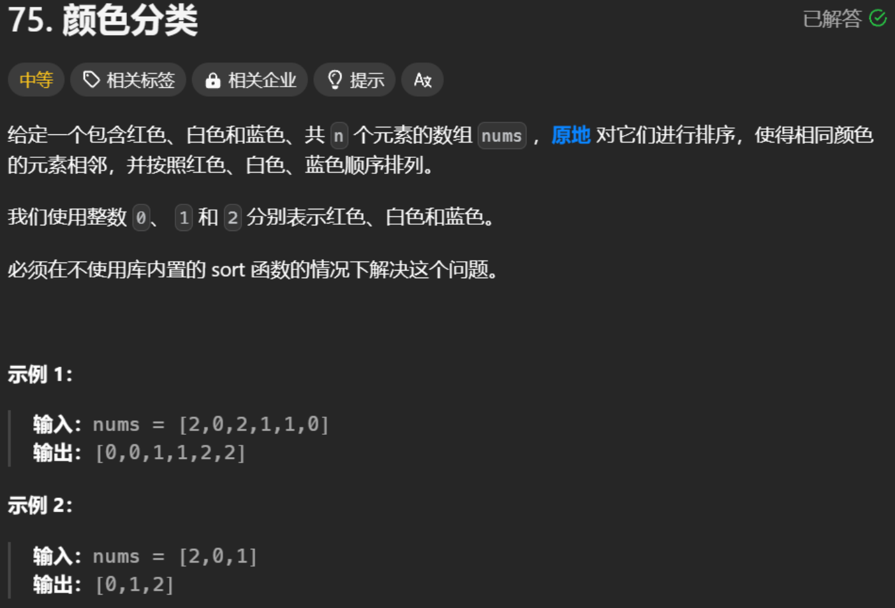

```java
class Solution {
    public void sortColors(int[] nums) {
        int zero = 0;
        int one = 0;

        for(int i = 0; i < nums.length; i++){
            int temp = nums[i];
            nums[i] = 2;

            if(temp < 2)
                nums[one++] = 1;
            if(temp < 1)
                nums[zero++] = 0;
        }
    }
}
```

## [581. 最短无序连续子数组](https://leetcode.cn/problems/shortest-unsorted-continuous-subarray/)

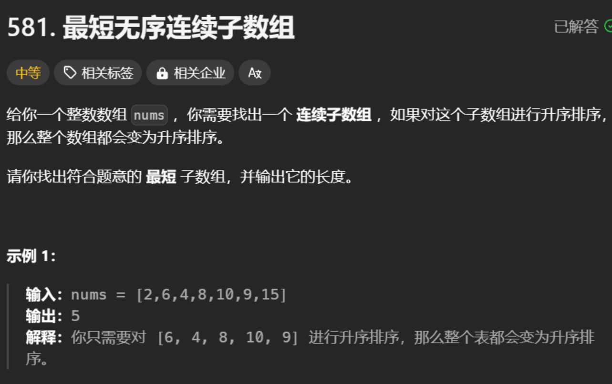

```java
class Solution {
    public int findUnsortedSubarray(int[] nums) {
        int left = 0;
        int right = nums.length-1;

        while(left < right && nums[left] <= nums[left+1]) left++;//注意有等于号！！！
        if(left == right) return 0;//已经有序，直接退出
        while(left < right && nums[right] >= nums[right-1]) right--;//注意有等于号！！！

        int min = nums[left];
        int max = nums[right];

        for(int i = left; i <= right; i++){
            min = Math.min(min,nums[i]);
            max = Math.max(max,nums[i]);
        }

        while(left >= 0 && nums[left] > min) left--;
        while(right < nums.length && nums[right] < max) right++;

        return right-left-1;
    }
}
```

## [LCR 120. 寻找文件副本](https://leetcode.cn/problems/shu-zu-zhong-zhong-fu-de-shu-zi-lcof/)

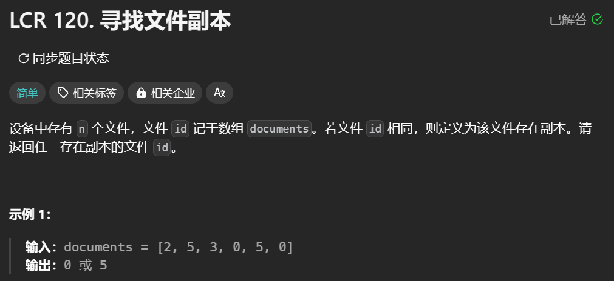

```java
class Solution {
    public int findRepeatDocument(int[] documents) {
        for(int i = 0; i < documents.length; i++){
            while(i != documents[i]){
                if(documents[i] == documents[documents[i]])
                    return documents[i];
                int temp = documents[i];
                documents[i] = documents[temp];
                documents[temp] =temp; 
            }
        }
        return -1;
    }
}
//遍历中，第一次遇到数字 x 时，将其交换至索引 x 处；而当第二次遇到数字 x 时，一定有 documents[x]=x ，此时即可得到一组重复数字。
```

1、题目明确说明了数组长度为n，范围为 n-1，也就是若无重复元素排序后下标0123对应的数字就应该是0123；

2、对数组排序，其实也就是让萝卜归位，1号坑要放1号萝卜，2号坑要放2号萝卜......排序过程中查找有无重复元素。先考虑没有重复元素的情况：

```yaml
 nums[i]     3  1  0  2   萝卜   
     i       0  1  2  3   坑  
```

0号坑说我要的是0号萝卜，不要3号萝卜，所以会去和3号坑的萝卜交换，因为如果0号坑拿了3号坑的3号萝卜，那说明3号坑装的也肯定是别人家的萝卜，所以要跟3号坑换，换完是这样的：

```yaml
 nums[i]     2  1  0  3   萝卜  
     i       0  1  2  3   坑 
```

然而0号坑还没找到自己的萝卜，它不要2号萝卜，又去和2号坑的萝卜交换，换完是这样的：

```yaml
 nums[i]     0  1  2  3   萝卜 
     i       0  1  2  3   坑  
```

这时候刚好就是一一对应的，交换过程也不会出现不同坑有相同编号的萝卜。要注意交换用的是while，也就是0号坑只有拿到0号萝卜，1号坑才能开始找自己的萝卜。

3、如果有重复元素，例如：

```yaml
 nums[i]     1  2  3  2    萝卜
     i       0  1  2  3    坑
```

同样的，0号坑不要1号，先和1号坑交换，交换完这样的：

```yaml
 nums[i]     2  1  3  2    萝卜
     i       0  1  2  3    坑
```

0号坑不要2号萝卜，去和2号坑交换，交换完这样的：

```yaml
 nums[i]     3  1  2  2    萝卜
     i       0  1  2  3    坑
```

0号坑不要3号萝卜，去和3号坑交换，交换完这样的：

```yaml
 nums[i]     2  1  2  3    萝卜
     i       0  1  2  3    坑
```

0号坑不要2号萝卜，去和2号坑交换，结果发现你2号坑也是2号萝卜，那我还换个锤子，同时也说明有重复元素出现。

4、总结

其实这种原地交换就是为了降低空间复杂度，只需多要1个坑来周转交换的萝卜就好了，空间复杂度O（1）。

## [LCR 121. 寻找目标值 - 二维数组](https://leetcode.cn/problems/er-wei-shu-zu-zhong-de-cha-zhao-lcof/)

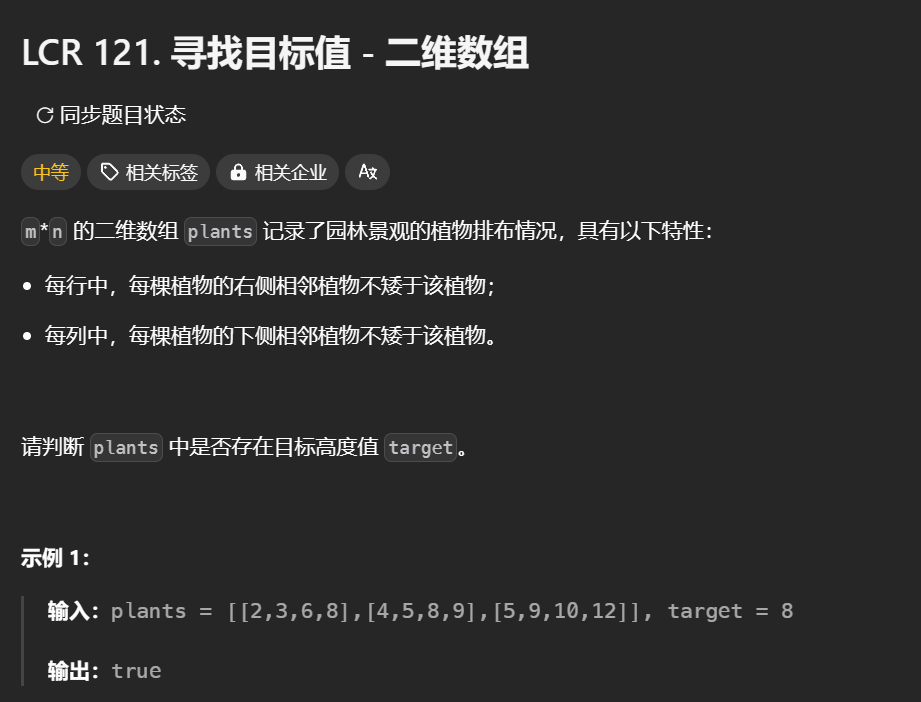

```java
class Solution {
    public boolean findTargetIn2DPlants(int[][] plants, int target) {
        if(plants == null || plants.length == 0) return false;
        int m = plants.length;
        int n = plants[0].length;
        int i = m-1;
        int j = 0;
        while(i >= 0 && j < n){
            if(target == plants[i][j]){
                return true;
            }else if(target < plants[i][j]){
                i--;
            }else{
                j++;
            }
        }
        return false;
    }
}
```

## [LCR 123. 图书整理 I](https://leetcode.cn/problems/cong-wei-dao-tou-da-yin-lian-biao-lcof/)

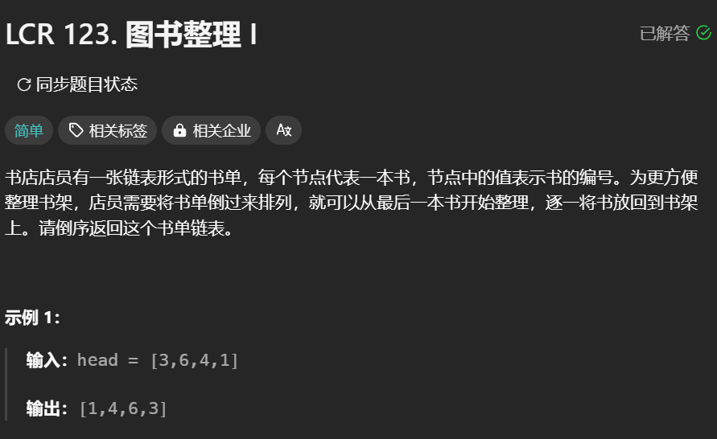

```java
class Solution {
    public int[] reverseBookList(ListNode head) {
        int len = 0;
        ListNode p = head;
        while(p != null){
            len++;
            p = p.next;
        }
        int[] res = new int[len];
        p = head;
        for(int i = 0; i < len; i++){
            res[i] = p.val;
            p = p.next;
        }
        for(int i = 0; i < len/2; i++){
            int temp = res[i];
            res[i] = res[len-i-1];
            res[len-i-1] = temp;
        }
        return res;
    }
}
```

# 链表

## [203. 移除链表元素](https://leetcode.cn/problems/remove-linked-list-elements/)

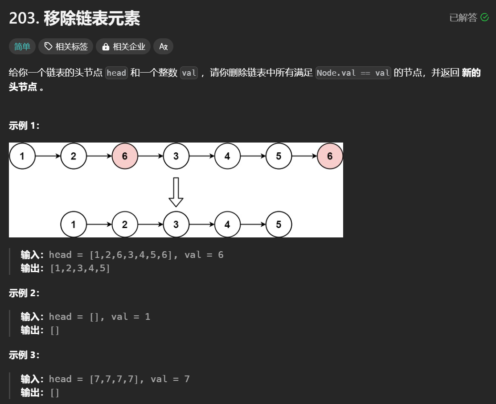

```java
class Solution {
    public ListNode removeElements(ListNode head, int val) {
        ListNode dummy = new ListNode();
        dummy.next = head;
        ListNode cur = dummy;
        while(cur!= null && cur.next != null){
            if(cur.next.val == val)
                cur.next = cur.next.next;
            else
                cur = cur.next;
        }
        return dummy.next;
    }
}
```

## [707. 设计链表](https://leetcode.cn/problems/design-linked-list/)

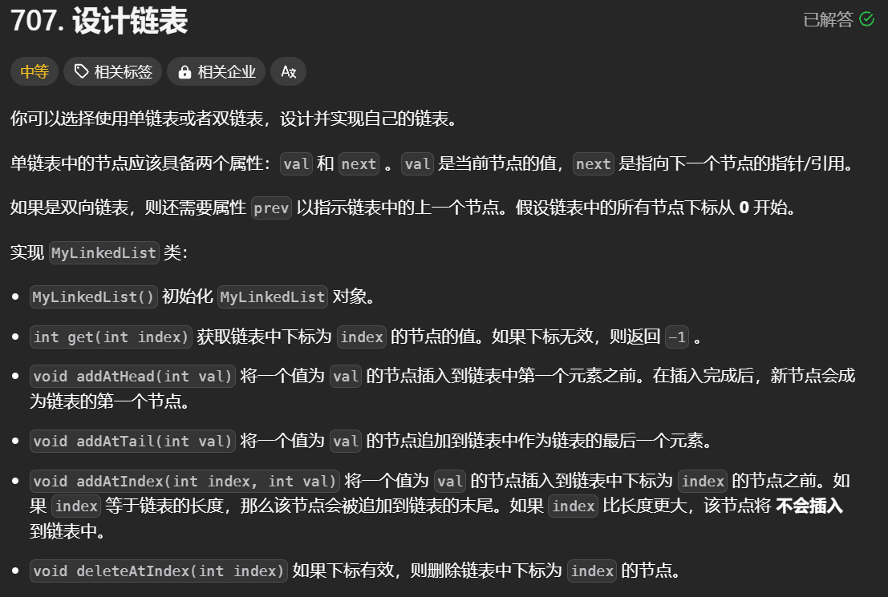

```java
class ListNode{
    int val;
    ListNode next;
}

class MyLinkedList {
    ListNode xuniHead;
    int len;

    public MyLinkedList() {
        xuniHead = new ListNode();
        len = 0;
    }
    
    public int get(int index) {
        if(index > len -1) return -1;
        ListNode p = xuniHead;
        for(int i = 0; i < index+1; i++){
            p = p.next;
        }
        return p.val;
    }
    
    public void addAtHead(int val) {
        ListNode s = new ListNode();
        s.val = val;
        s.next = xuniHead.next;
        xuniHead.next = s;
        len++;
    }
    
    public void addAtTail(int val) {
        ListNode s = new ListNode();
        s.val = val;
        ListNode p = xuniHead;
        for(int i = 0; i < len; i++){
            p = p.next;
        }
        p.next = s;
        len++;
    }
    
    public void addAtIndex(int index, int val) {
        if(index > len) return;
        ListNode s = new ListNode();
        s.val = val;
        ListNode p = xuniHead;
        for(int i = 0; i < index; i++){
            p = p.next;
        }
        s.next = p.next;
        p.next = s;
        len++;
    }
    
    public void deleteAtIndex(int index) {
        if(index > len -1) return;
        ListNode p = xuniHead;
        for(int i = 0; i < index; i++){
            p = p.next;
        }
        p.next = p.next.next;
        len--;
    }
}
```

## [206. 反转链表](https://leetcode.cn/problems/reverse-linked-list/)

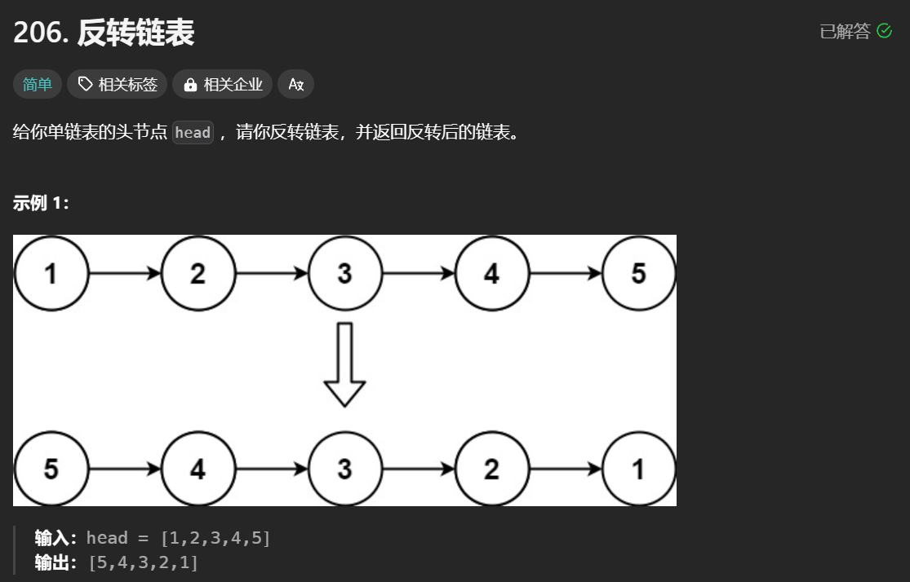

```java
class Solution {
    public ListNode reverseList(ListNode head) {
        ListNode pre = null;
        ListNode cur = head;
        while(cur != null){
            ListNode next = cur.next;
            cur.next = pre;
            pre = cur;
            cur = next;
        }
        return pre;
    }
}
```

## [24. 两两交换链表中的节点](https://leetcode.cn/problems/swap-nodes-in-pairs/)

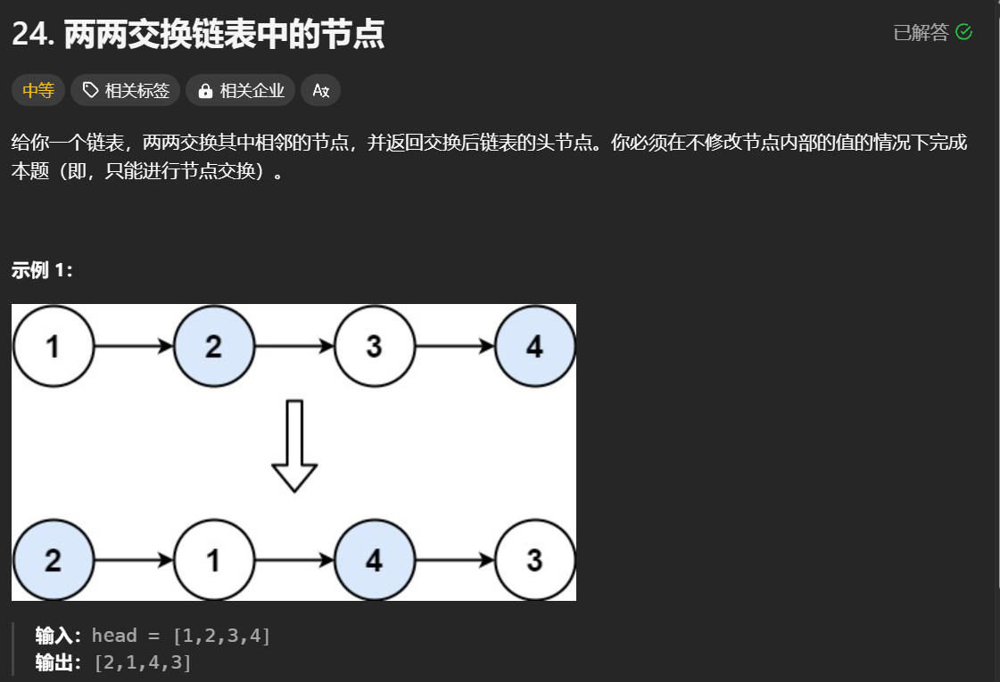

```java
class Solution {
    public ListNode swapPairs(ListNode head) {
        ListNode dummy = new ListNode();
        dummy.next = head;
        ListNode cur = dummy;
        while(cur.next != null && cur.next.next != null){
            ListNode p = cur.next;
            cur.next = cur.next.next;
            p.next = cur.next.next;
            cur.next.next = p;
            cur = cur.next.next;
        }
        return dummy.next;
    }
}
```

## [19. 删除链表的倒数第 N 个结点](https://leetcode.cn/problems/remove-nth-node-from-end-of-list/)

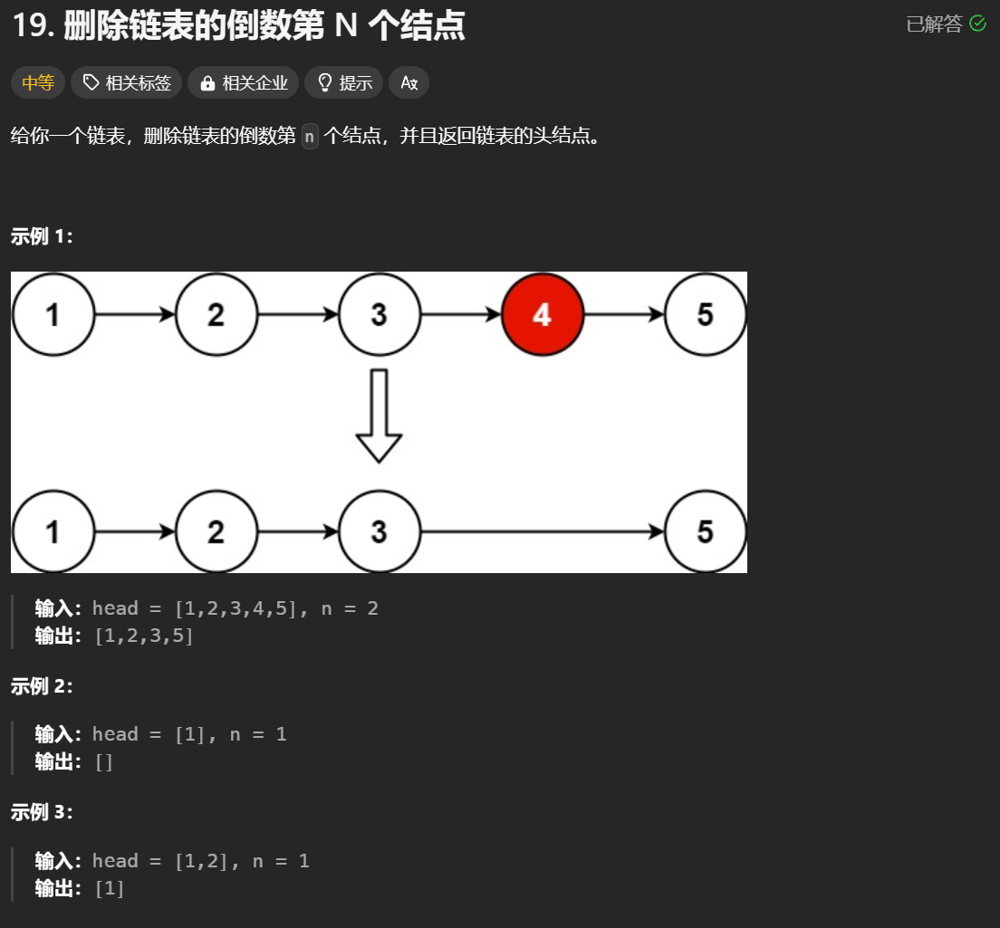

```java
class Solution {
    public ListNode removeNthFromEnd(ListNode head, int n) {
        ListNode dummy = new ListNode();
        dummy.next = head;

        ListNode fast = dummy;
        ListNode slow = dummy;
        
        for(int i = 0; i < n; i++)
            fast = fast.next;
        while(fast.next!=null){
            fast = fast.next;
            slow = slow.next;
        }
        slow.next = slow.next.next;
        return dummy.next;
    }
}
```

## [面试题 02.07. 链表相交](https://leetcode.cn/problems/intersection-of-two-linked-lists-lcci/)

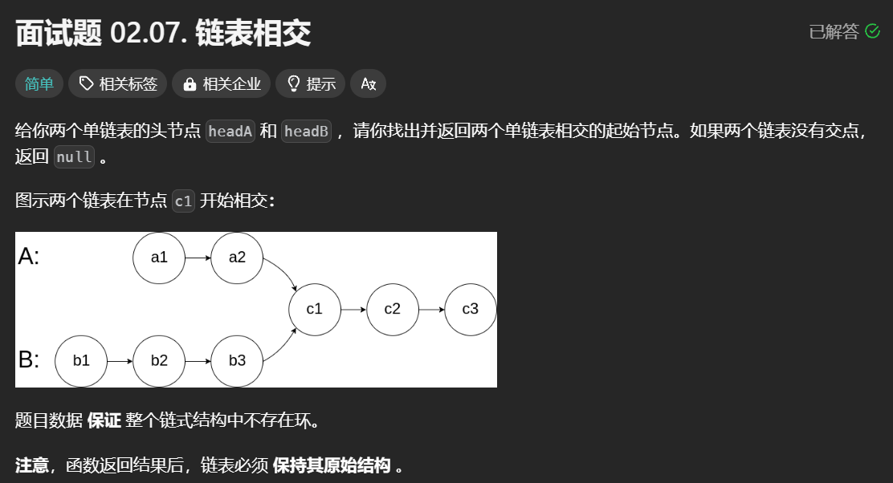

```java
public class Solution {
    public ListNode getIntersectionNode(ListNode headA, ListNode headB) {
        int lenA = 0;
        int lenB = 0;
        ListNode head = headA;
        while(head!=null){
            lenA++;
            head = head.next;
        }
        head = headB;
        while(head!=null){
            lenB++;
            head = head.next;
        }

        if(lenA > lenB){
            for(int i = 0; i < lenA-lenB; i++)
                headA = headA.next;
        }else{
            for(int i = 0; i < lenB-lenA; i++)
                headB = headB.next;
        }

        while(headA != null && headA != headB){
            headA = headA.next;
            headB = headB.next;
        }
        return headA;
    }
}
```

## [142. 环形链表 II](https://leetcode.cn/problems/linked-list-cycle-ii/)

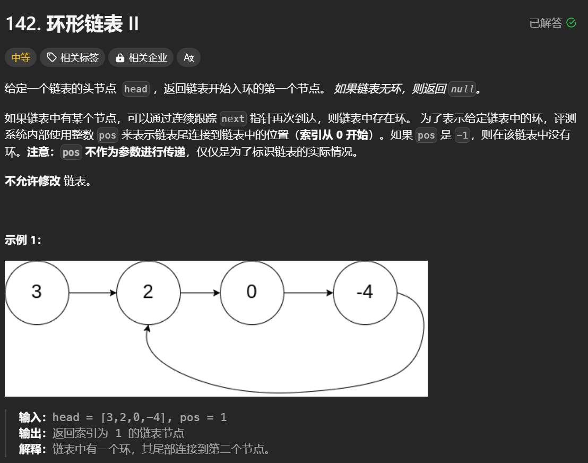

```java
public class Solution {
    public ListNode detectCycle(ListNode head) {
        if(head == null || head.next == null) return null;

        ListNode fast = head.next.next;
        ListNode slow = head.next;
        while(fast!=null && fast.next!= null && fast != slow){
            fast = fast.next.next;
            slow = slow.next;
        }
        
        if(fast == null || fast.next == null) return null;

        slow = head;
        while(fast != slow){
            fast = fast.next;
            slow = slow.next;
        }

        return slow;
    }
}
```

## [141. 环形链表](https://leetcode.cn/problems/linked-list-cycle/)

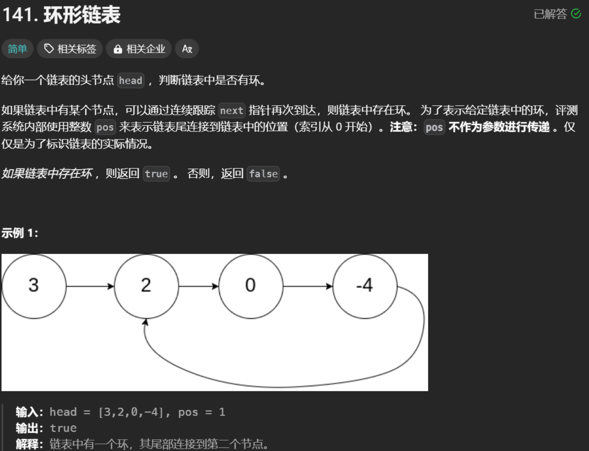

```java
public class Solution {
    public boolean hasCycle(ListNode head) {
        if(head == null || head.next == null) return false;

        ListNode fast = head.next.next;
        ListNode slow = head.next;
        while(slow != fast && fast != null && fast.next != null){
            fast = fast.next.next;
            slow = slow.next;
        }
        if(fast == slow) return true;
        return false;
    }
}
```

## [234. 回文链表](https://leetcode.cn/problems/palindrome-linked-list/)

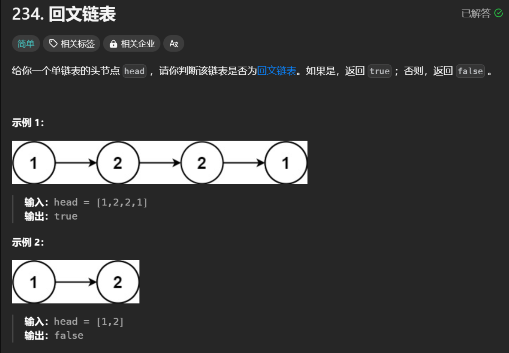

```java
class Solution {
    public boolean isPalindrome(ListNode head) {
        if(head == null || head.next == null) return true;
        ListNode slow = head.next;
        ListNode fast = head.next.next;
        while(fast != null && fast.next != null){
            slow = slow.next;
            fast = fast.next.next;
        }
        slow = reverse(slow);
        fast = head;
        while(fast != null && slow != null){
            if(fast.val != slow.val)
                return false;
            fast = fast.next;
            slow = slow.next;
        }
        return true;
    }
    //翻转链表
    public ListNode reverse(ListNode head){
        ListNode pre = null;
        ListNode cur = head;

        while(cur != null){
            ListNode next = cur.next;
            cur.next = pre;
            pre = cur;
            cur = next;
        }

        return pre;
    }
}
```

## [21. 合并两个有序链表](https://leetcode.cn/problems/merge-two-sorted-lists/)

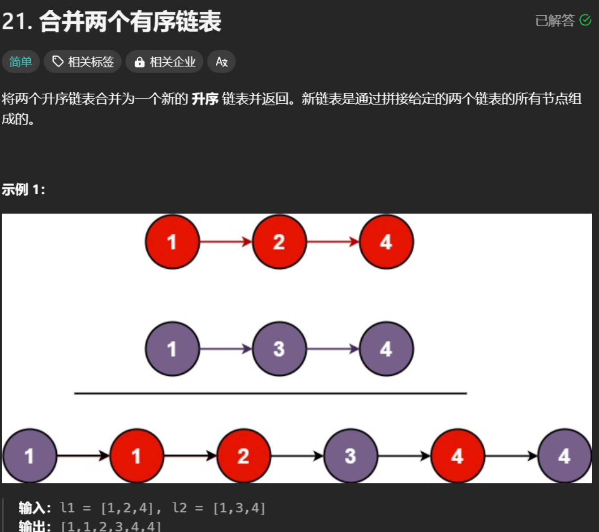

```java
class Solution {
    public ListNode mergeTwoLists(ListNode left, ListNode right) {
        
        ListNode dummy = new ListNode();
        ListNode cur = dummy;

        while(left != null && right != null){
            if(left.val < right.val){
                cur.next = left;
                left = left.next;
            }else{
                cur.next = right;
                right = right.next;
            }
            cur = cur.next;
        }

        if(left != null) cur.next = left;
        else cur.next = right;

        return dummy.next;
    }
}
```

## [23. 合并 K 个升序链表](https://leetcode.cn/problems/merge-k-sorted-lists/)

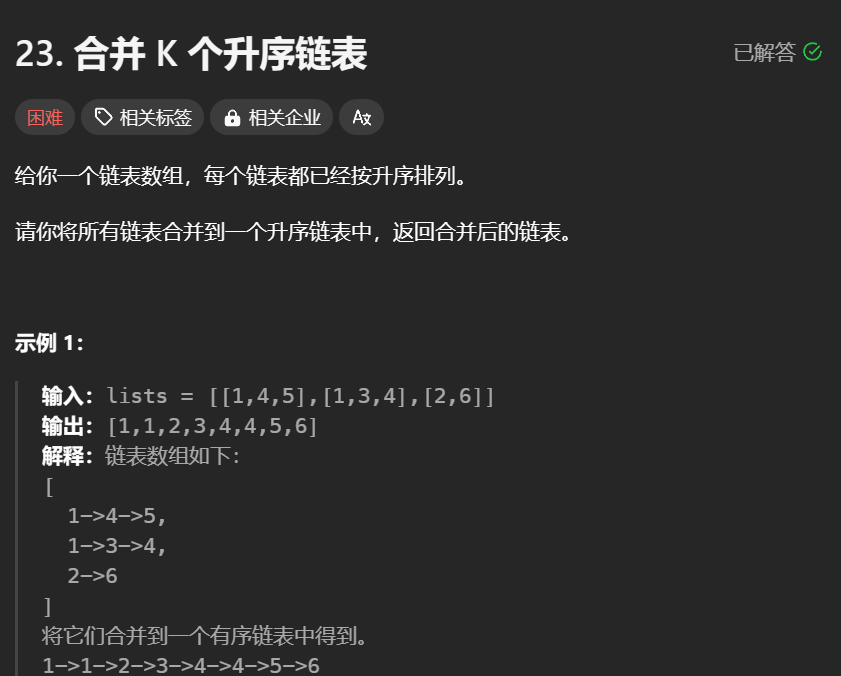

```java
class Solution {
    public ListNode mergeKLists(ListNode[] lists) {
        if(lists == null || lists.length == 0) return null;
        return mergeL(lists,0,lists.length-1);        
    }

    public ListNode mergeL(ListNode[] lists,int left,int right) {
        if(left == right) return lists[left];
        
        int mid = left + (right-left)/2;

        ListNode a = mergeL(lists,left,mid);
        ListNode b = mergeL(lists,mid+1,right);

        return merge(a,b);
    }

    public ListNode merge(ListNode left,ListNode right){
        ListNode dummy = new ListNode();
        ListNode cur = dummy;
        while(left != null && right != null){
            if(left.val <= right.val){
                cur.next = left;
                cur = cur.next;
                left = left.next;
            }else{
                cur.next = right;
                cur = cur.next;
                right = right.next;
            }
        }
        if(left != null) cur.next = left;
        else cur.next = right;

        return dummy.next;
    }

}
```

# 哈希表

## [242. 有效的字母异位词](https://leetcode.cn/problems/valid-anagram/)

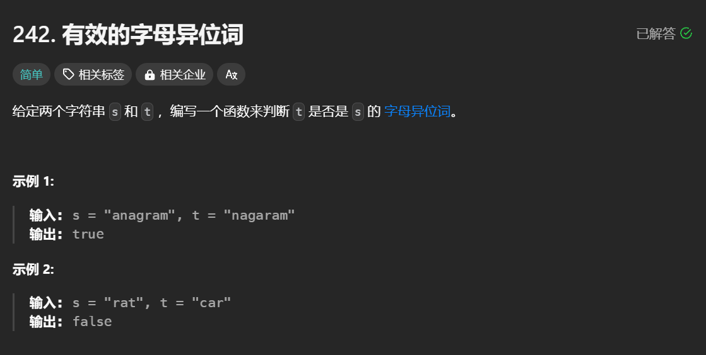

```java
class Solution {
    public boolean isAnagram(String s, String t) { 
        if(s.length() != t.length()) return false;

        char[] nums = new char[26];
        for(int i = 0; i < s.length(); i++){
            nums[s.charAt(i) - 'a']++;
        }
        for(int i = 0; i < s.length(); i++){
            nums[t.charAt(i) - 'a']--;
        }
        for(int i = 0; i < 26; i++){
            if(nums[i] != 0) return false;
        }
        return true;
    }
}
```

## [349. 两个数组的交集](https://leetcode.cn/problems/intersection-of-two-arrays/)


```java
class Solution {
    public int[] intersection(int[] nums1, int[] nums2) {
        Set<Integer> set = new HashSet<>();
        for(int num : nums1) set.add(num);

        Set<Integer> setRes = new HashSet<>();
        for(int num : nums2){
            if(set.contains(num))
                setRes.add(num);
        }
        int[] res = new int[setRes.size()];
        int i = 0;
        for(int num : setRes){
            res[i++] = num;
        }
        return res;
    }
}
```

## [202. 快乐数](https://leetcode.cn/problems/happy-number/)

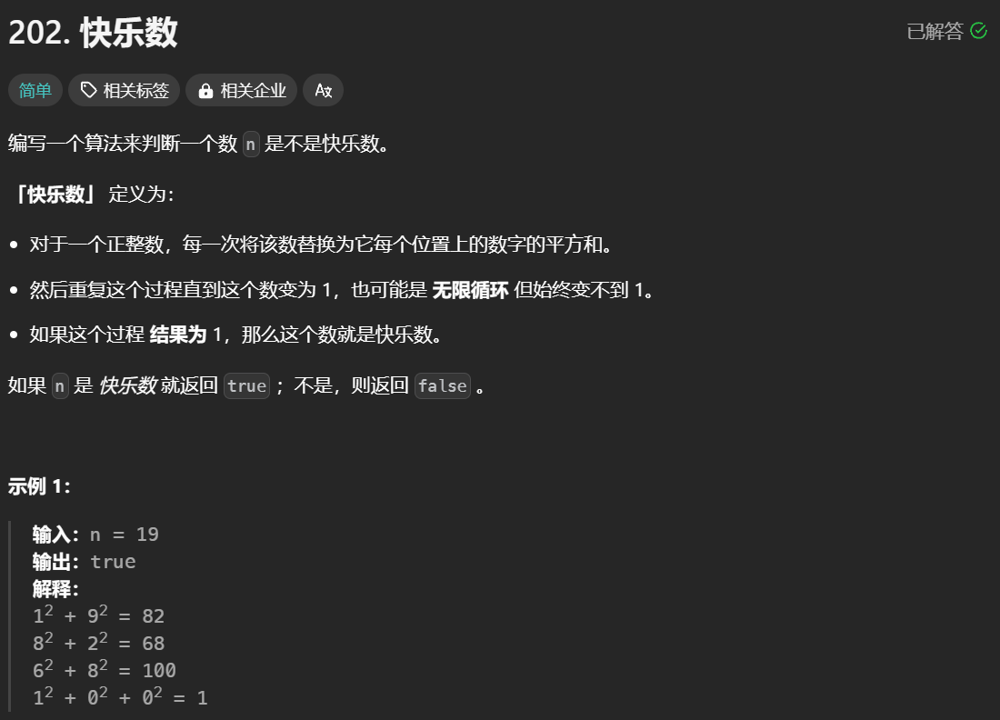

```java
class Solution {
    public boolean isHappy(int n) {
        Set<Integer> set = new HashSet<>();

        while(true){
            int sum = 0;
            while(n > 0){
                int k = n % 10;
                n = n / 10;
                sum += k*k;
            }
            if(sum == 1) return true;
            if(set.contains(sum)) return false;
            set.add(sum);
            n = sum;
        }
    }   
}
```

## [1. 两数之和](https://leetcode.cn/problems/two-sum/)

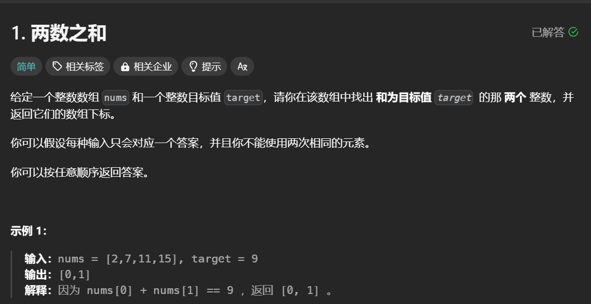

```java
class Solution {
    public int[] twoSum(int[] nums, int target) {
        Map<Integer,Integer> map = new HashMap<>();
        for(int i = 0; i < nums.length; i++){
            if(map.containsKey(target-nums[i]) && map.get(target-nums[i]) != i)
                return new int[]{i,map.get(target-nums[i])};
            map.put(nums[i],i);
        }
        return null;
    }
}
```

## [454. 四数相加 II](https://leetcode.cn/problems/4sum-ii/)

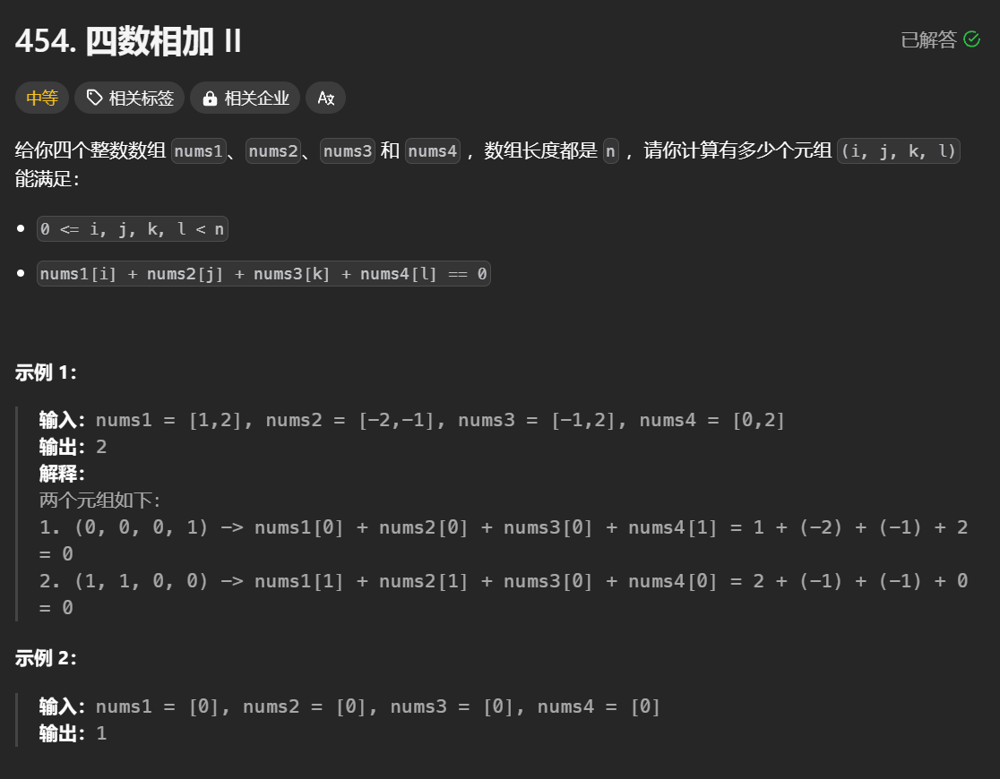

```java
class Solution {
    public int fourSumCount(int[] nums1, int[] nums2, int[] nums3, int[] nums4) {
        Map<Integer,Integer> map = new HashMap<>();

        for(int i = 0; i < nums1.length; i++){
            for(int j = 0; j < nums2.length; j++){
                int sum = nums1[i] + nums2[j];
                map.put(sum,map.getOrDefault(sum,0)+1);
            }
        }
        int count = 0;
        for(int i = 0; i < nums3.length; i++){
            for(int j = 0; j < nums4.length; j++){
                int sum = nums3[i] + nums4[j];
                count += map.getOrDefault(-sum,0);
            }
        }
        return count;
    }
}
```

## [383. 赎金信](https://leetcode.cn/problems/ransom-note/)

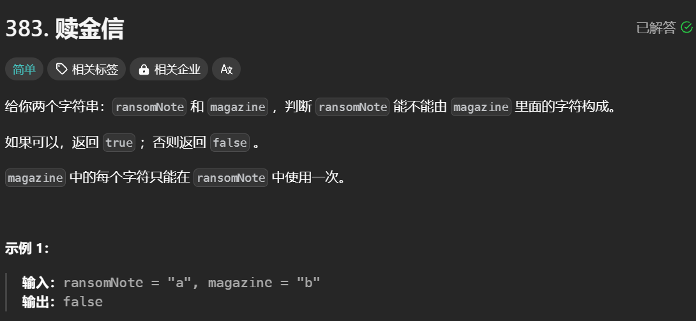

```java
class Solution {
    public boolean canConstruct(String ransomNote, String magazine) {
        int[] nums = new int[26];
        for(int i = 0; i < magazine.length(); i++){
            nums[magazine.charAt(i) - 'a']++;
        }
        for(int i = 0; i < ransomNote.length(); i++){
            nums[ransomNote.charAt(i) - 'a']--;
            if(nums[ransomNote.charAt(i) - 'a'] < 0)
                return false;
        }
        return true;
    }
}
```

## [15. 三数之和](https://leetcode.cn/problems/3sum/)

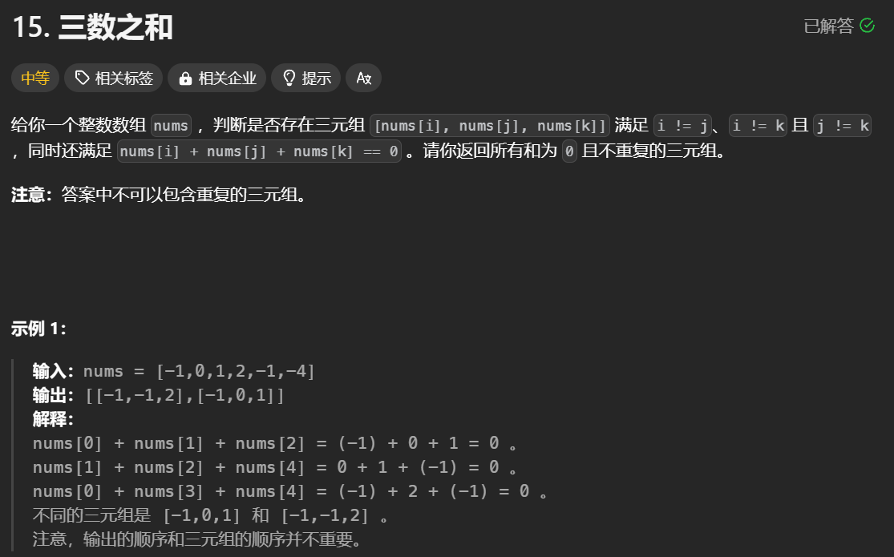

```java
class Solution {
    public List<List<Integer>> threeSum(int[] nums) {
        List<List<Integer>> list = new ArrayList<>();
        Arrays.sort(nums);
        for(int i = 0; i < nums.length-2; i++){
            if(i!=0 && nums[i] == nums[i-1]) continue;
            if(nums[i] + nums[i+1] +nums[i+2] > 0) break;   
            int left = i+1; 
            int right = nums.length-1;
            while(left < right){
                int sum = nums[i] + nums[left] + nums[right];
                if(sum < 0){
                    left++;
                }else if(sum > 0){
                    right--;
                }else{
                    list.add(new ArrayList<>(Arrays.asList(nums[i],nums[left],nums[right])));
                    while(left<right && nums[left] == nums[left+1]) left++;
                    while(left<right && nums[right] == nums[right-1]) right--;
                    left++;
                    right--;
                }
            }
        }
        return list;
    }
}
```

## [18. 四数之和](https://leetcode.cn/problems/4sum/)

```java
class Solution {
    public List<List<Integer>> fourSum(int[] nums, int target) {
        List<List<Integer>> list = new ArrayList<>();
        Arrays.sort(nums);

        for(int i = 0; i < nums.length-3; i++){
            if(i!=0 && nums[i] == nums[i-1]) continue;
            if((long)nums[i] + nums[i+1] + nums[i+2] + nums[i+3] > target) break;
            for(int j = i+1; j < nums.length-2; j++){
                if(j!=i+1 && nums[j] == nums[j-1]) continue;
                int left = j+1;
                int right = nums.length-1;
                while(left < right){
                    int sum = nums[i] + nums[j] + nums[left] + nums[right];
                    if(sum < target)
                        left++;
                    else if(sum > target)
                        right--;
                    else{
                        list.add(new ArrayList(Arrays.asList(nums[i],nums[j],nums[left],nums[right])));
                        while(left < right && nums[left] == nums[left+1]) left++;
                        while(left < right && nums[right] == nums[right-1]) right--;
                        left++;
                        right--;
                    }
                }
            }
        }
        return list;
    }
}
```

## [49. 字母异位词分组](https://leetcode.cn/problems/group-anagrams/)

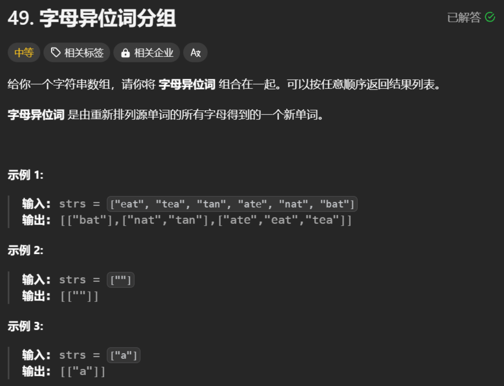

```java
class Solution {
    public List<List<String>> groupAnagrams(String[] strs) {
        Map<String,List<String>> map = new HashMap<>();

        for(String str : strs){
            char[] arr = str.toCharArray();
            Arrays.sort(arr);
            String temp = new String(arr);

            List<String> path = map.getOrDefault(temp,new ArrayList<>());
            path.add(str);
            map.put(temp,path);
        }


        return new ArrayList<>(map.values());
    }
}
//map.getOrDefault(key, new ArrayList<String>()) 的作用是：
//当遍历字符串数组 strs 时，对于每个字符串，先将其转换为字符数组并排序得到一个键 key。
//然后尝试从 map 中获取与这个键对应的列表。如果这个键已经存在于 map 中，那么就会返回与该键关联的列表；
//如果这个键不存在，那么就会创建一个新的空的 ArrayList<String> 作为默认值并返回。
//这样确保了无论键是否在 map 中，都能得到一个 List<String> 对象来进行后续操作（向其中添加当前遍历到的字符串）。
```

## [3. 无重复字符的最长子串](https://leetcode.cn/problems/longest-substring-without-repeating-characters/)


```java
class Solution {
    public int lengthOfLongestSubstring(String s) {
        Map<Character,Integer> map = new HashMap<>();
        int left = 0;
        int max = 0;
        for(int right = 0; right < s.length(); right++){
            char c = s.charAt(right);
            if(map.containsKey(c) && map.get(c) >= left){
                left = map.get(c)+1;
            }
            max = Math.max(max,right-left+1);
            map.put(c,right);
        }
        return max;
    }
}
```

## [560. 和为 K 的子数组](https://leetcode.cn/problems/subarray-sum-equals-k/)⭐

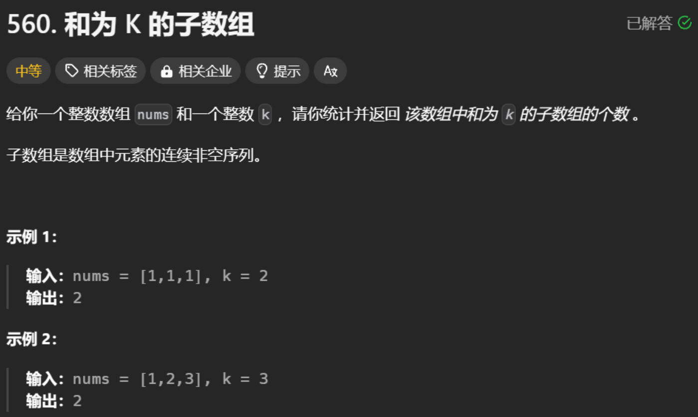

```java
class Solution {
    public int subarraySum(int[] nums, int k) {
        Map<Integer,Integer> map = new HashMap<>();
        map.put(0,1);
        int count = 0;
        int sum  = 0;
        for(int i = 0; i < nums.length; i++){
            sum += nums[i];
            count += map.getOrDefault(sum - k,0);
            map.put(sum,map.getOrDefault(sum,0)+1);
        }
        return count;
    }
}
```

## [437. 路径总和 III](https://leetcode.cn/problems/path-sum-iii/)

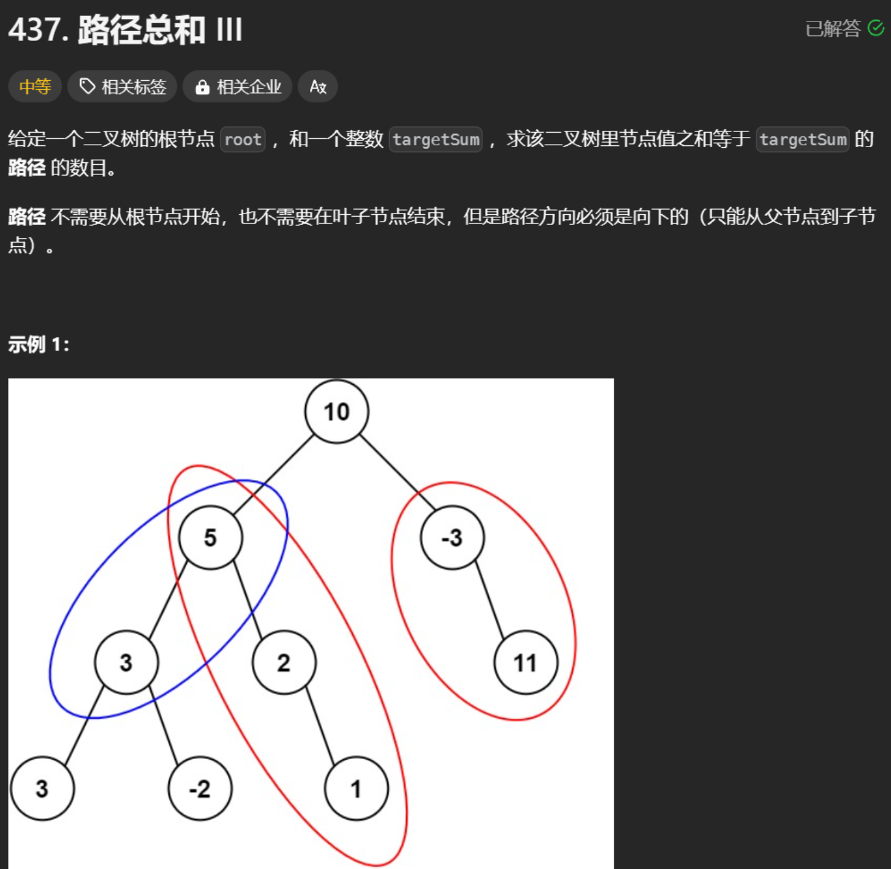

```java
class Solution {
    Map<Long,Integer> map = new HashMap<>();
    public int pathSum(TreeNode root, int targetSum) {
        map.put(0L,1);;// 有一个默认的前缀和0
        return fun(root,targetSum,0);
    }

    public int fun(TreeNode root, int targetSum,long pre) {
        if(root == null) return 0;

        pre += root.val;
        int count = map.getOrDefault(pre-targetSum,0);
        map.put(pre,map.getOrDefault(pre,0)+1);

        count+= fun(root.left,targetSum,pre) + fun(root.right,targetSum,pre);
        map.put(pre,map.get(pre)-1);//千万别忘了！！！
        return count;
    }
}
```

# 字符串

## [344. 反转字符串](https://leetcode.cn/problems/reverse-string/)

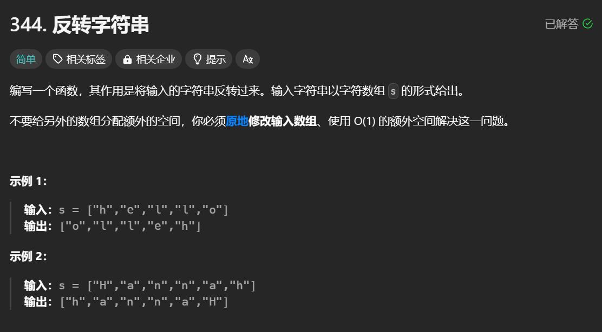

```java
class Solution {
    public void reverseString(char[] s) {
        int left = 0;
        int right = s.length-1;
        while(left < right){
            char temp = s[left];
            s[left] = s[right];
            s[right] = temp;
            left++;
            right--;
        }
    }
}
```

## [541. 反转字符串 II](https://leetcode.cn/problems/reverse-string-ii/)

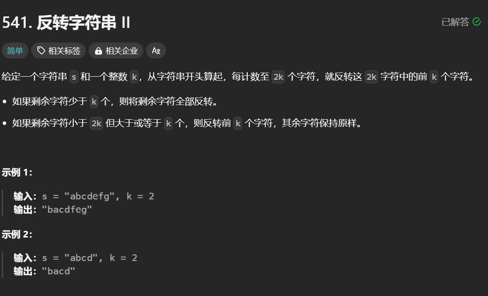

```java
class Solution {
    public String reverseStr(String s, int k) {
        char[] str = s.toCharArray();

        for(int i = 0; i < s.length(); i += 2*k){
            int j = Math.min(i + k - 1,s.length()-1);
            swap(str,i,j);
        }
        
        return new String(str);
    }

    public static void swap(char[] str, int left, int right){
        while(left < right){
            char temp = str[left];
            str[left] = str[right];
            str[right] = temp;
            left++;
            right--;
        }
    }
}
```

## [54. 替换数字（第八期模拟笔试） (kamacoder.com)](https://kamacoder.com/problempage.php?pid=1064)

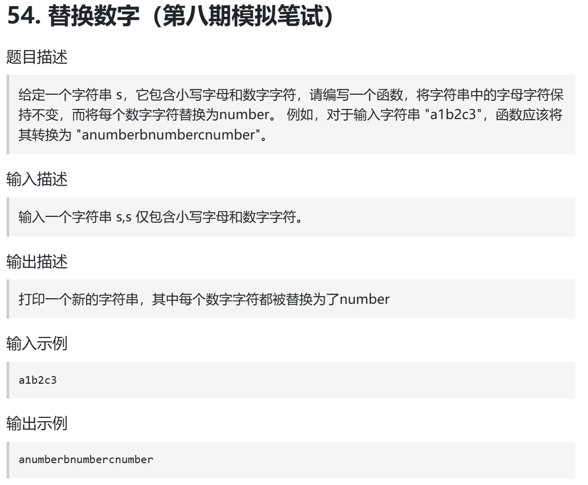

```java
import java.util.*;
public class Main{
    public static void main(String[] args){
        Scanner in = new Scanner(System.in);
        String str = in.nextLine();
        StringBuilder sb = new StringBuilder();
        for(int i = 0; i < str.length(); i++){
            char c = str.charAt(i);
            if(c >= '0' && c <= '9'){
                sb.append("number");
            }else{
                sb.append(c);
            }
        }
        System.out.println(new String(sb));
    }
}
```

## [151. 反转字符串中的单词](https://leetcode.cn/problems/reverse-words-in-a-string/)

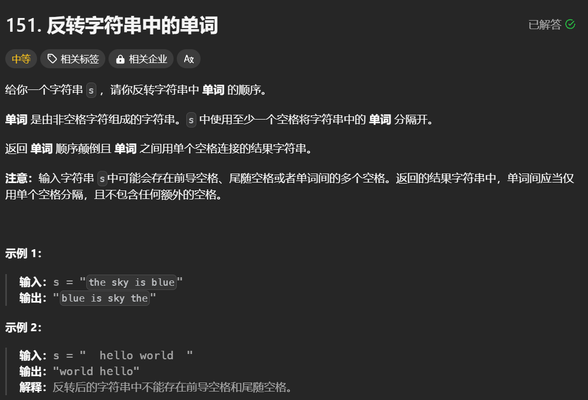

```java
class Solution {
    public String reverseWords(String s) {
        char[] str = delSpace(s.trim()).toCharArray();
        swap(str,0,str.length-1);

        for(int i = 0; i < str.length;){
            int j = i+1;
            while(j < str.length && str[j] != ' ') j++;
            swap(str,i,j-1);
            i = j+1;
        }
        return new String(str);
    }
    //去除多余空格
    public static String delSpace(String s){
        StringBuffer sb = new StringBuffer();
        int i = 0;
        for(; i < s.length(); i++){
            if(s.charAt(i) == ' '){
                sb.append(' ');
                while(s.charAt(i+1) == ' ') i++;
            }else{
                sb.append(s.charAt(i));
            }
        }
        return new String(sb);
    }
    //反转字符串
    public static void swap(char[] str,int left, int right){
        while(left < right){
            char temp = str[left];
            str[left] = str[right];
            str[right] = temp;
            left++;
            right--;
        }
    }
}
```

## [55. 右旋字符串（第八期模拟笔试） (kamacoder.com)](https://kamacoder.com/problempage.php?pid=1065)

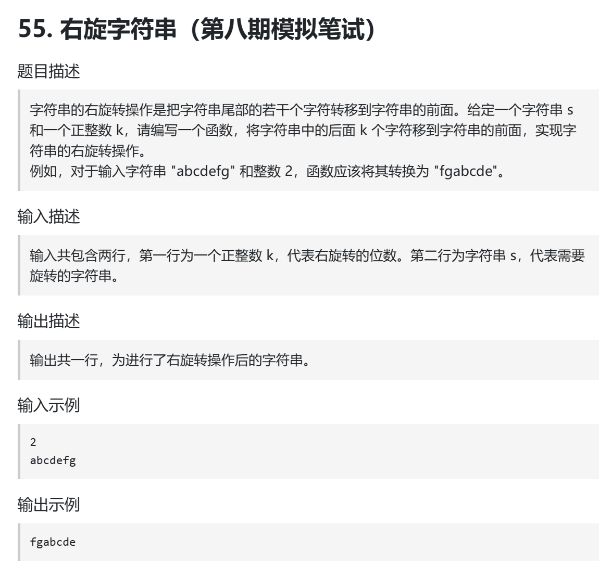

```java
import java.util.*;
public class Main{
    public static void main(String[] args){
        Scanner in = new Scanner(System.in);
        int n = in.nextInt();
        in.nextLine();//注意！！！
        String str = in.nextLine();
        char[] arr = str.toCharArray();
        for(int i = 0; i < n; i++){
            char temp = arr[arr.length-1];
            for(int j = arr.length-1; j >= 1; j--)
                arr[j] = arr[j-1];
            arr[0] = temp;
        }
        System.out.println(new String(arr));
    }
}

```

## [28. 找出字符串中第一个匹配项的下标](https://leetcode.cn/problems/find-the-index-of-the-first-occurrence-in-a-string/)


```java
class Solution {
    public int strStr(String haystack, String needle) {
        int[] next = getNext(needle);
        int j = 0;
        for(int i = 0; i < haystack.length(); i++){
            while(j!=0 && haystack.charAt(i) != needle.charAt(j))
                j = next[j-1];
            if(haystack.charAt(i) == needle.charAt(j))
                j++;
            if(j == needle.length()) return i-j+1;
        }
        return -1;
    }

    public int[] getNext(String needle){
        int[] next = new int[needle.length()];
        next[0] = 0;
        int j = 0;
        for(int i = 1; i < needle.length(); i++){
            while(j!=0 && needle.charAt(i) != needle.charAt(j))
                j = next[j-1];
            if(needle.charAt(i) == needle.charAt(j))
                j++;
            next[i] = j;
        }
        return next;
    }
}
```

## [459. 重复的子字符串](https://leetcode.cn/problems/repeated-substring-pattern/)

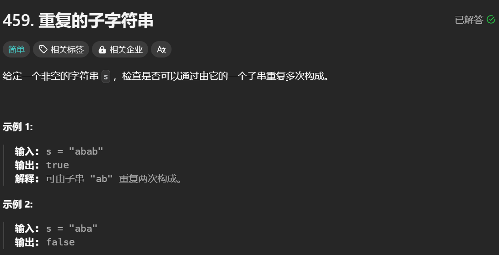

```java
class Solution {
    public boolean repeatedSubstringPattern(String s) {
        String str = s + s;
        return str.substring(1,str.length()-1).contains(s);
    }
}
```

## [438. 找到字符串中所有字母异位词](https://leetcode.cn/problems/find-all-anagrams-in-a-string/)

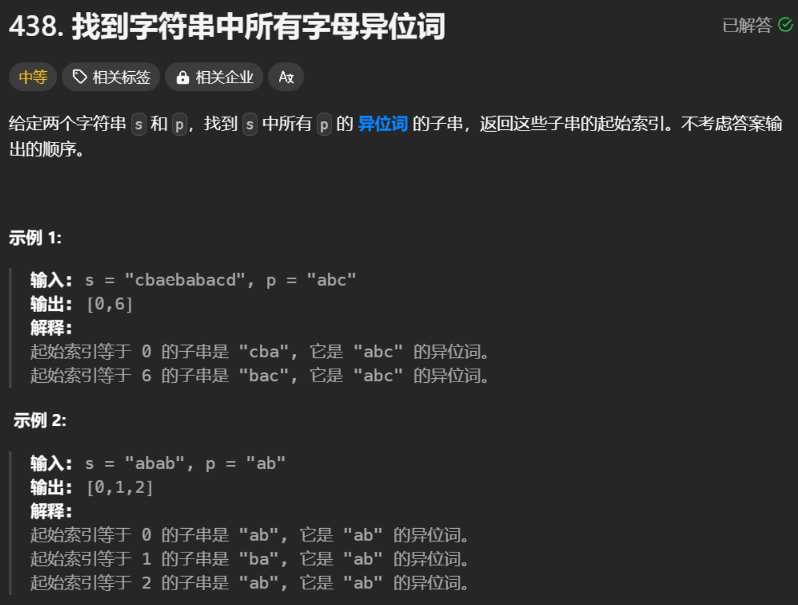

```java
class Solution {
    public List<Integer> findAnagrams(String s, String p) {
        Map<Character,Integer> window = new HashMap<>();
        Map<Character,Integer> need = new HashMap<>();
        List<Integer> list = new ArrayList<>();

        for(int i = 0; i < p.length(); i++){
            char c = p.charAt(i);
            need.put(c,need.getOrDefault(c,0)+1);
        }

        int count = need.size();   
        int left = 0;
        for(int right = 0; right < s.length(); right++){
            char c = s.charAt(right);
            if(need.containsKey(c)){
                window.put(c,window.getOrDefault(c,0)+1);
                if(window.get(c).equals(need.get(c)))//注意这里一定要用equals
                    count--;
            }

            while(count == 0){
                if(right-left+1 == p.length()) list.add(left);
                c = s.charAt(left);
                left++;
                if(window.containsKey(c)){
                    window.put(c,window.get(c)-1);
                    if(window.get(c) < need.get(c))
                        count++;
                }
            }
        }
        return list;
    }
}
```

## [LCR 122. 路径加密](https://leetcode.cn/problems/ti-huan-kong-ge-lcof/)

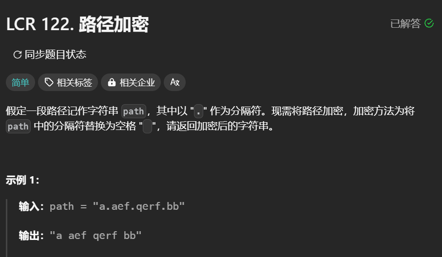

```java
class Solution {
    public String pathEncryption(String path) {
        char[] arr = path.toCharArray();
        for(int i = 0; i < arr.length; i++){
            if(arr[i] == '.')
                arr[i] = ' ';
        }
        return new String(arr);
    }
}
```

# 栈与队列

## [232. 用栈实现队列](https://leetcode.cn/problems/implement-queue-using-stacks/)


```java
class MyQueue {
    Stack<Integer> stack1;
    Stack<Integer> stack2;

    public MyQueue() {
        stack1 = new Stack<>();
        stack2 = new Stack<>();
    }
    
    public void push(int x) {
        stack1.push(x);
    }
    
    public int pop() {
        if(stack2.isEmpty()){
            while(!stack1.isEmpty()){
                stack2.push(stack1.pop());
            }
        }
        return stack2.pop();
    }
    
    public int peek() {
        if(stack2.isEmpty()){
            while(!stack1.isEmpty()){
                stack2.push(stack1.pop());
            }
        }
        return stack2.peek(); 
    }
    
    public boolean empty() {
        return stack1.isEmpty() && stack2.isEmpty();
    }
}

```

## [225. 用队列实现栈](https://leetcode.cn/problems/implement-stack-using-queues/)

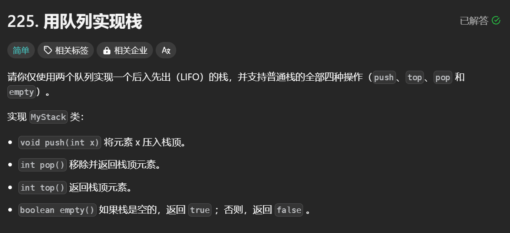

```java
class MyStack {
    LinkedList<Integer> queue1;
    LinkedList<Integer> queue2;
    public MyStack() {
        queue1 = new LinkedList<>();
        queue2 = new LinkedList<>();
    }
    
    public void push(int x) {
        queue2.offer(x);
        while(!queue1.isEmpty()){
            queue2.offer(queue1.poll());
        }
        LinkedList<Integer> temp = queue1;
        queue1 = queue2;
        queue2 = temp;
    }
    
    public int pop() {
        return queue1.poll();
    }
    
    public int top() {
        return queue1.peek();
    }
    
    public boolean empty() {
        return queue1.isEmpty();
    }
}
```

## [20. 有效的括号](https://leetcode.cn/problems/valid-parentheses/)

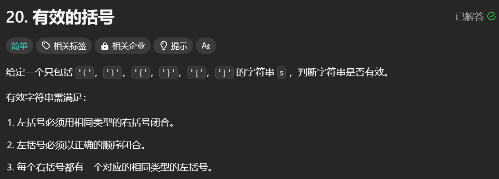

```java
class Solution {
    public boolean isValid(String s) {
        Stack<Character> stack = new Stack<>();
        for(int i = 0; i < s.length(); i++){
            char c = s.charAt(i);
            if(c == '[' || c == '(' || c == '{'){
                stack.push(c);
            }else if (c == ')'){
                if(stack.isEmpty() || stack.pop() != '(')
                    return false;
            }else if (c == '}'){
                if(stack.isEmpty() || stack.pop() != '{')
                    return false;
            }else if (c == ']'){
                if(stack.isEmpty() || stack.pop() != '[')
                    return false;
            }
        }
        return stack.isEmpty();//注意最后要判空！！！
    }
}
```

## [150. 逆波兰表达式求值](https://leetcode.cn/problems/evaluate-reverse-polish-notation/)

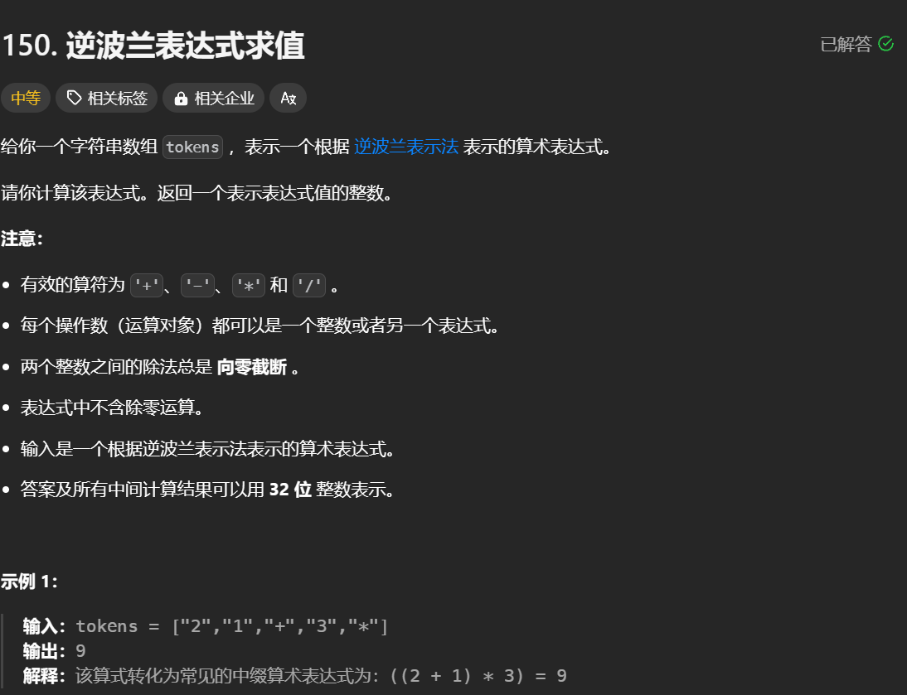

```java
class Solution {
    public int evalRPN(String[] tokens) {
        Stack<Integer> stack = new Stack<>();
        for(int i = 0; i < tokens.length; i++){
            if(tokens[i].equals("+")){
                int a = stack.pop();
                int b =  stack.pop();
                stack.push(a+b);
            }else if(tokens[i].equals("-")){
                int a = stack.pop();
                int b =  stack.pop(); 
                stack.push(b-a);
            }else if(tokens[i].equals("*")){
                int a = stack.pop();
                int b =  stack.pop();
                stack.push(a*b);
            }else if(tokens[i].equals("/")){
                int a = stack.pop();
                int b =  stack.pop();
                stack.push(b/a);
            }else{
                System.out.println(tokens[i]);
                stack.push(Integer.parseInt(tokens[i]));
            }
        }
        return stack.pop();
    }
}
```

## [239. 滑动窗口最大值](https://leetcode.cn/problems/sliding-window-maximum/)

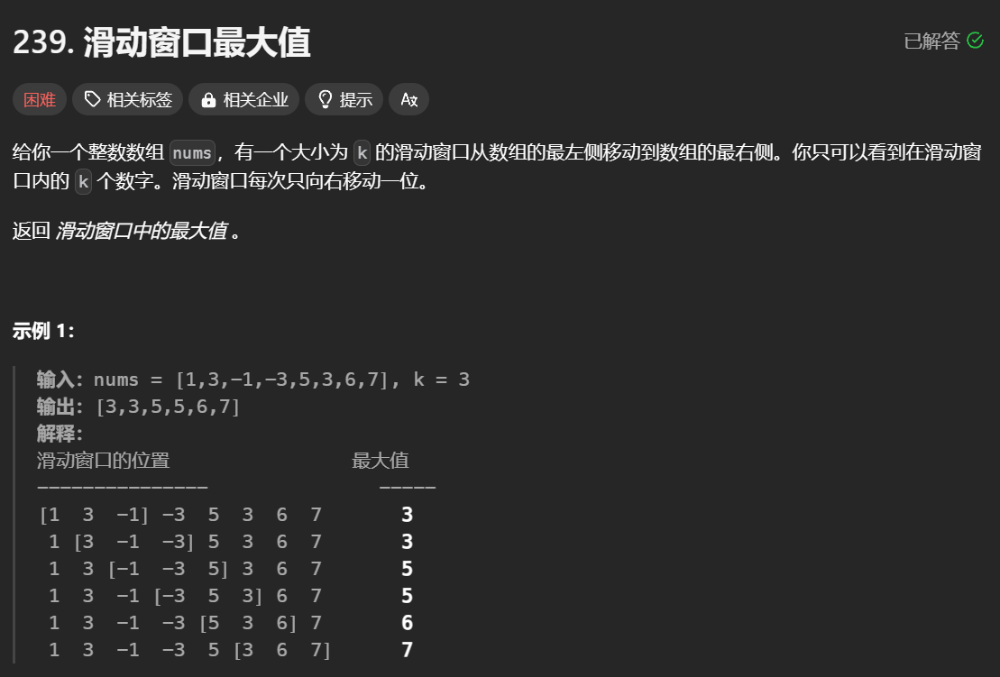

```java
class Solution {
    public int[] maxSlidingWindow(int[] nums, int k) {
        int[] result = new int[nums.length - k + 1];
        LinkedList<Integer> list = new LinkedList<>();

        for(int i =  0; i < k; i++){
            while(!list.isEmpty() && list.getLast() < nums[i]) 
                list.removeLast();
            list.addLast(nums[i]);
        }
        result[0] = list.getFirst();

        for(int i = k; i < nums.length; i++){
            while(!list.isEmpty() && list.getLast() < nums[i]) 
                list.removeLast();
            list.addLast(nums[i]);

            if(list.getFirst() == nums[i-k])
                list.removeFirst();
            result[i-k+1] = list.getFirst();
        }
        return result;
    }
}
```

## [347. 前 K 个高频元素](https://leetcode.cn/problems/top-k-frequent-elements/)

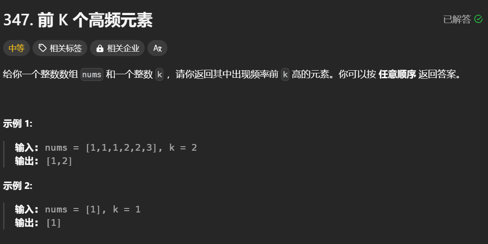

```java
class Solution {
    public int[] topKFrequent(int[] nums, int k) {
        Map<Integer,Integer> map = new HashMap<>();
        PriorityQueue<Integer> queue = new PriorityQueue<>((a,b) -> map.get(a) - map.get(b));
        
        for(int num : nums)
            map.put(num,map.getOrDefault(num,0)+1);
        
        for(int key : map.keySet()){
            if(queue.size() < k){
                queue.offer(key);
            }else if(map.get(queue.peek()) < map.get(key)){
                queue.poll();
                queue.offer(key);
            }
        }
        
        int[] res = new int[k];
        for(int i = 0; i < k; i++)
            res[i] = queue.poll();
        
        return res;
    }
}
```

## [207. 课程表](https://leetcode.cn/problems/course-schedule/)

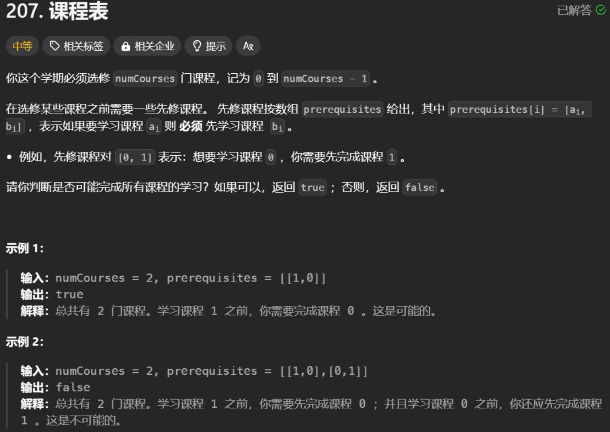

```java
class Solution {
    public boolean canFinish(int numCourses, int[][] prerequisites) {
        List<List<Integer>> list = new ArrayList<>();//存放邻接关系
        int[] ans = new int[numCourses];//存放入度
        Queue<Integer> queue = new LinkedList<>();//存放入度为0的课程
        //初始化集合
        for(int i = 0; i < numCourses; i++){
            list.add(new ArrayList<>());
        }
        //存放所有依赖关系，并调整入度
        for(int i = 0; i < prerequisites.length; i++){
            list.get(prerequisites[i][1]).add(prerequisites[i][0]);
            ans[prerequisites[i][0]]++;
        }
        //入度为0的添加到队列中
        for(int i = 0; i < numCourses; i++){
            if(ans[i] == 0){
                queue.offer(i);
            }
        }
      
        while(!queue.isEmpty()){
            int k = queue.poll();
            numCourses--;
            List<Integer> path = list.get(k);
            for(int i = 0; i < path.size(); i++){
                ans[path.get(i)]--;
                if(ans[path.get(i)] == 0){
                    queue.offer(path.get(i));
                }
            }
        }
        return numCourses == 0;
    }
}
```

## [155. 最小栈](https://leetcode.cn/problems/min-stack/)

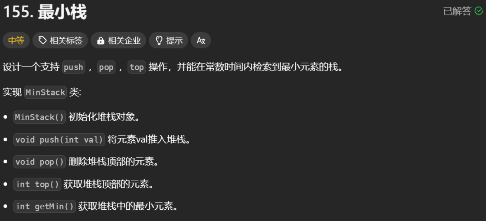

```java
class MinStack {
    Stack<int[]> stack;
    int min;

    public MinStack() {
        stack = new Stack<>();
    }
    
    public void push(int val) {
        int[] num = new int[2];
        num[0] = val;
        num[1] = val;
        if(!stack.isEmpty())
            num[1] = Math.min(val,stack.peek()[1]);
        stack.push(num);
    }
    
    public void pop() {
        stack.pop();
    }
    
    public int top() {
        return stack.peek()[0];
    }
    
    public int getMin() {
        return stack.peek()[1];
    }
}
```

## [394. 字符串解码](https://leetcode.cn/problems/decode-string/)

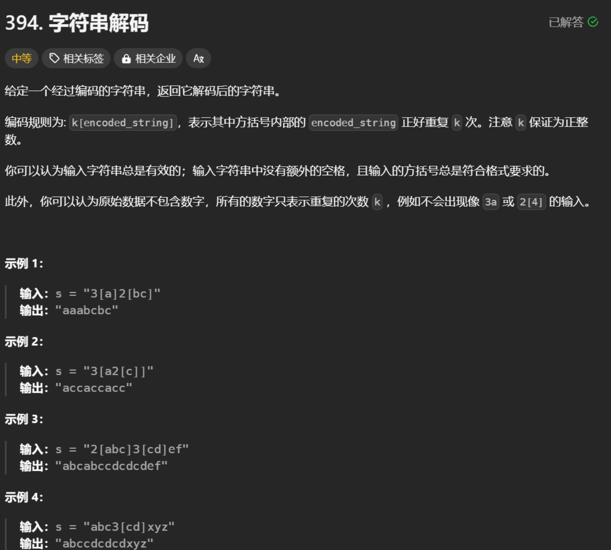

```java
class Solution {
    public String decodeString(String s) {
        /*
        双栈，一个栈模拟数字，一个栈模拟字符串
         */
        Stack<Integer> numStack = new Stack<>();
        Stack<StringBuilder> stringStack = new Stack<>();

        int num = 0;
        StringBuilder curString = new StringBuilder();

        for (int i = 0; i < s.length(); i++) {
            //当前字符
            char c = s.charAt(i);

            //如果是数字
            if(Character.isDigit(c)){
                num = num * 10 + c-'0';
            } else if (c == '[') {
                //如果是左括号，就把当前数字和字符入栈,同时重置当前数字和当前字符串
                numStack.push(num);
                stringStack.push(curString);
                num = 0;
                curString = new StringBuilder();
            } else if (c == ']') {
                //如果是右括号，就进行解码
                //1、得到当前字符串要重复的次数，也就是[]前的数字
                int loopTimes = numStack.pop();
                //注意这里创建的是栈顶元素的string容器
                StringBuilder temp = new StringBuilder(stringStack.pop());
                for (int j = 0; j < loopTimes; j++) {
                    temp.append(curString);
                }
                curString = temp;
            }else {
                //如果是字母就更新当前字母
                curString.append(c);
            }
        }
        return new String(curString);
    }
}
```

## [2. 两数相加](https://leetcode.cn/problems/add-two-numbers/)

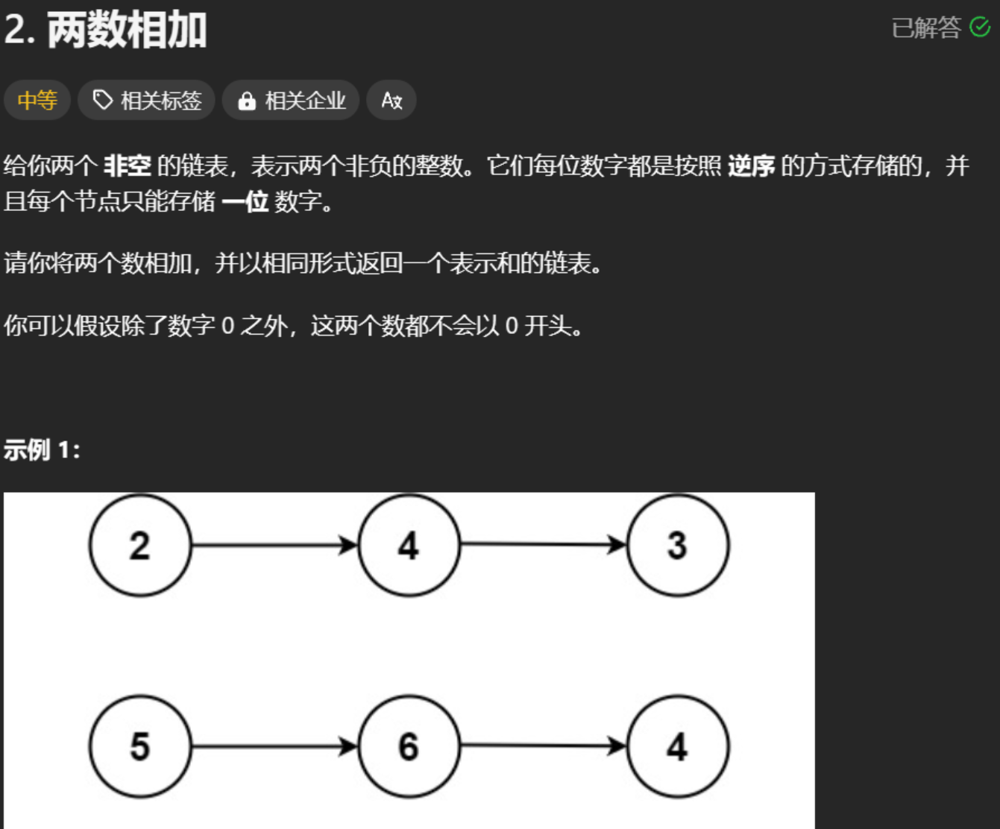

```java
class Solution {
    public ListNode addTwoNumbers(ListNode l1, ListNode l2) {
        //定义一个新联表伪指针，用来指向头指针，返回结果
        ListNode prev = new ListNode(0);
        //定义一个进位数的指针，用来存储当两数之和大于10的时候，
        int carry = 0;
        //定义一个可移动的指针，用来指向存储两个数之和的位置
        ListNode cur = prev;
        //当l1 不等于null或l2 不等于空时，就进入循环
        while(l1!=null || l2!=null){
            //如果l1 不等于null时，就取他的值，等于null时，就赋值0，保持两个链表具有相同的位数
            int x= l1 !=null ? l1.val : 0;
             //如果l1 不等于null时，就取他的值，等于null时，就赋值0，保持两个链表具有相同的位数
            int y = l2 !=null ? l2.val : 0;
            //将两个链表的值，进行相加，并加上进位数
            int sum = x + y + carry;
            //计算进位数
            carry = sum / 10;
            //计算两个数的和，此时排除超过10的请况（大于10，取余数）
            sum = sum % 10;
            //将求和数赋值给新链表的节点，
            //注意这个时候不能直接将sum赋值给cur.next = sum。这时候会报，类型不匹配。
            //所以这个时候要创一个新的节点，将值赋予节点
            cur.next = new ListNode(sum);
            //将新链表的节点后移
            cur = cur.next;
            //当链表l1不等于null的时候，将l1 的节点后移
            if(l1 !=null){
                l1 = l1.next;
            }
            //当链表l2 不等于null的时候，将l2的节点后移
            if(l2 !=null){
                l2 = l2.next;
            } 
        }
        //如果最后两个数，相加的时候有进位数的时候，就将进位数，赋予链表的新节点。
        //两数相加最多小于20，所以的的值最大只能时1
        if(carry == 1){
            cur.next = new ListNode(carry);
        }
        //返回链表的头节点
        return prev.next;
    }
}
```

## [32. 最长有效括号](https://leetcode.cn/problems/longest-valid-parentheses/)

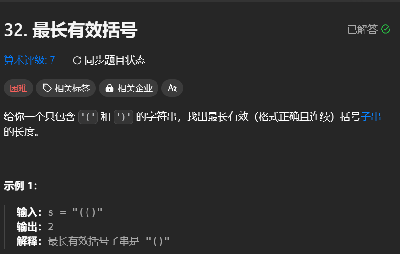

```java
class Solution {
    public int longestValidParentheses(String s) {
        Deque<Integer> stack = new LinkedList<>();
        stack.push(-1);
        int max = 0;
        for(int i = 0; i < s.length(); i++){
            char c = s.charAt(i);
            if(stack.size()==1 || c == '(' || s.charAt(stack.peek()) == ')')
                stack.push(i);
            else{
                stack.pop();
                max = Math.max(max,i-stack.peek());
            }
        }
        return max;
    }
}
```

栈的功能：栈存储索引。在遍历过程中，只要有两个连续索引对应字符可以构成一对括号就出栈，这样栈中存储的都是到当前位置暂时不可以构成括号的索引。

那满足什么条件才会导致当前不可以构成括号呢？
```java
i. 当前栈为空。当前字符s[i]将会是栈中第一个字符，无法跟之前的字符构成一对括号
ii. 当前字符s[i]是左括号'('。左括号无法跟栈顶元素构成一对括号
iii. 栈顶元素是右括号')'。无论当前字符s[i]是什么，都无法和栈顶元素构成一对括号

其实也就是栈顶元素必须为'('，当前字符s[i]必须为')'，这样才能构成一对括号！！！
```

构成一对括号以后，栈顶元素出栈。
这样就可以满足前面说的栈中存储的都是当前暂时不可以构成括号的索引

```java
当前有效括号的长度 = 当前索引i - 栈顶存储的索引stack[-1]
最后要返回的最长有效括号长度即为res = max(res, i - stack[-1])
因为此时栈可能为空，如果为空就是res = max(res, i - (-1))，所以可以提前入栈一个-1来减少判断!!!
```

https://leetcode.cn/problems/longest-valid-parentheses/solutions/762279/32-zui-chang-you-xiao-gua-hao-fu-zhu-zha-1cqq/

# 二叉树

## [144. 二叉树的前序遍历](https://leetcode.cn/problems/binary-tree-preorder-traversal/)

```java
class Solution {
    public List<Integer> preorderTraversal(TreeNode root) {
        List<Integer> list = new ArrayList<>();
        preorder(root,list);
        return list;
    }
    public static void preorder(TreeNode root,List<Integer> list ){
        if(root == null)
            return;
        
        list.add(root.val);
        preorder(root.left,list);
        preorder(root.right,list);
    }
}
```

```java
class Solution {
    public List<Integer> preorderTraversal(TreeNode root) {
        List<Integer> list = new ArrayList<>();
        if(root == null) return list;

        Stack<TreeNode> stack = new Stack<>();
        stack.push(root);

        while(!stack.isEmpty()){
            TreeNode p = stack.pop();
            list.add(p.val);
            if(p.right != null) stack.push(p.right);
            if(p.left != null) stack.push(p.left);
        }
        return list;
    }
}
```

## [145. 二叉树的后序遍历](https://leetcode.cn/problems/binary-tree-postorder-traversal/)

```java
class Solution {
    public List<Integer> postorderTraversal(TreeNode root) {
        List<Integer> list = new ArrayList<>();
        postorder(root,list);
        return list;
    }
    public static void postorder(TreeNode root,List<Integer> list){
        if(root == null)
            return;
        postorder(root.left,list);
        postorder(root.right,list);
        list.add(root.val);
    }
}
```

```java
class Solution {
    public List<Integer> postorderTraversal(TreeNode root) {
        List<Integer> list = new ArrayList<>();
        if(root == null) return list;

        Stack<TreeNode> stack = new Stack<>();
        stack.push(root);

        while(!stack.isEmpty()){

            TreeNode p = stack.pop();
            list.add(p.val);

            if(p.left != null) stack.push(p.left);
            if(p.right != null) stack.push(p.right);

        }
        Collections.reverse(list);
        return list;
    }
}
```

## [94. 二叉树的中序遍历](https://leetcode.cn/problems/binary-tree-inorder-traversal/)

```java
class Solution {
    public List<Integer> inorderTraversal(TreeNode root) {
        List<Integer> list = new ArrayList<>();
        inorder(root,list);
        return list;
    }
    public static void inorder(TreeNode root,List<Integer> list){
        if(root == null)
            return;
        inorder(root.left,list);
        list.add(root.val);
        inorder(root.right,list);
    }
}
```

```java
class Solution {
    public List<Integer> inorderTraversal(TreeNode root) {
        List<Integer> list = new ArrayList<>();
        if(root == null) return list;

        Stack<TreeNode> stack = new Stack<>();
        TreeNode cur = root;
        while(cur!= null || !stack.isEmpty()){
            if(cur!=null){
                stack.push(cur);
                cur = cur.left;
            }else{
                TreeNode p = stack.pop();
                list.add(p.val);
                cur = p.right;
            }
        }

        return list;
    }
}
```

## [102. 二叉树的层序遍历](https://leetcode.cn/problems/binary-tree-level-order-traversal/)

```java
class Solution {
    public List<List<Integer>> levelOrder(TreeNode root) {
        List<List<Integer>> list = new ArrayList<>();
        if(root == null) return list;

        Queue<TreeNode> queue = new LinkedList<>();
        queue.offer(root);
        while(!queue.isEmpty()){
            List<Integer> temp = new ArrayList<>();
            int len = queue.size();

            for(int i = 0; i < len; i++){
                TreeNode p = queue.poll();
                temp.add(p.val);
                
                if(p.left != null)  queue.offer(p.left);
                if(p.right != null)  queue.offer(p.right);
            }
            list.add(temp);
        }
        return list;
    }
}
```

## [226. 翻转二叉树](https://leetcode.cn/problems/invert-binary-tree/)

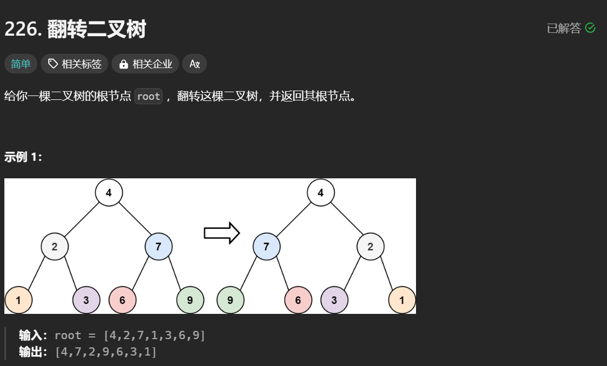

```java
class Solution {
    public TreeNode invertTree(TreeNode root) {
        reverse(root);
        return root;
    }

    public static void reverse(TreeNode root){
        if(root == null) return;

        TreeNode temp = root.left;
        root.left = root.right;
        root.right = temp;

        reverse(root.left);
        reverse(root.right);
    }
}
```

## [101. 对称二叉树](https://leetcode.cn/problems/symmetric-tree/)

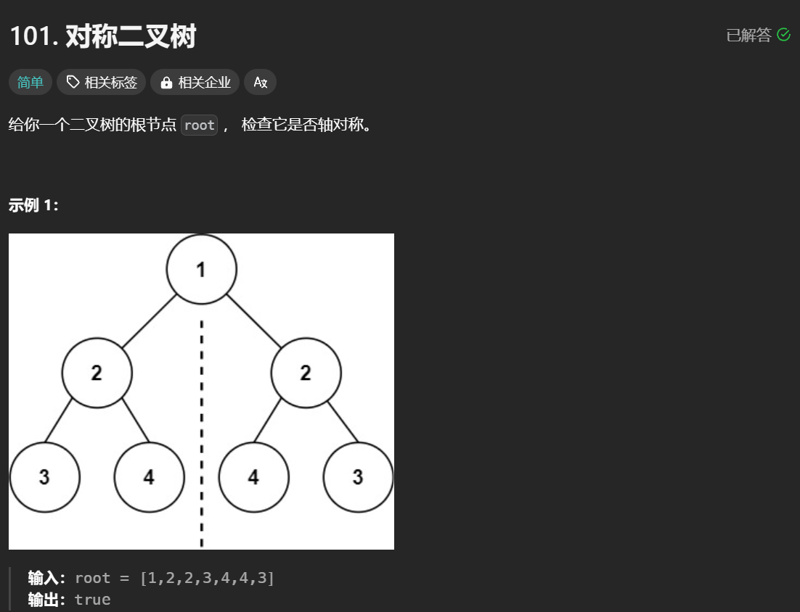

```java
class Solution {
    public boolean isSymmetric(TreeNode root) {
        return isRight(root.left,root.right);
    }

    public static boolean isRight(TreeNode left,TreeNode right){
        //递归出口
        if(left == null && right == null)
            return true;
        if(left == null || right == null)
            return false;
        if(left.val != right.val)
             return false;

        //单层递归逻辑 left.val == right.val的情况
        boolean out = isRight(left.left,right.right);//左
        boolean in = isRight(left.right,right.left);//右
        return out && in;//中
    }

}
```

## [104. 二叉树的最大深度](https://leetcode.cn/problems/maximum-depth-of-binary-tree/)

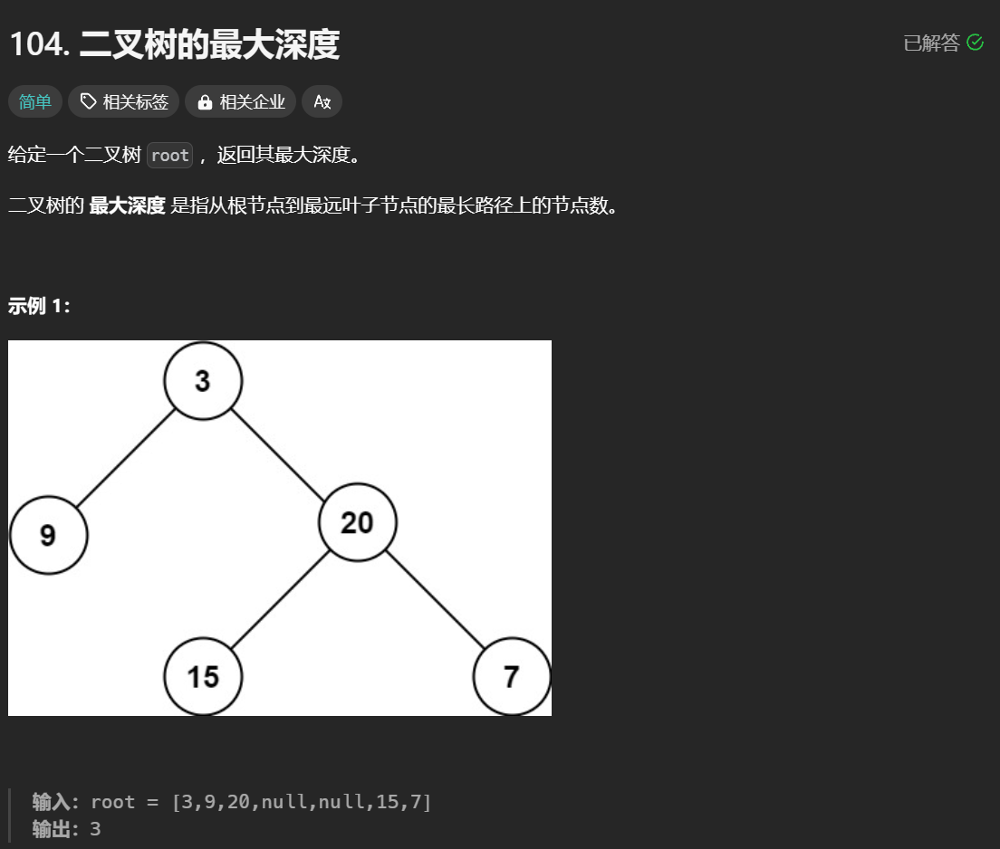

```java
class Solution {
    public int maxDepth(TreeNode root) {
        if(root == null) return 0;

        int left = maxDepth(root.left);
        int right = maxDepth(root.right);

        return Math.max(left,right)+1;
    }
}
```

## [111. 二叉树的最小深度](https://leetcode.cn/problems/minimum-depth-of-binary-tree/)

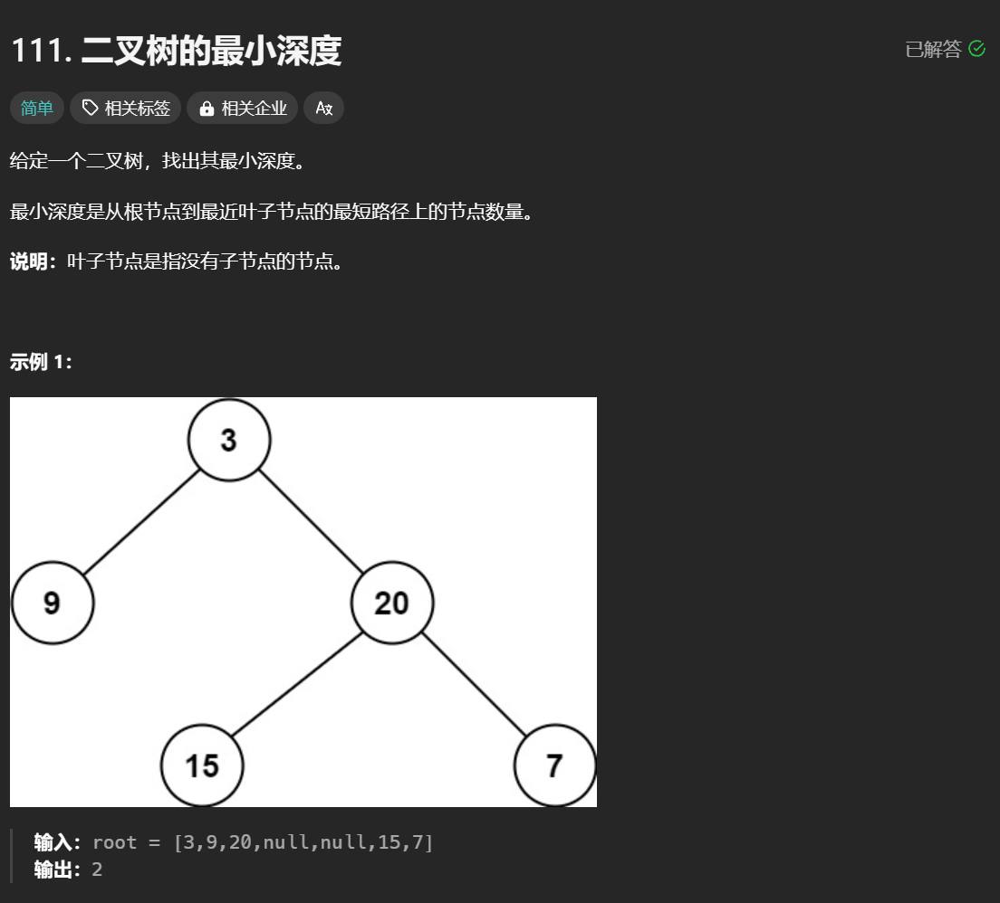

```java
class Solution {
    public int minDepth(TreeNode root) {
        return min(root);
    }

    public static int min(TreeNode root){
        if(root == null) return 0;

        int left = min(root.left);
        int right = min(root.right);

        if(left != 0 && right != 0)
            return Math.min(left,right)+1;
        else
            return left+right+1;
    }

}
```

## [222. 完全二叉树的节点个数](https://leetcode.cn/problems/count-complete-tree-nodes/)

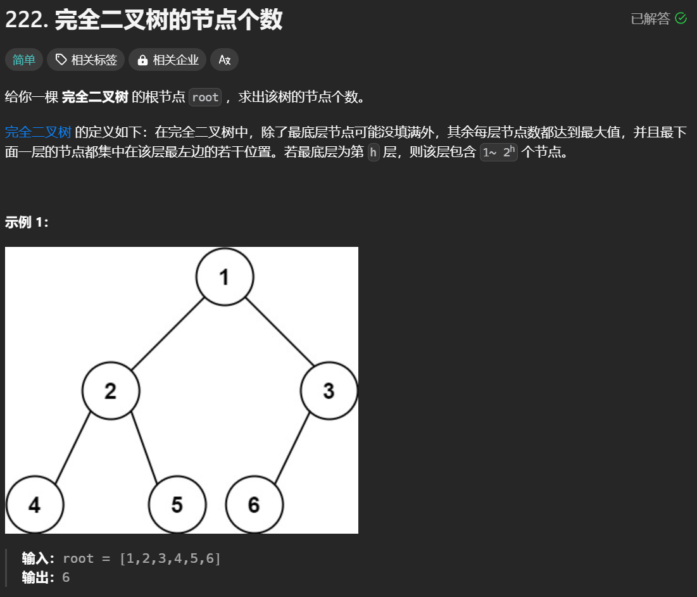

```java
class Solution {
    public int countNodes(TreeNode root) {
        if(root == null) return 0;
        return countNodes(root.left) + countNodes(root.right) + 1;
    }
}
```

## [110. 平衡二叉树](https://leetcode.cn/problems/balanced-binary-tree/)

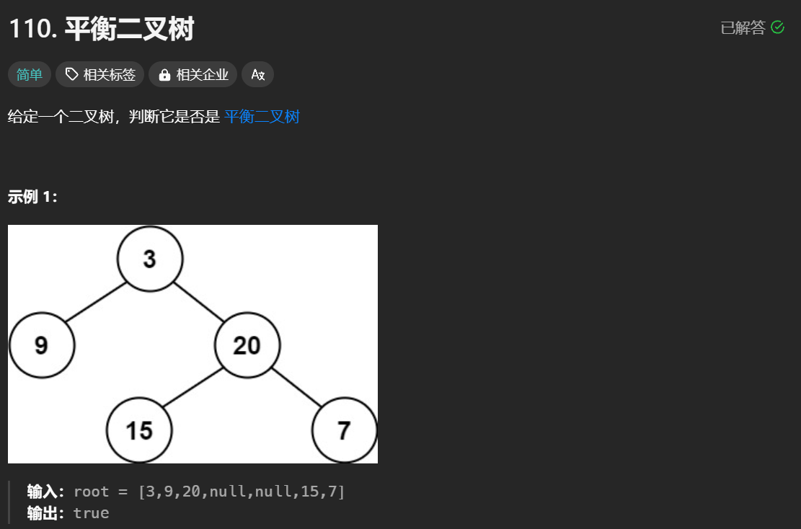

```java
class Solution {
    boolean flag = true;
    public boolean isBalanced(TreeNode root) {
        search(root);
        return flag;
    }

    public int search(TreeNode root){
        if(root == null) return 0;

        int left = search(root.left);
        int right = search(root.right);

        if(Math.abs(left-right)>1)
            flag = false;

        return Math.max(left,right)+1;
    }
}
```

## [404. 左叶子之和](https://leetcode.cn/problems/sum-of-left-leaves/)

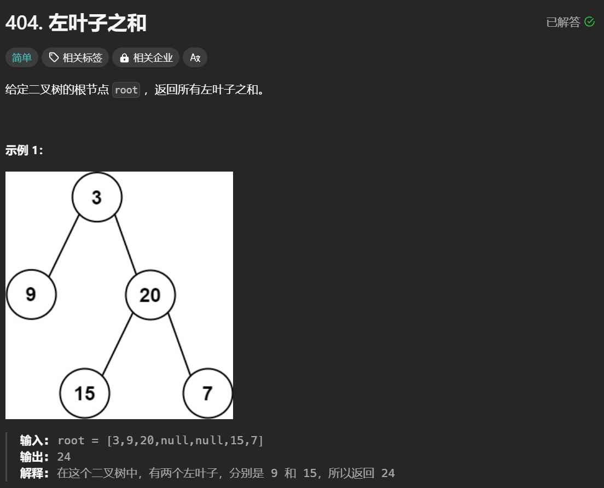

```java
class Solution {
    int count = 0;
    public int sumOfLeftLeaves(TreeNode root) {
        sum(root);
        return count;
    }


    public void sum(TreeNode root){
        if(root == null)
            return;
            
        if(root.left != null && root.left.left == null && root.left.right == null){
            count += root.left.val;
        }

        sum(root.left);
        sum(root.right);
    }
}
```

## [513. 找树左下角的值](https://leetcode.cn/problems/find-bottom-left-tree-value/)

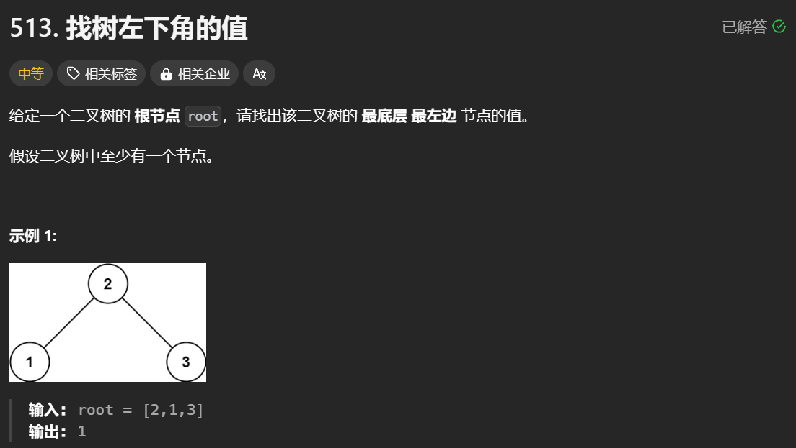

```java
class Solution {
    public int findBottomLeftValue(TreeNode root) {
        int left = root.val;
        Queue<TreeNode> queue = new LinkedList<>();
        queue.offer(root);

        while(!queue.isEmpty()){
            int len = queue.size();
            for(int i = 0; i < len; i++){
                TreeNode p = queue.poll();
                if(i == 0) left = p.val;
                if(p.left != null) queue.offer(p.left);
                if(p.right != null) queue.offer(p.right);
            }
        }
        return left;
    }
}
```

## [106. 从中序与后序遍历序列构造二叉树](https://leetcode.cn/problems/construct-binary-tree-from-inorder-and-postorder-traversal/)

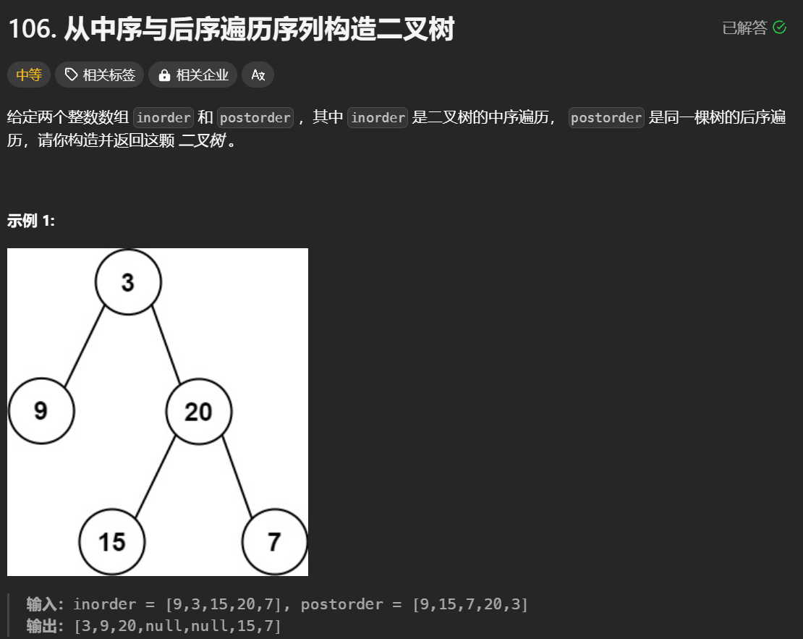

```java
class Solution {
    Map<Integer,Integer> map = new HashMap<>();
    public TreeNode buildTree(int[] inorder, int[] postorder) {
        for(int i = 0; i < inorder.length; i++){
            map.put(inorder[i],i);
        }

        return bulild(inorder,0,inorder.length-1,postorder,0,postorder.length-1);
    }

    public TreeNode bulild(int[] inorder,int inS,int inE,int[] postorder,int postS,int postE){
        if(inS > inE || postS > postE) return null;

        int mid = postorder[postE];//后序遍历最后一个元素是根节点
        TreeNode root = new TreeNode(mid);

        int len = map.get(mid) - inS;//找到根节点在中序遍历的位置

        root.left = bulild(inorder,inS,inS + len - 1,postorder,postS,postS + len - 1);
        root.right = bulild(inorder,inS + len + 1,inE,postorder,postS + len,postE-1);

        return root;
    }

}
```

## [105. 从前序与中序遍历序列构造二叉树](https://leetcode.cn/problems/construct-binary-tree-from-preorder-and-inorder-traversal/)

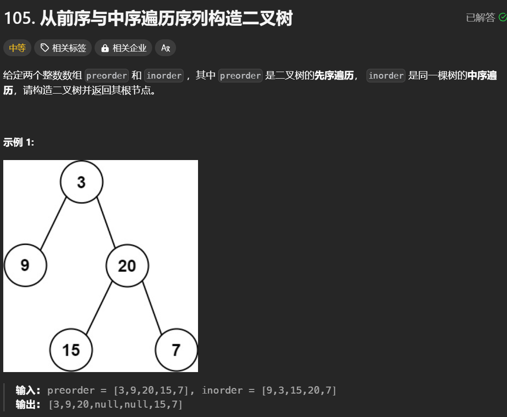

```java
class Solution {
    Map<Integer,Integer> map = new HashMap<>();
    public TreeNode buildTree(int[] preorder, int[] inorder) {
        for(int i = 0; i < inorder.length; i++)
            map.put(inorder[i],i);
        return build(preorder,0,preorder.length-1,inorder,0,inorder.length-1);
    }

    public TreeNode build(int[] preorder,int preS,int preE,int[] inorder,int inS,int inE){
        if(preS > preE || inS > inE) return null;
        
        int x = preorder[preS];
        int index = map.get(x);
        int len = index - inS;
        
        TreeNode root = new TreeNode(x);
        root.left = build(preorder,preS+1,preS+len,inorder,inS,index-1);
        root.right = build(preorder,preS+len+1,preE,inorder,index+1,inE);

        return root;
    }
}
```

## [654. 最大二叉树](https://leetcode.cn/problems/maximum-binary-tree/)

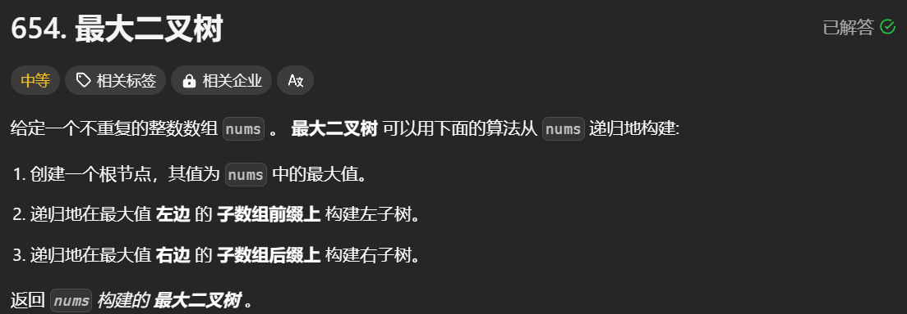

```java
class Solution {

    public TreeNode constructMaximumBinaryTree(int[] nums) {
        return build(nums,0,nums.length-1);
    }   

    public TreeNode build(int[] nums,int start,int end){
        if(start > end) return null;

        //求最大值
        int maxIndex = start;
        for(int i = start; i <= end; i++){
            if(nums[i] > nums[maxIndex]) maxIndex = i;
        }
        
        TreeNode root = new TreeNode(nums[maxIndex]);

        root.left = build(nums,start,maxIndex-1);
        root.right = build(nums,maxIndex+1,end);
        return root;
    }
}
```

## [617. 合并二叉树](https://leetcode.cn/problems/merge-two-binary-trees/)

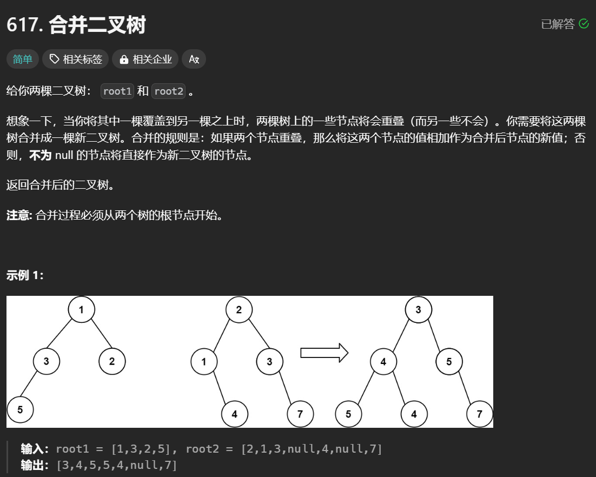

```java
class Solution {
    public TreeNode mergeTrees(TreeNode root1, TreeNode root2) {
        if(root1 == null) return root2;
        if(root2 == null) return root1;

        root1.val += root2.val;
        root1.left = mergeTrees(root1.left,root2.left);
        root1.right = mergeTrees(root1.right,root2.right);

        return root1;
    }
}
```

## [700. 二叉搜索树中的搜索](https://leetcode.cn/problems/search-in-a-binary-search-tree/)

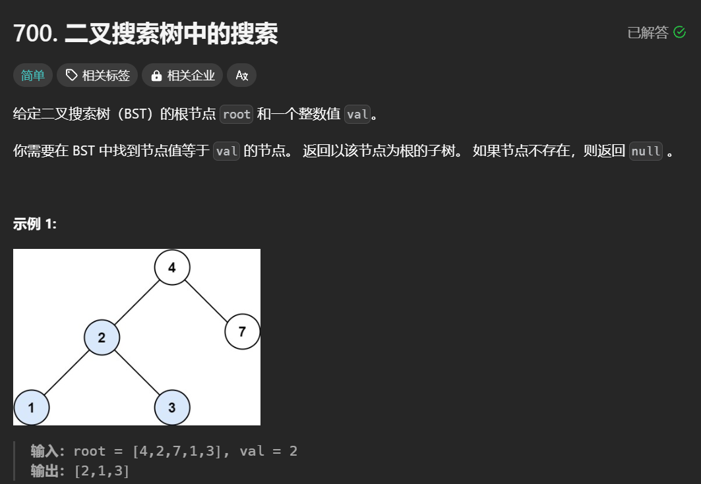

```java
class Solution {
    public TreeNode searchBST(TreeNode root, int val) {
        if(root == null) return null;

        if(val < root.val)
            return searchBST(root.left,val);
        else if(val > root.val)
            return searchBST(root.right,val);
        else
            return root;
    }
}
```

## [98. 验证二叉搜索树](https://leetcode.cn/problems/validate-binary-search-tree/)

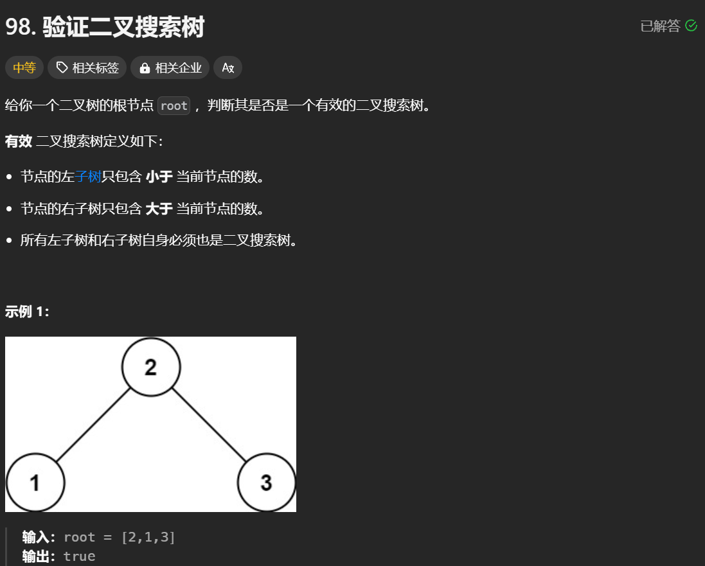

```java
class Solution {
    TreeNode pre = null;
    boolean flag = true;
    public boolean isValidBST(TreeNode root) {
        search(root);
        return flag;
    }

    public void search(TreeNode root){
        if(root == null || flag == false) return;

        search(root.left);

        if(pre != null && root.val <= pre.val){
            flag = false;
        }
        pre = root;

        search(root.right);
    }

}
```

## [530. 二叉搜索树的最小绝对差](https://leetcode.cn/problems/minimum-absolute-difference-in-bst/)

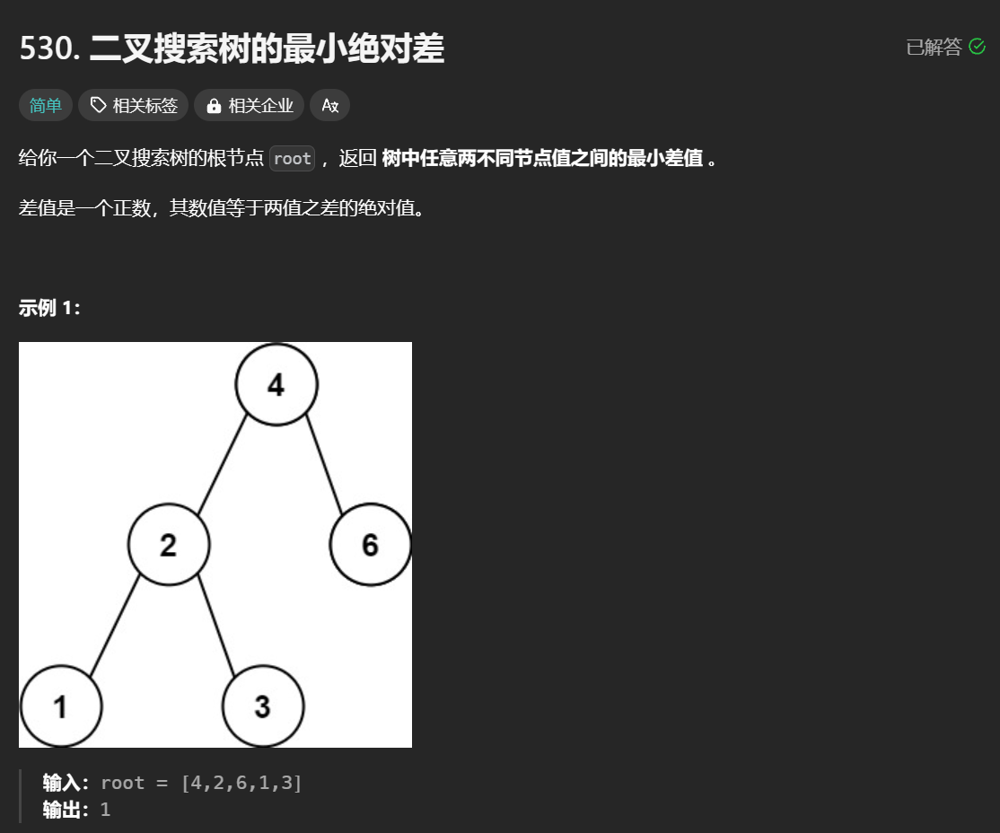

```java
class Solution {
    TreeNode pre;
    int min = Integer.MAX_VALUE;

    public int getMinimumDifference(TreeNode root) {
        get(root);
        return min;
    }

    public void get(TreeNode root) {
        if(root == null) return;

        get(root.left);

        if (pre != null) {
            min = Math.min(min, root.val - pre.val);
        }
        pre = root;

        get(root.right);
    }

}
```

## [501. 二叉搜索树中的众数](https://leetcode.cn/problems/find-mode-in-binary-search-tree/)

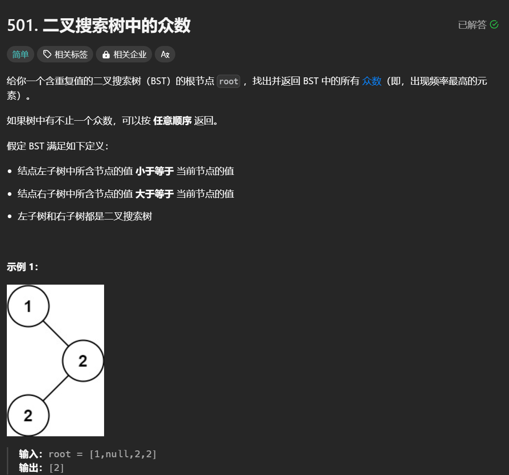

```java
class Solution {
    int maxCount = 0;
    int curCount = 0;
    TreeNode pre;
    List<Integer> list = new ArrayList<>();

    public int[] findMode(TreeNode root) {
        find(root);
        int[] nums = new int[list.size()];
        for(int i = 0; i < nums.length; i++){
            nums[i] = list.get(i);
        }
        return nums;
    }

    public void find(TreeNode root){
        if(root == null) return;

        findMode(root.left);

        if(pre == null){
            curCount = 1;
        }else if(pre != null && root.val == pre.val){
            curCount++;
        }else{
            curCount = 1;
        }
        pre = root;
        if(curCount == maxCount)
            list.add(pre.val);
        if(curCount > maxCount){
            list.clear();
            list.add(pre.val);
            maxCount = curCount;
        }
        findMode(root.right);
    }

}
```

## [236. 二叉树的最近公共祖先](https://leetcode.cn/problems/lowest-common-ancestor-of-a-binary-tree/)

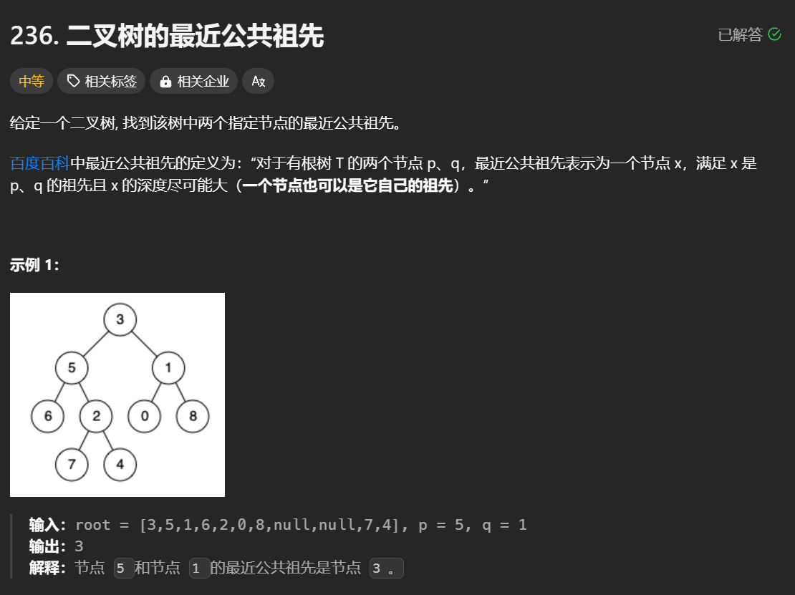

```java
class Solution {
    public TreeNode lowestCommonAncestor(TreeNode root, TreeNode p, TreeNode q) {
        if(root == null || root == p || root == q) return root;
        
        TreeNode left = lowestCommonAncestor(root.left,p,q);
        TreeNode right = lowestCommonAncestor(root.right,p,q);

        if(left == null) return right;
        if(right == null) return left;

        return root;
    }
}
```

## [450. 删除二叉搜索树中的节点](https://leetcode.cn/problems/delete-node-in-a-bst/)

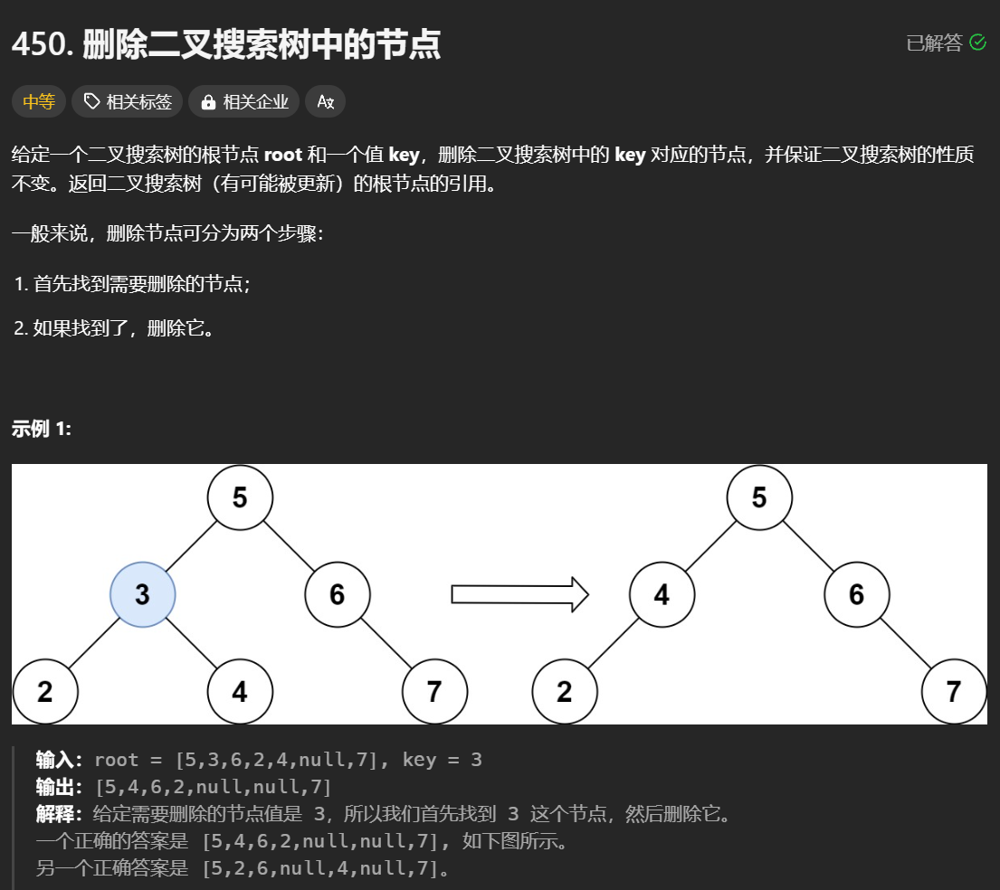

```java
class Solution {
    public TreeNode deleteNode(TreeNode root, int key) {
        if(root == null) return null;
 
        if(root.val > key)
            root.left = deleteNode(root.left,key);
        else if(root.val < key)
            root.right = deleteNode(root.right,key);
        else{
            if(root.left == null) return root.right;
            if(root.right == null) return root.left;
            TreeNode left = root.left;
            TreeNode right = root.right;
            TreeNode res = left;
            while(left.right != null)
                left = left.right;
            left.right = right;
            return res;
        }
        return root;
    }
}
```

## [669. 修剪二叉搜索树](https://leetcode.cn/problems/trim-a-binary-search-tree/)

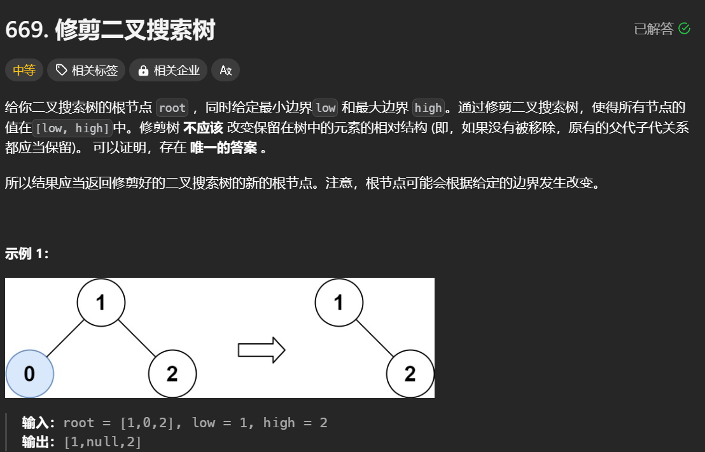

```java
class Solution {
    public TreeNode trimBST(TreeNode root, int low, int high) {
        if(root == null) return null;
        
        if(root.val < low) return trimBST(root.right,low,high);
        if(root.val > high) return trimBST(root.left,low,high);
        // root在[low,high]范围内,但是两个子树不一定，照样要剪枝
        root.left = trimBST(root.left,low,high);
        root.right = trimBST(root.right,low,high);

        return root;
    }
}
```

## [108. 将有序数组转换为二叉搜索树](https://leetcode.cn/problems/convert-sorted-array-to-binary-search-tree/)

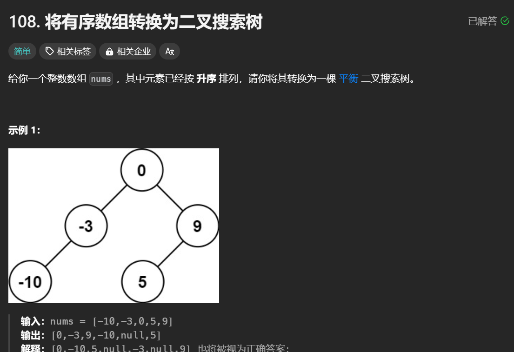

```java
class Solution {
    public TreeNode sortedArrayToBST(int[] nums) {
        return build(nums, 0, nums.length - 1);
    }

    public TreeNode build(int nums[], int start, int end) {
        if (start > end)
            return null;

        int mid = (start + end) >> 1;
        TreeNode root = new TreeNode(nums[mid]);

        root.left = build(nums, start, mid - 1);
        root.right = build(nums, mid + 1, end);
        return root;
    }

}
```

## [538. 把二叉搜索树转换为累加树](https://leetcode.cn/problems/convert-bst-to-greater-tree/)

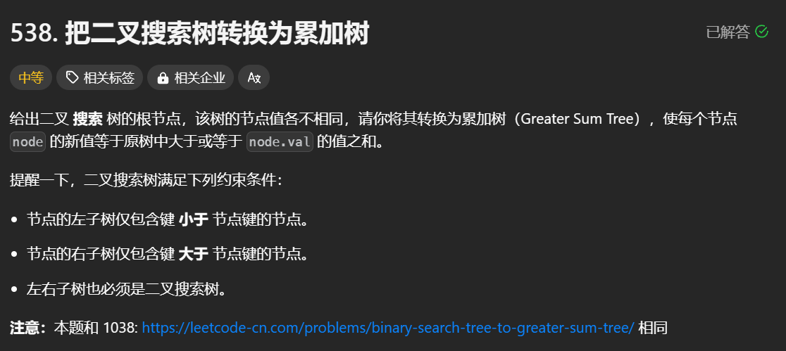

```java
class Solution {
    int sum = 0;
    public TreeNode convertBST(TreeNode root) {
        search(root);
        return root;
    }

    public void search(TreeNode root){
        if(root == null) return;

        search(root.right);

        sum += root.val;
        root.val = sum;

        search(root.left);
    }
}
```

## [124. 二叉树中的最大路径和](https://leetcode.cn/problems/binary-tree-maximum-path-sum/)⭐

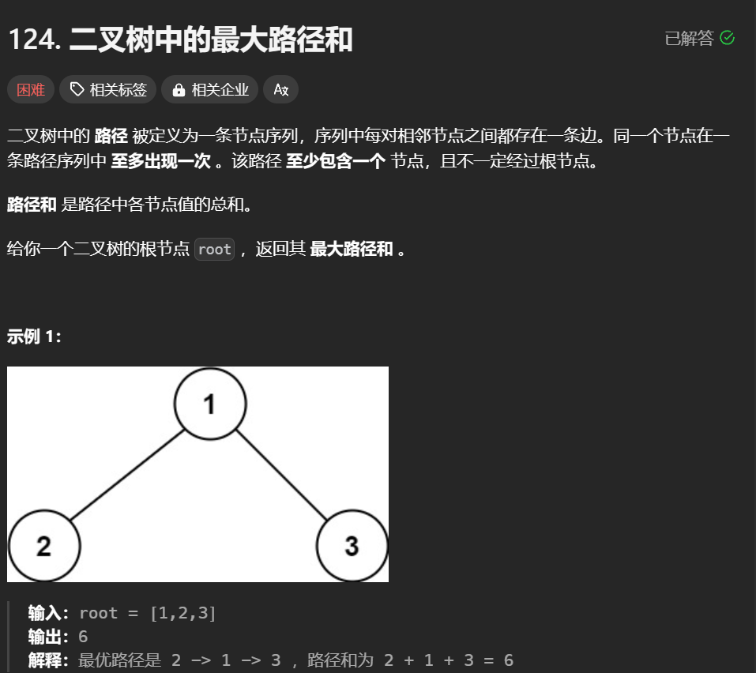

```java
class Solution {
    int ans = Integer.MIN_VALUE;
    public int maxPathSum(TreeNode root) {
        dfs(root);
        return ans;
    }
    //链：从叶子到当前节点的路径。其节点值之和是 dfs 的返回值。
    //直径：等价于由两条（或者一条）链拼成的路径。我们枚举每个 node，假设直径在这里 「拐弯」，也就是计算由左右两条从叶子到 node 的链的节点值之和，去更新答案的最大值。
    public int dfs(TreeNode root){
        if(root == null)
            return 0;

        int left = dfs(root.left);// 左子树最大链和
        int right = dfs(root.right);// 右子树最大链和
        ans = Math.max(ans,left+right+root.val);// 两条链拼成路径,在当前节点拐弯

        return Math.max(0,Math.max(left,right)+root.val);//当前子树最大单链，不拐弯
    }

}
```

## [543. 二叉树的直径](https://leetcode.cn/problems/diameter-of-binary-tree/)

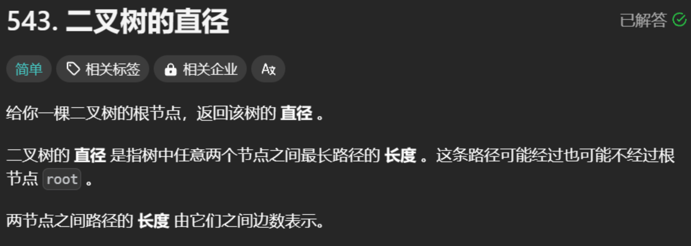

```java
class Solution {
    int max = 0;
    public int diameterOfBinaryTree(TreeNode root) {
        fun(root);
        return max;
    }

    public int fun(TreeNode root) {
        if(root == null) return 0;

        int left = fun(root.left);
        int right = fun(root.right);

        max = Math.max(max,left + right);
        
        return Math.max(left,right)+1;
    }
}
```

## [114. 二叉树展开为链表](https://leetcode.cn/problems/flatten-binary-tree-to-linked-list/)

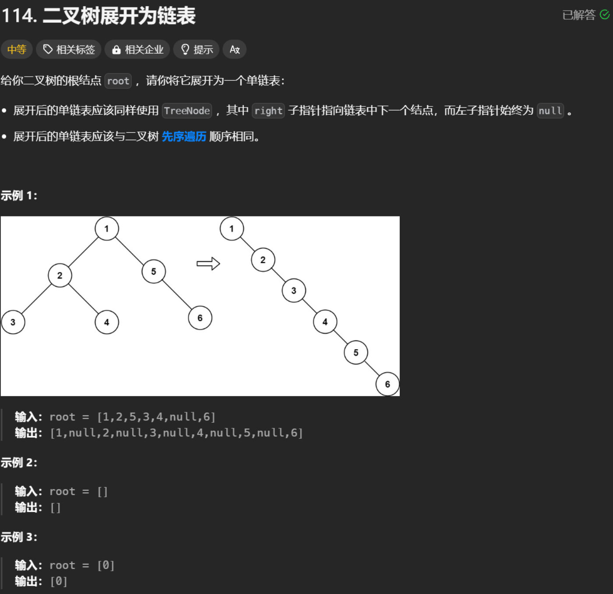

```java
class Solution {
    public void flatten(TreeNode root) {
        if(root == null) return;
		
        flatten(root.left);
        flatten(root.right);

        TreeNode temp = root.right;
        root.right = root.left;
        root.left = null;
        while(root.right != null) root = root.right;
        root.right = temp;

    }
}
```

## [297. 二叉树的序列化与反序列化](https://leetcode.cn/problems/serialize-and-deserialize-binary-tree/)

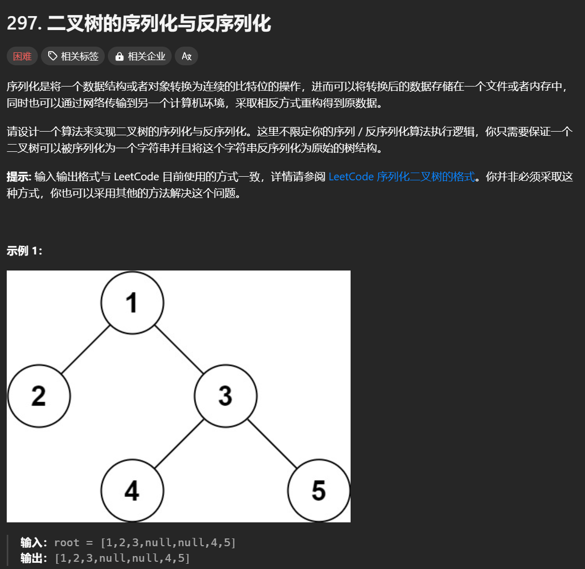

```java
public class Codec {
    public String serialize(TreeNode root) {
        if (root == null) return "[]";
        StringBuilder res = new StringBuilder("[");
        Queue<TreeNode> queue = new LinkedList<>() {{ add(root); }};
        while (!queue.isEmpty()) {
            TreeNode node = queue.poll();
            if (node != null) {
                res.append(node.val + ",");
                queue.add(node.left);
                queue.add(node.right);
            }
            else res.append("null,");
        }
        res.deleteCharAt(res.length() - 1);
        res.append("]");
        System.out.println(res);
        return res.toString();
    }

    public TreeNode deserialize(String data) {
        if (data.equals("[]")) return null;
        String[] vals = data.substring(1, data.length() - 1).split(",");
        TreeNode root = new TreeNode(Integer.parseInt(vals[0]));
        Queue<TreeNode> queue = new LinkedList<>();
        queue.add(root);
        int i = 1;
        while (!queue.isEmpty()) {
            TreeNode node = queue.poll();
            if (!vals[i].equals("null")) {
                node.left = new TreeNode(Integer.parseInt(vals[i]));
                queue.add(node.left);
            }
            i++;
            if (!vals[i].equals("null")) {
                node.right = new TreeNode(Integer.parseInt(vals[i]));
                queue.add(node.right);
            }
            i++;
        }
        return root;
    }
}
```

# 回溯算法

## 回溯总结

### 组合

```java
class Solution {
    List<List<Integer>> list = new ArrayList<>();
    List<Integer> path = new ArrayList<>();
    public List<List<Integer>> subsetsWithDup(int[] nums) {
        backTracing(nums,0);
        return list;
    }

    public void backTracing(int[] nums,int index){
        //终止条件
        if(index == nums.length){
            list.add(new ArrayList<>(path));
            return; 
        }
        //横向循环！！！！
        for(int i = index; i < nums.length; i++){

            path.add(nums[i]);
            backTracing(nums,i+1);//纵向深入！！！！，如果可以重复用一个数就不用+1
            path.removeLast();
        }

    }
}
```

### 排列

```java
class Solution {
    List<List<Integer>> list = new ArrayList<>();
    List<Integer> path = new ArrayList<>();
    boolean used[];//！！！
    public List<List<Integer>> permute(int[] nums) {
        used = new boolean[nums.length];
        backTracing(nums);
        return list;
    }

    public void backTracing(int[] nums){
        if(path.size() == nums.length){
            list.add(new ArrayList<>(path));
            return;
        }

        for(int i = 0; i <nums.length; i++){
            if(used[i]) continue;

            used[i] = true;
            path.add(nums[i]);
            backTracing(nums);
            path.removeLast();
            used[i] = false;
        }
    }
}
```

### 可排序去重


### 不可排序去重


## [77. 组合](https://leetcode.cn/problems/combinations/)

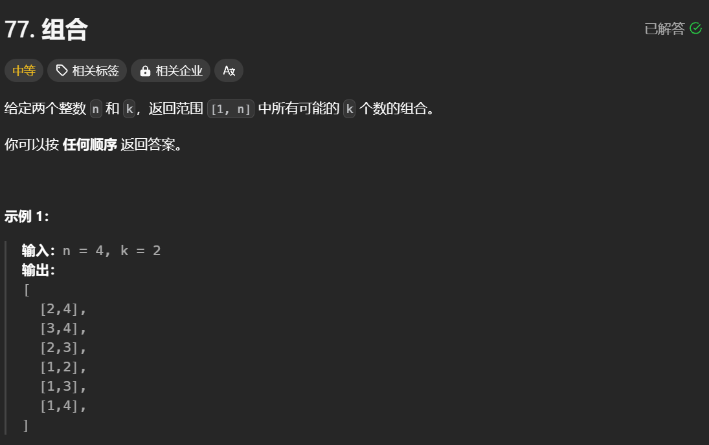

```java
class Solution {
    List<List<Integer>> list = new ArrayList<>();
    List<Integer> path = new ArrayList<>();
    public List<List<Integer>> combine(int n, int k) {
        backTracing(n,k,1);
        return list;
    }
    public void backTracing(int n, int k,int index){
        if(path.size() == k){
            list.add(new ArrayList<>(path));
            return;
        }

        for(int i = index; i <= n; i++){
            if(k-path.size() > n - i + 1)//剪枝
                break;
            path.add(i);   
            backTracing(n,k,i+1);
            path.removeLast();
        }

    }
}
```

## [17. 电话号码的字母组合](https://leetcode.cn/problems/letter-combinations-of-a-phone-number/)

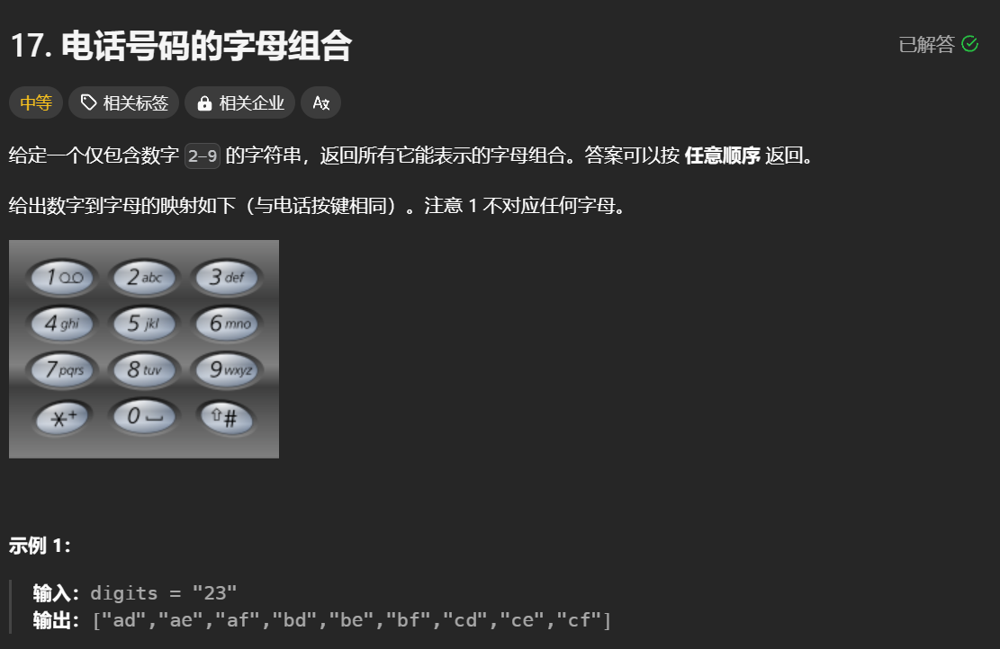

```java
class Solution {
    List<String> list = new ArrayList<>();
    StringBuilder sb = new StringBuilder();
    public List<String> letterCombinations(String digits) {
        if(digits == null || digits.length() == 0)
            return list;
        String[] strs = {
            "","","abc","def","ghi","jkl","mno","pqrs","tuv","wxyz"
        };
        backTracing(strs,digits,0);
        return list;
    }

    public void backTracing(String[] strs,String digits,int index){
        if(sb.length() == digits.length()){
            list.add(sb.toString());
            return;
        }
            
        String str = strs[digits.charAt(index)-'0'];
        for(int i = 0; i < str.length(); i++){
            sb.append(str.charAt(i));
            backTracing(strs,digits,index+1);//格外需要注意的点！！！
            sb.deleteCharAt(sb.length()-1);
        }
    }

}
```

## [39. 组合总和](https://leetcode.cn/problems/combination-sum/)

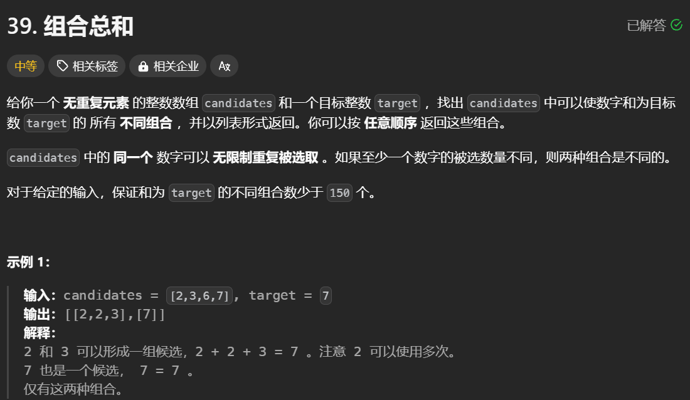

```java
class Solution {
    List<List<Integer>> list = new ArrayList<>();
    List<Integer> path = new ArrayList<>();
    public List<List<Integer>> combinationSum(int[] candidates, int target) {
        backTracing(candidates,target,0,0);
        return list;
    }

    public void backTracing(int[] candidates, int target,int index,int sum){
        if(sum > target)
            return;
        if(sum == target){
            list.add(new ArrayList(path));
            return;
        }

        for(int i = index; i < candidates.length; i++){
            path.add(candidates[i]);
            backTracing(candidates,target,i,sum+candidates[i]);//纵向可以用多次
            path.removeLast();
        }
    }
}
```

## [40. 组合总和 II](https://leetcode.cn/problems/combination-sum-ii/)

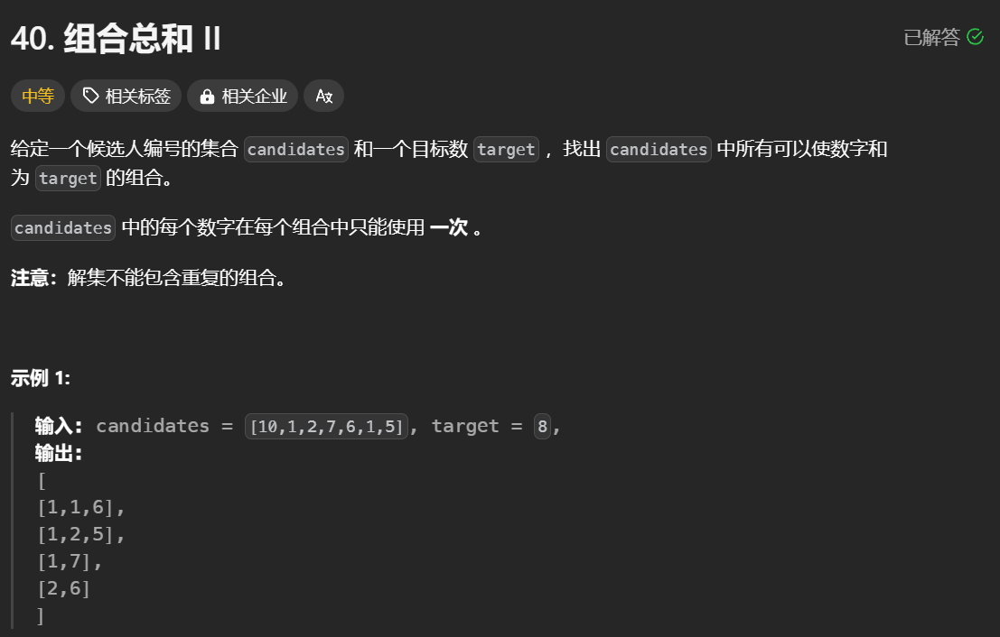

```java
class Solution {
    List<List<Integer>> list = new ArrayList<>();
    List<Integer> path = new ArrayList<>();
    public List<List<Integer>> combinationSum2(int[] candidates, int target) {
        Arrays.sort(candidates);
        backTracing(candidates,target,0,0);
        return list;
    }

    public void backTracing(int[] candidates, int target,int index,int sum){
        if(sum == target){
            list.add(new ArrayList<>(path));
            return;
        }
        if(index == candidates.length || sum > target)
            return;

        for(int i = index; i < candidates.length; i++){
            path.add(candidates[i]);
            backTracing(candidates,target,i+1,sum+candidates[i]);
            path.removeLast();
            while(i+1 < candidates.length && candidates[i] == candidates[i+1]) i++;
        }
    }
}
```

## [216. 组合总和 III](https://leetcode.cn/problems/combination-sum-iii/)

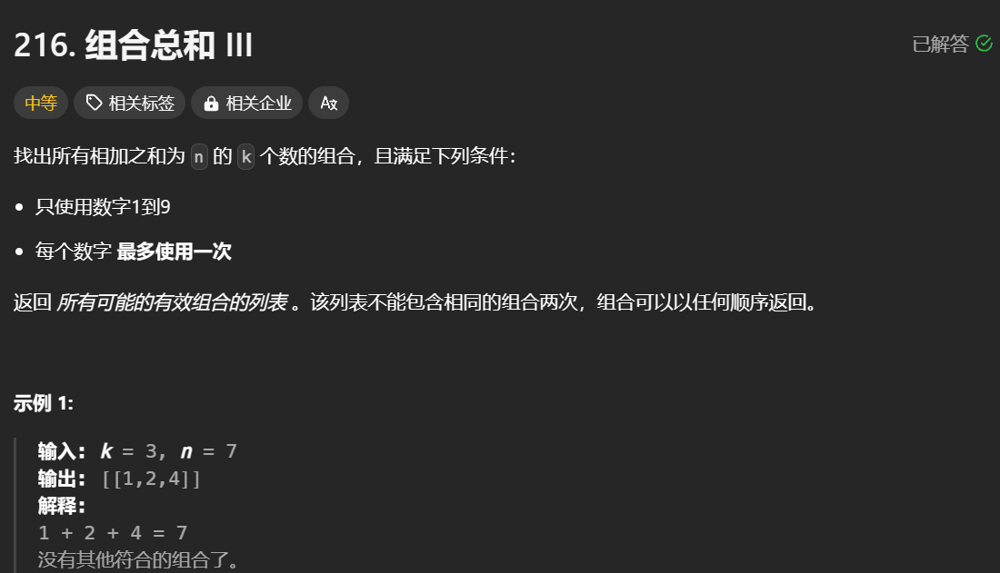

```java
class Solution {
    List<List<Integer>> list = new ArrayList<>();
    List<Integer> path = new ArrayList<>();

    public List<List<Integer>> combinationSum3(int k, int n) {
        backTracing(k,n,1,0);
        return list;
    }

    public void backTracing(int k,int n,int index,int sum){
        if(sum == n && path.size() == k){
            list.add(new ArrayList<>(path));
            return;
        }
        if(index == 10 || sum >= n)
            return;

        for(int i = index; i <= 9; i++){
            path.add(i);
            backTracing(k,n,i+1,sum+i);
            path.removeLast();
        }

    }
}
```

## [131. 分割回文串](https://leetcode.cn/problems/palindrome-partitioning/)⭐

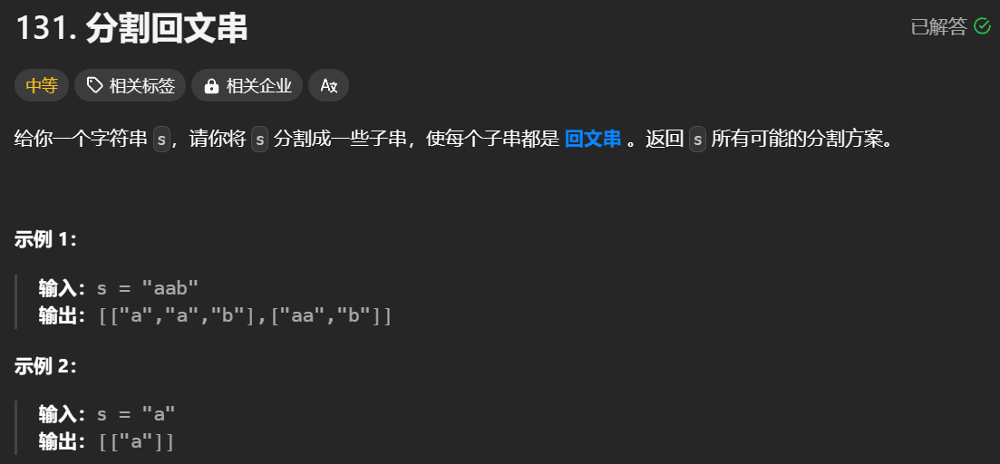

```java
class Solution {
    List<List<String>> list = new ArrayList<>();
    List<String> path = new ArrayList<>();
    public List<List<String>> partition(String s) {
        backTracing(s,0);
        return list;
    }

    public void backTracing(String s,int index){
        if(index == s.length()){
            list.add(new ArrayList(path));
            return;
        }

        for(int i = index; i < s.length(); i++){
            String str = s.substring(index,i+1);
            if(!isTrue(str))
                continue;

            path.add(str);
            backTracing(s,i+1);//注意这里传入的是s
            path.removeLast();
        }
    }

    public boolean isTrue(String s){
        int left = 0;
        int right = s.length()-1;
        while(left < right){
            if(s.charAt(left) != s.charAt(right))
                return false;
            left++;
            right--;
        }
        return true;
    }
}
```

## [93. 复原 IP 地址](https://leetcode.cn/problems/restore-ip-addresses/)

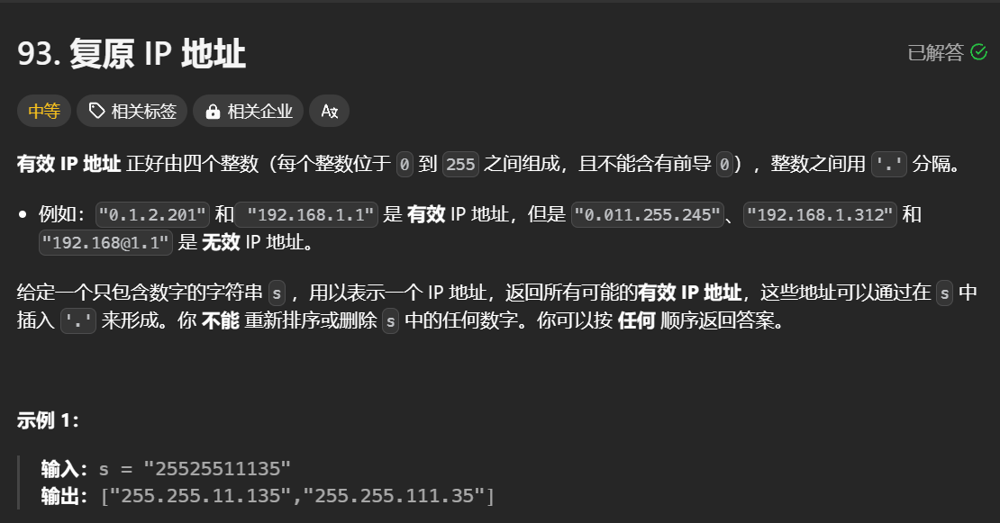

```java
class Solution {
    List<String> list = new ArrayList<>();
    List<String> path = new ArrayList<>();
    public List<String> restoreIpAddresses(String s) {
        backTracing(s,0);
        return list;
    }

    public void backTracing(String s,int index){
        if(index == s.length() && path.size() == 4){
            StringBuilder sb = new StringBuilder();
            for(int i = 0; i < path.size(); i++){
                if(i != 0)
                    sb.append(".");
                sb.append(path.get(i));
            }
            list.add(new String(sb));
        }
        for(int i = index; i < s.length(); i++){
            String str = s.substring(index,i+1);
            if(!isTrue(str))
                continue;
            path.add(str);
            backTracing(s,i+1);
            path.removeLast();
        }   
    }

    public boolean isTrue(String str){
        if(str.length() > 3) return fals
        if(str.startsWith("0") && str.length() != 1) return false;//注意这里是startsWith()，有个s
        int num = Integer.parseInt(str);
        if(num < 0 || num > 255) return false;
        return true;
    }
}
```

## [78. 子集](https://leetcode.cn/problems/subsets/)

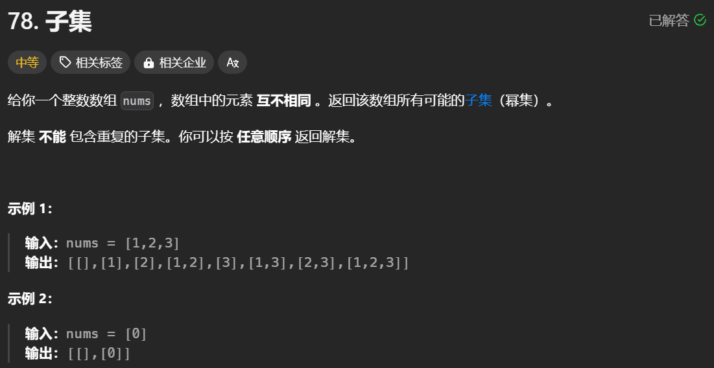

```java
class Solution {
    List<List<Integer>> list = new ArrayList<>();
    List<Integer> path = new ArrayList<>();
    public List<List<Integer>> subsets(int[] nums) {
        backTracing(nums,0);
        return list;
    }

    public void backTracing(int[] nums,int index){
        list.add(new ArrayList<>(path));
        if(index == nums.length)
            return;
        
        for(int i = index; i <nums.length; i++){
            path.add(nums[i]);
            backTracing(nums,i+1);
            path.removeLast();
        }
    }
}
```

## [90. 子集 II](https://leetcode.cn/problems/subsets-ii/)

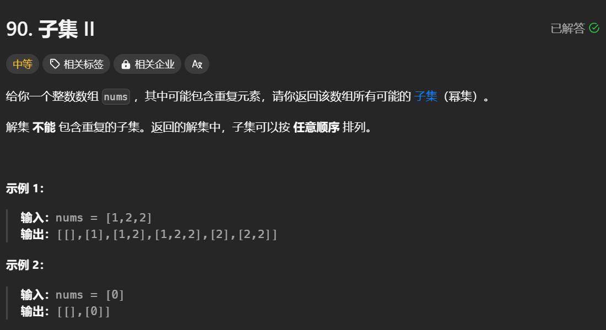

```java
class Solution {
    List<List<Integer>> list = new ArrayList<>();
    List<Integer> path = new ArrayList<>();
    public List<List<Integer>> subsetsWithDup(int[] nums) {
        Arrays.sort(nums);
        backTracing(nums,0);
        return list;
    }

    public void backTracing(int[] nums,int index){
        list.add(new ArrayList<>(path));
        //终止条件
        if(index == nums.length){
            return; 
        }
        //横向循环
        for(int i = index; i < nums.length; i++){

            path.add(nums[i]);
            backTracing(nums,i+1);//纵向深入
            path.removeLast();

            while(i+1 < nums.length && nums[i] == nums[i+1]) i++;//去重
        }

    }
}
```

## [491. 非递减子序列](https://leetcode.cn/problems/non-decreasing-subsequences/)


```java
class Solution {
    List<List<Integer>> list = new ArrayList<>();
    List<Integer> path = new ArrayList<>();
    public List<List<Integer>> findSubsequences(int[] nums) {
        backTracing(nums,0);
        return list;
    }

    public void backTracing(int[] nums,int index){
        if(path.size() >= 2)
            list.add(new ArrayList<>(path));
        if(index == nums.length) return;

        Set<Integer> set = new HashSet<>();
        for(int i = index; i < nums.length; i++){
            if(set.contains(nums[i])) continue;
            if(!path.isEmpty() && nums[i] < path.getLast()) continue;
            set.add(nums[i]);
            path.add(nums[i]);
            backTracing(nums,i+1);
            path.removeLast();
        }
    }
}
```

## [46. 全排列](https://leetcode.cn/problems/permutations/)

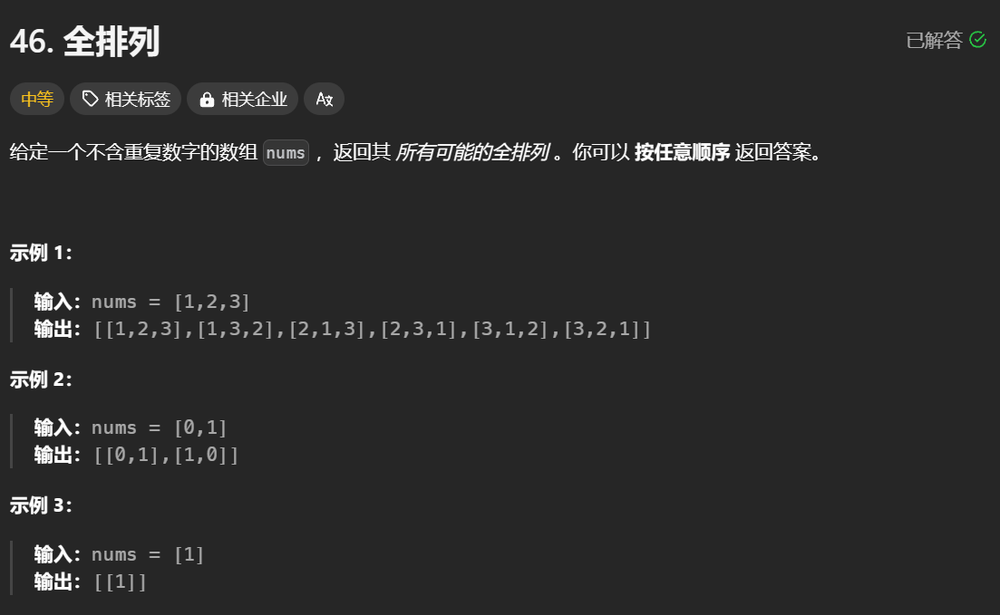

```java
class Solution {
    List<List<Integer>> list = new ArrayList<>();
    List<Integer> path = new ArrayList<>();
    boolean used[];
    public List<List<Integer>> permute(int[] nums) {
        used = new boolean[nums.length];
        backTracing(nums);
        return list;
    }

    public void backTracing(int[] nums){
        if(path.size() == nums.length){
            list.add(new ArrayList<>(path));
            return;
        }

        for(int i = 0; i <nums.length; i++){
            if(used[i]) continue;

            used[i] = true;
            path.add(nums[i]);
            backTracing(nums);
            path.removeLast();
            used[i] = false;
        }
    }
}
```

## [47. 全排列 II](https://leetcode.cn/problems/permutations-ii/)


```java
class Solution {
    List<List<Integer>> list = new ArrayList<>();
    List<Integer> path = new ArrayList<>();
    boolean used[];
    public List<List<Integer>> permuteUnique(int[] nums) {
        used = new boolean[nums.length];
        backTracing(nums);
        return list;
    }

    public void backTracing(int[] nums){
        if(path.size() == nums.length)
            list.add(new ArrayList<>(path));

        Set<Integer> set = new HashSet<>();
        for(int i = 0; i < nums.length; i++){
            if(used[i] || set.contains(nums[i])) continue;
            set.add(nums[i]);

            used[i] = true;
            path.add(nums[i]);
            backTracing(nums);
            path.removeLast();
            used[i] = false;
        }
    }
}
```

## [332. 重新安排行程](https://leetcode.cn/problems/reconstruct-itinerary/)

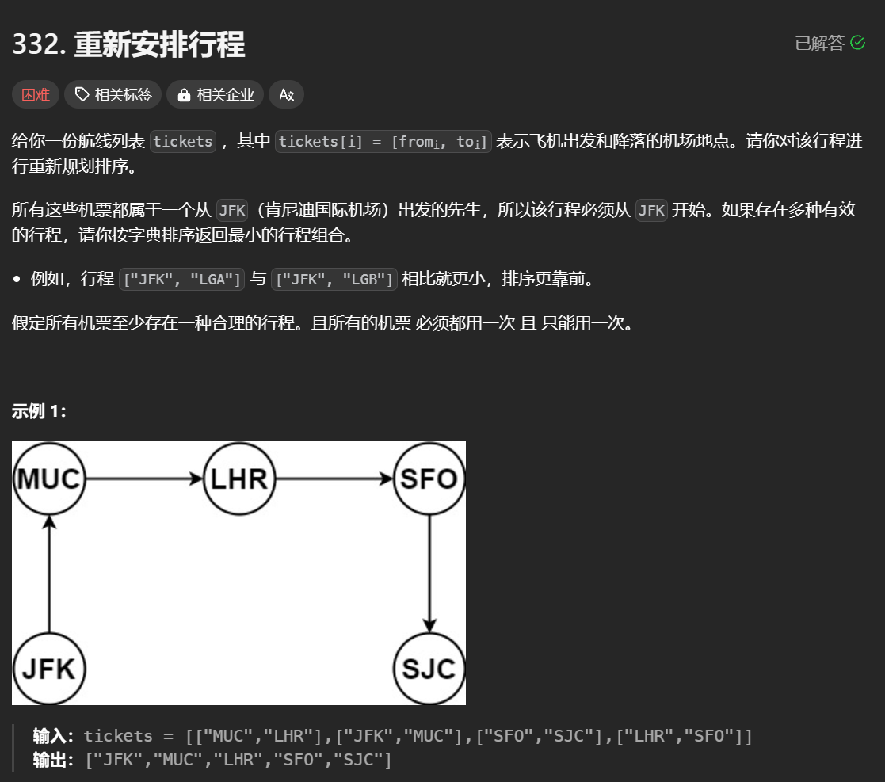

```java
class Solution {
    List<String> list;
    List<String> path = new ArrayList<>();
    boolean[] used;
    public List<String> findItinerary(List<List<String>> tickets) {
        used = new boolean[tickets.size()];
        Collections.sort(tickets,(a,b) -> a.get(1).compareTo(b.get(1)));
        path.add("JFK");
        backTracing(tickets);
        return list;
    }

    public void backTracing(List<List<String>> tickets){
        if(list != null) return;
        if(path.size() == tickets.size() + 1){
            list = new ArrayList<>(path);
            return;
        }

        for(int i = 0; i < tickets.size(); i++){
            if(used[i]) continue;
            if(!tickets.get(i).get(0).equals(path.getLast())) continue;
            used[i] = true;
            path.add(tickets.get(i).get(1));
            backTracing(tickets);
            path.removeLast();
            used[i] = false;
        }
    }
}
```

## [22. 括号生成](https://leetcode.cn/problems/generate-parentheses/)

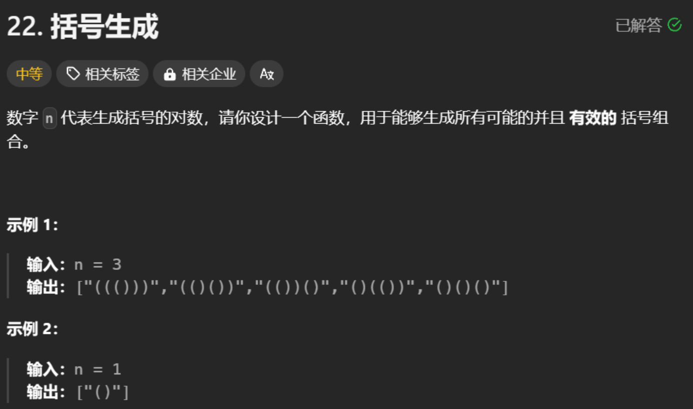

```java
class Solution {
    List<String> list = new ArrayList<>();
    StringBuilder path = new StringBuilder();
    public List<String> generateParenthesis(int n) {
        backTracing(0,0,n);
        return list;
    }

    public void backTracing(int left,int right,int n){
        if(left == n && right == n){
            list.add(path.toString());
            return;
        }
        if(left > n || right > n)
            return;

        if(left > right){
            path.append(")");
            backTracing(left,right+1,n);
            path.deleteCharAt(path.length()-1);
        }
        path.append("(");
        backTracing(left+1,right,n);
        path.deleteCharAt(path.length()-1);
    }
}
```

## [257. 二叉树的所有路径](https://leetcode.cn/problems/binary-tree-paths/)

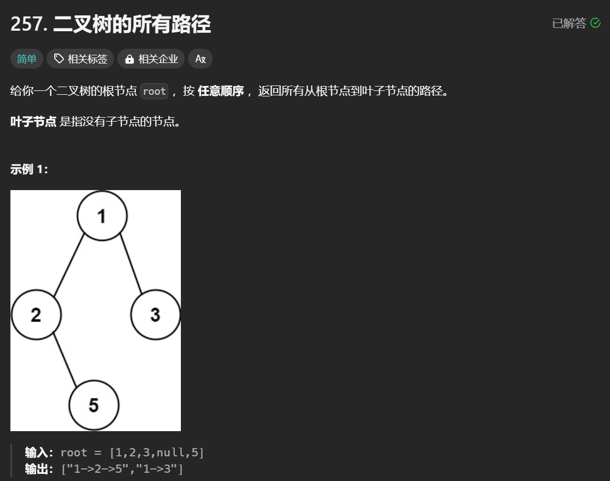

```java
class Solution {
    List<String> list = new ArrayList<>();
    List<Integer> path = new ArrayList<>();
    public List<String> binaryTreePaths(TreeNode root) {
        backTracing(root);
        return list;
    }

    public void backTracing(TreeNode root){
        path.add(root.val);
        if(root.left == null && root.right == null){
            StringBuilder sb = new StringBuilder();
            for(int i = 0; i < path.size(); i++){
                if(i != 0) sb.append("->");
                sb.append(path.get(i));
            }
            list.add(new String(sb));
            return;
        }

        if(root.left != null)
            backTracing(root.left);
        if(root.right != null)
            backTracing(root.right);

        path.removeLast();
    }

}
```

## [112. 路径总和](https://leetcode.cn/problems/path-sum/)

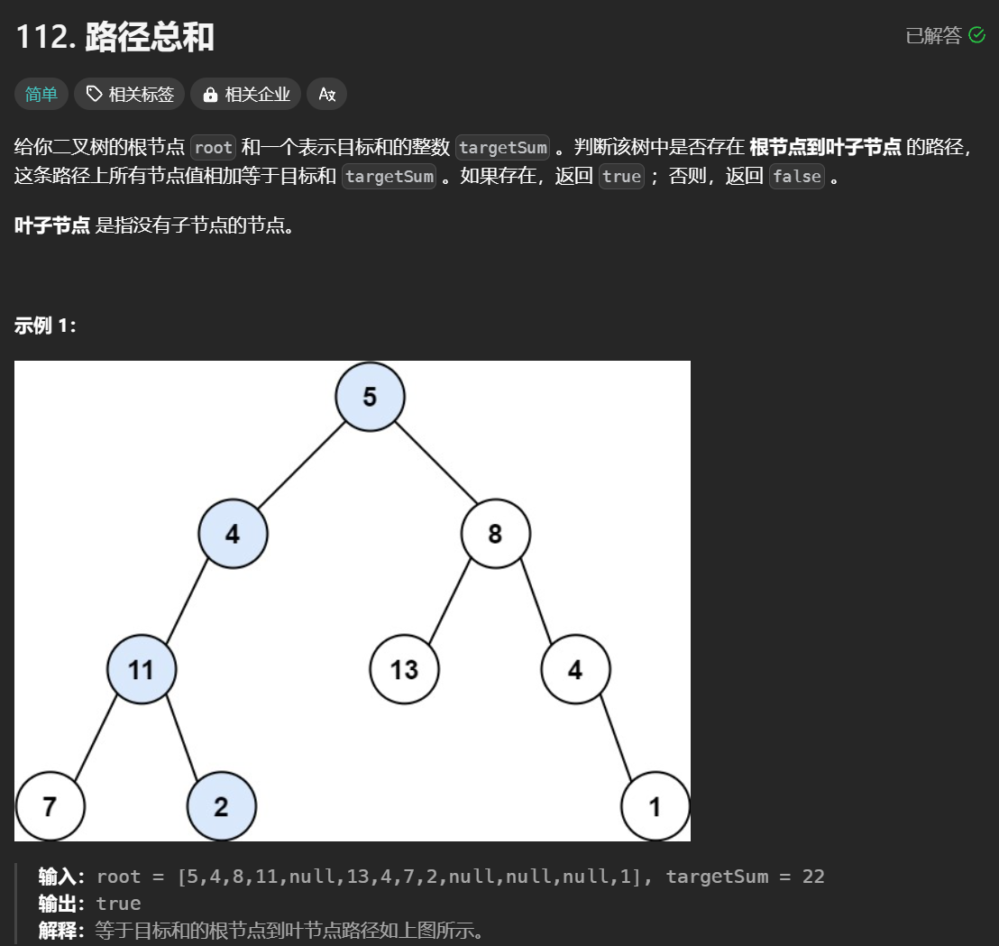

```java
class Solution {
    boolean flag = false;
    public boolean hasPathSum(TreeNode root, int targetSum) {
        search(root,targetSum,0);
        return flag;
    }

    public void search(TreeNode root,int targetSum,int sum){
        if(root == null || flag == true) return;

        sum += root.val;
        if(sum == targetSum && root.left == null && root.right == null){
            flag =  true;
            return;
        }

        search(root.left,targetSum,sum);
        search(root.right,targetSum,sum);
    }
}
```

##  [301. 删除无效的括号](https://leetcode.cn/problems/remove-invalid-parentheses/)


```java
class Solution {
    Set<String> set = new HashSet<>();
    int maxLen = 0;
    int max = 0;// n：字符串长度；max：最大括号数（单括号）；maxPathLen：记录「爆搜」过程中的最大路径子串的长度
    public List<String> removeInvalidParentheses(String s) {
        int left = 0;
        int right = 0;
        for(int i = 0; i < s.length(); i++){
            char c = s.charAt(i);
            if(c == '(') left++;
            if(c == ')'){
                if(left > 0) left--;
                else right++;
            }
        }
        maxLen = s.length() - left - right;
        int left2 = 0;
        int right2 = 0;
        for(int i = 0; i < s.length(); i++){
            char c = s.charAt(i);
            if(c == '(') left2++;
            if(c == ')') right2++;
        }
        max = Math.min(left2,right2); 
        backTracing(s,"",0,0);
        return new ArrayList<>(set);
    }

    public void backTracing(String s,String cur,int index,int score){
        if(score < 0 || score > max) return;
        if(index == s.length()){
            if(score == 0 && cur.length() == maxLen)
                set.add(cur);
            return;
        }

        char c = s.charAt(index);
        if(c == '('){
            backTracing(s,cur+c,index+1,score+1);
            backTracing(s,cur,index+1,score);
        }else if( c == ')'){
            backTracing(s,cur+c,index+1,score-1);
            backTracing(s,cur,index+1,score);
        }else{
            backTracing(s,cur+c,index+1,score);
        }

    }
}
```

首先我们令左括号的得分为 1；右括号的得分为 −1。则会有如下性质：

对于一个合法的方案而言，必然有最终得分为 0；
搜索过程中不会出现得分值为 负数 的情况（当且仅当子串中某个前缀中「右括号的数量」大于「左括号的数量」时，会出现负数，此时不是合法方案）。
https://leetcode.cn/problems/remove-invalid-parentheses/solutions/1068652/gong-shui-san-xie-jiang-gua-hao-de-shi-f-asu8/

# 贪心算法

## [455. 分发饼干](https://leetcode.cn/problems/assign-cookies/)

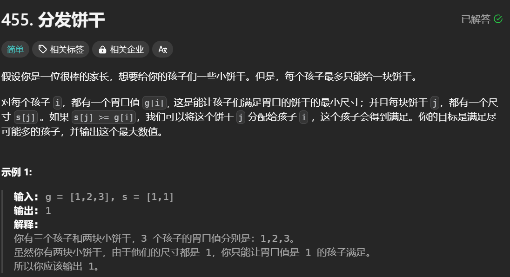

```java
class Solution {
    public int findContentChildren(int[] g, int[] s) {
        Arrays.sort(g);
        Arrays.sort(s);
        int i = 0;
        int j = 0;
        while(i < g.length && j < s.length){
            if(s[j] >= g[i]){//能满足条件
                i++;
                j++;
            }else{//饼干后移
                j++;
            }
        }
        return i;
    }
}
```

## [376. 摆动序列](https://leetcode.cn/problems/wiggle-subsequence/)

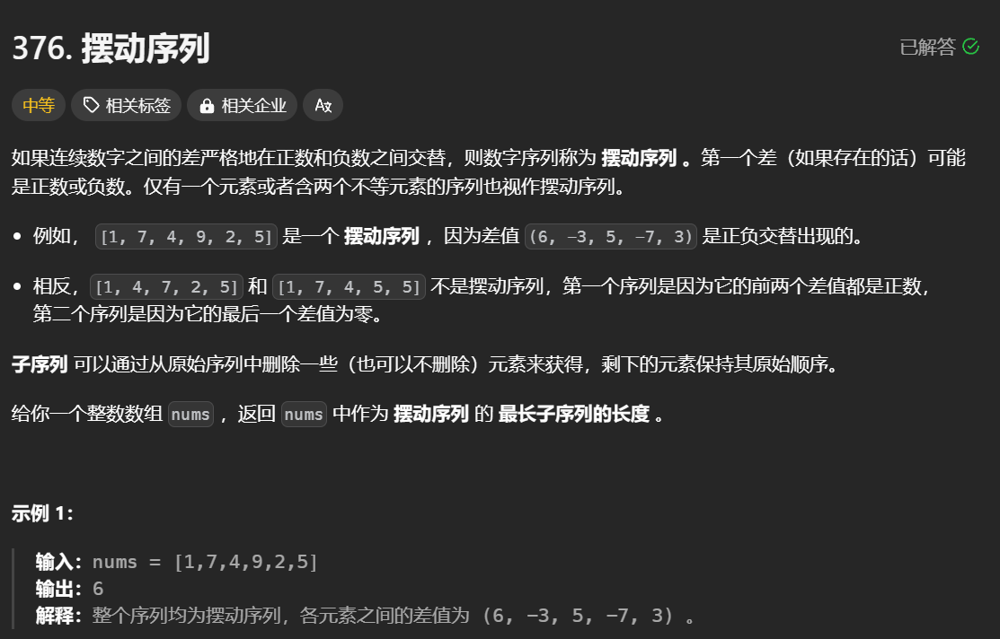

```java
class Solution {
    public int wiggleMaxLength(int[] nums) {
        if(nums.length == 1) return 1;
        int pre = 0;
        int count = 1;
        for(int i = 1; i < nums.length; i++){
            if(pre == 0){
                pre = nums[i] - nums[i-1];
                if(pre != 0) count++;
            }else if(pre < 0 && nums[i] - nums[i-1] > 0){
                count++;
                pre = nums[i] - nums[i-1];
            }else if(pre > 0 && nums[i] - nums[i-1] < 0){
                count++;
                pre = nums[i] - nums[i-1];
            }
        }
        return count;
    }
}
```

## [55. 跳跃游戏](https://leetcode.cn/problems/jump-game/)


```java
class Solution {
    public boolean canJump(int[] nums) {
        int right = nums[0];
        int i = 0;
        for(; i <= right && i < nums.length; i++){
            right = Math.max(right,i+nums[i]);
        }
        return i == nums.length;
    }
}
```

## [45. 跳跃游戏 II](https://leetcode.cn/problems/jump-game-ii/)⭐

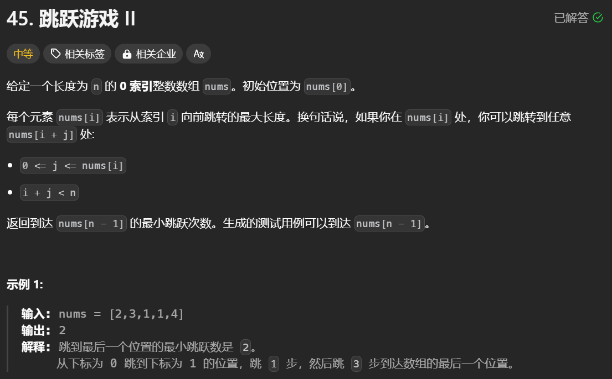

```java
class Solution {
    public int jump(int[] nums) {
        if(nums == null || nums.length == 1) return 0;
        int count = 1;
        int bigIndex = nums[0];
        int curIndex = nums[0];
        for(int i = 0; i <= curIndex; i++){
            bigIndex = Math.max(bigIndex,i + nums[i]);
            if(i == nums.length - 1)
                return count;
            if(i == curIndex){
                curIndex = bigIndex;
                count++;
            }
        }
        return count;
    }
}
```

## [1005. K 次取反后最大化的数组和](https://leetcode.cn/problems/maximize-sum-of-array-after-k-negations/)

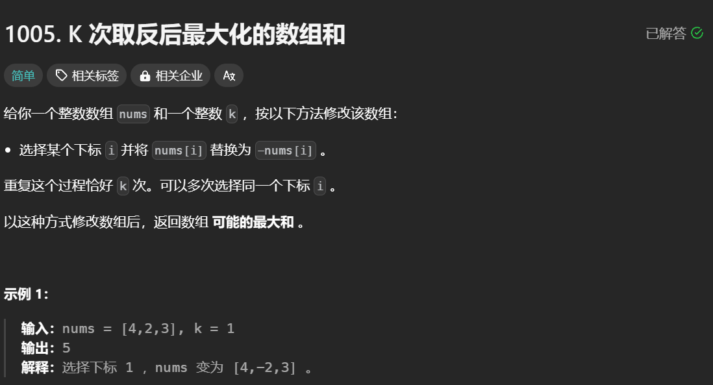

```java
class Solution {
    public int largestSumAfterKNegations(int[] nums, int k) {
        Arrays.sort(nums);

        for(int i = 0; i < nums.length && k > 0; i++){//注意k > 0;
            if(nums[i] > 0)
                break;
            nums[i] = -nums[i];
            k--;
        }
        
        if(k % 2 != 0 && k != 0){
            Arrays.sort(nums);
            nums[0] = -nums[0];
        }
            
        int sum = 0;
        for(int num : nums) sum += num;

        return sum;
    }
}
```

## [134. 加油站](https://leetcode.cn/problems/gas-station/)


```java
class Solution {
    public int canCompleteCircuit(int[] gas, int[] cost) {
        //找到积累和最低点
        int min = gas[0] - cost[0];
        int minIndex = 0;
        int sum = 0;
        for(int i = 0; i < gas.length; i++){
            sum += gas[i] - cost[i];
            if(sum < min){
                min = sum;
                minIndex = i;
            }
        }
        if(sum < 0) return -1;//如果总和 < 0直接返回-1

        sum = 0;
        for(int i = minIndex+1; i < minIndex+gas.length+1; i++){
            sum += gas[i%gas.length] - cost[i%gas.length];
            if(sum < 0) return -1;
        }
        return (minIndex+1)%gas.length;
    }
}
```

## [135. 分发糖果](https://leetcode.cn/problems/candy/)

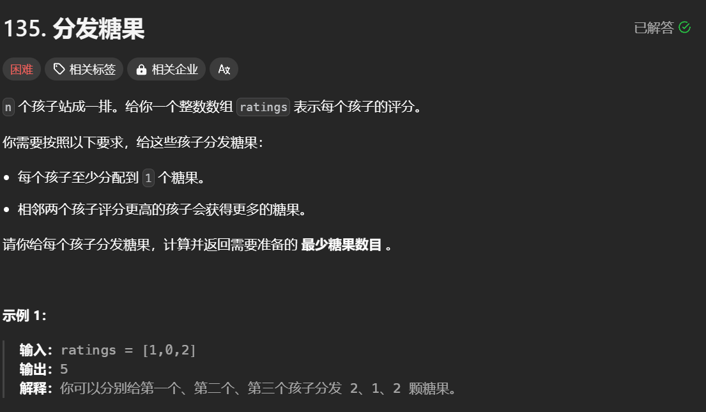

```java
class Solution {
    public int candy(int[] ratings) {
        int[] nums = new int[ratings.length];
        
        //从左往右分
        for(int i = 1; i < ratings.length; i++){
            if(ratings[i] > ratings[i-1])
                nums[i] = Math.max(nums[i-1]+1,nums[i]);
        }
        //从右往左分
        for(int i = ratings.length-2; i >= 0; i--){
            if(ratings[i] > ratings[i+1])
                nums[i] = Math.max(nums[i+1]+1,nums[i]);
        }

        int sum = 0;
        for(int i = 0; i < nums.length;i++){
            sum += nums[i];
        }
        return sum + nums.length;
    }
}
```

## [860. 柠檬水找零](https://leetcode.cn/problems/lemonade-change/)

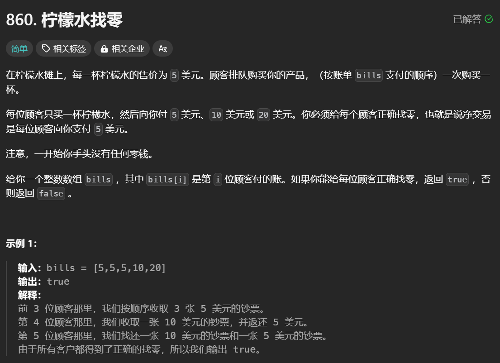

```java
class Solution {
    public boolean lemonadeChange(int[] bills) {
        int i5 = 0;
        int i10 = 0;

        for(int i = 0; i < bills.length; i++){
            if(bills[i] == 5){
                i5++;
            }else if(bills[i] == 10){
                i5--;
                i10++;
            }else{
                if(i10 != 0){
                    i10--;
                    i5--;
                }else{
                    i5-=3;
                }
            }
            if(i5 < 0)
                return false;    
        }
        return true;
    }
}
```

## [406. 根据身高重建队列](https://leetcode.cn/problems/queue-reconstruction-by-height/)

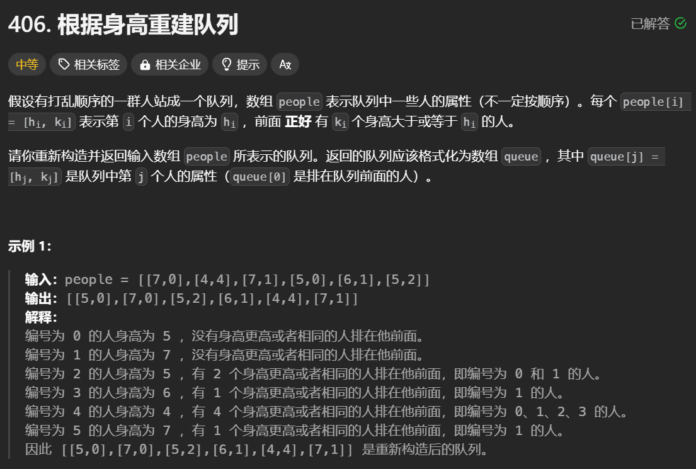

```java
class Solution {
    public int[][] reconstructQueue(int[][] people) {
        Arrays.sort(people, (a, b) -> {
            if (b[0] == a[0])// 身高相同，前面人数少的排在前面
                return a[1] - b[1];
            return b[0] - a[0];// 按身高排序
        });

        List<int[]> list = new ArrayList<>();
        for(int[] person : people){
            list.add(person[1],person);
        }

        return list.toArray(new int[people.length][]);
    }
}
```

## [763. 划分字母区间](https://leetcode.cn/problems/partition-labels/)

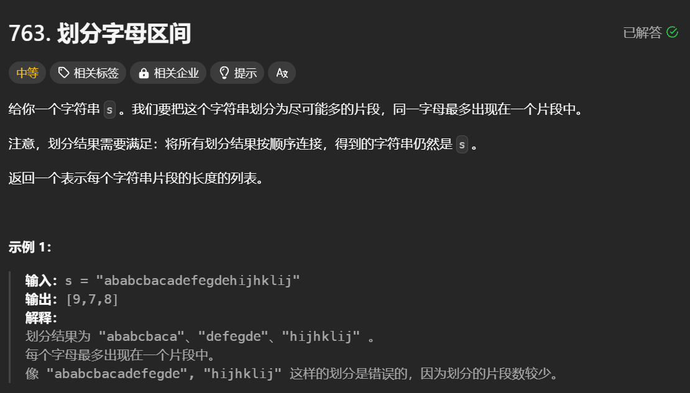

```java
class Solution {
    public List<Integer> partitionLabels(String s) {
        List<Integer> list = new ArrayList<>();

        int[] nums = new int[26];
        for(int i = 0; i < s.length(); i++){
            char c = s.charAt(i);
            nums[c-'a'] = i;
        }

        int left = 0;
        int right = 0;
        for(int i = 0; i < s.length(); i++){
            char c = s.charAt(i);
            right = Math.max(right,nums[c-'a']);
            if(i == right){
                list.add(right-left+1);
                left = right+1;
            }
        }
        return list;
    }
}
```

## [738. 单调递增的数字](https://leetcode.cn/problems/monotone-increasing-digits/)

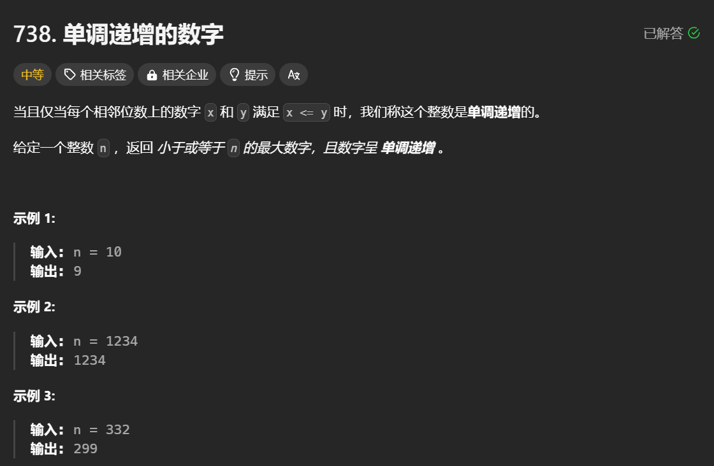

```java
class Solution {
    public int monotoneIncreasingDigits(int n) {
        String str = String.valueOf(n);
        char[] arr = str.toCharArray();

        for(int i = arr.length-1; i>0; i--){
            if(arr[i] < arr[i-1]){
                arr[i] = '9';
                arr[i-1]--;
            }
        }
        for(int i = 0; i < arr.length; i++){
            if(arr[i] == '9')
                while(i < arr.length) arr[i++] = '9';
        }

        return Integer.valueOf(new String(arr));
    }
}
```

## [968. 监控二叉树](https://leetcode.cn/problems/binary-tree-cameras/)

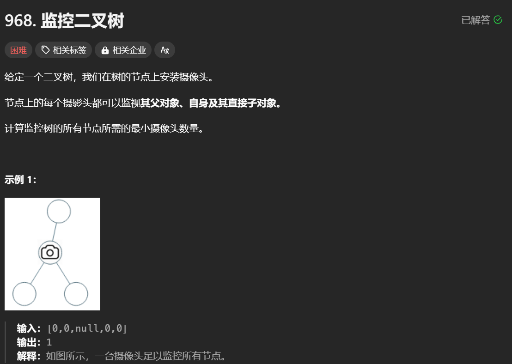

```java
class Solution {
    int count = 0;
    public int minCameraCover(TreeNode root) {
        if(search(root) == 0)
            count++;
        return count;
    }

    // 0: 无覆盖
    // 1：子节点有监控
    // 2：自身有监控
    public int search(TreeNode root){
        if(root == null) 
            return 1;

        int left = search(root.left);
        int right = search(root.right);

        if(left == 0 || right == 0){
            count++;
            return 2;
        }else if(left == 2 || right == 2)
            return 1;
        else
            return 0;
    }

}
```

## [11. 盛最多水的容器](https://leetcode.cn/problems/container-with-most-water/)


```java
class Solution {
    public int maxArea(int[] height) {
        int max = 0;
        int left = 0;
        int right = height.length-1;

        while(left < right){
            max = Math.max(max,(right-left)*Math.min(height[left],height[right]));
            if(height[left] < height[right]) left++;
            else right--;
        }

        return max;
    }
}
```

每次选短的移动，木桶效应，短的不变长，永远取最小值

## [621. 任务调度器](https://leetcode.cn/problems/task-scheduler/)

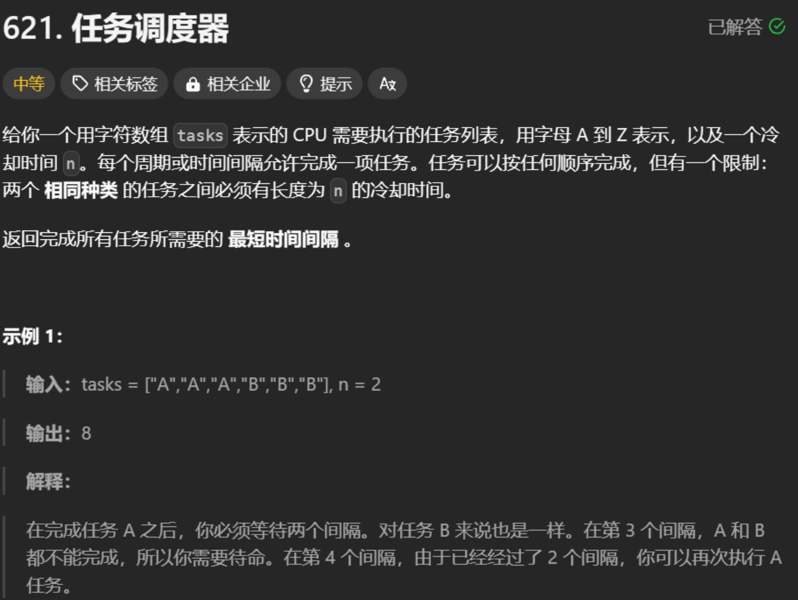

```java
class Solution {
    public int leastInterval(char[] tasks, int n) {
        int[] nums = new int[26];
        for(char c : tasks){
            nums[c-'A']++;
        }
        int max = 0;
        for(int i = 0; i < 26; i++){
            max = Math.max(max,nums[i]);
        }
        int count = 0;
        for(int i = 0; i < 26; i++){
            if(nums[i] == max) count++;
        }

        int a = (max-1) * (n+1) + count;
        int b = tasks.length;
        return Math.max(a,b);
    }
}
```

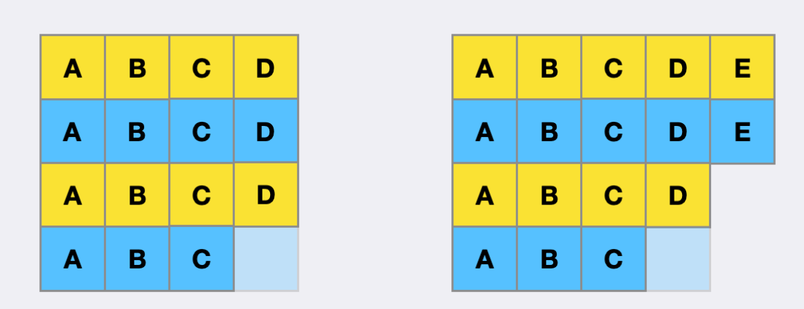

## [452. 用最少数量的箭引爆气球](https://leetcode.cn/problems/minimum-number-of-arrows-to-burst-balloons/)

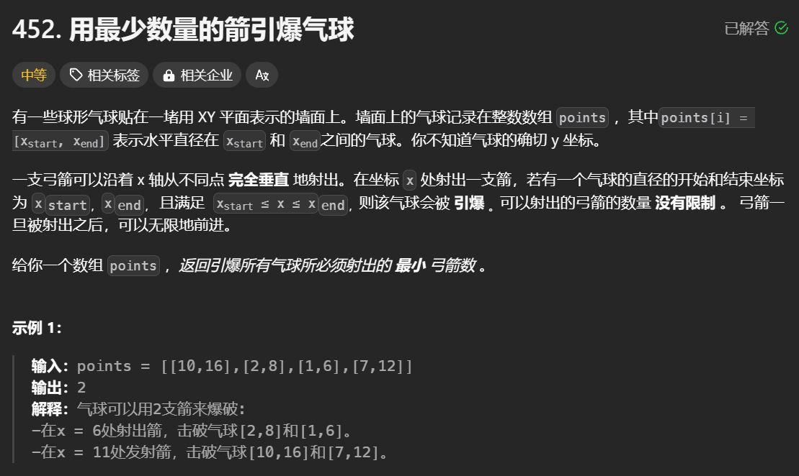

```java
class Solution {
    public int findMinArrowShots(int[][] points) {
        Arrays.sort(points,(a,b) -> Integer.compare(a[0],b[0]));
        
        int count = 1;
        int right = points[0][1];
        for(int i = 1; i < points.length; i++){
            if(points[i][0] > right){
                count++;
                right = points[i][1];
            }else{
                right = Math.min(right,points[i][1]);
            }
        }
        return count;
    }
}
```

## [435. 无重叠区间](https://leetcode.cn/problems/non-overlapping-intervals/)

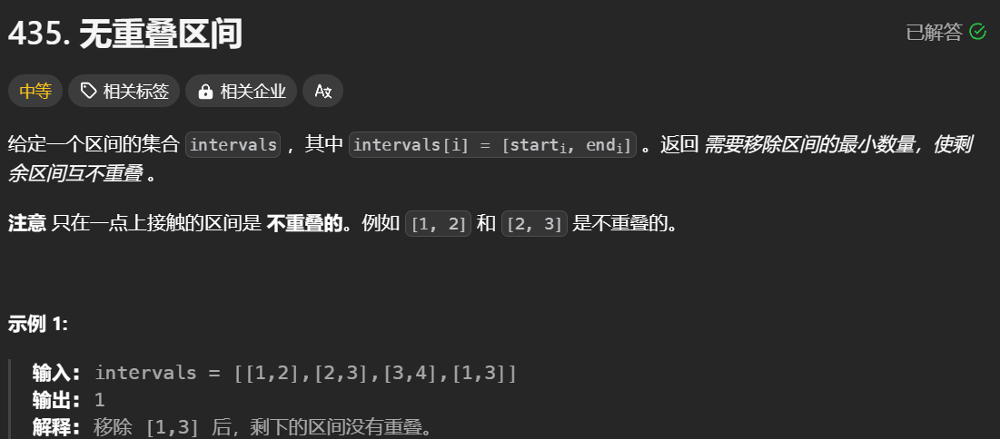

```java
class Solution {
    public int eraseOverlapIntervals(int[][] intervals) {
        Arrays.sort(intervals,(a,b) -> a[0] - b[0]);
        int count = 0;
        int right = intervals[0][1];
        for(int i = 1; i < intervals.length; i++){
            if(intervals[i][0] < right){
                //如果重叠了，必须要移除一个，所以count要加1，
                //然后更新尾部的位置，我们取尾部比较小的
                count++;
                right = Math.min(right,intervals[i][1]);
            }else{
                //如果没有重叠，就不需要移除，只需要更新尾部的位置即可
                right = intervals[i][1];
            }
        }
        return count;
    }
}
```

## [56. 合并区间](https://leetcode.cn/problems/merge-intervals/)

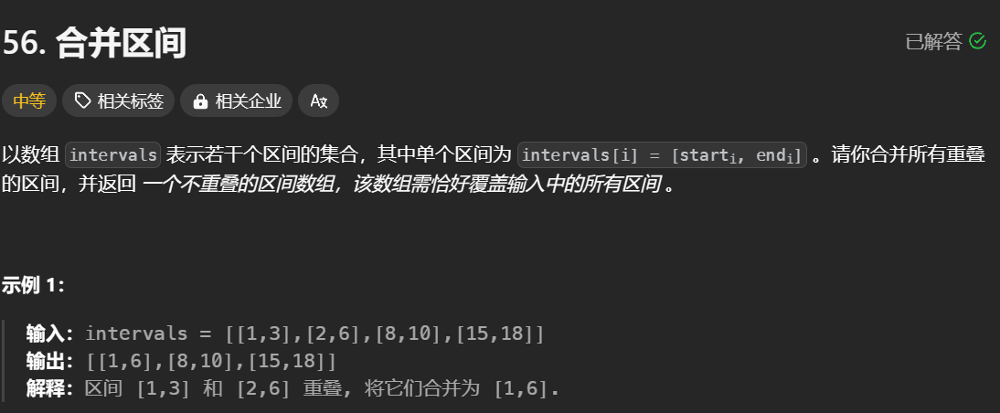

```java
class Solution {
    public int[][] merge(int[][] intervals) {
        Arrays.sort(intervals,(a,b) -> a[0] - b[0]);
        List<int[]> list = new ArrayList<>();
        for(int i = 1; i < intervals.length; i++){
            if(intervals[i][0] > intervals[i-1][1]){
                list.add(intervals[i-1]);
            }else{
                intervals[i][0] = intervals[i-1][0];
                intervals[i][1] = Math.max(intervals[i-1][1],intervals[i][1]);
            }
        }
        list.add(intervals[intervals.length-1]);

        return list.toArray(new int[list.size()][]);
    }
}
```

# 单调栈

## [739. 每日温度](https://leetcode.cn/problems/daily-temperatures/)

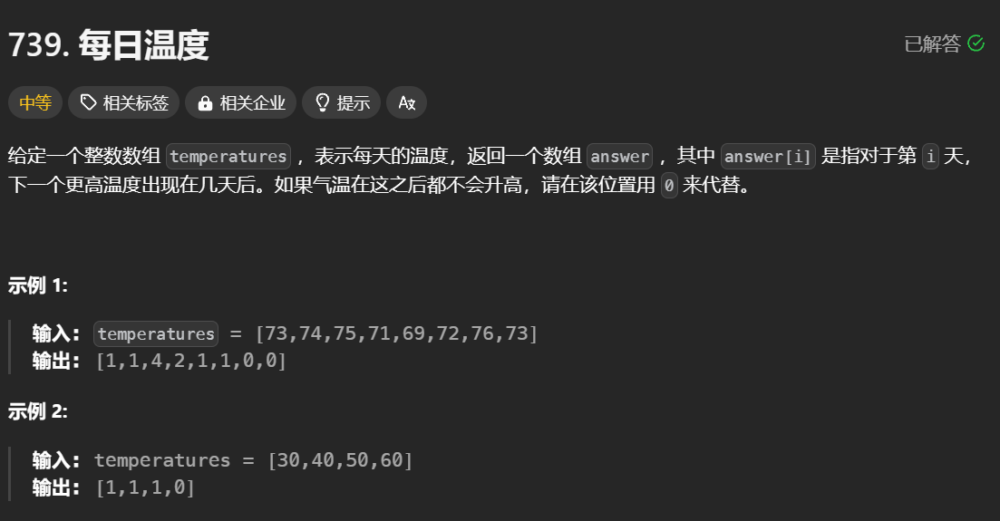

```java
class Solution {
    public int[] dailyTemperatures(int[] temperatures) {
        Deque<Integer> stack = new LinkedList<>();//Deque就是快，就是很奇怪
        int[] res = new int[temperatures.length];

        for(int i = 0; i < temperatures.length; i++){
            while(!stack.isEmpty() && temperatures[stack.peek()] < temperatures[i]){
                res[stack.peek()] = i - stack.pop();
            }
            stack.push(i);
        }

        return res;
    }
}
```

## [496. 下一个更大元素 I](https://leetcode.cn/problems/next-greater-element-i/)

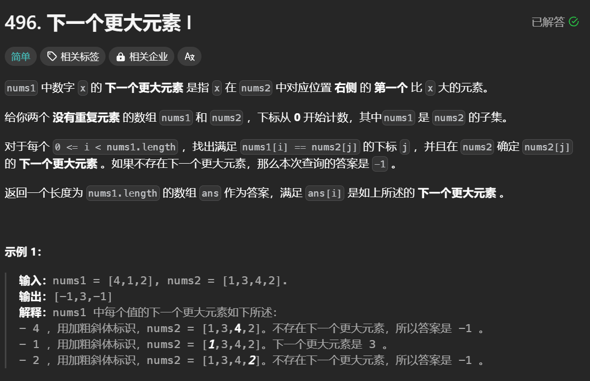

```java
class Solution {
    public int[] nextGreaterElement(int[] nums1, int[] nums2) {
        Deque<Integer> stack = new LinkedList<>();
        Map<Integer,Integer> map = new HashMap<>();
        for(int i = 0; i < nums2.length; i++){
            while(!stack.isEmpty() && nums2[stack.peek()] < nums2[i])
                map.put(nums2[stack.pop()], nums2[i]);
            stack.push(i);
        }

        int[] ans = new int[nums1.length];
        for(int i = 0; i < nums1.length; i++){
            ans[i] = map.getOrDefault(nums1[i],-1);
        }

        return ans;
    }   
}
```

## [503. 下一个更大元素 II](https://leetcode.cn/problems/next-greater-element-ii/)

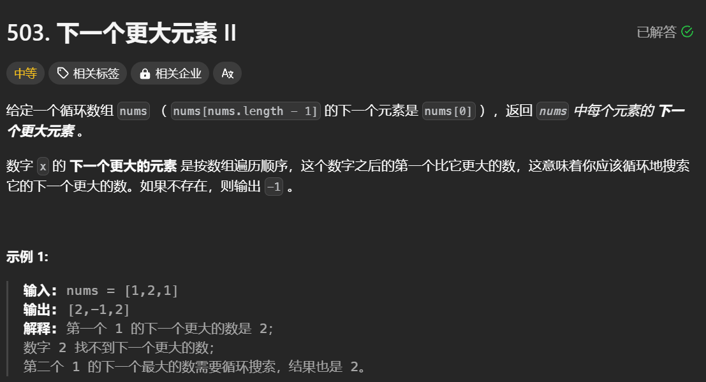

```java
class Solution {
    public int[] nextGreaterElements(int[] nums) {
        Deque<Integer> stack = new LinkedList<>();
        int[] res = new int[nums.length];
        Arrays.fill(res,-1);
        for(int i = 0; i < nums.length*2; i++){
            while(!stack.isEmpty() && nums[stack.peek()%nums.length] < nums[i%nums.length])
                res[stack.pop()%nums.length] = nums[i%nums.length];

            stack.push(i);
        }
        return res;
    }
}
```

## [42. 接雨水](https://leetcode.cn/problems/trapping-rain-water/)

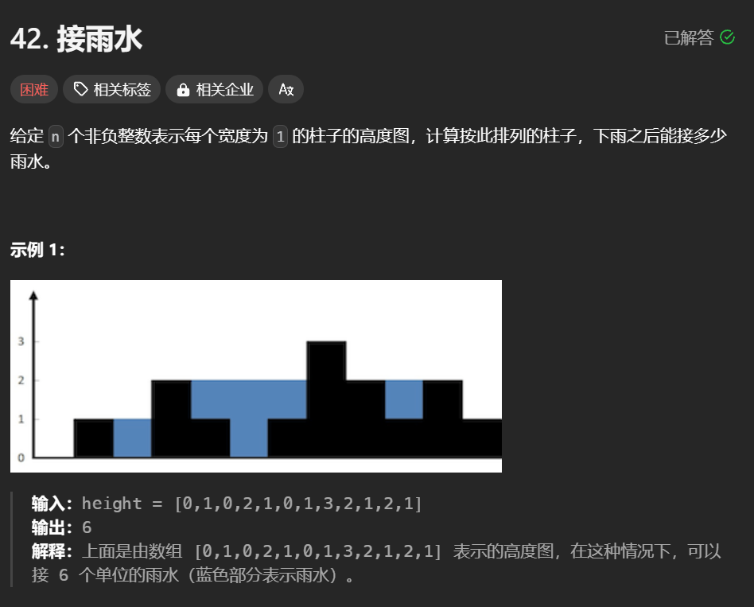

```java
class Solution {
    public int trap(int[] height) {
        Deque<Integer> stack = new LinkedList<>();
        int sum = 0;
        for(int i = 0; i < height.length; i++){
            while(!stack.isEmpty() && height[i] > height[stack.peek()]){
                int right = height[i];
                int mid = height[stack.pop()];
                if(stack.isEmpty()) break;;// 栈空就出去
                int left = height[stack.peek()];
                sum += (Math.min(left,right)-mid)*(i-stack.peek()-1);
            }
            stack.push(i);
        }
        return sum;
    }
}
```

# 动态规划题目

## [509. 斐波那契数](https://leetcode.cn/problems/fibonacci-number/)

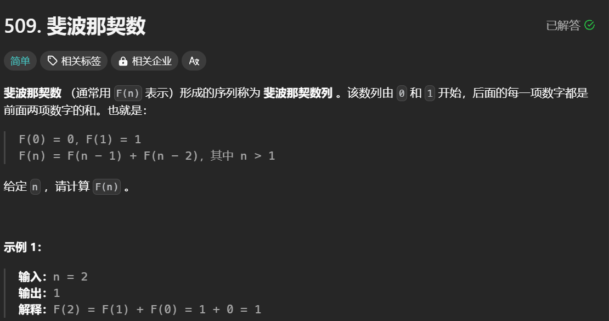

```java
class Solution {
    public int fib(int n) {
        if(n == 0 || n == 1) return n;
        int[] dp = new int[n+1];
        dp[0] = 0;
        dp[1] = 1;
        for(int i = 2; i <= n; i++){
            dp[i] = dp[i-1] + dp[i-2];
        }
        return dp[n];
    }
}
```

```java
//要求取余
class Solution {
    public int fib(int n) {
        if(n <= 1) return n;
        int[] dp = new int[n+1];
        dp[0] = 0;
        dp[1] = 1;
        for(int i = 2; i <= n; i++)
            dp[i] = (dp[i-1] + dp[i-2]) % 1000000007;
        return dp[n];
    }
}
```

## [70. 爬楼梯](https://leetcode.cn/problems/climbing-stairs/)

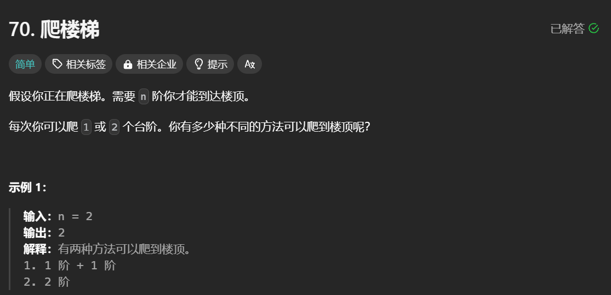

```java
class Solution {
    public int climbStairs(int n) {
        if(n == 1 || n == 2) return n;
        int[] dp = new int[n+1];
        dp[1] = 1;
        dp[2] = 2; 
        for(int i = 3; i <= n; i++){
            dp[i] = dp[i-1] + dp[i-2];
        }
        return dp[n];
    }
}
```

## [746. 使用最小花费爬楼梯](https://leetcode.cn/problems/min-cost-climbing-stairs/)

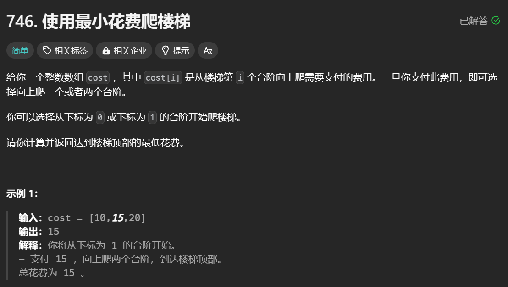

```java
class Solution {
    public int minCostClimbingStairs(int[] cost) {
        int n = cost.length;
        int[] dp = new int[n+1];
        dp[1] = 0;
        dp[2] = Math.min(cost[0],cost[1]);
        for(int i = 3; i < n+1; i++){
            dp[i] = Math.min(dp[i-1] + cost[i-1],dp[i-2] + cost[i-2]);
        }
        return dp[n];
    }
}
```

## [62. 不同路径](https://leetcode.cn/problems/unique-paths/)

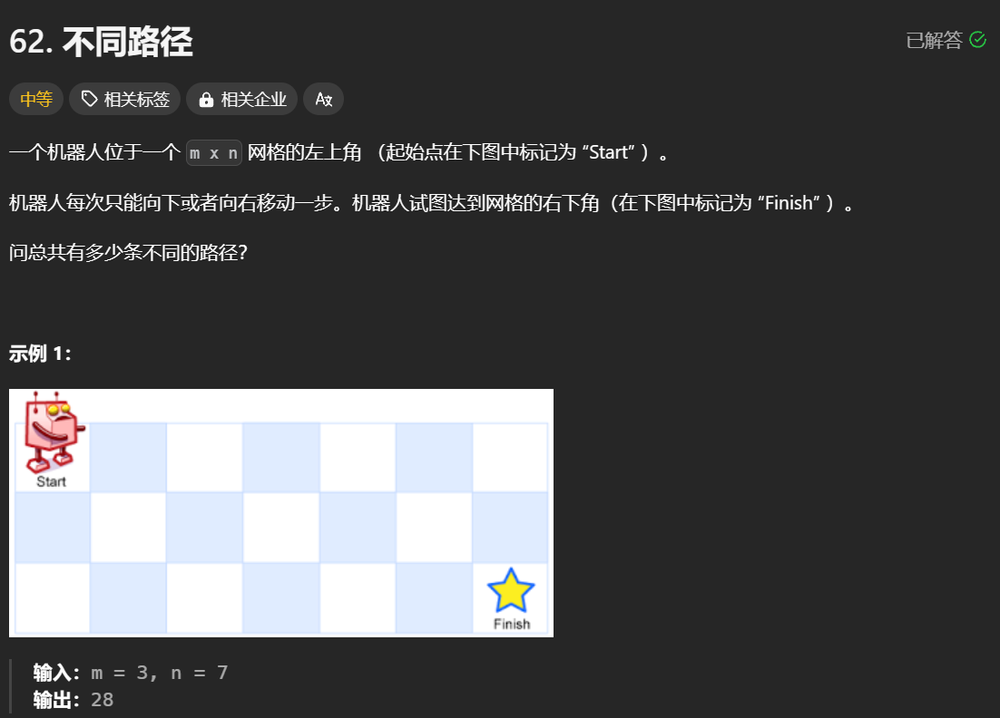

```java
class Solution {
    public int uniquePaths(int m, int n) {
        int[][] dp = new int[m][n];

        for(int i = 0; i < m; i++){
            dp[i][0] = 1;
        }
        for(int i = 0; i < n; i++){
            dp[0][i] = 1;
        }

        for(int i = 1; i < m; i++){
            for(int j = 1; j < n; j++){
                dp[i][j] = dp[i-1][j] + dp[i][j-1];
            }
        }

        return dp[m-1][n-1];
    }
}
```

## [63. 不同路径 II](https://leetcode.cn/problems/unique-paths-ii/)

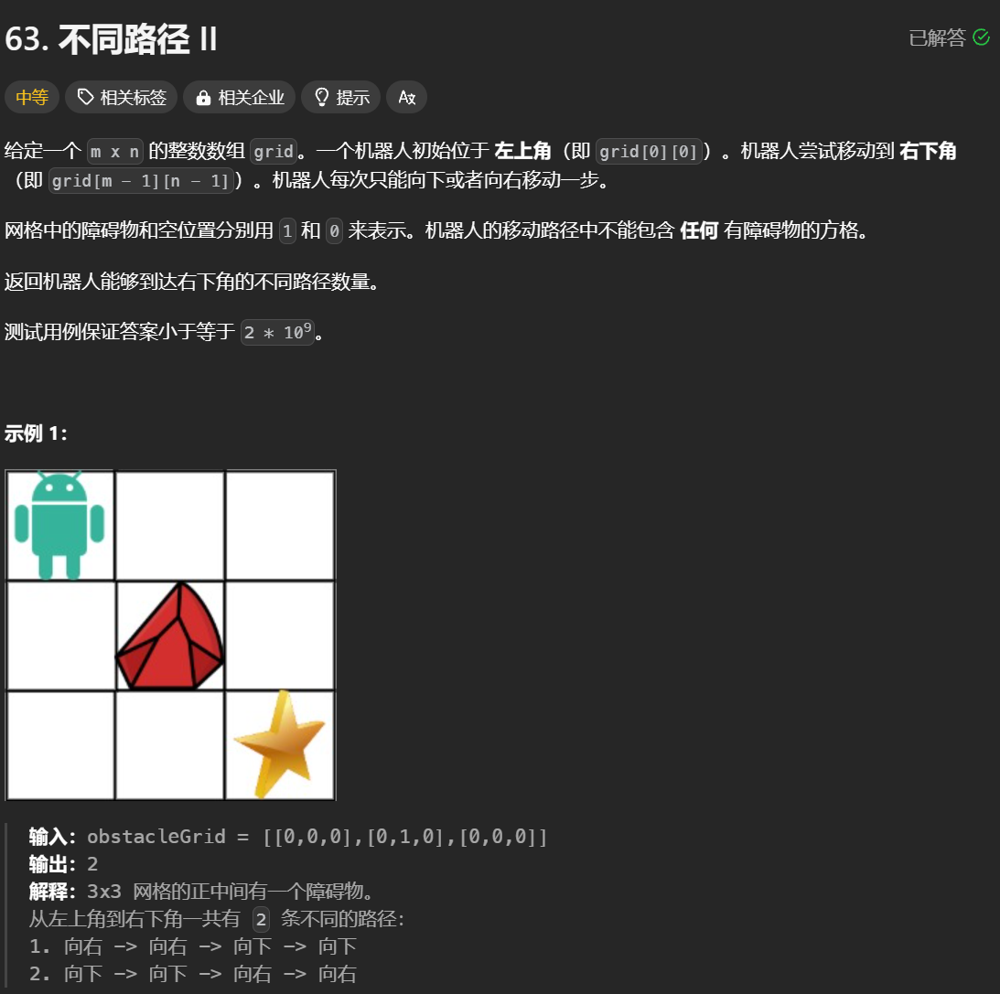

```java
class Solution {
    public int uniquePathsWithObstacles(int[][] obstacleGrid) {
        int m = obstacleGrid.length;
        int n = obstacleGrid[0].length;

        int[][] dp = new int[m][n];
        for(int i = 0; i < m; i++){
            if(obstacleGrid[i][0] == 1)
                break;
            dp[i][0] = 1;
        }

        for(int i = 0; i < n; i++){
            if(obstacleGrid[0][i] == 1)
                break; 
            dp[0][i] = 1;
        }

        for(int i = 1; i < m; i++){
            for(int j = 1; j < n; j++){
                if(obstacleGrid[i][j] == 1)
                    continue;
                dp[i][j] = dp[i-1][j] + dp[i][j-1];
            }
        }
        return dp[m-1][n-1];
    }
}
```

## [343. 整数拆分](https://leetcode.cn/problems/integer-break/)

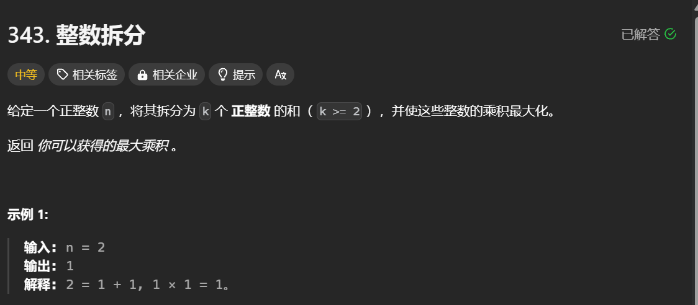

```java
class Solution {
    public int integerBreak(int n) {
        int[] dp = new int[n+1];
        dp[2] = 1;
        for(int i = 3; i <= n; i++){
            for(int j = 1; j < i; j++)
                dp[i] = Math.max(dp[i],Math.max(j*(i-j),j*dp[i-j]));
        }
        return dp[n];
    }
}
```

要不拆分成两部分相乘，要不拆分成多部分相乘。

也可以这么理解，j * (i - j) 是单纯的把整数拆分为两个数相乘，而j * dp[i - j]是拆分成两个以及两个以上的个数相乘。

如果定义dp[i - j] * dp[j] 也是默认将一个数强制拆成4份以及4份以上了，所以多数相乘的定义是j*dp[i-j]。
链接：https://leetcode.cn/problems/integer-break/solutions/856984/dai-ma-sui-xiang-lu-dong-tai-gui-hua-wu-r1ao3/

## [96. 不同的二叉搜索树](https://leetcode.cn/problems/unique-binary-search-trees/)

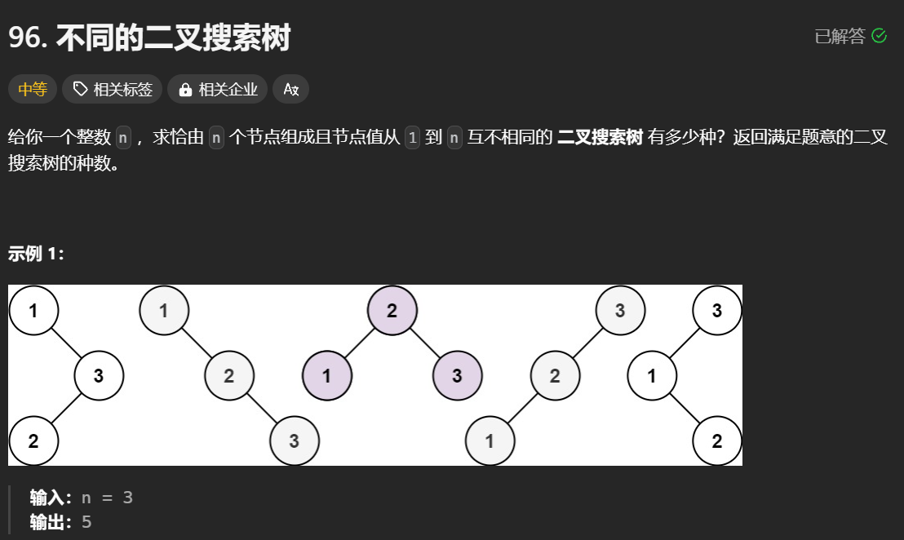

```java
class Solution {
    public int numTrees(int n) {
        int[] dp = new int[n+1];
        dp[0] = 1;
        dp[1] = 1;
        for(int i = 2; i <= n; i++){
            for(int j = 0; j < i; j++)
                dp[i] += dp[j] * dp[i-j-1];
        }
        return dp[n];
    }
}
```

## [221. 最大正方形](https://leetcode.cn/problems/maximal-square/)

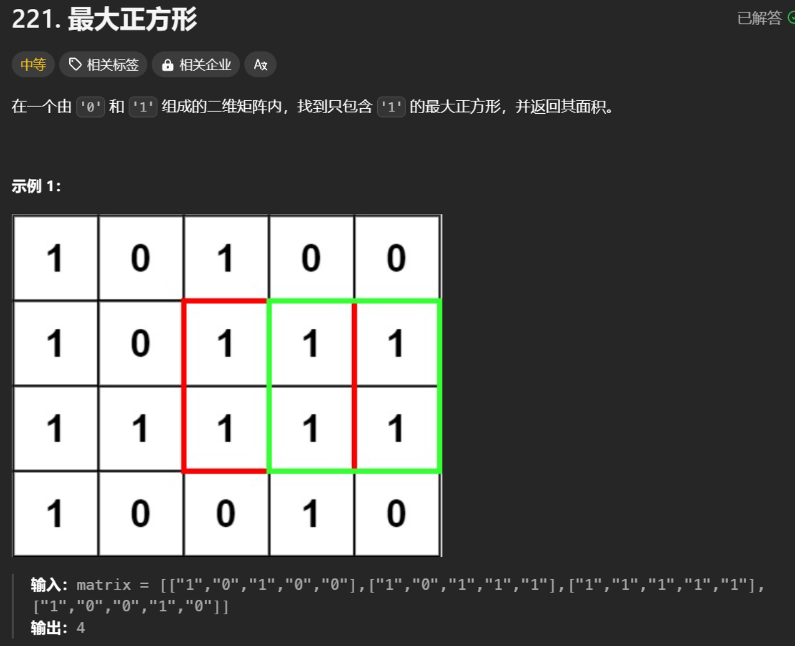

```java
class Solution {
    public int maximalSquare(char[][] matrix) {
        int m = matrix.length;
        int n = matrix[0].length;

        int[][] dp = new int[m][n];
        int max = 0;
        for(int i = 0; i < m; i++){
            for(int j = 0; j < n; j++){
                if(i == 0 || j == 0 ){
                    dp[i][j] = matrix[i][j] == '1' ? 1 : 0;
                }else{
                    if(matrix[i][j] == '1')
                        dp[i][j] = Math.min(Math.min(dp[i-1][j],dp[i][j-1]),dp[i-1][j-1])+1;
                }
                max = Math.max(max,dp[i][j]);
            }
        }
        return max*max;
    }
}
```

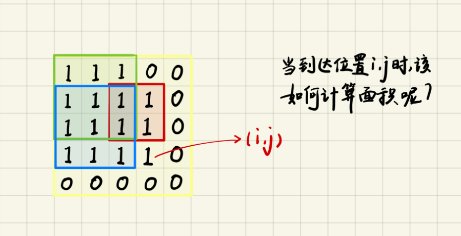

## [338. 比特位计数](https://leetcode.cn/problems/counting-bits/)

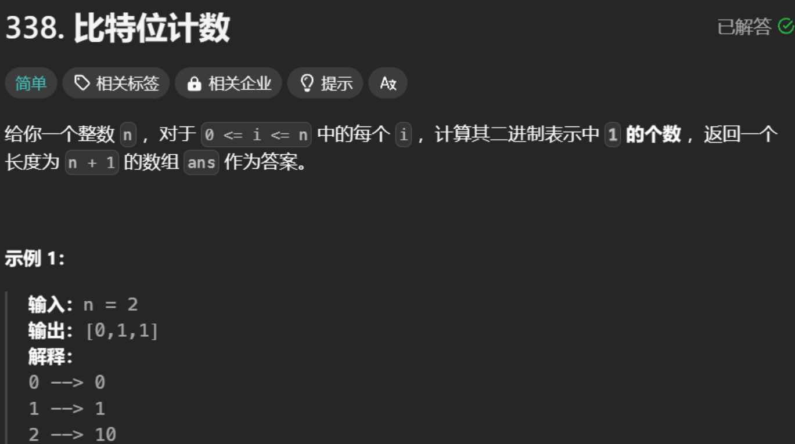

```java
class Solution {
    public int[] countBits(int n) {
        int[] dp = new int[n+1];
        dp[0] = 0;
        for(int i = 1; i <= n; i++){
            if(i % 2 == 1)
                dp[i] = dp[i-1]+1;
            else
                dp[i] = dp[i/2];
        }
        return dp;
    }
}
```

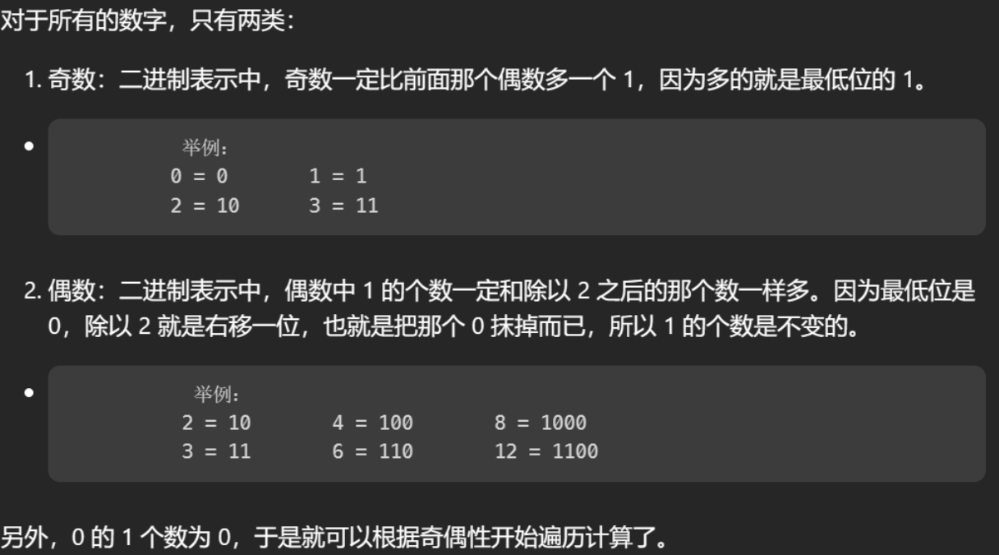

## [64. 最小路径和](https://leetcode.cn/problems/minimum-path-sum/)

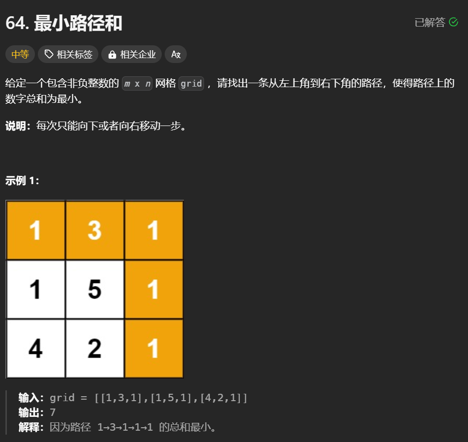

```java
class Solution {
    public int minPathSum(int[][] grid) {
        int m = grid.length;
        int n = grid[0].length;

        int[][] dp = new int[m][n];
        dp[0][0] = grid[0][0];

        for(int i = 1; i < m; i++)
            dp[i][0] = dp[i-1][0] + grid[i][0];
        for(int i = 1; i < n; i++)
            dp[0][i] = dp[0][i-1] + grid[0][i];

        for(int i = 1; i < m; i++){
            for(int j = 1; j < n; j++){
                dp[i][j] = Math.min(dp[i-1][j],dp[i][j-1]) + grid[i][j];
            }
        }

        return dp[m-1][n-1];
    }
}
```

## [312. 戳气球](https://leetcode.cn/problems/burst-balloons/)

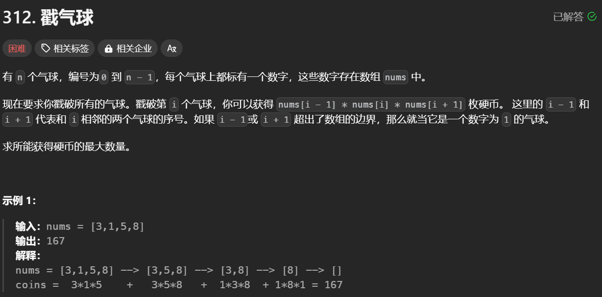

```java
class Solution {
    public int maxCoins(int[] _nums) {
        int[] nums = new int[_nums.length+2];// 加上边界的数组，统一处理
        for(int i = 0; i < _nums.length; i++)
            nums[i+1] = _nums[i];
        nums[0] = 1;
        nums[nums.length-1] = 1;

        int n = nums.length;
        int[][] dp = new int[n][n]; // dp[i][j]表示数组范围nums(i, j)可以获得的最大硬币数
        for(int i = n-3; i >= 0; i--){
            for(int j = i+2; j < n; j++){
                for(int k = i+1; k < j; k++){
                    //i依赖于更大的i，因此i逆序
                    //j依赖于更小的j，因此j正序
                    dp[i][j] = Math.max(dp[i][j],dp[i][k]+nums[i]*nums[k]*nums[j]+dp[k][j]);
                }
            }
        }
        return dp[0][n-1];
    }
}
```


链接：https://leetcode.cn/problems/burst-balloons/solutions/2807046/javapython3cdong-tai-gui-hua-yi-qu-jian-k6cos/

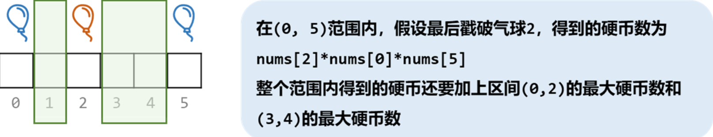

`dp[i][j]` 表示数组范围 `(i, j)` 可以得到的最大硬币个数，则状态转移方程为：

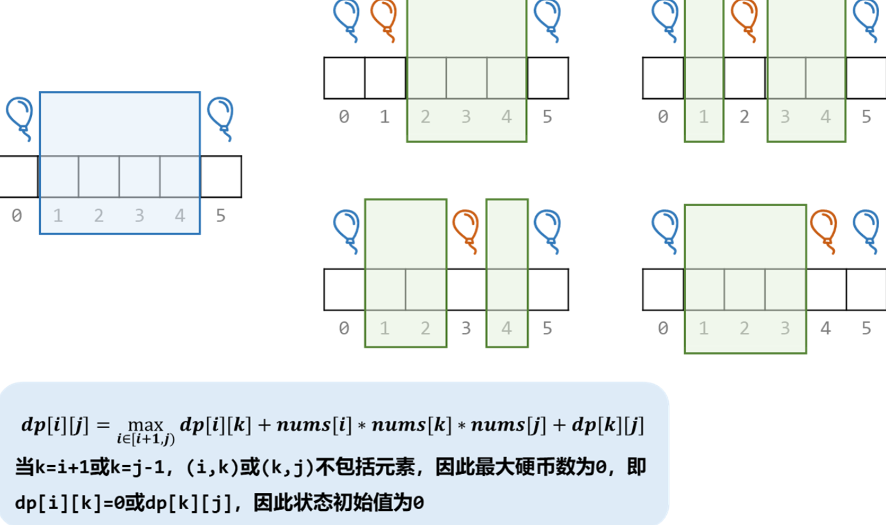

我们在枚举 i 的状态和 j 的状态时，两个方向一定是相反的。因为我们计算 dp[i][j] 的值依赖于两端的值 dp[i][k] 和 dp[k][j]。因此两端的值必须先得到：

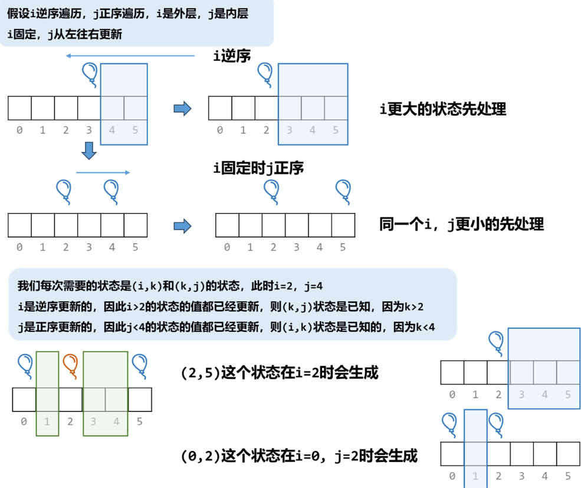

# 背包问题

## 背包总结

### 01背包

外层物品，内层容量，内层反向遍历从而保留状态

```java
for(int i = 0; i <stones.length; i++){
    for(int j = target; j >= stones[i]; j--)
        dp[j] = Math.max(dp[j],dp[j-stones[i]] + stones[i]);
}
```

### 完全背包

正向遍历，因为可以多次使用同一物品

```java
dp[0] = 1;
for(int i = 0; i < coins.length; i++){
    for(int j = coins[i]; j < amount + 1; j++){
        //不用当前硬币有多少种 or 用当前硬币有多少种
        dp[j] =  dp[j] + dp[j - coins[i]];
    }
}
```

### 最大价值（价值可以是容量本身）

```java
dp[j] = Math.max(dp[j], dp[j - nums[i]] + nums[i]);//不放自己 or 放自己
dp[j] = Math.max(dp[j], dp[j - weight[i]] + value[i]);//不放自己 or 放自己
```

### **问装满背包有几种方法**

```java
dp[0] = 1;
...
dp[j] += dp[j - nums[i]] //不放自己 or 放自己，且要注意这种题要设置dp[0] = 1;
```

### **问装满背包所有物品的最小个数**

```java
int max = Integer.MAX_VALUE;
int[] dp = new int[amount+1];
Arrays.fill(dp,max);
dp[0] = 0;
dp[j] = Math.min(dp[j], dp[j - coins[i]] + 1);//不放自己 or 放自己，且要初始化为Integer.MAX_VALUE，且dp[0] = 0;
```

## [416. 分割等和子集](https://leetcode.cn/problems/partition-equal-subset-sum/)

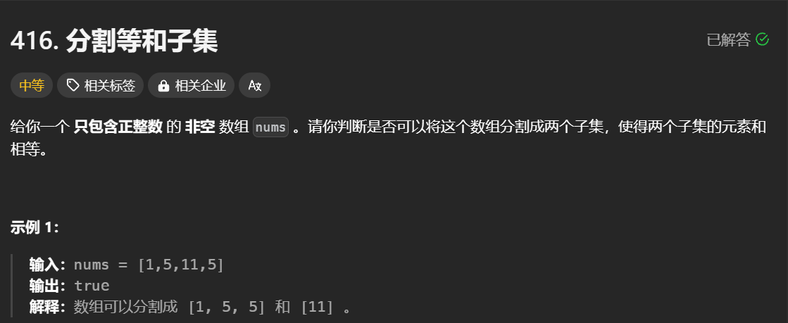

```java
class Solution {
    public boolean canPartition(int[] nums) {
        int sum = 0;
        for(int i = 0; i < nums.length; i++){
            sum += nums[i];
        }
        if(sum % 2 != 0) return false;

        int target = sum/2;
        int[] dp = new int[target+1];//价值和体积相同
        for(int i = 0; i < nums.length; i++){//先遍历物品
            for(int j = target; j >= nums[i]; j--){//再遍历背包
                dp[j] = Math.max(dp[j],dp[j-nums[i]] + nums[i]);
                if(dp[target] == target) return true;//稍微剪枝一下
            }
        }

        return dp[target] == target;
    }
}
```

## [1049. 最后一块石头的重量 II](https://leetcode.cn/problems/last-stone-weight-ii/)

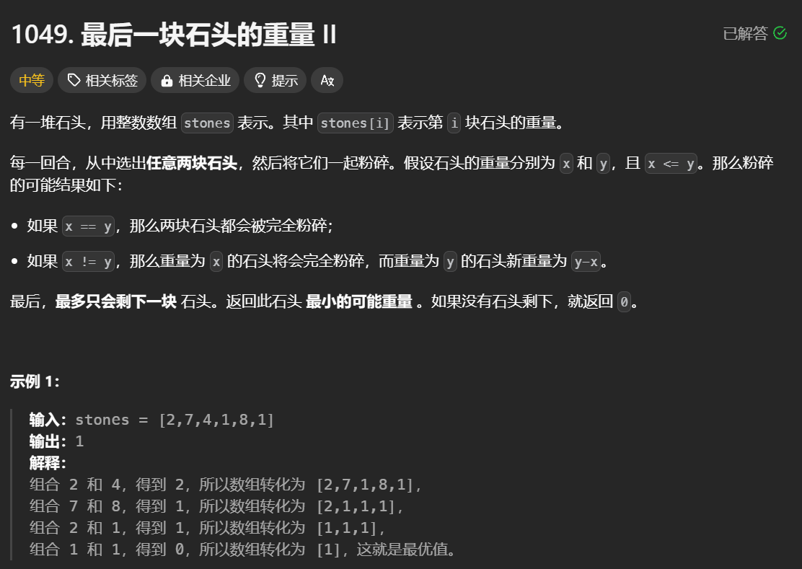

```java
class Solution {
    public int lastStoneWeightII(int[] stones) {
        int sum = 0;
        for(int i = 0; i < stones.length; i++){
            sum += stones[i];
        }
        int target = sum >> 1;

        int[] dp = new int[target+1];
        for(int i = 0; i <stones.length; i++){
            for(int j = target; j >= stones[i]; j--)
                dp[j] = Math.max(dp[j],dp[j-stones[i]] + stones[i]);
        }

        return sum - 2*dp[target];
    }
}
```

## [494. 目标和](https://leetcode.cn/problems/target-sum/)

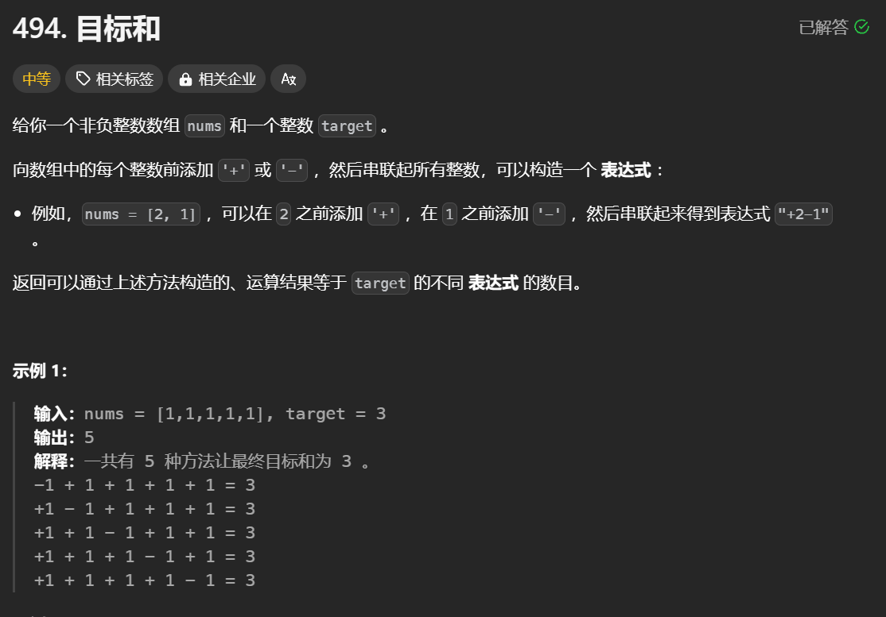

```java
class Solution {
    public int findTargetSumWays(int[] nums, int target) {
        int sum = 0;
        for(int num : nums) sum += num;

        if((sum + target) % 2 != 0 || (sum + target) < 0) return 0;//重要！！！
        int n = (sum + target) / 2;

        int[] dp = new int[n+1];
        dp[0] = 1;

        for(int i = 0; i < nums.length; i++){
            for(int j = n; j >= nums[i]; j--)
                dp[j] += dp[j-nums[i]];
        }

        return dp[n];
    }
}
```

## [474. 一和零](https://leetcode.cn/problems/ones-and-zeroes/)

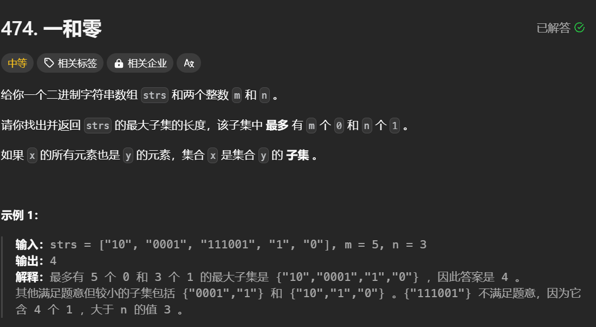

```java
class Solution {
    public int findMaxForm(String[] strs, int m, int n) {
        int[][] dp = new int[m+1][n+1];

        for(String str :strs){
            int count0 = 0;
            int count1 = 0;
            for(int i = 0; i < str.length(); i++){
                if(str.charAt(i) == '0')
                    count0++;
                else
                    count1++;
            }
            //两个维度的01背包
            //价值是字符串个数，体积是0和1的个数
            for(int i = m; i >= count0; i--){{
                for(int j = n; j >= count1; j--)
                    dp[i][j] = Math.max(dp[i][j],dp[i-count0][j-count1] + 1);
            }}
        }
        return dp[m][n];
    }
}
```

## [322. 零钱兑换](https://leetcode.cn/problems/coin-change/)

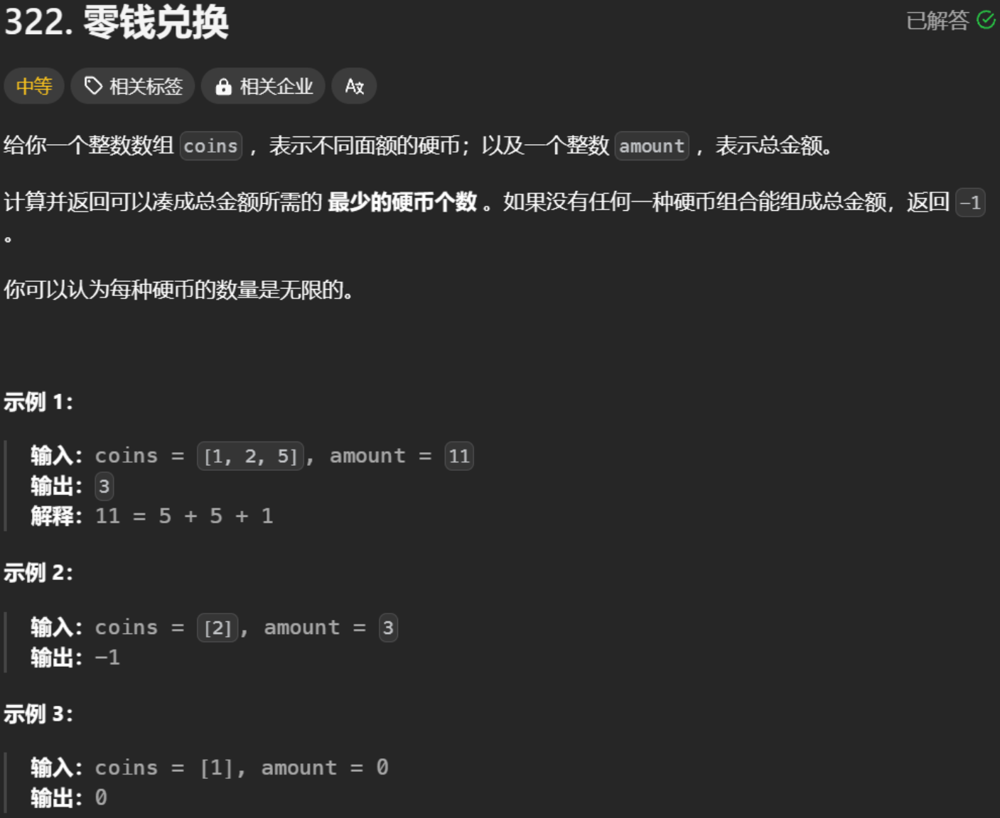

```java
class Solution {
    public int coinChange(int[] coins, int amount) {
        int max = Integer.MAX_VALUE;
        int[] dp = new int[amount+1];
        Arrays.fill(dp,max);
        dp[0] = 0;
        for(int i = 0; i < coins.length; i++){
            for(int j = coins[i]; j <= amount; j++){
                if(dp[j-coins[i]] != max){
                    dp[j] = Math.min(dp[j],dp[j-coins[i]]+1);
                }
            }
        }

        return dp[amount] == max ? -1 : dp[amount];
    }
}
```

## [518. 零钱兑换 II](https://leetcode.cn/problems/coin-change-ii/)

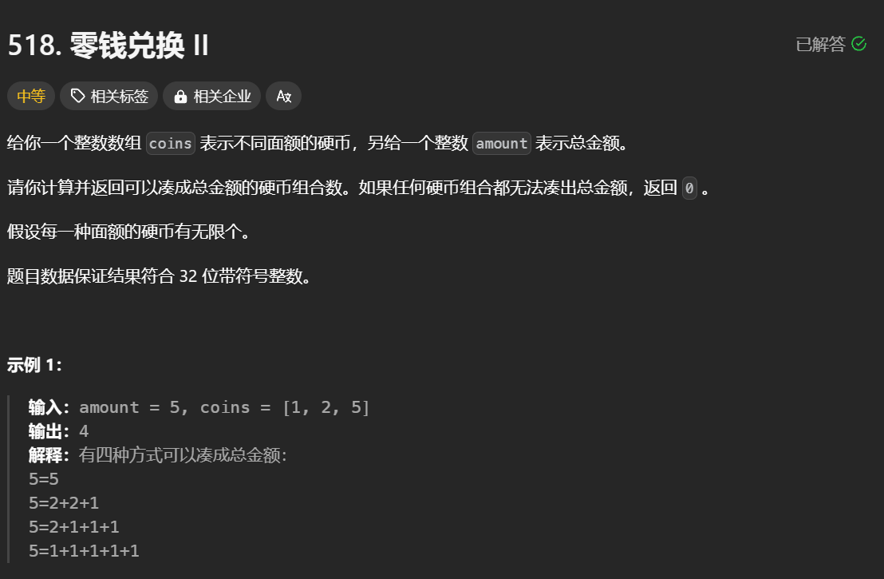

```java
class Solution {
    public int change(int amount, int[] coins) {
        int[] dp = new int[amount+1];
        dp[0] = 1;
        for(int i = 0; i < coins.length; i++){
            for(int j = coins[i]; j <= amount; j++)
                dp[j] += dp[j-coins[i]];
        }

        return dp[amount];
    }
}
```

## [377. 组合总和 Ⅳ](https://leetcode.cn/problems/combination-sum-iv/)


```java
class Solution {
    public int combinationSum4(int[] nums, int target) {
        int[] dp = new int[target+1];
        dp[0] = 1;

        for(int j = 0; j <= target; j++){
            for(int i = 0; i < nums.length; i++){
                if(j >= nums[i])
                    dp[j] += dp[j-nums[i]];
            }
        }

        return dp[target];
    }
}
```

## [57. 爬楼梯（第八期模拟笔试） (kamacoder.com)](https://kamacoder.com/problempage.php?pid=1067)

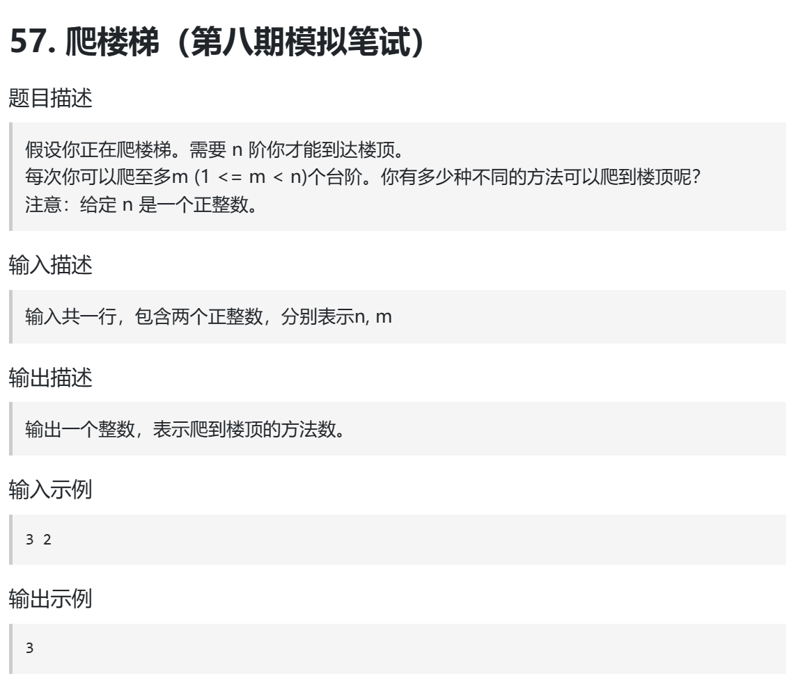

```java
import java.util.*;
public class Main{
    public static void main(String[] args){
        Scanner sc = new Scanner(System.in);
        int n = sc.nextInt();
        int m = sc.nextInt();
        
        int[] dp = new int[n+1];
        dp[0] = 1;
        for(int j = 1; j <= n; j++){
            for(int i = 1; i <= m; i++){
                if(j >= i)
                    dp[j] = dp[j] + dp[j-i];
            }
        }
        
        System.out.println(dp[n]);
    }
}
```

## [322. 零钱兑换](https://leetcode.cn/problems/coin-change/)

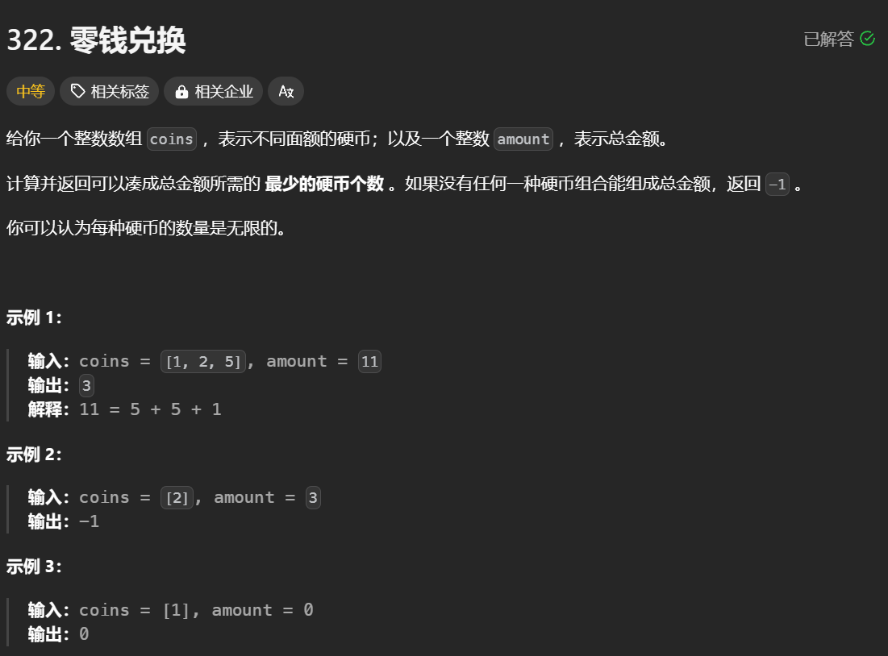

```java
class Solution {
    public int coinChange(int[] coins, int amount) {
        int max = Integer.MAX_VALUE;
        int[] dp = new int[amount+1];
        Arrays.fill(dp,max);
        dp[0] = 0;

        for(int i = 0; i < coins.length; i++){
            for(int j = coins[i]; j <= amount; j++){
                if(dp[j-coins[i]] != max)
                    dp[j] =  Math.min(dp[j],dp[j-coins[i]]+1);
            }
        }
        return dp[amount] == max ? -1 : dp[amount];
    }
}
```

## [279. 完全平方数](https://leetcode.cn/problems/perfect-squares/)

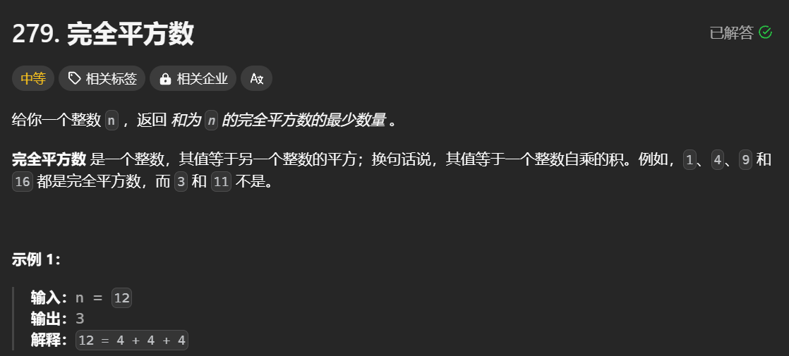

```java
class Solution {
    public int numSquares(int n) {
        int max = Integer.MAX_VALUE;
        int[] dp = new int[n+1];
        Arrays.fill(dp,max);
        dp[0] = 0;

        for(int i = 1; i*i <= n; i++){
            for(int j = i*i; j <= n; j++){
                if(dp[j-i*i] != max){
                    dp[j] = Math.min(dp[j],dp[j-i*i]+1);
                }
            }
        }
        return dp[n];
    }
}
```

## [139. 单词拆分](https://leetcode.cn/problems/word-break/)


```java
class Solution {
    public boolean wordBreak(String s, List<String> wordDict) {
        boolean[] dp = new boolean[s.length()+1];
        dp[0] = true;

        for(int j = 0; j <= s.length(); j++){
            for(String word : wordDict){
                if(j+word.length() > s.length()) continue;
                String str = s.substring(j,j+word.length());
                if(dp[j] == true && str.equals(word))
                    dp[j+word.length()] = true;
            }
        }

        return dp[s.length()];
    }
}
```


# 打家劫舍系列

## [198. 打家劫舍](https://leetcode.cn/problems/house-robber/)

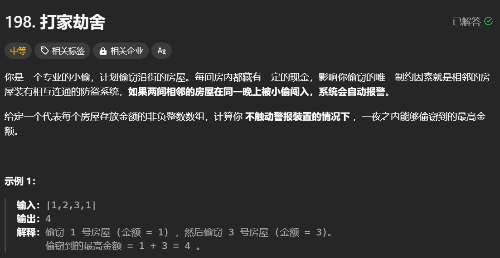

```java
class Solution {
    public int rob(int[] nums) {
        if(nums.length == 1) return nums[0];
        int[] dp = new int[nums.length];
        dp[0] = nums[0];
        dp[1] = Math.max(nums[0],nums[1]);
        for(int i = 2; i < nums.length; i++)
            dp[i] = Math.max(dp[i-2]+nums[i],dp[i-1]);
        return dp[nums.length-1];
    }
}
```

## [213. 打家劫舍 II](https://leetcode.cn/problems/house-robber-ii/)

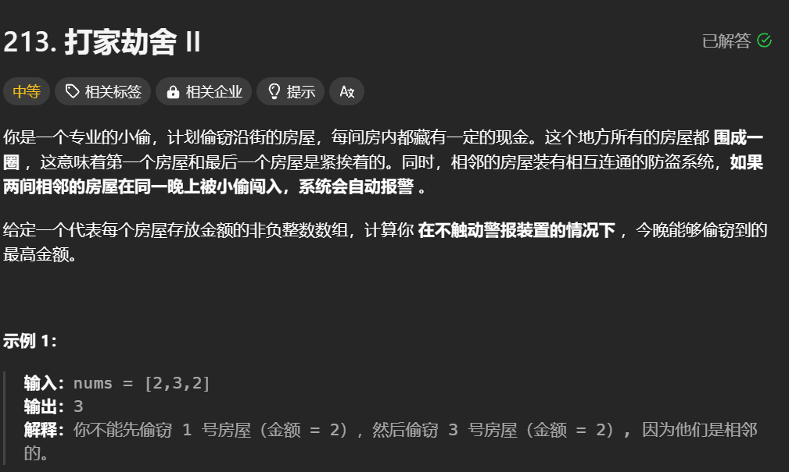

```java
class Solution {
    public int rob(int[] nums) {
        if(nums.length == 1) return nums[0];
        int a = rob2(nums,0,nums.length-2);
        int b = rob2(nums,1,nums.length-1);
        return Math.max(a,b);
    }

    public int rob2(int[] nums,int start, int end){
        if(end - start == 0) return nums[start];
        int n = end-start+1;
        int[] dp = new int[n];
        dp[0] = nums[start];
        dp[1] = Math.max(nums[start],nums[start+1]);
        for(int i = 2; i < n; i++)
            dp[i] = Math.max(dp[i-2]+nums[start+i],dp[i-1]);
        return dp[n-1];
    }
}


```

## [337. 打家劫舍 III](https://leetcode.cn/problems/house-robber-iii/)

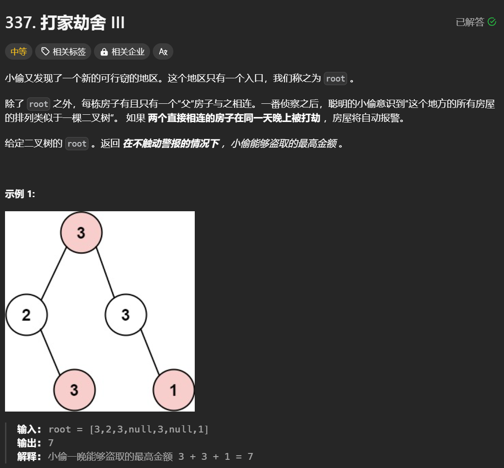

```java
class Solution {
    public int rob(TreeNode root) {
        int[] res = robAction1(root);
        //0:不偷当前节点，1：偷当前节点
        return Math.max(res[0], res[1]);
    }
    
    public int[] robAction1(TreeNode root) {
        int res[] = new int[2];
        if (root == null)
            return res;

        int[] left = robAction1(root.left);
        int[] right = robAction1(root.right);
        //不偷：Max(左孩子不偷，左孩子偷) + Max(右孩子不偷，右孩子偷)
        res[0] = Math.max(left[0], left[1]) + Math.max(right[0], right[1]);
        //偷：左孩子不偷+ 右孩子不偷 + 当前节点偷
        res[1] = root.val + left[0] + right[0];
        return res;
    }
}
```

# 股票系列

## 股票总结

```java
我们要跳出固有的思维模式，并不是要考虑买还是卖，而是要最大化手里持有的钱。

买股票手里的钱减少，卖股票手里的钱增加，无论什么时刻，我们要保证手里的钱最多。

我们这一次买还是卖只跟上一次我们卖还是买的状态有关。
```

https://leetcode.cn/problems/best-time-to-buy-and-sell-stock-iv/solutions/740596/5xing-dai-ma-gao-ding-suo-you-gu-piao-ma-j6zo

## [21. 买卖股票的最佳时机](https://leetcode.cn/problems/best-time-to-buy-and-sell-stock/)

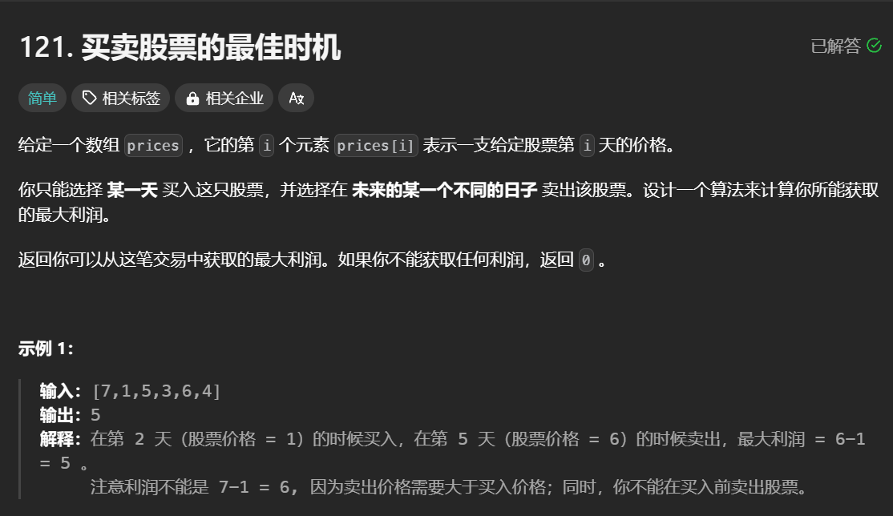

```java
class Solution {
    public int maxProfit(int[] prices) {
        if(prices.length <= 1) return 0;
        int[][] dp = new int[prices.length][2];
        dp[0][0] = -prices[0];//持有股票
        dp[1][1] = 0;//不持有股票

        for(int i = 1; i < prices.length; i++){
            dp[i][0] = Math.max(dp[i-1][0],-prices[i]);//持有股票
            dp[i][1] = Math.max(dp[i-1][1],dp[i-1][0] + prices[i]);//不持有股票
        }

        return dp[prices.length-1][1];
    }
}
```

## [122. 买卖股票的最佳时机 II](https://leetcode.cn/problems/best-time-to-buy-and-sell-stock-ii/)


```java
class Solution {
    public int maxProfit(int[] prices) {
        if(prices.length <= 1) return 0;

        int[][] dp = new int[prices.length][2];
        dp[0][0] = -prices[0];//持有股票
        dp[1][1] = 0;//不持有股票

        for(int i = 1; i < prices.length; i++){
            dp[i][0] = Math.max(dp[i-1][0],dp[i-1][1] - prices[i]);//持有股票
            dp[i][1] = Math.max(dp[i-1][1],dp[i-1][0] + prices[i]);//不持有股票
        }
        return dp[prices.length-1][1];
    }
}
```

## [123. 买卖股票的最佳时机 III](https://leetcode.cn/problems/best-time-to-buy-and-sell-stock-iii/)

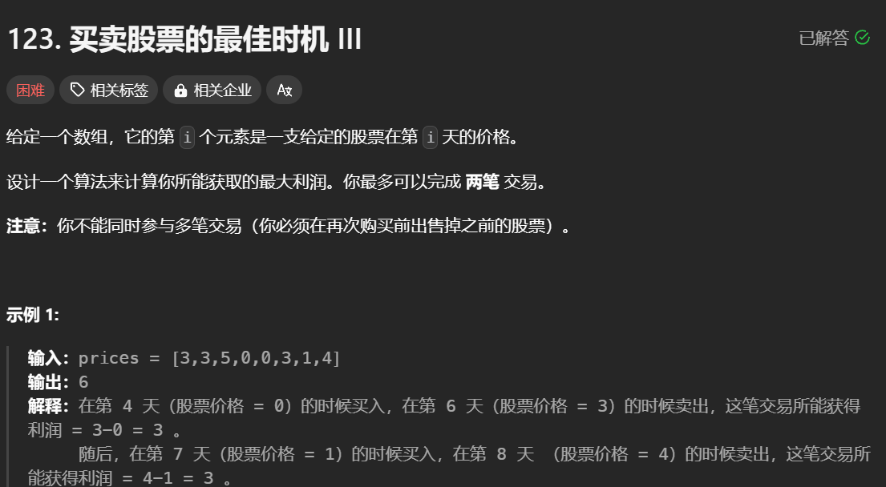

```java
class Solution {
    public int maxProfit(int[] prices) {
        if(prices.length <= 1) return 0;
        int n = prices.length;
        //天数 交易数 持有 or 未持有
        int[][][] dp = new int[n][2][2];
        dp[0][0][0] = -prices[0];
        dp[0][1][0] = -prices[0];

        for(int i = 1; i < prices.length; i++){
            dp[i][0][0] = Math.max(dp[i-1][0][0],-prices[i]);//第一次买入持有股票
            dp[i][0][1] = Math.max(dp[i-1][0][1],dp[i-1][0][0]+prices[i]);//第一次卖出不持有股票

            dp[i][1][0] = Math.max(dp[i-1][1][0],dp[i-1][0][1]-prices[i]);//第二次买入持有股票
            dp[i][1][1] = Math.max(dp[i-1][1][1],dp[i-1][1][0]+prices[i]);//第二次卖出不持有股票
        }

        return dp[prices.length-1][1][1];
    }
}
```

## [188. 买卖股票的最佳时机 IV](https://leetcode.cn/problems/best-time-to-buy-and-sell-stock-iv/)

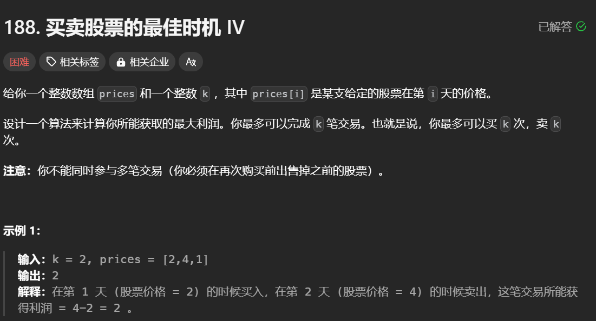

```java
// 到了第四题，相信大家已经要懂了，第三题最多两次我们有2x2个状态，那么k次我们就需要kx2个状态。
// 那么我们并不需要像第三题那样真的列kx2个参数，我们只需要两个数组就可以了
class Solution {
    public int maxProfit(int k, int[] prices) {
        if(prices.length <= 1) return 0;

        int[][][] dp = new int[prices.length][k+1][2];//一定要注意这里是k+1
        for(int i = 1; i <= k; i++){
            dp[0][i][0] =  -prices[0];
        }

        for(int i = 1; i < prices.length; i++){
            for(int j = 1; j <= k; j++){
                //持有
                dp[i][j][0] = Math.max(dp[i-1][j][0],dp[i-1][j-1][1]-prices[i]);
                //不持有，先买才能卖，所以是dp[i-1][j][0]
                dp[i][j][1] = Math.max(dp[i-1][j][1],dp[i-1][j][0]+prices[i]);
            }
        }
        return dp[prices.length-1][k][1];
    }
}
```

## [309. 买卖股票的最佳时机含冷冻期](https://leetcode.cn/problems/best-time-to-buy-and-sell-stock-with-cooldown/)

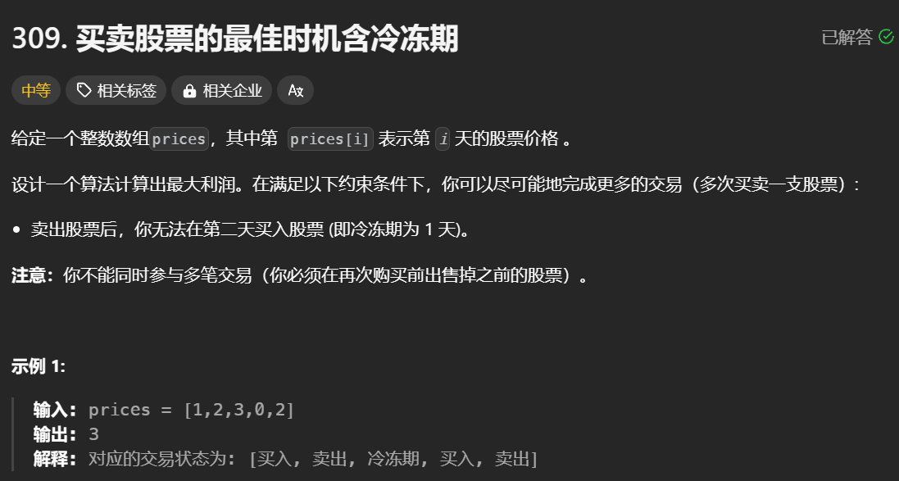

```java
class Solution {
    public int maxProfit(int[] prices) {
        if(prices.length <= 1) return 0;

        int[][] dp = new int[prices.length][2];
        dp[0][0] = -prices[0];
        dp[1][0] = Math.max(-prices[0],-prices[1]);
        dp[1][1] = Math.max(0,prices[1]-prices[0]);

        for(int i = 2; i < prices.length; i++){
            dp[i][0] = Math.max(dp[i-1][0],dp[i-2][1] - prices[i]);
            dp[i][1] = Math.max(dp[i-1][1],dp[i-1][0] + prices[i]);
        }

        return dp[prices.length-1][1];
    }
}
```

## [714. 买卖股票的最佳时机含手续费](https://leetcode.cn/problems/best-time-to-buy-and-sell-stock-with-transaction-fee/)

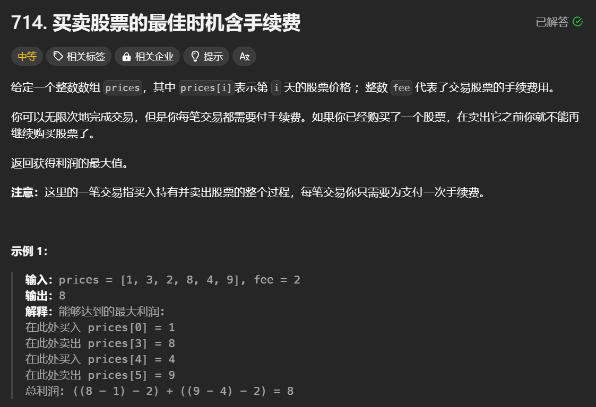

```java
class Solution {
    public int maxProfit(int[] prices, int fee) {
        if(prices.length <= 1) return 0;

        int[][] dp = new int[prices.length][2];
        dp[0][0] =  -prices[0];//持有股票
        dp[0][1] =  0;//不持有股票

        for(int i = 1; i < prices.length; i++){
            dp[i][0] = Math.max(dp[i-1][0],dp[i-1][1] - prices[i]);//持有股票
            dp[i][1] = Math.max(dp[i-1][1],dp[i-1][0] + prices[i] - fee);//不持有股票
        }   
        return dp[prices.length-1][1];
    }
}
```

# 单个字符串处理

## [300. 最长递增子序列](https://leetcode.cn/problems/longest-increasing-subsequence/)

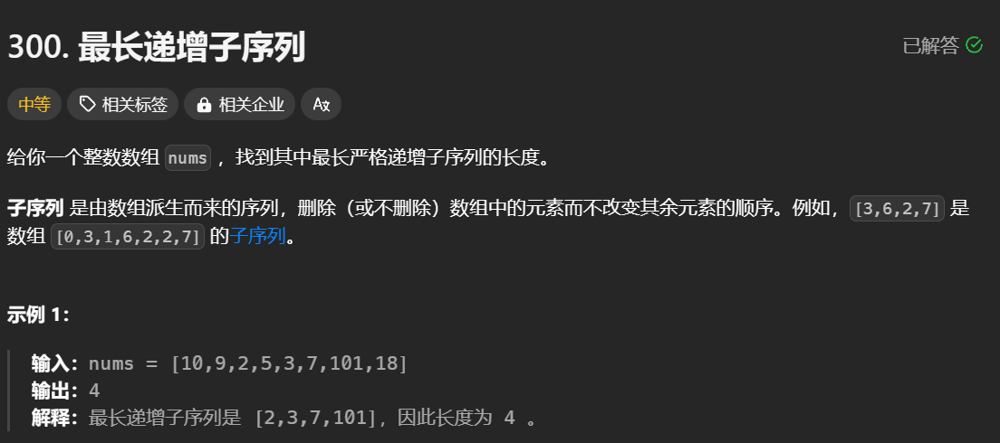

```java
class Solution {
    public int lengthOfLIS(int[] nums) {
        int[] tails = new int[nums.length];
        int res = 0;//// res为 tails 当前长度,代表直到当前的最长上升子序列长度，起始是0！！！
        
        for(int i = 0; i < nums.length; i++){
            int left = 0;
            int right = res-1;
            while(left <= right){
                int mid = left + (right-left)/2;
                if(tails[mid] < nums[i])
                    left = mid+1;
                else
                    right = mid-1;
            }
            tails[left] = nums[i];
            if(left == res) res++;
        }
        return res;
    }
}
//案例 7 8 9 1 2 3 4 5 6
// 7
// 7 8
// 7 8 9
// 1 8 9
// 1 2 9
```

```java
比如序列是78912345，前三个遍历完以后tail是789，这时候遍历到1，就得把1放到合适的位置，于是在tail二分查找1的位置，变成了189（如果序列在此时结束，因为res不变，所以依旧输出3），再遍历到2成为129，然后是123直到12345
```

## [674. 最长连续递增序列](https://leetcode.cn/problems/longest-continuous-increasing-subsequence/)

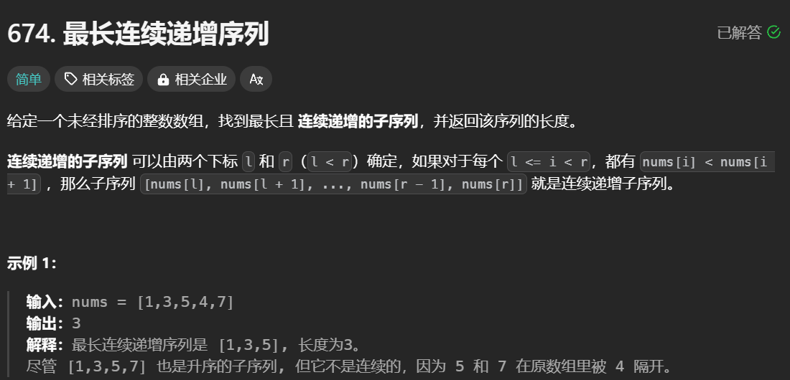

```java
class Solution {
    public int findLengthOfLCIS(int[] nums) {
        int[] dp = new int[nums.length];
        int max = 0;
        for(int i = 0; i < nums.length; i++){
            if(i!=0 && nums[i] > nums[i-1])
                dp[i] = dp[i-1] + 1;
            else
                dp[i] = 1;
            max = Math.max(max,dp[i]);
        }
        return max;
    }
}
```

## [53. 最大子数组和](https://leetcode.cn/problems/maximum-subarray/)

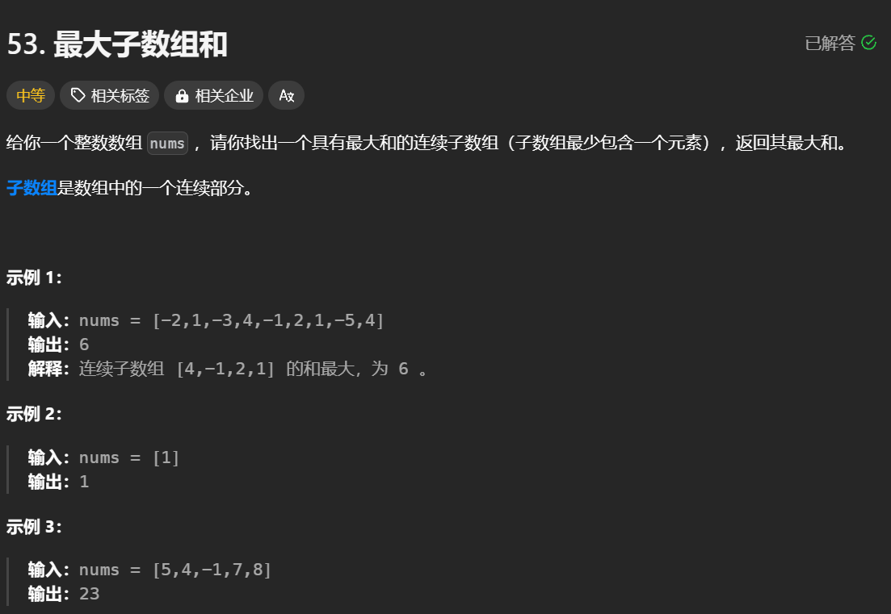

```java
class Solution {
    public int maxSubArray(int[] nums) {
        //dp[i]：表示以 nums[i] 结尾 的 连续 子数组的最大和
        int[] dp = new int[nums.length];
        dp[0] = nums[0];
        int max = dp[0];
        for(int i = 1; i < nums.length; i++){
            dp[i] = Math.max(dp[i-1]+nums[i],nums[i]);
            max = Math.max(max,dp[i]);
        }
        return max;
    }
}
```

## [647. 回文子串](https://leetcode.cn/problems/palindromic-substrings/)

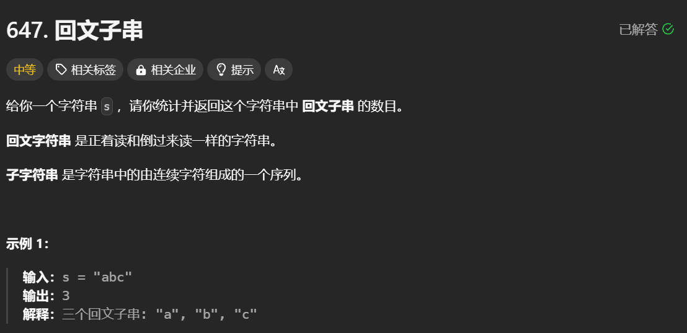

```java
class Solution {
    public int countSubstrings(String s) {
        int count = 0;
        for(int i = 0; i < 2*s.length(); i++){
            int left = i/2;
            int right = i/2 + i%2;
            while(left >= 0 && right < s.length() && s.charAt(left) == s.charAt(right)){
                count++;
                left--;
                right++;
            }
        }
        return count;
    }
}
```

## [5. 最长回文子串](https://leetcode.cn/problems/longest-palindromic-substring/)

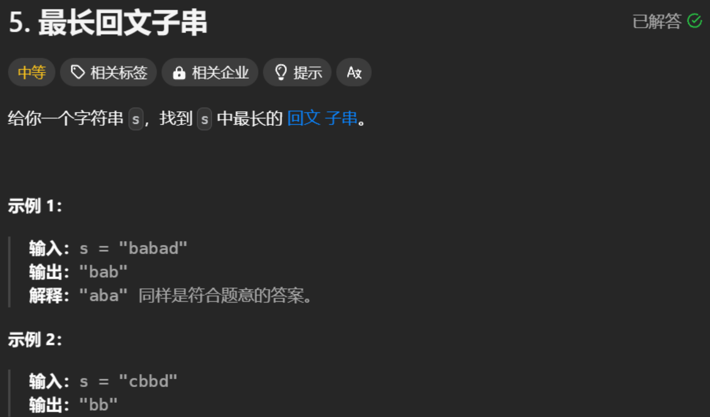

```java
class Solution {
    public String longestPalindrome(String s) {
        int n = s.length();
        String res = "";
        for(int i = 0; i < 2*n+1; i++){
            int left = i/2;
            int right = i/2 + i%2;
            while(left>=0 && right < n && s.charAt(left) == s.charAt(right)){
                if(right - left + 1 > res.length())
                    res = s.substring(left,right+1);
                left--;
                right++;
            }
        }
        return res;
    }
}
```

## [516. 最长回文子序列](https://leetcode.cn/problems/longest-palindromic-subsequence/)（需要初始化）

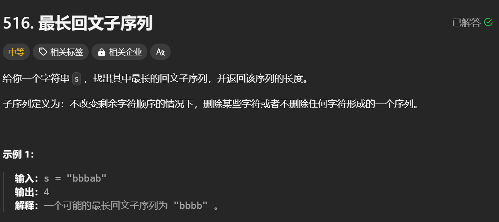

```java
class Solution {
    public int longestPalindromeSubseq(String s) {
        int[][] dp = new int[s.length()][s.length()];
        for(int i = 0; i < s.length(); i++)
            dp[i][i] = 1;

        for(int i = s.length()-1; i >= 0; i--){
            for(int j = i+1; j < s.length(); j++){
                if(s.charAt(i) == s.charAt(j))
                    dp[i][j] = dp[i+1][j-1] + 2;
                else
                    dp[i][j] = Math.max(dp[i+1][j],dp[i][j-1]);
            }
 
        }
        return dp[0][s.length()-1];
    }
}
```

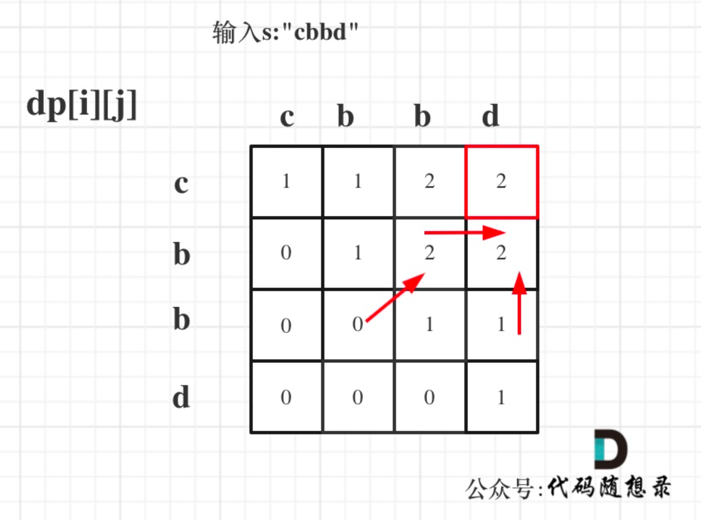


# 最长公共子序列(两个字符串)

## [718. 最长重复子数组](https://leetcode.cn/problems/maximum-length-of-repeated-subarray/)

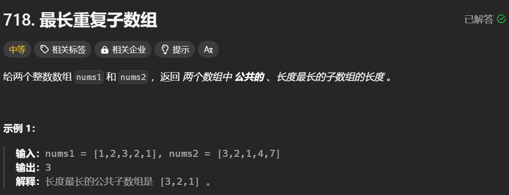

```java
class Solution {
    public int findLength(int[] nums1, int[] nums2) {
        int[][] dp = new int[nums1.length+1][nums2.length+1];
        int max = 0;
        for(int i = 1; i <= nums1.length; i++){
            for(int j = 1; j <= nums2.length; j++){
                if(nums1[i-1] == nums2[j-1]){
                    dp[i][j] = dp[i-1][j-1] + 1;
                    max = Math.max(max,dp[i][j]);
                }
            }
        }
        return max;
    }
}
```

## [1143. 最长公共子序列](https://leetcode.cn/problems/longest-common-subsequence/)

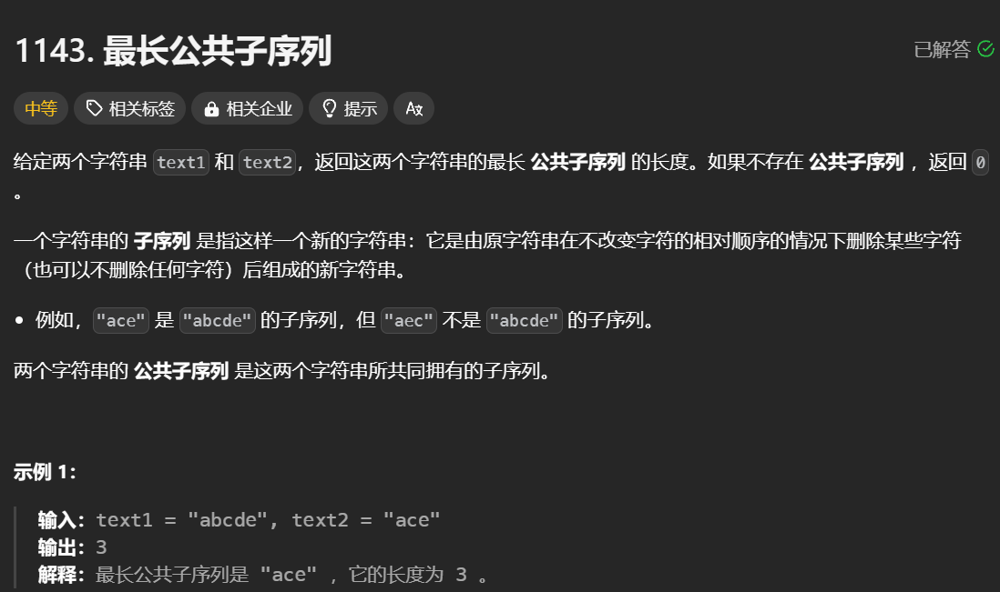

```java
class Solution {
    public int longestCommonSubsequence(String text1, String text2) {
        //长度为[0, i - 1]的字符串text1与长度为[0, j - 1]的字符串text2的最长公共子序列为dp[i][j]
        int[][] dp = new int[text1.length()+1][text2.length()+1];
        for(int i = 1; i <text1.length()+1; i++){
            for(int j = 1; j < text2.length()+1; j++){
                if(text1.charAt(i-1) == text2.charAt(j-1)){
                    dp[i][j] = dp[i-1][j-1] + 1;
                }else{
                    dp[i][j] = Math.max(dp[i-1][j],dp[i][j-1]);
                }
            }
        }
        return dp[text1.length()][text2.length()];
    }
}
```

## [1035. 不相交的线](https://leetcode.cn/problems/uncrossed-lines/)

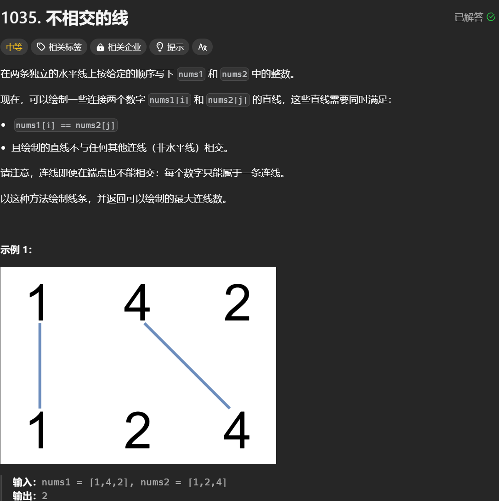

```java
class Solution {
    public int maxUncrossedLines(int[] nums1, int[] nums2) {
        int[][] dp = new int[nums1.length+1][nums2.length+1];
        
        for(int i = 1; i < nums1.length+1; i++){
            for(int j = 1; j < nums2.length+1; j++){
                if(nums1[i-1] == nums2[j-1])
                    dp[i][j] = dp[i-1][j-1] + 1;
                else
                    dp[i][j] = Math.max(dp[i-1][j],dp[i][j-1]);
            }   
        }
        return dp[nums1.length][nums2.length];
    }
}
```

## [583. 两个字符串的删除操作](https://leetcode.cn/problems/delete-operation-for-two-strings/)

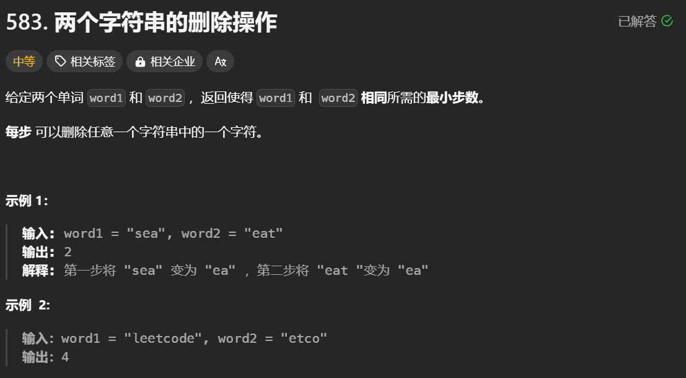

```java
class Solution {
    public int minDistance(String word1, String word2) {
        int[][] dp = new int[word1.length()+1][word2.length()+1];

        for(int i = 1; i <= word1.length(); i++){
            for(int j = 1; j <= word2.length(); j++){
                if(word1.charAt(i-1) == word2.charAt(j-1))
                    dp[i][j] = dp[i-1][j-1]+1;
                else
                    dp[i][j] = Math.max(dp[i-1][j],dp[i][j-1]);
            }
        }
        return word1.length() + word2.length() - 2*dp[word1.length()][word2.length()];
    }
}
```


## [392. 判断子序列](https://leetcode.cn/problems/is-subsequence/)

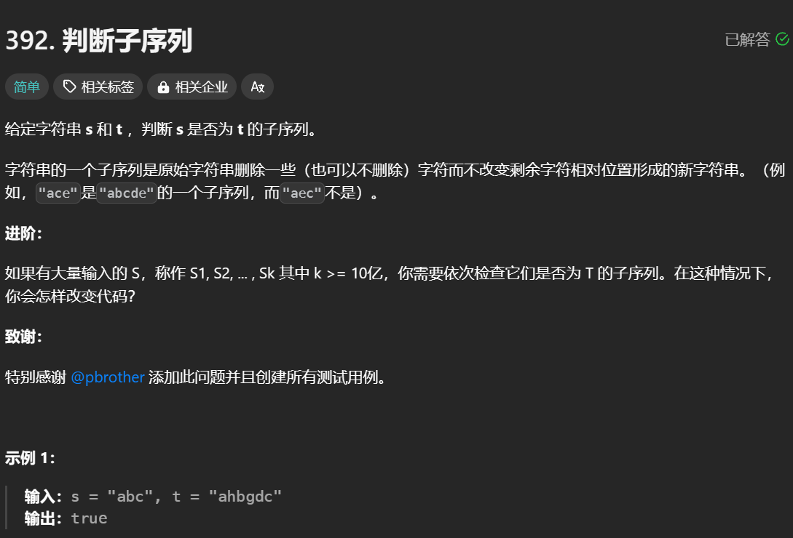

```java
class Solution {
    public boolean isSubsequence(String s, String t) {
        int[][] dp = new int[s.length()+1][t.length()+1];

        for(int i = 1; i <= s.length(); i++){
            for(int j = 1; j <= t.length(); j++){
                if(s.charAt(i-1) == t.charAt(j-1))
                    dp[i][j] = dp[i-1][j-1] + 1;
                else
                    dp[i][j] = Math.max(dp[i-1][j],dp[i][j-1]);
            }
        }

        return dp[s.length()][t.length()] == s.length();
    }
}
```

# 子序列系列(两个字符串)

## [115. 不同的子序列](https://leetcode.cn/problems/distinct-subsequences/)（需要初始化）

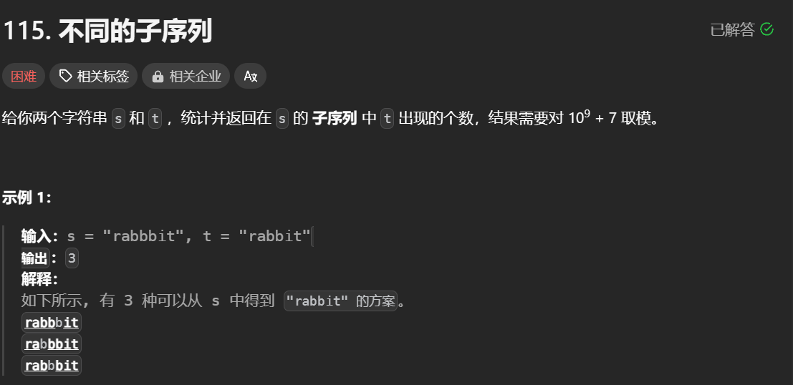

```java
class Solution {
    public int numDistinct(String s, String t) {
        int[][] dp = new int[s.length()+1][t.length()+1];

        for(int i = 0; i <= s.length(); i++)
            dp[i][0] = 1;
        
        for(int i = 1; i <= s.length(); i++){
            for(int j = 1; j <= t.length(); j++){
                if(s.charAt(i-1) == t.charAt(j-1))
                    dp[i][j] = dp[i-1][j-1] + dp[i-1][j];
                else
                    dp[i][j] = dp[i-1][j];
            }
        }

        return dp[s.length()][t.length()];
    }
}
```

当`S[j] != T[i]`时，那么出现个数不变，dp自然就延续前一个值，即`dp[i][j] = dp[i][j-1]`

当`S[j] == T[i]`时，那么这个时候，需要计算的出现个数来自于两个部分：

- 我们使用新加入的这个元素去匹配，此时的个数为`dp[i-1][j-1]`
- 我们不使用新加入的这个元素去匹配，此时的个数为`dp[i][j-1]`

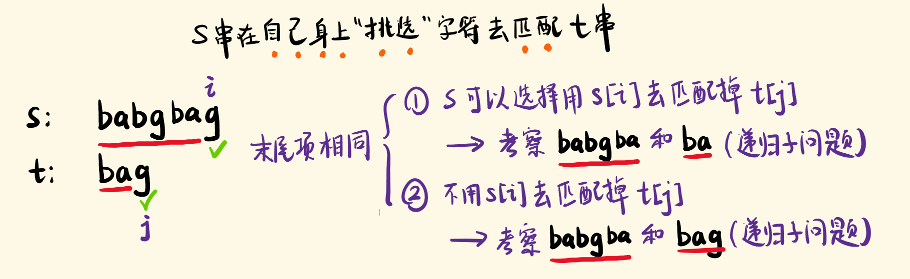

所以此时`dp[i][j] = dp[i-1][j-1] + dp[i][j-1]`

## [72. 编辑距离](https://leetcode.cn/problems/edit-distance/)（需要初始化）

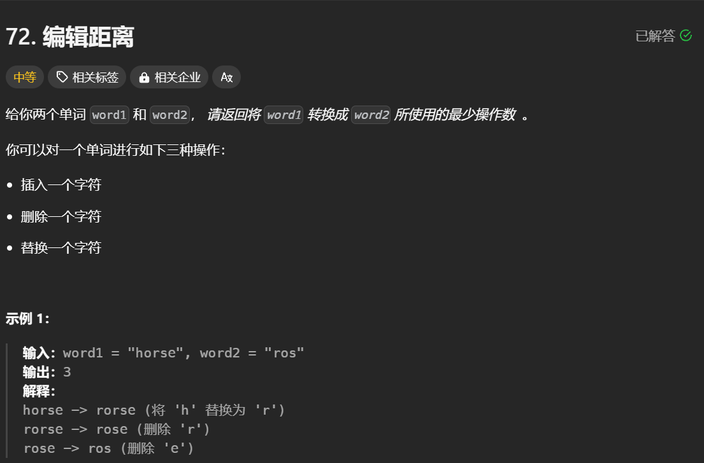

```java
class Solution {
    public int minDistance(String word1, String word2) {
        //dpij 代表 word1 中前 i 个字符，变换到 word2 中前 j 个字符，最短需要操作的次数；
        int[][] dp = new int[word1.length()+1][word2.length()+1];
        for(int i = 0; i < word1.length()+1; i++)
            dp[i][0] = i;
        for(int j = 0; j < word2.length()+1; j++)
            dp[0][j] = j;

        for(int i = 1; i < word1.length()+1; i++){
            for(int j = 1; j < word2.length()+1; j++){
                if(word1.charAt(i-1) == word2.charAt(j-1))
                    dp[i][j] = dp[i-1][j-1];
                else
                    dp[i][j] = Math.min(dp[i-1][j-1],Math.min(dp[i-1][j],dp[i][j-1])) + 1;

            }
        }
        return dp[word1.length()][word2.length()];
    }
}
```

```java
感觉这个定义更加准确：“dpij 代表 word1 中前 i 个字符，变换到 word2 中前 j 个字符，最短需要操作的次数；”

dp[i-1][j-1] (表示替换)：word1的前i-1个字符已经变换到word2的前j-1个字符的次数，说明word1的前i-1个和word2的前j-1个字符已经完成操作；那么对于word1的第i个怎么变成word2的第j个呢？这两个字符都存在，那么只能是替换了；所以dp[i][j] = dp[i-1][j-1]+1;

dp[i-1][j] (表示删除)：word1的前i-1个字符已经变换到word2的前j个字符的次数，当前word1仅用了前i-1个字符就完成了到word2的前j个字符的操作，所以word1的第i个字符其实没啥用了，那么删除操作就好了；所以dp[i][j] = dp[i-1][j]+1;

dp[i][j-1] (表示插入)：word1的前i个字符已经变换到word2的前j-1个字符的次数，当前word1的第i步字符已经用了，但是word2还差一个字符（因为当前只是处理了word2的前j-1个字符），那么插入一个字符就好了；所以dp[i][j] = dp[i][j-1]+1;
```

## [10. 正则表达式匹配](https://leetcode.cn/problems/regular-expression-matching/)

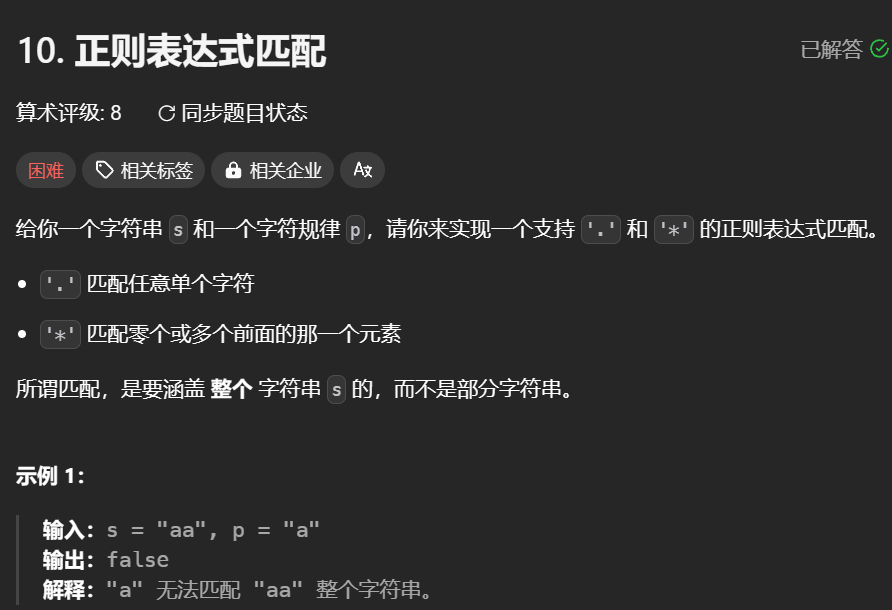

```java
class Solution {
    public boolean isMatch(String s, String p) {
        boolean[][] dp = new boolean[s.length()+1][p.length()+1];
        dp[0][0] = true;
        for(int j = 2; j <= p.length(); j = j+2){
            if(p.charAt(j-1) == '*' && dp[0][j-2] == true)
                dp[0][j] = true;
        }

        for(int i = 1; i <= s.length(); i++){
            for(int j = 1; j <= p.length(); j++){
                if(p.charAt(j-1) == '*'){
                    if(dp[i][j-2]) dp[i][j] = true;
                    if(dp[i-1][j] && s.charAt(i-1) == p.charAt(j-2)) dp[i][j] = true;
                    if(dp[i-1][j] && p.charAt(j-2) == '.') dp[i][j] = true;
                }else{
                    if(dp[i-1][j-1] && s.charAt(i-1) == p.charAt(j-1)) dp[i][j] = true;
                    if(dp[i-1][j-1] && p.charAt(j-1) == '.') dp[i][j] = true;
                }
            }
        }

        return dp[s.length()][p.length()];
    }
}
```

```java
a 和 a*  dp[i-1][j]相当于把a删掉
aa 和 a* 从上面推出下面
aaa 和 a* 再次从上面推出下面
```

```java
状态定义：f(i,j) 代表考虑 s 中以 i 为结尾的子串和 p 中的 j 为结尾的子串是否匹配。即最终我们要求的结果为 f[n][m] 。
状态转移：也就是我们要考虑 f(i,j) 如何求得，前面说到了 p 有三种字符，所以这里的状态转移也要分三种情况讨论：

1.p[j] 为普通字符：匹配的条件是前面的字符匹配，同时 s 中的第 i 个字符和 p 中的第 j 位相同。 即 f(i,j) = f(i - 1, j - 1) && s[i] == p[j] 。

2.p[j] 为 '.'：匹配的条件是前面的字符匹配， s 中的第 i 个字符可以是任意字符。即 f(i,j) = f(i - 1, j - 1) && p[j] == '.'。

3.p[j] 为 '*'：读得 p[j - 1] 的字符，例如为字符 a。 然后根据 a* 实际匹配 s 中 a 的个数是 0 个、1 个、2 个 ...

3.1. 当匹配为 0 个：f(i,j) = f(i, j - 2)

3.2. 当匹配为 1 个：f(i,j) = f(i - 1, j - 2) && (s[i] == p[j - 1] || p[j - 1] == '.')

3.3. 当匹配为 2 个：f(i,j) = f(i - 2, j - 2) && ((s[i] == p[j - 1] && s[i - 1] == p[j - 1]) || p[j] == '.')

a1-例子：s="aab", p="aabb*", 干掉“b*”，p' = "aab" == s；所以，干掉“b*”，相当于*让第2个b重复0次（即抹掉了第二个b），属于a1情况，这种情况就是，不看p串的末尾两个，就看p(0,j-3)与s(0,i-1)是否相同，相同就是true。此种情况下，推导公式为：dp(i)(j) = dp(i)(j-2)

a2-例子：s="aab",p="aab*"，p(j-1)="*",p(j-2)==s(i-1)=b，*使得b重复1次，属于a2描述情况。此种情况，有两种方法：

<1> 仅干掉p串末尾的“*”，看p(0,j-2)与s(0,i-1)是否相同，此时，推导公式为：dp(i)(j) = dp(i)(j-1)；

<2> 已知p末尾的*重复它前一个字符去匹配了s串末尾的一个字符。所以，可以同时干掉p串末尾两个字符和s末尾1个字符，看剩下的p(0,j-3)与s(0,j-2)是否相同。此时，推导公式为：dp(i)(j) = dp(i-1)(j-2);

【注】所以，网上的题解会看到两种状态转移的公式，其实分析明白了，两种都可以得到正确的解（都是一样的）。本文选择的是第2种方法的推导公式，即dp(i)(j) = dp(i-1)(j-2)

a3-例子: s="aabb"（或s="aabbb"都行）,p="aab*"。不难看出，p末尾的*使得b重复了2次（或3次），符合情况a3。这种情况，已知s(i-1)=p(j-2)，*使得p(j-2)这个字符重复1次匹配了s(i-1)，*能不能使得p(j-2)再与s(i-2)字符继续匹配，那就把s串的末尾字符去掉，查看p(0,j-1)能否继续与s(0,i-2)匹配了。此时，推导公式为：dp(i)(j) = dp(i-1)(j)

【注】对了，依据此文各情况分支的讨论，此分支dp(i)(j) 是a1~a3三种情况的“或运算”，即dp(i)(j) = dp(i)(j-2) || dp(i-1)(j-2) || dp(i-1)(j) 。
```

https://leetcode.cn/problems/regular-expression-matching/solutions/296114/shou-hui-tu-jie-wo-tai-nan-liao-by-hyj8

# 排序算法

## [快速排序](https://leetcode.cn/problems/sort-an-array/)

```java
import java.util.Random;


class Solution {

    private final static Random random = new Random(System.currentTimeMillis());

    public int[] sortArray(int[] nums) {
        quickSort(nums, 0, nums.length - 1);
        return nums;
    }

    private void quickSort(int[] nums, int left, int right) {
        if (left >= right) {
            return;
        }

        int pivotIndex = partition(nums, left, right);
        quickSort(nums, left, pivotIndex - 1);
        quickSort(nums, pivotIndex + 1, right);
    }

    private int partition(int[] nums, int left, int right) {
        // [left..right]
        int randomIndex = left + random.nextInt(right - left + 1);
        swap(nums, left, randomIndex);

        int pivot = nums[left];

        int le = left + 1; // le: less equals
        int ge = right; // ge: greater equals
        // all in nums[left + 1..le) <= pivot
        // all in nums(ge..right] >= pivot
        while (true) {
            while (le <= ge && nums[le] < pivot) {
                le++;
            }

            while (le <= ge && nums[ge] > pivot) {
                ge--;
            }
            // le 来到了第一个大于等于 pivot 的位置
            // ge 来到了第一个小于等于 pivot 的位置

            if (le >= ge) {
                break;
            }
            swap(nums, le, ge);
            le++;
            ge--;
        }

        swap(nums, left, ge);
        return ge;
    }

    private void swap(int[] nums, int index1, int index2) {
        int temp = nums[index1];
        nums[index1] = nums[index2];
        nums[index2] = temp;
    }

}

```

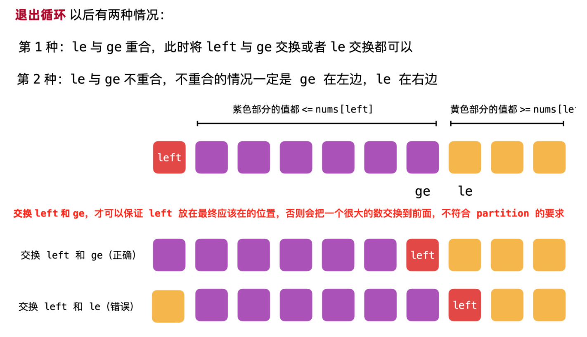

## [215. 数组中的第K个最大元素](https://leetcode.cn/problems/kth-largest-element-in-an-array/)

```java
class Solution {
    public final static Random random = new Random();

    public int findKthLargest(int[] nums, int k) {
        int n = nums.length;
        int target = n - k;

        int left = 0;
        int right= n-1;
        while(true){
            int pivotIndex = partition(nums,left,right);
            if(pivotIndex == target)
                return nums[pivotIndex];
            else if(pivotIndex < nums.length-k)
                left = pivotIndex+1;
            else
                right = pivotIndex-1;
        }
    }  

    public int partition(int[] nums,int left, int right){
        int randomIndex = left + random.nextInt(right-left+1);
        swap(nums,left,randomIndex);

        int pivot = nums[left];
        int le = left+1;
        int ge = right;

        while(true){
            while(le <= ge && nums[le] < pivot) le++;
            while(le <= ge && nums[ge] > pivot) ge--;
            if(le >= ge) break;
            swap(nums,le,ge);
            le++;
            ge--;
        }   
        swap(nums,left,ge);
        return ge;
    }

    public void swap(int[] nums,int left,int right){
        int temp = nums[left];
        nums[left] = nums[right];
        nums[right] = temp;
    }

}
```

## [归并排序](https://leetcode.cn/problems/sort-an-array/)

```java
class Solution {
    public int[] sortArray(int[] nums) {
        return megerSort(nums,0,nums.length-1);
    }

    public int[] megerSort(int[] nums,int left,int right){
        if(left == right) return new int[]{nums[left]};

        int mid = left + (right-left)/2;

        int[] a = megerSort(nums,left,mid);
        int[] b = megerSort(nums,mid+1,right);

        return merge(a,b);
    }

    public int[] merge(int[] left,int[] right){
        int[] res = new int[left.length+right.length];
        
        int i = 0;
        int j = 0;
        int k = 0;
        while(i < left.length && j < right.length){
            if(left[i] <= right[j]) res[k++] = left[i++];
            else res[k++] = right[j++];
        }

        while(i < left.length)
            res[k++] = left[i++];
        while(j < right.length)
            res[k++] = right[j++];
        
        return res;
    }
}
```

## [148. 排序链表](https://leetcode.cn/problems/sort-list/)

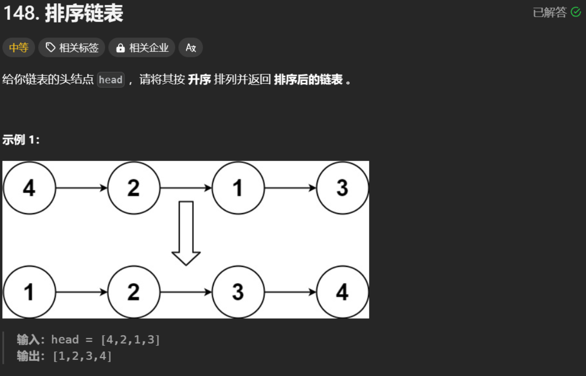

```java
class Solution {
    public ListNode sortList(ListNode head) {
        if(head == null || head.next == null) return head;//单个元素不用排序
        // 使用快慢指针，寻找中间节点（涉及题目《876. 链表的中间结点》）
        ListNode fast = head.next,slow = head;
        while(fast != null && fast.next != null){
            fast = fast.next.next;
            slow = slow.next;
        }
        ListNode p = slow.next;
        slow.next = null;

        ListNode left =  sortList(head);
        ListNode right = sortList(p);
        // 合并有序链表（涉及题目《21. 合并两个有序链表》）
        return merge(left,right);
    }
    public ListNode merge(ListNode left,ListNode right){
        ListNode dummy = new ListNode();
        ListNode cur = dummy;
        while(left != null && right != null){
            if(left.val < right.val){
                cur.next = left;
                left = left.next;
            }else{
                cur.next = right;
                right = right.next;
            }
            cur = cur.next;
        }
        if(left != null){
            cur.next = left;
        }else{
            cur.next = right;
        }

        return dummy.next;
    }
}
```

# DFS

## [200. 岛屿数量](https://leetcode.cn/problems/number-of-islands/)

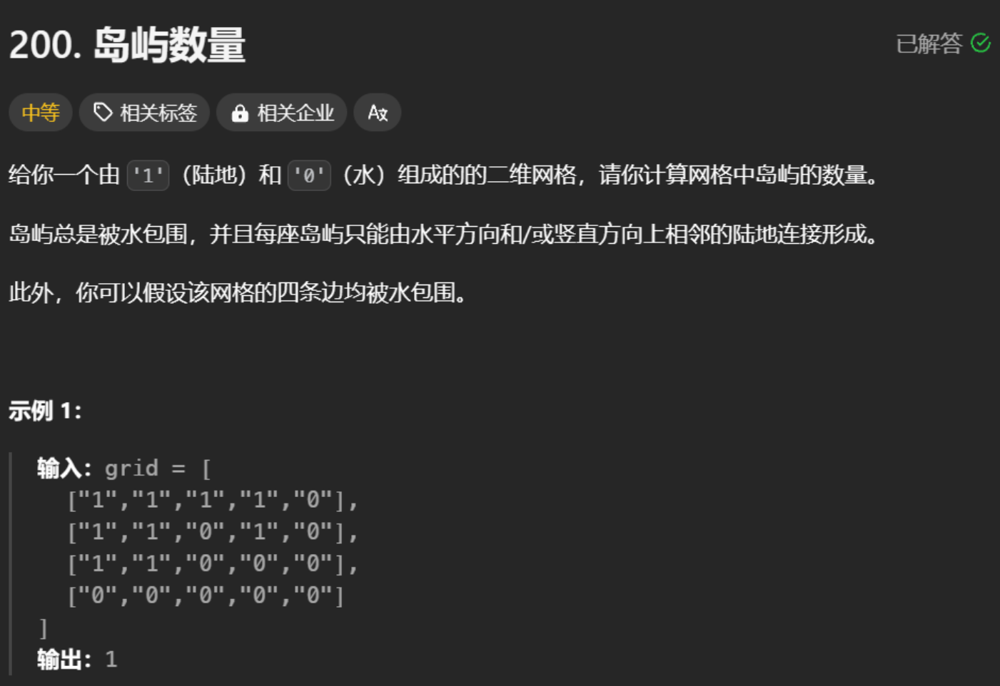

```java
class Solution {
    public int numIslands(char[][] grid) {
        int count = 0;        
        for(int i = 0; i < grid.length; i++){
            for(int j = 0; j < grid[0].length; j++){
                if(grid[i][j] == '1'){
                    dfs(grid,i,j);
                    count++;
                }
            }
        }
        return count;
    }

    public void dfs(char[][] grid,int i, int j){
        if(i<0||j<0||i==grid.length||j==grid[0].length||grid[i][j] == '0') return;
        grid[i][j] = '0';
        dfs(grid,i-1,j);
        dfs(grid,i+1,j);
        dfs(grid,i,j-1);
        dfs(grid,i,j+1);
    }
}
```

## [79. 单词搜索](https://leetcode.cn/problems/word-search/)

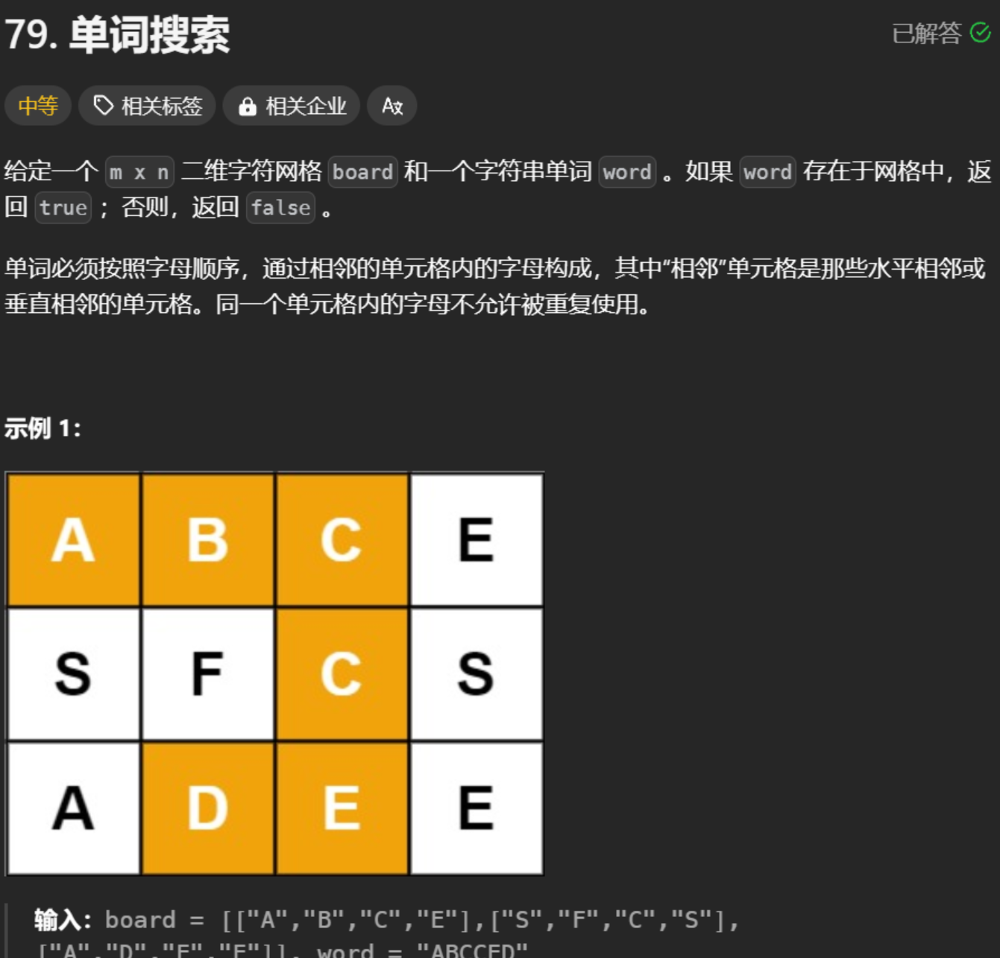

```java
class Solution {
    int m;
    int n;
    public boolean exist(char[][] board, String word) {
        m = board.length;
        n = board[0].length;

        for(int i = 0; i < m; i++){
            for(int j = 0; j < n; j++)
                if(dfs(board,word,i,j,0))
                    return true;
        }

        return false;
    }


    public boolean dfs(char[][] board, String word,int i,int j,int index){
        if(i < 0 || j < 0 || i >= m || j >= n || word.charAt(index) != board[i][j]) return false;
        if(index == word.length()-1) return true;

        board[i][j] = '\0';

        if(dfs(board,word,i-1,j,index+1) ||
            dfs(board,word,i+1,j,index+1) ||
            dfs(board,word,i,j-1,index+1) ||
            dfs(board,word,i,j+1,index+1))
            return true;
        board[i][j] = word.charAt(index);

        return false;
    }
}
```

## [399. 除法求值](https://leetcode.cn/problems/evaluate-division/)

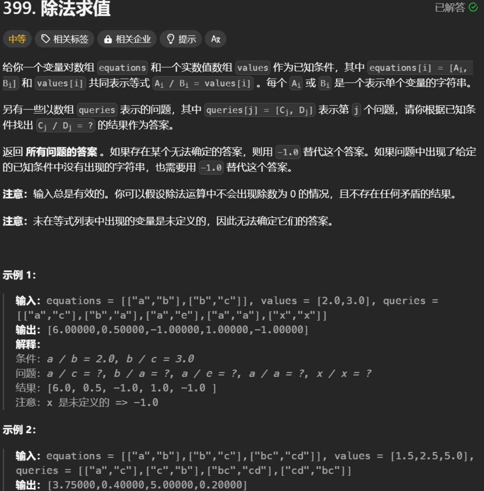

```java
class Solution {
    // 记录边 String是起始节点 Map<String,Double>是到达节点和值
    Map<String,Map<String,Double>> edge = new HashMap<>();
    // 记录访问过的字符串
    Set<String> visited = new HashSet<>();
    // 记录结果
    double[] res;
    public double[] calcEquation(List<List<String>> equations, double[] values, List<List<String>> queries) {
        // 存储边
        for(int i = 0; i < equations.size(); i++){

            String u = equations.get(i).get(0);
            String v = equations.get(i).get(1);

            Map<String,Double> valueU = edge.getOrDefault(u,new HashMap<>());
            Map<String,Double> valueV = edge.getOrDefault(v,new HashMap<>());

            valueU.put(v,values[i]);
            valueV.put(u,1/values[i]);

            edge.put(u,valueU);
            edge.put(v,valueV);
        }
        // 初始化结果数组
        res = new double[queries.size()];
        Arrays.fill(res,-1);
        for(int i = 0; i < queries.size(); i++){
            dfs(queries.get(i).get(0),queries.get(i).get(1),1,i);
            // 重置visited,别忘了！！！
            visited.clear();
        }
        return res;
    }

    public void dfs(String start,String end,double mul,int index){
        visited.add(start);

        if(edge.containsKey(start)){
            if(start.equals(end)){
                // 访问到目的节点时，更新res数组
                res[index] = mul;
                return;
            }
            // 获取当前节点对应的哈希表
            Map<String,Double> value = edge.get(start);
            for(String next : value.keySet()){
                // 对没有访问过的节点进行访问
                if(!visited.contains(next))
                    dfs(next,end,mul*value.get(next),index);
            }
        }
    }
}
```

## [LCR 130. 衣橱整理](https://leetcode.cn/problems/ji-qi-ren-de-yun-dong-fan-wei-lcof/)

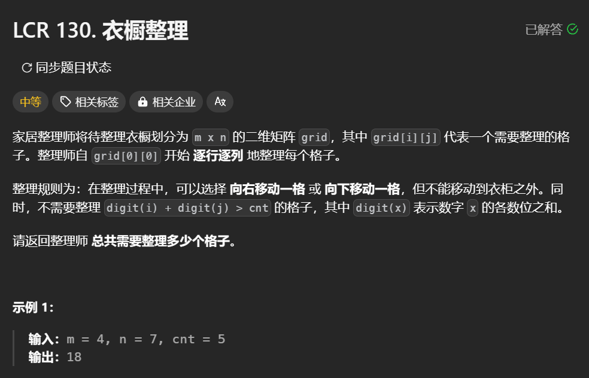

```java
class Solution {
    boolean[][] used;
    int m;
    int n;
    int count;
    int cnt;
    public int wardrobeFinishing(int _m, int _n, int _cnt) {
        m = _m;
        n = _n;
        cnt = _cnt;
        count = 0;
        used = new boolean[m][n];
        dfs(0,0);
        return count;    
    }

    public void dfs(int i,int j){
        if(i < 0 || i >= m || j < 0 || j >= n ) return;
        if(count(i) + count(j) > cnt || used[i][j]) return;
        count++;
        used[i][j] = true;
        dfs(i-1,j);
        dfs(i+1,j);
        dfs(i,j-1);
        dfs(i,j+1);
    }

    public int count(int x){
        int cnt = 0;
        while(x > 0){
            cnt += x % 10;
            x = x / 10;
        }
        return cnt;
    }
}
```

# 二进制

## 十进制和二进制的转换

10->2

```java
import java.util.*;
public class Main{
    public static void main(String[] args){
        Scanner in = new Scanner(System.in);
        int n = in.nextInt();
        
        List<Integer> list = new ArrayList<>();
        while(n > 0){
            int k = n % 2;
            n = n / 2;
            list.add(0,k);
        }
        for(int i = 0; i < list.size(); i++){
            System.out.print(list.get(i));
        }
    }
}
```

2->10

```java

```

## [461. 汉明距离](https://leetcode.cn/problems/hamming-distance/)

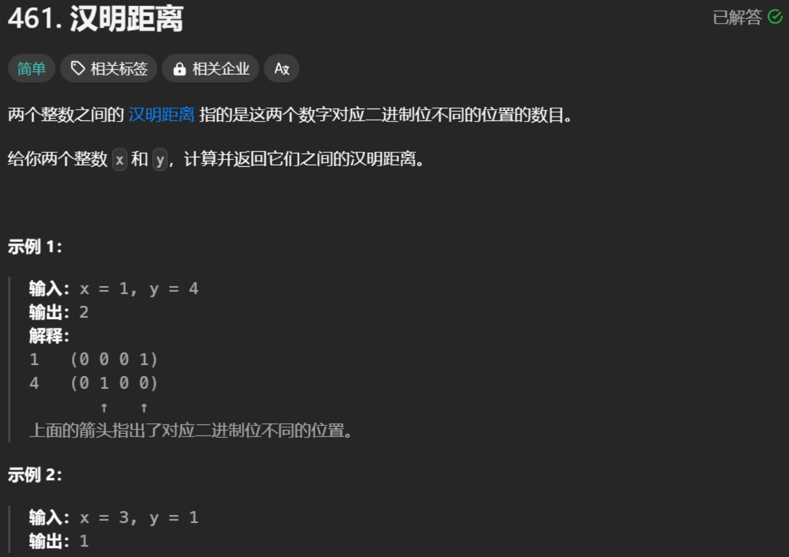

```java
class Solution {
    public int hammingDistance(int x, int y) {
        int count = 0;
        for(int i = 0; i < 32; i++){
            int a = x >> i & 1,b = y >> i & 1;
            count += a^b;
        }
        return count;
    }
}
```

## [LCR 133. 位 1 的个数](https://leetcode.cn/problems/er-jin-zhi-zhong-1de-ge-shu-lcof/)

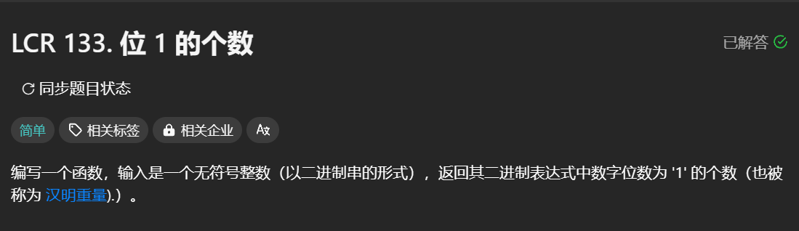

```java
public class Solution {
    public int hammingWeight(int n) {
        int count = 0;
        for(int i = 0; i < 32; i++){
            count += n >> i & 1;
        }
        return count;
    }
}
```

## [LCR 134. Pow(x, n)](https://leetcode.cn/problems/shu-zhi-de-zheng-shu-ci-fang-lcof/)


```java

```

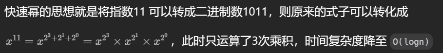

# 其他

## [208. 实现 Trie (前缀树)](https://leetcode.cn/problems/implement-trie-prefix-tree/)

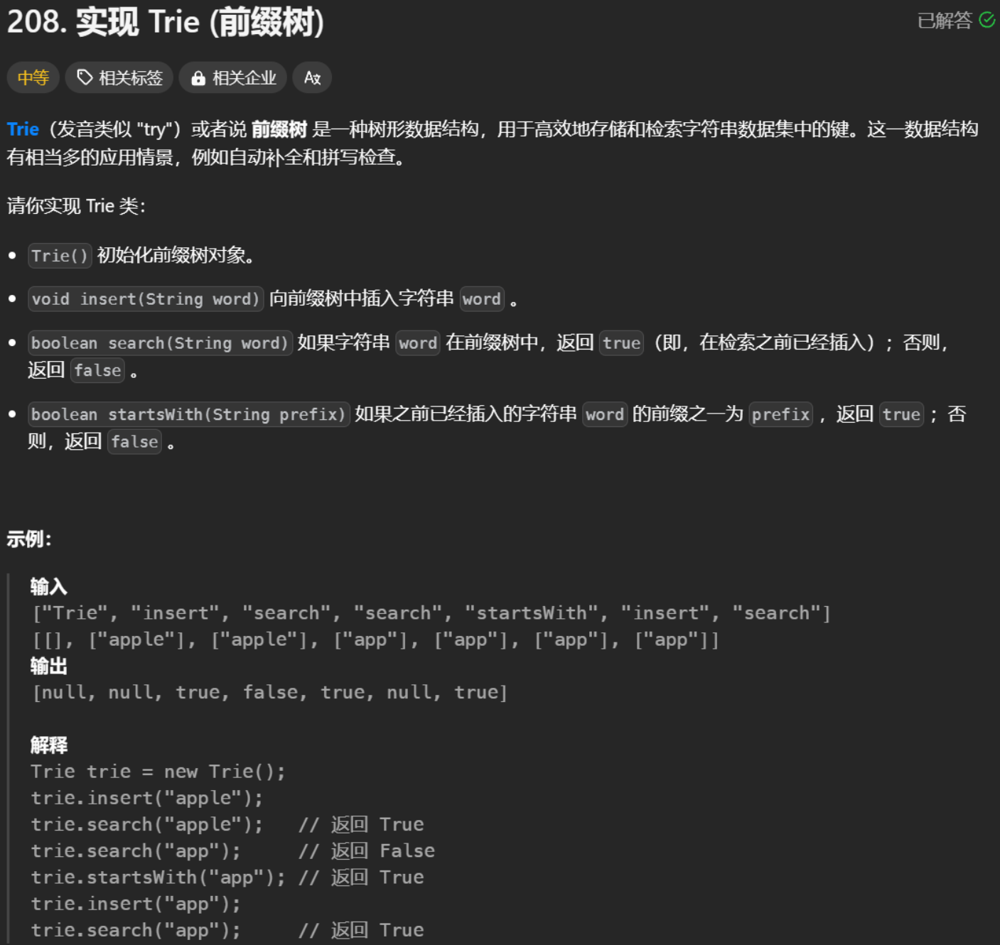

```java
class Node{
    Node[] children;
    boolean isEnd;
    public Node(){
        children = new Node[26];
        isEnd = false;
    }
}

class Trie {
    Node root;

    public Trie() {
        root = new Node();
    }
    
    public void insert(String word) {
        Node node = root;
        for(int i = 0; i < word.length(); i++){
            int c = word.charAt(i) - 'a';
            if(node.children[c] == null)
                node.children[c] = new Node();
            node = node.children[c];
        }
        node.isEnd = true;
    }
    
    public boolean search(String word) {
        Node node = root;
        for(int i = 0; i < word.length(); i++){
            int c = word.charAt(i) - 'a';
            if(node.children[c] == null)
                return false;
            node = node.children[c];
        }
        return node.isEnd == true;
    }
    
    public boolean startsWith(String prefix) {
        Node node = root;
        for(int i = 0; i < prefix.length(); i++){
            int c = prefix.charAt(i) - 'a';
            if(node.children[c] == null)
                return false;
            node = node.children[c];
        }
        return true;
    }
}
```

## [146. LRU 缓存](https://leetcode.cn/problems/lru-cache/)

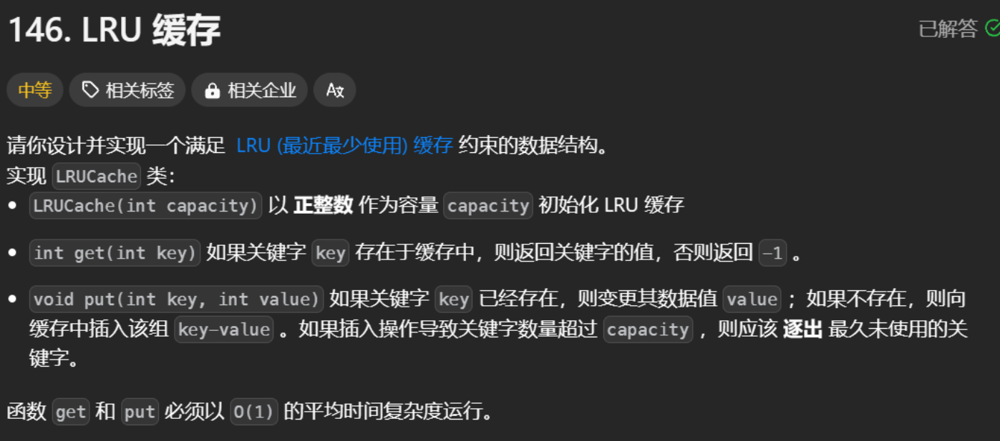

```java
//定义Node节点
class Node{
    int key;
    int value;
    Node pre;
    Node next;
    Node(int key,int value){
        this.key = key;
        this.value = value;
    }
}

class LRUCache {
    Node head;//增加两个哨兵节点减少判空
    Node tail;
    Map<Integer,Node> map;
    int capacity;
    public LRUCache(int capacity) {
        this.capacity = capacity;
        map = new HashMap<>(); 
        head = new Node(-1,-1);
        tail = new Node(-1,-1);
        head.next = tail;
        tail.pre = head;
    }
    
    public int get(int key) {
        if(map.containsKey(key)){
            Node node = map.get(key);
            refresh(node);
            return node.value;
        }
        return -1;
    }
    
    public void put(int key, int value) {
        Node node = null;
        if(map.containsKey(key)){
            node = map.get(key);
            node.value = value;
        }else{
            if(map.size() == capacity){
                node = tail.pre;
                map.remove(node.key);
                delete(node);
            }
            node = new Node(key,value);
            map.put(key,node);
        }
        refresh(node);
    }

    // refresh 操作分两步：
    // 1. 先将当前节点从双向链表中删除（如果该节点本身存在于双向链表中的话）
    // 2. 将当前节点添加到双向链表头部
    public void refresh(Node node){
        delete(node);
        node.next = head.next;
        head.next.pre = node;
        node.pre = head;
        head.next = node;
    }
    // 由于我们预先建立 head 和 tail 两位哨兵，
    //因此如果 node.pre 不为空，则代表了 node 本身存在于双向链表（不是新节点）
    public void delete(Node node){
        if(node.pre != null){
            node.pre.next = node.next;
            node.next.pre = node.pre;
        }
    }
}
```

# 进度

今日进度：


昨天没做出来：

[LCR 130. 衣橱整理](https://leetcode.cn/problems/ji-qi-ren-de-yun-dong-fan-wei-lcof/)

[LCR 134. Pow(x, n)](https://leetcode.cn/problems/shu-zhi-de-zheng-shu-ci-fang-lcof/)


# 剑指没做出来的题

[LCR 120. 寻找文件副本](https://leetcode.cn/problems/shu-zu-zhong-zhong-fu-de-shu-zi-lcof/)

[LCR 128. 库存管理 I](https://leetcode.cn/problems/xuan-zhuan-shu-zu-de-zui-xiao-shu-zi-lcof/)

[LCR 130. 衣橱整理](https://leetcode.cn/problems/ji-qi-ren-de-yun-dong-fan-wei-lcof/)

[LCR 134. Pow(x, n)](https://leetcode.cn/problems/shu-zhi-de-zheng-shu-ci-fang-lcof/)


