#  不常用API

## HashMap

hashmap如何判断是否包含某一个元素？一定注意时containsKey()

```java
HashMap<Integer, String> map = new HashMap<>();
map.put(1, "one");
map.put(2, "two");

if (map.containsKey(1)) {
    System.out.println("Map contains key 1.");
}
```

hashmap获取值，如果不存在就为默认值

```java
map.put(sum, map.getOrDefault(sum, 0) + 1);
```

hashmap遍历

```java
for(Integer key : map.keySet()){
    int[] arr = new int[2];
    arr[0] = key;
    arr[1] = map.get(key);
    queue.offer(arr);
}
```

## 字符串

如何去除字符串前后的空格？

```java
s.trim()
```

## 堆栈

栈的使用

```java
Stack<Integer> a = new Stack<>();
a.push(x);
a.pop();
a.peek();
```

队列的使用

```java
LinkedList<Integer> queue = new LinkedList<>();
queue1.offer(x);
queue1.poll();
queue1.peek();
```

## 队列

优先级队列使用

```java
PriorityQueue<int[]> queue = new PriorityQueue<>((o1,o2) -> o2[1] - o1[1]);
```


# Java Scanner 类

## **读取字符串**

```java
import java.util.Scanner;
public class Main {
    public static void main(String[] args) {

        Scanner scanner = new Scanner(System.in);
        //读取一行字符串，包括空格。
        String name = scanner.nextLine();
        System.out.println(name);

        //读取下一个单词（以空格或换行符分隔）。
        String s = scanner.next();
        System.out.println(s);
        
    }
}
```

## **读取基本类型**

```java
import java.util.Scanner;
public class Main {
    public static void main(String[] args) {

        Scanner scanner = new Scanner(System.in);
        //nextInt()：读取一个整数。
        int a = scanner.nextInt();
        System.out.println(a);
        //nextDouble()：读取一个双精度浮点数。
        double b = scanner.nextDouble();
        System.out.println(b);
        //nextBoolean()：读取一个布尔值。
        boolean c = scanner.nextBoolean();
        System.out.println(c);
        
    }
}
```

## 分隔符

### 默认分隔符

Scanner类默认使用空白字符（如空格、制表符、换行符等）作为分隔符。这意味着next()方法会读取下一个以空白字符分隔的单词。

你可以使用`useDelimiter()`方法来自定义分隔符。

### **自定义分隔符**

你可以使用`useDelimiter()`方法来自定义分隔符。

```java
import java.util.Scanner;
public class Main {
    public static void main(String[] args) {

        Scanner scanner = new Scanner(System.in);
        scanner.useDelimiter(",");

        while(scanner.hasNext()) {
            int a = scanner.nextInt();
            System.out.println(a);
        }

    }
}
```

## **获取整型数组**

```java
import java.util.Scanner;
public class Main {
    public static void main(String[] args) {

        Scanner scanner = new Scanner(System.in);
        String str = scanner.nextLine();
        String[] s = str.split(",");
        int[] nums= new int[s.length];
        for(int i=0;i<s.length;i++){
            nums[i]= Integer.parseInt(s[i]);
        }
    }
}
```

## [A+B(1)](https://ac.nowcoder.com/acm/contest/5652/A)

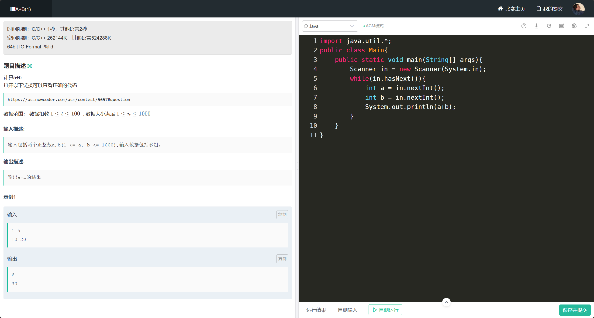

## [A+B(2)](https://ac.nowcoder.com/acm/contest/5652/B)

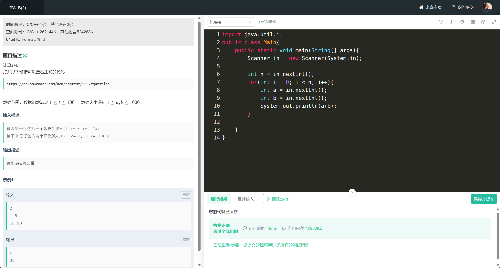

## [A+B(3)](https://ac.nowcoder.com/acm/contest/5652/C)

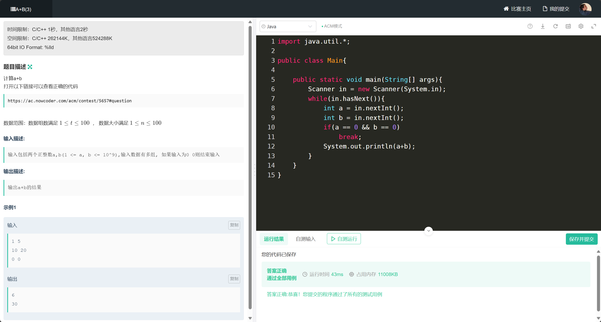

## [A+B(4)](https://ac.nowcoder.com/acm/contest/5652/D)


# 数组

## 704. 二分查找

https://leetcode.cn/problems/binary-search/

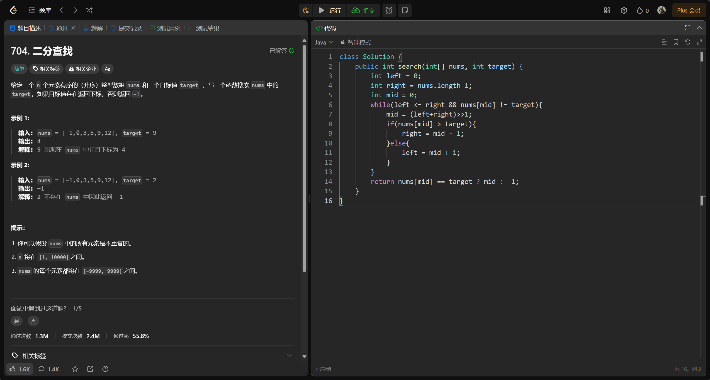

```java
class Solution {
    public int search(int[] nums, int target) {
        int left = 0;
        int right = nums.length-1;
        int mid = 0;
        while(left <= right && n·ums[mid] != target){
            mid = (left+right)>>1;
            if(nums[mid] > target){
                right = mid - 1;
            }else{
                left = mid + 1;
            }
        }
        return nums[mid] == target ? mid : -1;
    }
}
```

##  27. 移除元素

[27. 移除元素 - 力扣（LeetCode）](https://leetcode.cn/problems/remove-element/description/)


```java
class Solution {
    public int removeElement(int[] nums, int val) {
        int left = 0;
        int right = 0;
        for(; right < nums.length; right++){
            if(nums[right] != val) nums[left++] = nums[right];
        }
        return left;
    }
}
```

快慢指针法

## 977.有序数组的平方

[977. 有序数组的平方 - 力扣（LeetCode）](https://leetcode.cn/problems/squares-of-a-sorted-array/)


```java
class Solution {
    public int[] sortedSquares(int[] nums) {
        int left = 0;
        int right = nums.length-1;
        int[] arr = new int[nums.length];
        int k = nums.length-1;
        while(left <= right){
            if(nums[left] * nums[left] > nums[right] * nums[right]){
                arr[k--] = nums[left] * nums[left];
                left++;
            }else{
                arr[k--] = nums[right] * nums[right];
                right--;
            }
        }
        return arr;
    }
}
```

双指针法，两边指针

##  209.长度最小的子数组

[209. 长度最小的子数组](https://leetcode.cn/problems/minimum-size-subarray-sum/)


```java
class Solution {
    public int minSubArrayLen(int target, int[] nums) {
        int left = 0;
        int sum = 0;
        int count = Integer.MAX_VALUE;

        for(int right = 0; right < nums.length; right++){
            sum += nums[right];
            while(sum >= target && left <= right){
                count = Math.min(right - left + 1,count);
                sum-=nums[left];
                left++;
            }
        }

        return count == Integer.MAX_VALUE ? 0 : count;
    }
}
```

快慢指针，for循环的快指针嵌套while循环的慢指针

## 59.螺旋矩阵II

[59. 螺旋矩阵 II - 力扣（LeetCode）](https://leetcode.cn/problems/spiral-matrix-ii/description/)

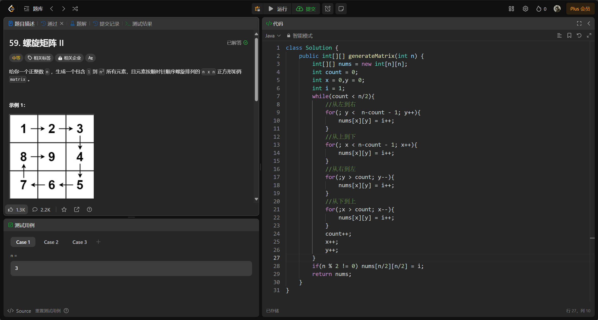

```java
class Solution {
    public int[][] generateMatrix(int n) {
        int[][] nums = new int[n][n];
        int count = 0;
        int x = 0,y = 0;
        int i = 1;
        while(count < n/2){
            //从左到右
            for(; y <  n-count - 1; y++){
                nums[x][y] = i++;
            }
            //从上到下
            for(; x < n-count - 1; x++){
                nums[x][y] = i++;
            }
            //从右到左
            for(;y > count; y--){
                nums[x][y] = i++;
            }
            //从下到上
            for(;x > count; x--){
                nums[x][y] = i++;
            }
            count++;
            x++;
            y++;
        }
        if(n % 2 != 0) nums[n/2][n/2] = i;
        return nums;
    }
}
```

一定要注意，第一个循环x不动，y增加，因为这个问题耽误了很久时间！！！

# 链表

## 203.移除链表元素

[203. 移除链表元素 - 力扣（LeetCode）](https://leetcode.cn/problems/remove-linked-list-elements/description/)


## 707.设计链表


```java
class ListNode{
    int val;
    ListNode next;
}

class MyLinkedList {
    int len = 0;
    ListNode head;//虚拟头节点

    public MyLinkedList() {
        head = new ListNode();
    }
    
    public int get(int index) {
        if(index > len - 1) return -1;
        ListNode p = head.next;
        for(int i = 0; i < index; i++){
            p = p.next;
        }
        return p.val;
    }
    
    public void addAtHead(int val) {
        ListNode s = new ListNode();
        s.val = val;
        s.next = head.next;
        head.next = s;
        len++;
    }
    
    public void addAtTail(int val) {
        ListNode p = head.next;
        for(int i = 0; i < len-1; i++){
            p = p.next;
        }
        ListNode s = new ListNode();
        s.val = val;
        p.next = s;
        len++;
    }
    
    public void addAtIndex(int index, int val) {
        if(index > len - 1) return;
        ListNode s = new ListNode();
        s.val = val;
        ListNode p = head.next;
        for(int i = 0; i < index - 1; i++){
            p = p.next;
        }
        s.next = p.next;
        p.next = s;
        len++;
    }
    
    public void deleteAtIndex(int index) {
        if(index > len - 1) return;
        ListNode p = head.next;
        for(int i = 0; i < index - 1; i++){
            p = p.next;
        }
        p.next = p.next.next;
        len--;
    }
}
```

注意要设置一个虚拟头节点

##  206.反转链表

[206. 反转链表 - 力扣（LeetCode）](https://leetcode.cn/problems/reverse-linked-list/description/)


```java
class Solution {
    public ListNode reverseList(ListNode head) {
        if(head == null || head.next == null) return head;
        ListNode p = head;
        ListNode q = head.next;
        ListNode r;
        p.next = null;//防止第一个节点成环
        while(q != null){
            r = q.next;
            q.next = p;
            p = q;
            q = r;
        }
        return p;
    }
}
```

三个节点，前两个节点反转指针，最后一个节点记录q的下一个节点位置

## 24. 两两交换链表中的节点

[24. 两两交换链表中的节点 - 力扣（LeetCode）](https://leetcode.cn/problems/swap-nodes-in-pairs/description/)


```java
class Solution {
    public ListNode swapPairs(ListNode head) {
        if(head == null || head.next == null) return head;
        ListNode xuniHead = new ListNode();
        xuniHead.next = head;
        ListNode q;
        ListNode p = xuniHead;
        while(p.next!=null && p.next.next!=null){
            q = p.next;
            p.next = q.next;
            q.next = p.next.next;
            p.next.next = q;

            p = q;
        }

        return xuniHead.next;
    }
}
```

创建一个虚拟头，加双指针，会方便许多

## 19.删除链表的倒数第N个节点

[19. 删除链表的倒数第 N 个结点 - 力扣（LeetCode）](https://leetcode.cn/problems/remove-nth-node-from-end-of-list/description/)

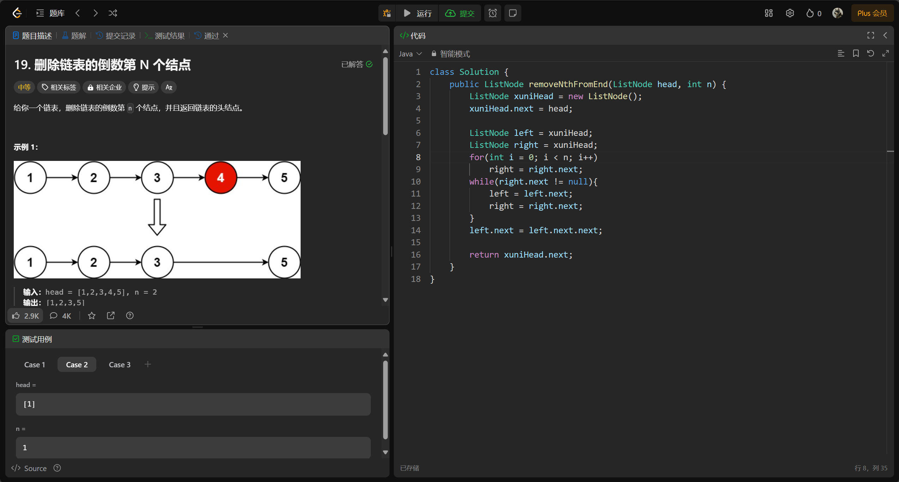

```java
class Solution {
    public ListNode removeNthFromEnd(ListNode head, int n) {
        ListNode xuniHead = new ListNode();
        xuniHead.next = head;

        ListNode left = xuniHead;
        ListNode right = xuniHead;
        for(int i = 0; i < n; i++)
            right = right.next;
        while(right.next != null){
            left = left.next;
            right = right.next;
        }
        left.next = left.next.next;

        return xuniHead.next;
    }
}
```

设置虚拟头，然后快慢指针法，快指针先移动n次

## 面试题 02.07. 链表相交

[面试题 02.07. 链表相交 - 力扣（LeetCode）](https://leetcode.cn/problems/intersection-of-two-linked-lists-lcci/description/)

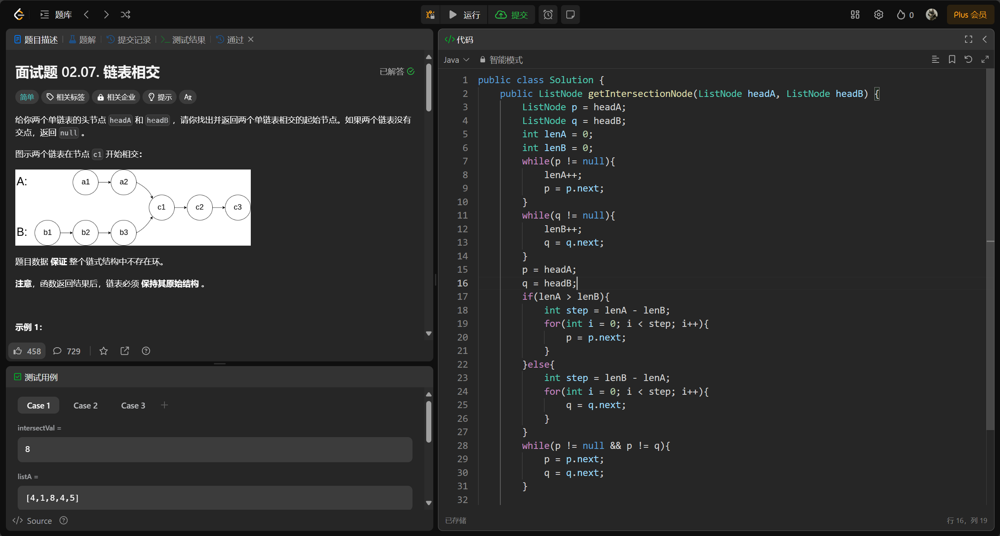

```java
public class Solution {
    public ListNode getIntersectionNode(ListNode headA, ListNode headB) {
        ListNode p = headA;
        ListNode q = headB;
        int lenA = 0;
        int lenB = 0;
        while(p != null){
            lenA++;
            p = p.next;
        }
        while(q != null){
            lenB++;
            q = q.next;
        }
        p = headA;
        q = headB;
        if(lenA > lenB){
            int step = lenA - lenB;
            for(int i = 0; i < step; i++){
                p = p.next;
            }
        }else{
            int step = lenB - lenA;
            for(int i = 0; i < step; i++){
                q = q.next;
            }
        }
        while(p != null && p != q){
            p = p.next;
            q = q.next;
        }
        
        return p == q ? p : null;
    }
}
```

先计算长度，比较长的链表先走step次。

##  ⭐142.环形链表II

[142. 环形链表 II - 力扣（LeetCode）](https://leetcode.cn/problems/linked-list-cycle-ii/description/)


```java
public class Solution {
    public ListNode detectCycle(ListNode head) {
        ListNode fast = head, slow = head;
        while (true) {
            if (fast == null || fast.next == null) return null;
            fast = fast.next.next;
            slow = slow.next;
            if (fast == slow) break;
        }
        //一言以蔽之，相遇之处和链表头距离环入口距离相等
        fast = head;
        while (slow != fast) {
            slow = slow.next;
            fast = fast.next;
        }
        return fast;
    }
}

```

快指针一次走两步，慢指针一次走一步，到达相遇点以后，有一个指针回到头节点，然后两个指针同时往下走，相遇点就是入口。

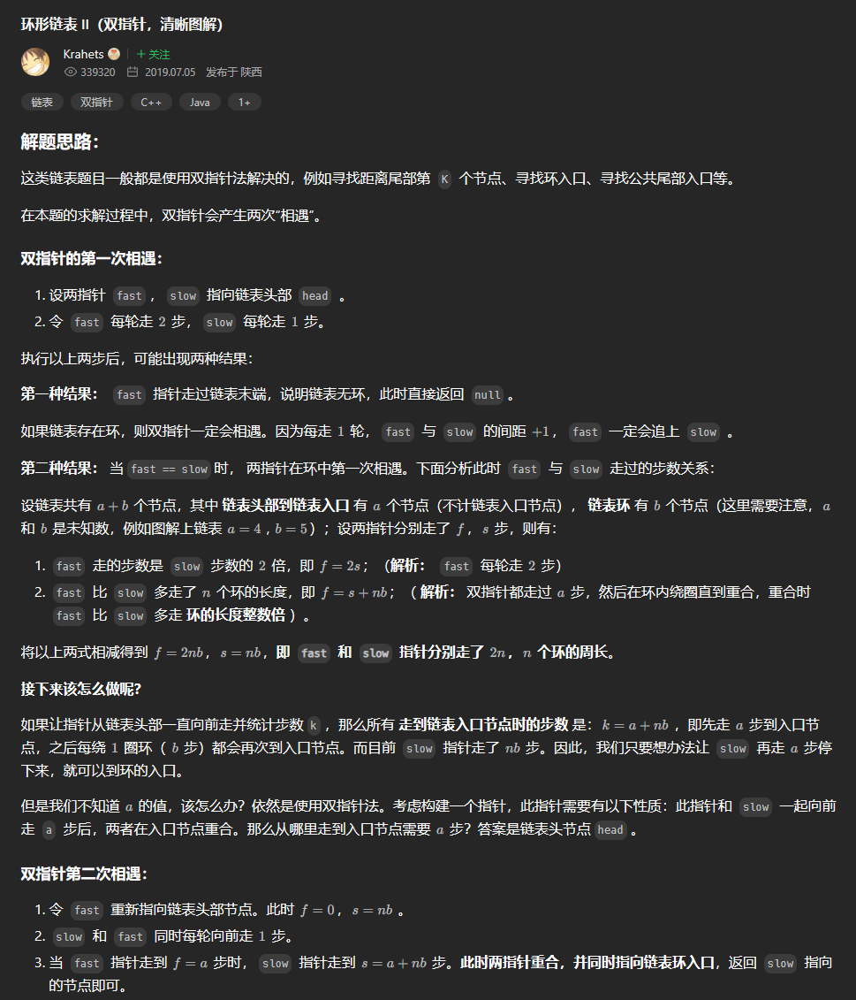

一言以蔽之，相遇之处和链表头距离环入口距离相等

# 哈希表

## 242.有效的字母异位词

[242. 有效的字母异位词 - 力扣（LeetCode）](https://leetcode.cn/problems/valid-anagram/description/)


```java
class Solution {
    public boolean isAnagram(String s, String t) { 
        if(s.length() != t.length()) return false;

        char[] nums = new char[26];
        for(int i = 0; i < s.length(); i++){
            nums[s.charAt(i) - 'a']++;
        }
        for(int i = 0; i < s.length(); i++){
            nums[t.charAt(i) - 'a']--;
        }
        for(int i = 0; i < 26; i++){
            if(nums[i] != 0) return false;
        }
        return true;
    }
}
```

三个循环解决问题，用一个字母数组存放每个字母个数。

##  349. 两个数组的交集

[349. 两个数组的交集 - 力扣（LeetCode）](https://leetcode.cn/problems/intersection-of-two-arrays/description/)

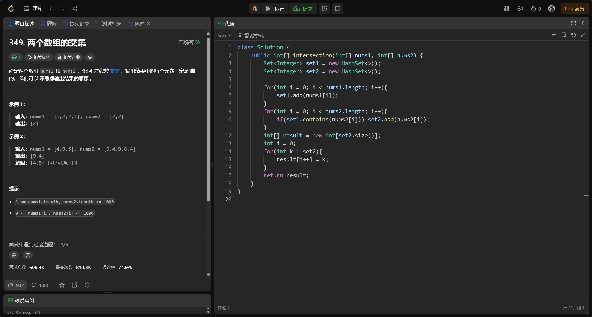

```java
class Solution {
    public int[] intersection(int[] nums1, int[] nums2) {
        Set<Integer> set1 = new HashSet<>();
        Set<Integer> set2 = new HashSet<>();

        for(int i = 0; i < nums1.length; i++){
            set1.add(nums1[i]);
        }
        for(int i = 0; i < nums2.length; i++){
            if(set1.contains(nums2[i])) set2.add(nums2[i]);
        }
        int[] result = new int[set2.size()];
        int i = 0;
        for(int k : set2){
            result[i++] = k;
        }
        return result;
    }
}
```

使用两个set，第一个用于存放数组1，第二个用于遍历数组2的时候判断是否时交集，是的话就放第二个set中

## 第202题. 快乐数

[202. 快乐数 - 力扣（LeetCode）](https://leetcode.cn/problems/happy-number/description/)

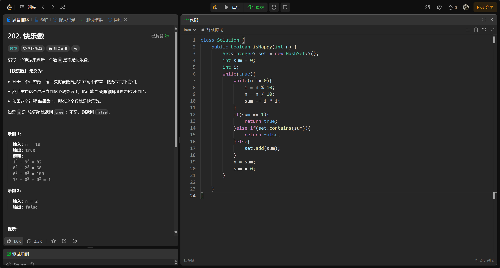

```java
class Solution {
    public boolean isHappy(int n) {
        Set<Integer> set = new HashSet<>();
        int sum = 0;
        int i;
        while(true){
            while(n != 0){
                i = n % 10;
                n = n / 10;
                sum += i * i;
            }
            if(sum == 1){
                return true;
            }else if(set.contains(sum)){
                return false;
            }else{
                set.add(sum);
            }
            n = sum;
            sum = 0;
        }

    }
}
```

这道题的关键在于，在循环求sum过程中，一旦重复说明必定不是快乐数，所以可以把循环过程中的sum放入set中，以后判断是否重复，用两个while循环判断，外循环判断sum，内循环计算sum。

## 1. 两数之和

[1. 两数之和 - 力扣（LeetCode）](https://leetcode.cn/problems/two-sum/description/)

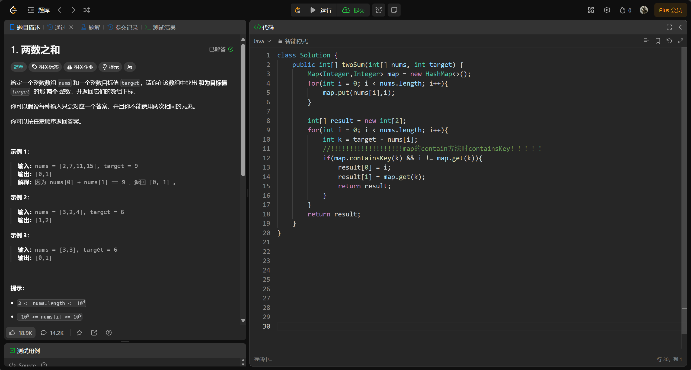

```java
class Solution {
    public int[] twoSum(int[] nums, int target) {
        Map<Integer,Integer> map = new HashMap<>();
        for(int i = 0; i < nums.length; i++){
            map.put(nums[i],i);
        }

        int[] result = new int[2];
        for(int i = 0; i < nums.length; i++){
            int k = target - nums[i];
            //!!!!!!!!!!!!!!!!!!!map的contain方法是containsKey！！！！！
            if(map.containsKey(k) && i != map.get(k)){
                result[0] = i;
                result[1] = map.get(k);
                return result;
            }
        }
        return result;
    }
}
```

用一个HashMap，key是数字，value是下标，一定注意map的contain方法是containsKey！！！！！

## 第454题.四数相加II

[454. 四数相加 II - 力扣（LeetCode）](https://leetcode.cn/problems/4sum-ii/description/)

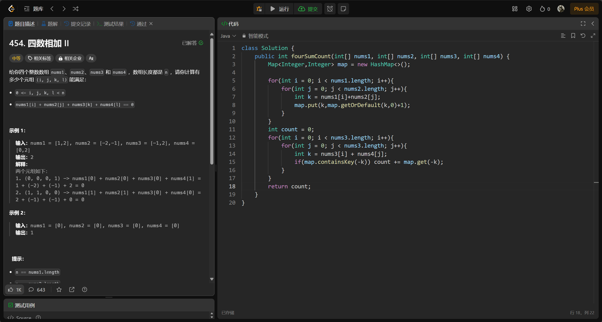

前两个数放到map中，key是两数值和，value是次数。两个双层循环。

## 383. 赎金信

[383. 赎金信 - 力扣（LeetCode）](https://leetcode.cn/problems/ransom-note/description/)

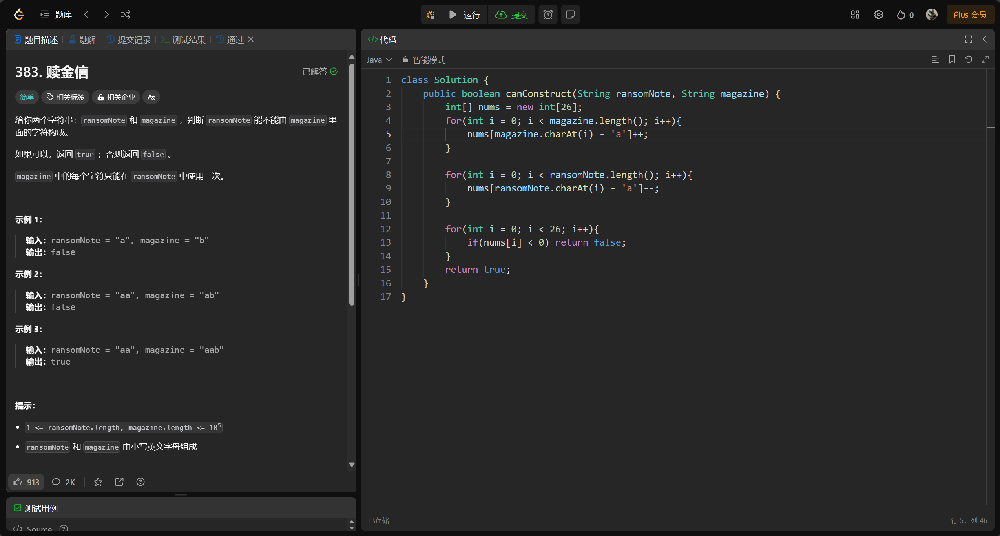

```java
class Solution {
    public boolean canConstruct(String ransomNote, String magazine) {
        int[] nums = new int[26];
        for(int i = 0; i < magazine.length(); i++){
            nums[magazine.charAt(i) - 'a']++;
        }

        for(int i = 0; i < ransomNote.length(); i++){
            nums[ransomNote.charAt(i) - 'a']--;
        }

        for(int i = 0; i < 26; i++){
            if(nums[i] < 0) return false;
        }
        return true;
    }
}
```

和前面有效的字母异位词很像，三次循环，第一次循环放值，第二次取值，第三次判断，因为字母固定，所以可以用int数组代替hash。

## ⭐第15题. 三数之和

[15. 三数之和 - 力扣（LeetCode）](https://leetcode.cn/problems/3sum/description/)

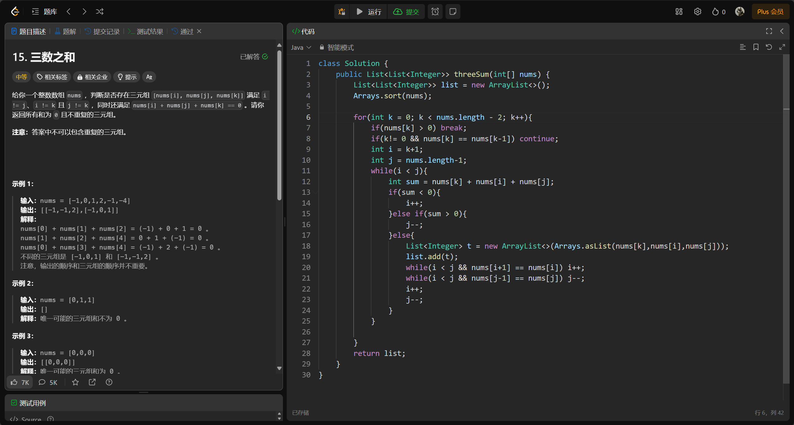

```java
class Solution {
    public List<List<Integer>> threeSum(int[] nums) {
        List<List<Integer>> list = new ArrayList<>();
        Arrays.sort(nums);

        for(int k = 0; k < nums.length - 2; k++){
            if(nums[k] > 0) break;
            if(k!= 0 && nums[k] == nums[k-1]) continue;
            int i = k+1;
            int j = nums.length-1;
            while(i < j){
                int sum = nums[k] + nums[i] + nums[j];
                if(sum < 0){
                    i++;
                }else if(sum > 0){
                    j--;
                }else{
                    List<Integer> t = new ArrayList<>(Arrays.asList(nums[k],nums[i],nums[j]));
                    list.add(t);
                    while(i < j && nums[i+1] == nums[i]) i++;
                    while(i < j && nums[j-1] == nums[j]) j--;
                    i++;
                    j--;
                }
            }

        }
        return list;
    }
}
```

三数之和，不用hash！！！用三指针法， 先排序，然后，后面两个指针往中间移动。

## ⭐第18题. 四数之和

[18. 四数之和 - 力扣（LeetCode）](https://leetcode.cn/problems/4sum/description/)

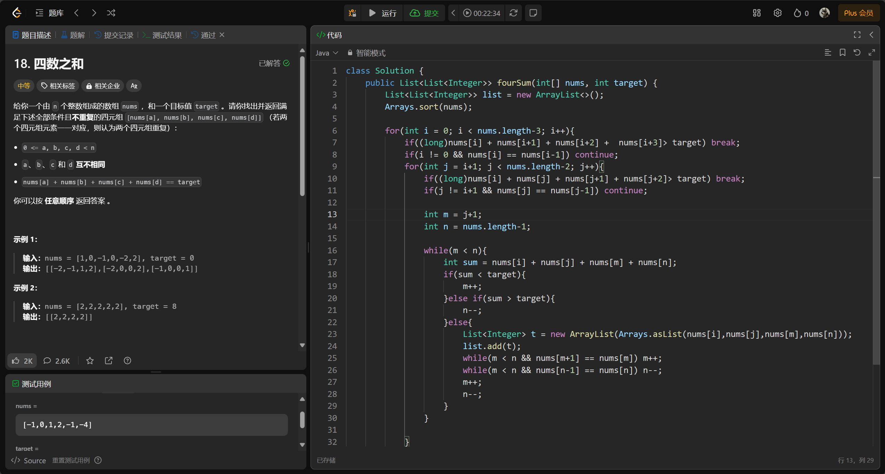

```java
class Solution {
    public List<List<Integer>> fourSum(int[] nums, int target) {
        List<List<Integer>> list = new ArrayList<>();
        Arrays.sort(nums);

        for(int i = 0; i < nums.length-3; i++){
            if((long)nums[i] + nums[i+1] + nums[i+2] + nums[i+3]> target) break;
            if(i != 0 && nums[i] == nums[i-1]) continue;
            for(int j = i+1; j < nums.length-2; j++){
                if((long)nums[i] + nums[j] + nums[j+1] + nums[j+2]> target) break;
                if(j != i+1 && nums[j] == nums[j-1]) continue;

                int m = j+1;
                int n = nums.length-1;

                while(m < n){
                    int sum = nums[i] + nums[j] + nums[m] + nums[n];
                    if(sum < target){
                        m++;
                    }else if(sum > target){
                        n--;
                    }else{
                        List<Integer> t = new ArrayList(Arrays.asList(nums[i],nums[j],nums[m],nums[n]));
                        list.add(t);
                        while(m < n && nums[m+1] == nums[m]) m++;
                        while(m < n && nums[n-1] == nums[n]) n--;
                        m++;
                        n--;
                    }
                }

            }
        }

        return list;
    }
}
```

还是用双指针法，注意！！！有几个过不了的案例，是因为超出int范围了，要转为long。

# 字符串

## 344.反转字符串

[344. 反转字符串 - 力扣（LeetCode）](https://leetcode.cn/problems/reverse-string/)


```java
class Solution {
    public void reverseString(char[] s) {
        int left = 0;
        int right = s.length-1;
        while(left < right){
            char temp = s[left];
            s[left] = s[right];
            s[right] = temp;
            left++;
            right--;
        }
    }
}
```

## ⭐541. 反转字符串II

[541. 反转字符串 II - 力扣（LeetCode）](https://leetcode.cn/problems/reverse-string-ii/description/)

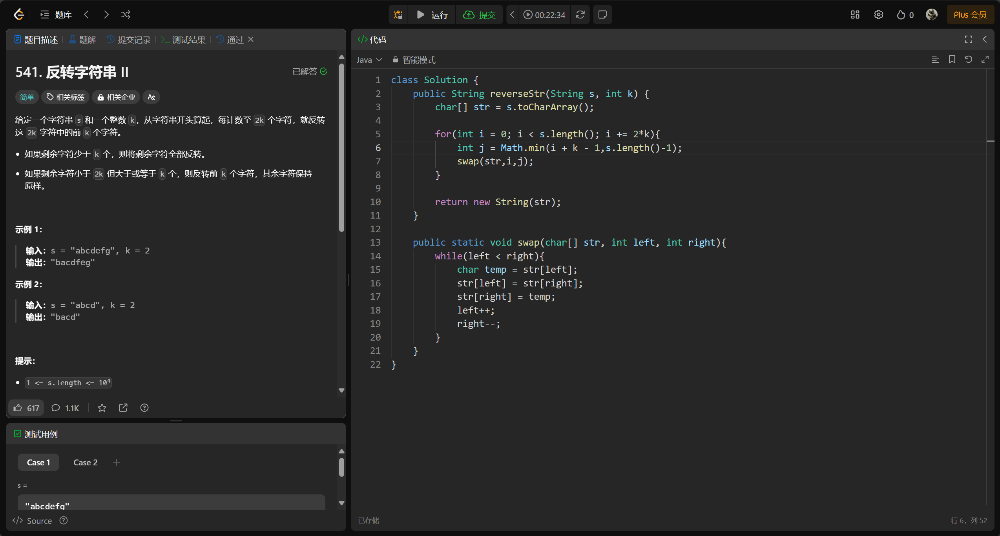

```java
class Solution {
    public String reverseStr(String s, int k) {
        char[] str = s.toCharArray();

        for(int i = 0; i < s.length(); i += 2*k){
            int j = Math.min(i + k - 1,s.length()-1);
            swap(str,i,j);
        }
        
        return new String(str);
    }

    public static void swap(char[] str, int left, int right){
        while(left < right){
            char temp = str[left];
            str[left] = str[right];
            str[right] = temp;
            left++;
            right--;
        }
    }
}
```

for循环套swap函数，注意j的值为int j = **Math.min(i + k - 1,s.length()-1);**

## ⭐151.翻转字符串里的单词

[151. 反转字符串中的单词 - 力扣（LeetCode）](https://leetcode.cn/problems/reverse-words-in-a-string/)

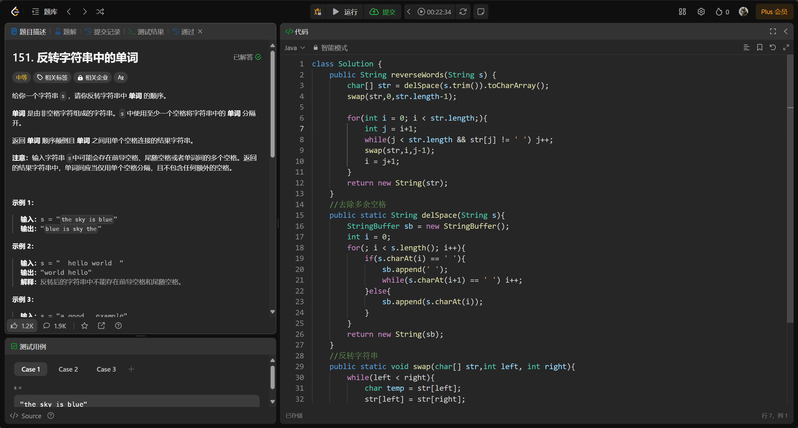

```java
class Solution {
    public String reverseWords(String s) {
        char[] str = delSpace(s.trim()).toCharArray();
        swap(str,0,str.length-1);

        for(int i = 0; i < str.length;){
            int j = i+1;
            while(j < str.length && str[j] != ' ') j++;
            swap(str,i,j-1);
            i = j+1;
        }
        return new String(str);
    }
    //去除多余空格
    public static String delSpace(String s){
        StringBuffer sb = new StringBuffer();
        int i = 0;
        for(; i < s.length(); i++){
            if(s.charAt(i) == ' '){
                sb.append(' ');
                while(s.charAt(i+1) == ' ') i++;
            }else{
                sb.append(s.charAt(i));
            }
        }
        return new String(sb);
    }
    //反转字符串
    public static void swap(char[] str,int left, int right){
        while(left < right){
            char temp = str[left];
            str[left] = str[right];
            str[right] = temp;
            left++;
            right--;
        }
    }
}
```

第一步：去除字符串前后的空格和重点多余的空格

第二步：反转整个字符串

第三步：逐个单词反转

##  ⭐28. 实现 strStr()

[28. 找出字符串中第一个匹配项的下标 - 力扣（LeetCode）](https://leetcode.cn/problems/find-the-index-of-the-first-occurrence-in-a-string/description/)

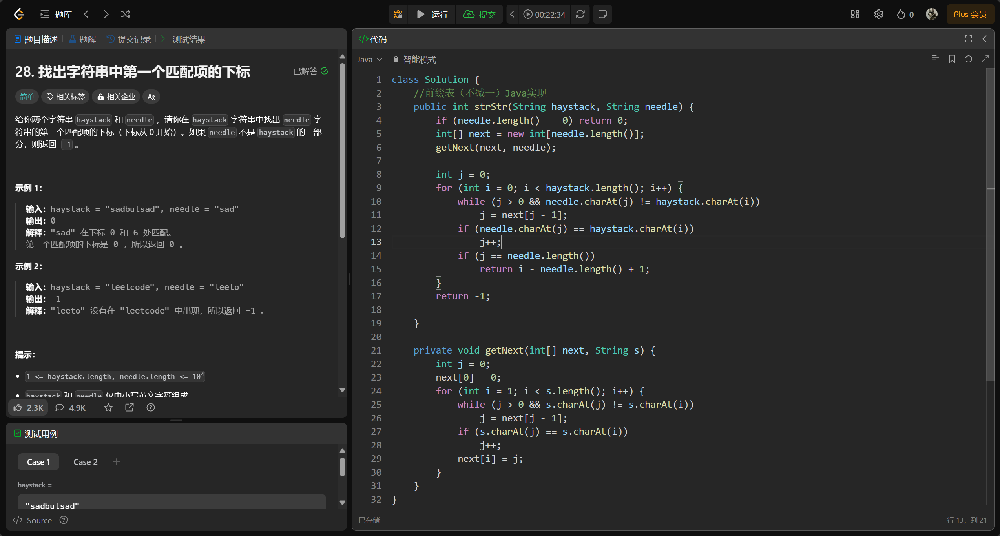

```java
class Solution {
    //前缀表（不减一）Java实现
    public int strStr(String haystack, String needle) {
        if (needle.length() == 0) return 0;
        int[] next = new int[needle.length()];
        getNext(next, needle);

        int j = 0;
        for (int i = 0; i < haystack.length(); i++) {
            while (j > 0 && needle.charAt(j) != haystack.charAt(i)) 
                j = next[j - 1];
            if (needle.charAt(j) == haystack.charAt(i)) 
                j++;
            if (j == needle.length()) 
                return i - needle.length() + 1;
        }
        return -1;

    }
    
    private void getNext(int[] next, String s) {
        int j = 0;
        next[0] = 0;
        for (int i = 1; i < s.length(); i++) {
            while (j > 0 && s.charAt(j) != s.charAt(i)) 
                j = next[j - 1];
            if (s.charAt(j) == s.charAt(i)) 
                j++;
            next[i] = j; 
        }
    }
}
```

## ⭐459.重复的子字符串

[459. 重复的子字符串 - 力扣（LeetCode）](https://leetcode.cn/problems/repeated-substring-pattern/description/)

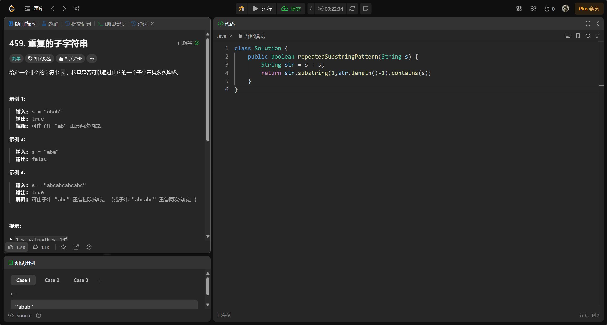

```java
class Solution {
    public boolean repeatedSubstringPattern(String s) {
        String str = s + s;
        return str.substring(1,str.length()-1).contains(s);
    }
}
```


# 栈与队列

## ⭐232.用栈实现队列

[232. 用栈实现队列 - 力扣（LeetCode）](https://leetcode.cn/problems/implement-queue-using-stacks/description/)

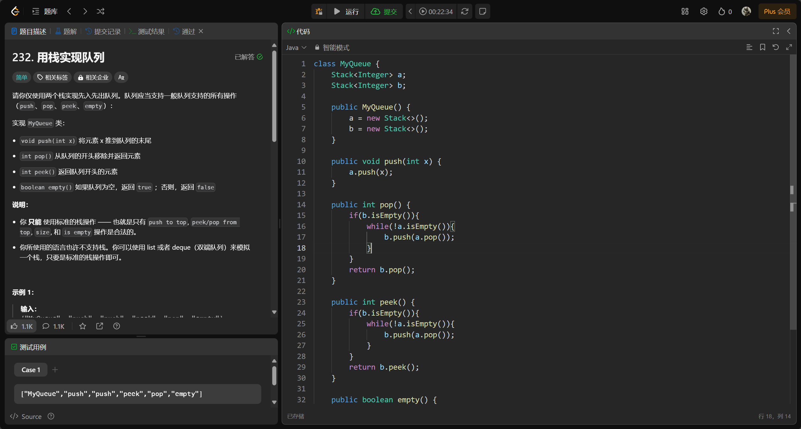

```java
class MyQueue {
    Stack<Integer> a;
    Stack<Integer> b;

    public MyQueue() {
        a = new Stack<>();
        b = new Stack<>();
    }
    
    public void push(int x) {
        a.push(x);
    }
    
    public int pop() {
        if(b.isEmpty()){
            while(!a.isEmpty()){
                b.push(a.pop());
            }
        }
        return b.pop();
    }
    
    public int peek() {
        if(b.isEmpty()){
            while(!a.isEmpty()){
                b.push(a.pop());
            }
        }
        return b.peek();
    }
    
    public boolean empty() {
        if(a.isEmpty() && b.isEmpty()) return true;
        return false;
    }
}
```

## ⭐225. 用队列实现栈

[225. 用队列实现栈 - 力扣（LeetCode）](https://leetcode.cn/problems/implement-stack-using-queues/description/)


```java
class MyStack {
    LinkedList<Integer> queue1;
    LinkedList<Integer> queue2;
    public MyStack() {
        queue1 = new LinkedList<>();
        queue2 = new LinkedList<>();
    }
    
    public void push(int x) {
        queue2.offer(x);
        while(!queue1.isEmpty()){
            queue2.offer(queue1.poll());
        }
        LinkedList<Integer> temp = queue1;
        queue1 = queue2;
        queue2 = temp;
    }
    
    public int pop() {
        return queue1.poll();
    }
    
    public int top() {
        return queue1.peek();
    }
    
    public boolean empty() {
        return queue1.isEmpty();
    }
}
```

**用两个队列que1和que2实现队列的功能，que2其实完全就是一个备份的作用**，把que1最后面的元素以外的元素都备份到que2，然后弹出最后面的元素，再把q1和q2互换，主队列变从队列，从队列变主队列。

##  20. 有效的括号

[20. 有效的括号 - 力扣（LeetCode）](https://leetcode.cn/problems/valid-parentheses/description/)


```java
class Solution {
    public boolean isValid(String s) {
        Stack<Character> stack = new Stack<>();

        for(int i = 0; i < s.length(); i++){
            if(s.charAt(i) == '(' || s.charAt(i) == '[' || s.charAt(i) == '{')
                stack.push(s.charAt(i));

            if(s.charAt(i) == ')'){
                if(stack.isEmpty() || stack.pop() != '(') return false;
            }
            if(s.charAt(i) == ']'){
                if(stack.isEmpty() || stack.pop() != '[') return false;
            }
            if(s.charAt(i) == '}'){
                if(stack.isEmpty() || stack.pop() != '{') return false;
            }
        }
        if(stack.isEmpty()) return true;
        return false;
    }
}
```

## 1047. 删除字符串中的所有相邻重复项

[1047. 删除字符串中的所有相邻重复项 - 力扣（LeetCode）](https://leetcode.cn/problems/remove-all-adjacent-duplicates-in-string/description/)

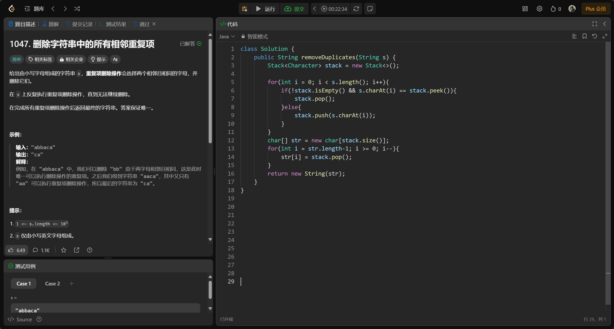

```java
class Solution {
    public String removeDuplicates(String s) {
        Stack<Character> stack = new Stack<>();

        for(int i = 0; i < s.length(); i++){
            if(!stack.isEmpty() && s.charAt(i) == stack.peek()){
                stack.pop();
            }else{
                stack.push(s.charAt(i));
            }
        }
        char[] str = new char[stack.size()];
        for(int i = str.length-1; i >= 0; i--){
            str[i] = stack.pop();
        }
        return new String(str);
    }
}
```

栈

## 150. 逆波兰表达式求值

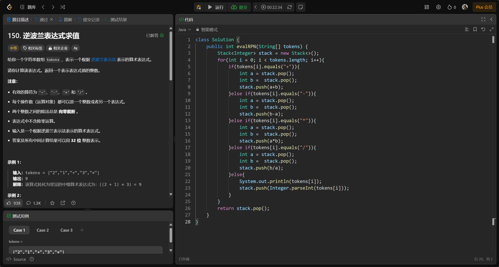

```java
class Solution {
    public int evalRPN(String[] tokens) {
        Stack<Integer> stack = new Stack<>();
        for(int i = 0; i < tokens.length; i++){
            if(tokens[i].equals("+")){
                int a = stack.pop();
                int b =  stack.pop();
                stack.push(a+b);
            }else if(tokens[i].equals("-")){
                int a = stack.pop();
                int b =  stack.pop(); 
                stack.push(b-a);
            }else if(tokens[i].equals("*")){
                int a = stack.pop();
                int b =  stack.pop();
                stack.push(a*b);
            }else if(tokens[i].equals("/")){
                int a = stack.pop();
                int b =  stack.pop();
                stack.push(b/a);
            }else{
                System.out.println(tokens[i]);
                stack.push(Integer.parseInt(tokens[i]));
            }
        }
        return stack.pop();
    }
}
```

切记！字符串判等要用equals

##  239. 滑动窗口最大值

[239. 滑动窗口最大值 - 力扣（LeetCode）](https://leetcode.cn/problems/sliding-window-maximum/description/)


```java
class Solution {
    public int[] maxSlidingWindow(int[] nums, int k) {
        int[] result = new int[nums.length - k + 1];
        LinkedList<Integer> list = new LinkedList<>();

        for(int i =  0; i < k; i++){
            while(!list.isEmpty() && list.getLast() < nums[i]) 
                list.removeLast();
            list.addLast(nums[i]);
        }
        result[0] = list.getFirst();

        for(int i = k; i < nums.length; i++){
            while(!list.isEmpty() && list.getLast() < nums[i]) 
                list.removeLast();
            list.addLast(nums[i]);

            if(list.getFirst() == nums[i-k])
                list.removeFirst();
            result[i-k+1] = list.getFirst();
        }
        return result;
    }
}
```

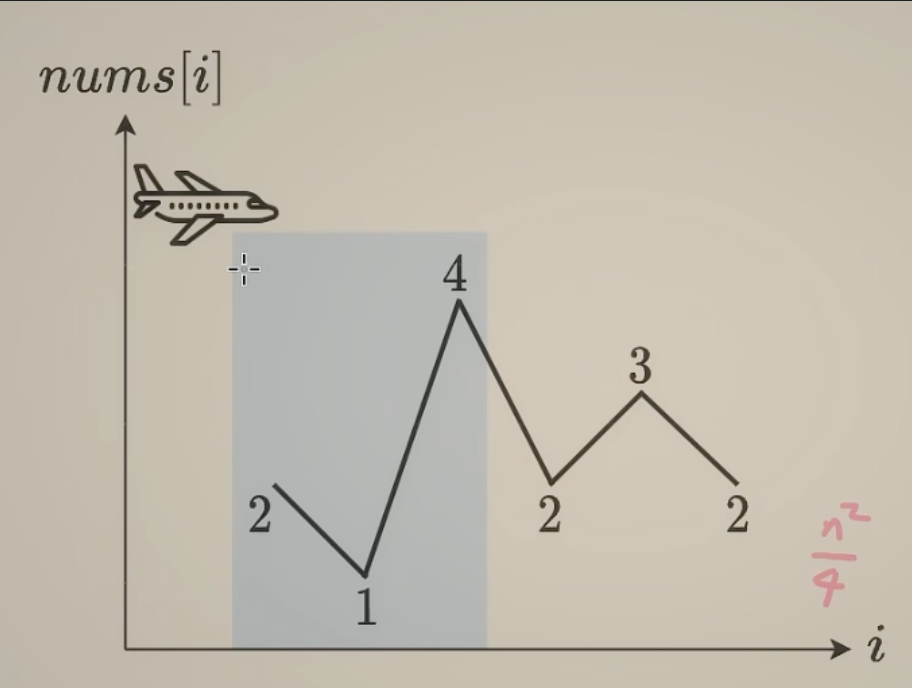

想像成在飞机上往下看,如果有更高的山峰出现在视野中,那么这座山之前的所有山都可以去掉了,因为他们肯定更先消失且最高峰不可能是他们,使用双端队列(递减)实现,进值一个个从右边进入(进入前出队比当前值小的),取值一个个从左边取(不出队只是取值)

## ⭐347.前 K 个高频元素


```java
class Solution {
    public int[] topKFrequent(int[] nums, int k) {
        int[] result = new int[k];
        PriorityQueue<int[]> queue = new PriorityQueue<>((o1,o2) -> o2[1] - o1[1]);
        Map<Integer,Integer> map = new HashMap<>();//计算频次
        for(int i = 0; i < nums.length; i++){
            map.put(nums[i],map.getOrDefault(nums[i],0)+1);
        }

        for(Integer key : map.keySet()){
            int[] arr = new int[2];
            arr[0] = key;
            arr[1] = map.get(key);
            queue.offer(arr);
        }
        
        for(int i = 0; i < k; i++){
            result[i] = queue.poll()[0];
        }

        return result;
    }
}
```

一个HashMap计算频次，一个PriorityQueue比较。

# 二叉树

## 方法论

1. **确定递归函数的参数和返回值：** 确定哪些参数是递归的过程中需要处理的，那么就在递归函数里加上这个参数， 并且还要明确每次递归的返回值是什么进而确定递归函数的返回类型。
2. **确定终止条件：** 写完了递归算法, 运行的时候，经常会遇到栈溢出的错误，就是没写终止条件或者终止条件写的不对，操作系统也是用一个栈的结构来保存每一层递归的信息，如果递归没有终止，操作系统的内存栈必然就会溢出。
3. **确定单层递归的逻辑：** 确定每一层递归需要处理的信息。在这里也就会重复调用自己来实现递归的过程。

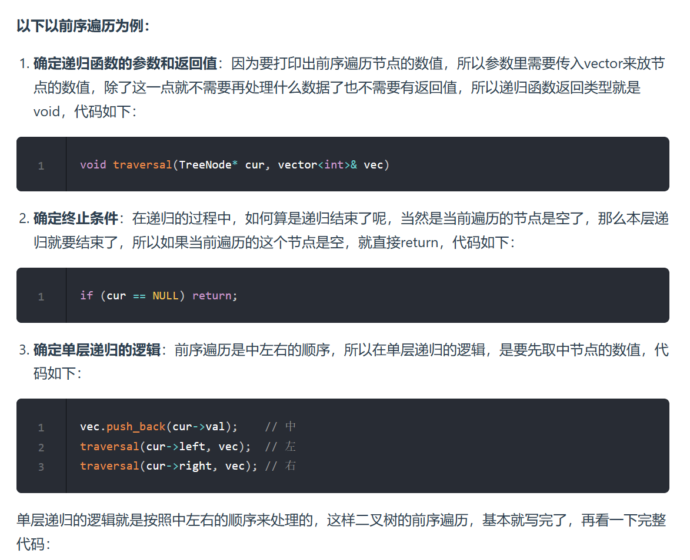

## 二叉树前中后序遍历（递归）

[144. 二叉树的前序遍历](https://leetcode.cn/problems/binary-tree-preorder-traversal/)

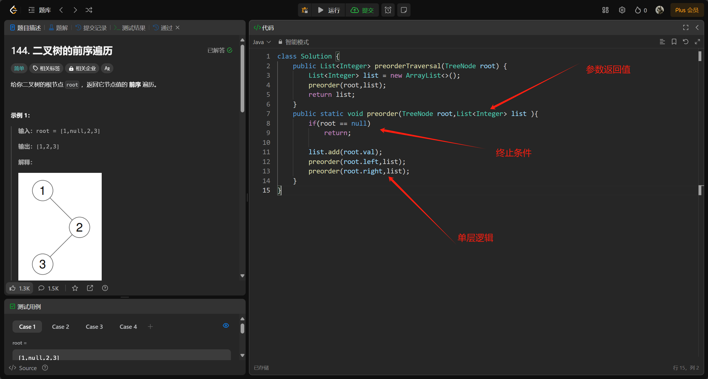

```java
class Solution {
    public List<Integer> preorderTraversal(TreeNode root) {
        List<Integer> list = new ArrayList<>();
        preorder(root,list);
        return list;
    }
    public static void preorder(TreeNode root,List<Integer> list ){
        if(root == null)
            return;
        
        list.add(root.val);
        preorder(root.left,list);
        preorder(root.right,list);
    }
}
```

[145. 二叉树的后序遍历 - 力扣（LeetCode）](https://leetcode.cn/problems/binary-tree-postorder-traversal/description/)

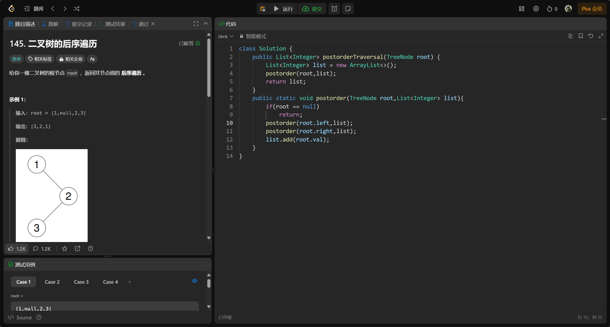

```java
class Solution {
    public List<Integer> postorderTraversal(TreeNode root) {
        List<Integer> list = new ArrayList<>();
        postorder(root,list);
        return list;
    }
    public static void postorder(TreeNode root,List<Integer> list){
        if(root == null)
            return;
        postorder(root.left,list);
        postorder(root.right,list);
        list.add(root.val);
    }
}
```

[94. 二叉树的中序遍历 - 力扣（LeetCode）](https://leetcode.cn/problems/binary-tree-inorder-traversal/description/)


```java
class Solution {
    public List<Integer> inorderTraversal(TreeNode root) {
        List<Integer> list = new ArrayList<>();
        inorder(root,list);
        return list;
    }
    public static void inorder(TreeNode root,List<Integer> list){
        if(root == null)
            return;
        inorder(root.left,list);
        list.add(root.val);
        inorder(root.right,list);
    }
}
```

## ⭐二叉树前中后序遍历（迭代）

[144. 二叉树的前序遍历 - 力扣（LeetCode）](https://leetcode.cn/problems/binary-tree-preorder-traversal/description/)


```java
class Solution {
    public List<Integer> preorderTraversal(TreeNode root) {
        List<Integer> list = new ArrayList<>();
        if(root == null) return list;

        Stack<TreeNode> stack = new Stack<>();
        stack.push(root);

        while(!stack.isEmpty()){
            TreeNode p = stack.pop();
            list.add(p.val);
            if(p.right != null) stack.push(p.right);
            if(p.left != null) stack.push(p.left);
        }

        return list;
    }
}
```

前序遍历是中左右，每次先处理的是中间节点，那么先将根节点放入栈中，然后将右孩子加入栈，再加入左孩子。

为什么要先加入 右孩子，再加入左孩子呢？ 因为这样出栈的时候才是中左右的顺序。

[145. 二叉树的后序遍历 - 力扣（LeetCode）](https://leetcode.cn/problems/binary-tree-postorder-traversal/description/)

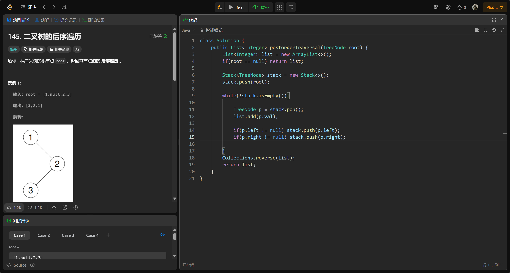

```java
class Solution {
    public List<Integer> postorderTraversal(TreeNode root) {
        List<Integer> list = new ArrayList<>();
        if(root == null) return list;

        Stack<TreeNode> stack = new Stack<>();
        stack.push(root);

        while(!stack.isEmpty()){

            TreeNode p = stack.pop();
            list.add(p.val);

            if(p.left != null) stack.push(p.left);
            if(p.right != null) stack.push(p.right);

        }
        Collections.reverse(list);
        return list;
    }
}
```

再来看后序遍历，先序遍历是中左右，后序遍历是左右中，那么我们只需要调整一下先序遍历的代码顺序，就变成中右左的遍历顺序，然后在反转result数组，输出的结果顺序就是左右中了，如下图：


[94. 二叉树的中序遍历 - 力扣（LeetCode）](https://leetcode.cn/problems/binary-tree-inorder-traversal/description/)


```java
class Solution {
    public List<Integer> inorderTraversal(TreeNode root) {
        List<Integer> list = new ArrayList<>();
        if(root == null) return list;

        Stack<TreeNode> stack = new Stack<>();
        TreeNode cur = root;
        while(cur!= null || !stack.isEmpty()){
            if(cur!=null){
                stack.push(cur);
                cur = cur.left;
            }else{
                TreeNode p = stack.pop();
                list.add(p.val);
                cur = p.right;
            }
        }

        return list;
    }
}
```

**在使用迭代法写中序遍历，就需要借用指针的遍历来帮助访问节点，栈则用来处理节点上的元素。**

如果cur!=null就一直向左找，找不到就pop数据，并把cur指向pop出节点的右子树。

## 二叉树层序遍历	

- [102.二叉树的层序遍历(opens new window)](https://leetcode.cn/problems/binary-tree-level-order-traversal/)


```java
class Solution {
    public List<List<Integer>> levelOrder(TreeNode root) {
        List<List<Integer>> list = new ArrayList<>();
        if(root == null) return list;

        Queue<TreeNode> queue = new LinkedList<>();
        queue.offer(root);
        while(!queue.isEmpty()){
            List<Integer> temp = new ArrayList<>();
            int len = queue.size();

            for(int i = 0; i < len; i++){
                TreeNode p = queue.poll();
                temp.add(p.val);
                
                if(p.left != null)  queue.offer(p.left);
                if(p.right != null)  queue.offer(p.right);
            }
            list.add(temp);
        }
        return list;
    }
}
```

用队列！！！

- [107.二叉树的层次遍历II(opens new window)](https://leetcode.cn/problems/binary-tree-level-order-traversal-ii/)


```java
class Solution {
    public List<List<Integer>> levelOrderBottom(TreeNode root) {
        List<List<Integer>> list = new ArrayList<>();
        if(root == null)
            return list;

        Queue<TreeNode> queue = new LinkedList<>();
        queue.add(root);

        while(!queue.isEmpty()){
            List<Integer> temp = new ArrayList<>();
            int len = queue.size();

            for(int i = 0; i < len; i++){
                TreeNode p = queue.poll();
                temp.add(p.val);
                if(p.left != null) queue.offer(p.left);
                if(p.right != null) queue.offer(p.right);
            }

            list.add(0,temp);
        }

        return list;
    }
}
```

插入list的时候采用头插法即可，或者最后反转一下list

- [199.二叉树的右视图(opens new window)](https://leetcode.cn/problems/binary-tree-right-side-view/)


```java
class Solution {
    public List<Integer> rightSideView(TreeNode root) {
        List<Integer> list = new ArrayList<>();
        if(root == null) return list;
        Queue<TreeNode> queue = new LinkedList<>();
        queue.add(root);

        while(!queue.isEmpty()){

            int len  = queue.size();
            for(int i = 0; i < len; i++){
                TreeNode p = queue.poll();
                if(p.left != null) queue.offer(p.left);
                if(p.right != null) queue.offer(p.right);
                if(i == len-1) list.add(p.val);
            }
            
        }

        return list;
    }
}
```

- [637.二叉树的层平均值(opens new window)](https://leetcode.cn/problems/average-of-levels-in-binary-tree/)

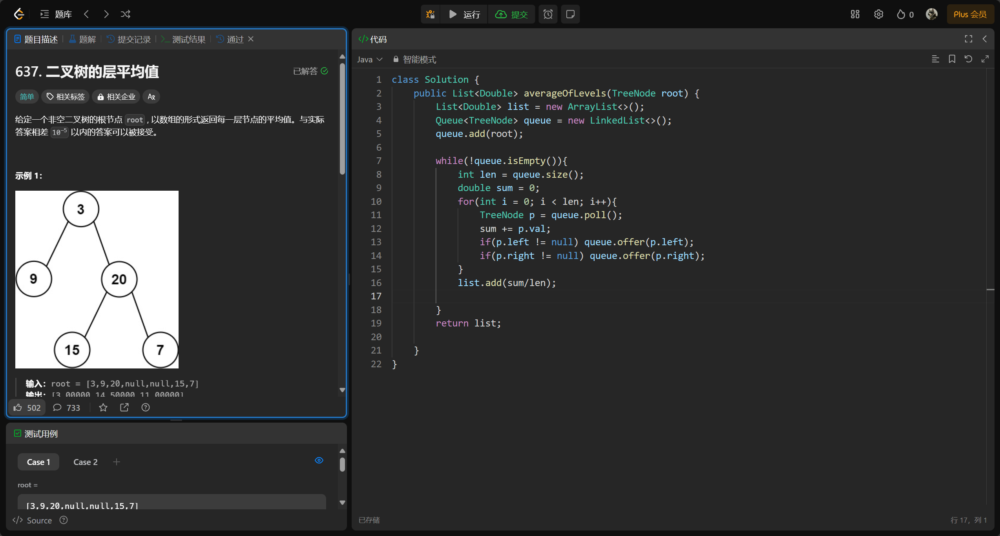

```java
class Solution {
    public List<Double> averageOfLevels(TreeNode root) {
        List<Double> list = new ArrayList<>();
        Queue<TreeNode> queue = new LinkedList<>();
        queue.add(root);

        while(!queue.isEmpty()){
            int len = queue.size();
            double sum = 0;
            for(int i = 0; i < len; i++){
                TreeNode p = queue.poll();
                sum += p.val;
                if(p.left != null) queue.offer(p.left);
                if(p.right != null) queue.offer(p.right);
            }
            list.add(sum/len);

        }
        return list;

    }
}
```

- [429.N叉树的层序遍历(opens new window)](https://leetcode.cn/problems/n-ary-tree-level-order-traversal/)


```java
class Solution {
    public List<List<Integer>> levelOrder(Node root) {
        List<List<Integer>> list = new ArrayList<>();
        if(root == null) return list;
        Queue<Node> queue = new LinkedList<>();
        queue.offer(root);

        while(!queue.isEmpty()){
            int len = queue.size();
            List<Integer> temp = new ArrayList<>();
            for(int i = 0; i < len; i++){
                Node p = queue.poll();
                temp.add(p.val);
                for(Node n : p.children){
                    queue.offer(n);
                }
            }
            list.add(temp);
        }
        return list;
    }

}
```

- [515.在每个树行中找最大值(opens new window)](https://leetcode.cn/problems/find-largest-value-in-each-tree-row/)


```java
class Solution {
    public List<Integer> largestValues(TreeNode root) {
        List<Integer> list = new ArrayList<>();
        if(root == null) return list;
        Queue<TreeNode> queue = new LinkedList<>();
        queue.add(root);

        while(!queue.isEmpty()){
            int len = queue.size();
            int max = Integer.MIN_VALUE;

            for(int i = 0; i < len; i++){
                TreeNode p = queue.poll();
                max = Math.max(max,p.val);
                if(p.left != null) queue.offer(p.left);
                if(p.right != null) queue.offer(p.right);
            }
            list.add(max);

        }
        return list;
    }
}
```

- [116.填充每个节点的下一个右侧节点指针(opens new window)](https://leetcode.cn/problems/populating-next-right-pointers-in-each-node/)


```java
class Solution {
    public Node connect(Node root) {
        if(root == null) return root;
        Queue<Node> queue = new LinkedList<>();
        queue.offer(root);

        while(!queue.isEmpty()){
            int len = queue.size();
            Node pre = queue.poll();
            if(pre.left != null) queue.offer(pre.left);
            if(pre.right != null) queue.offer(pre.right);
            
            for(int i  = 1; i < len; i++){
                Node cur = queue.poll();
                pre.next = cur;
                pre = cur;

                if(pre.left != null) queue.offer(pre.left);
                if(pre.right != null) queue.offer(pre.right);
            }
        }
        return root;
    }
}
```

- [117.填充每个节点的下一个右侧节点指针II(opens new window)](https://leetcode.cn/problems/populating-next-right-pointers-in-each-node-ii/)

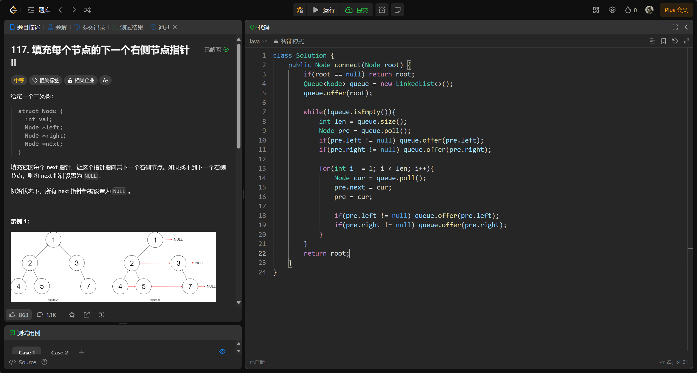

```java
class Solution {
    public Node connect(Node root) {
        if(root == null) return root;
        Queue<Node> queue = new LinkedList<>();
        queue.offer(root);

        while(!queue.isEmpty()){
            int len = queue.size();
            Node pre = queue.poll();
            if(pre.left != null) queue.offer(pre.left);
            if(pre.right != null) queue.offer(pre.right);
            
            for(int i  = 1; i < len; i++){
                Node cur = queue.poll();
                pre.next = cur;
                pre = cur;

                if(pre.left != null) queue.offer(pre.left);
                if(pre.right != null) queue.offer(pre.right);
            }
        }
        return root;
    }
}
```

- [104.二叉树的最大深度(opens new window)](https://leetcode.cn/problems/maximum-depth-of-binary-tree/)


```java
class Solution {
    public int maxDepth(TreeNode root) {
        if(root == null) return 0;
        Queue<TreeNode> queue = new LinkedList<>();
        queue.offer(root);

        int count = 0;
        while(!queue.isEmpty()){
            int len = queue.size();
            for(int i = 0; i < len; i++){
                TreeNode p = queue.poll();
                if(p.left != null) queue.offer(p.left);
                if(p.right != null) queue.offer(p.right);
            }
            count++;
        }
        return count;
    }
}
```

- [111.二叉树的最小深度](https://leetcode.cn/problems/minimum-depth-of-binary-tree/)


```java
class Solution {
    public int minDepth(TreeNode root) {
        if(root == null) return 0;
        Queue<TreeNode> queue = new LinkedList<>();
        queue.offer(root);
        
        int count = 0;
        while(!queue.isEmpty()){
            int len = queue.size();
            for(int i = 0; i < len; i++){
                TreeNode p = queue.poll();
                if(p.left != null) queue.offer(p.left);
                if(p.right != null) queue.offer(p.right);
                if(p.left == null && p.right == null) return ++count;
            }
            count++;
        }
        return count;
    }
}
```

## 226.翻转二叉树

[226. 翻转二叉树 - 力扣（LeetCode）](https://leetcode.cn/problems/invert-binary-tree/description/)


```java
class Solution {
    public TreeNode invertTree(TreeNode root) {
        reverse(root);
        return root;
    }

    public static void reverse(TreeNode root){
        if(root == null) return;

        TreeNode temp = root.left;
        root.left = root.right;
        root.right = temp;

        reverse(root.left);
        reverse(root.right);
    }
}
```

##  ⭐101. 对称二叉树

[101. 对称二叉树 - 力扣（LeetCode）](https://leetcode.cn/problems/symmetric-tree/description/)


```java
class Solution {
    public boolean isSymmetric(TreeNode root) {
        return isRight(root.left,root.right);
    }

    public static boolean isRight(TreeNode left,TreeNode right){
        //递归出口
        if(left == null && right == null)
            return true;
        if(left == null || right == null)
            return false;
        if(left.val != right.val)
             return false;

        //单层递归逻辑 left.val == right.val的情况
        boolean out = isRight(left.left,right.right);//左
        boolean in = isRight(left.right,right.left);//右
        return out && in;//中
    }

}
```

## ⭐104.二叉树的最大深度

[104. 二叉树的最大深度 - 力扣（LeetCode）](https://leetcode.cn/problems/maximum-depth-of-binary-tree/description/)

递归

```java
class Solution {
    public int maxDepth(TreeNode root) {
        return max(root);
    }

    public static int max(TreeNode root){
        if(root == null) return 0;

        int left = max(root.left);
        int right = max(root.right);
        return Math.max(left,right)+1;
    }

}
```

层次遍历

```java
class Solution {
    public int maxDepth(TreeNode root) {
        if(root == null) return 0;
        Queue<TreeNode> queue = new LinkedList<>();
        queue.offer(root);

        int count = 0;
        while(!queue.isEmpty()){
            int len = queue.size();
            for(int i = 0; i < len; i++){
                TreeNode p = queue.poll();
                if(p.left != null) queue.offer(p.left);
                if(p.right != null) queue.offer(p.right);
            }
            count++;
        }
        return count;
    }
}
```

## ⭐111.二叉树的最小深度

递归

```java
class Solution {
    public int minDepth(TreeNode root) {
        return min(root);
    }

    public static int min(TreeNode root){
        if(root == null) return 0;

        int left = min(root.left);
        int right = min(root.right);

        if(left != 0 && right != 0)
            return Math.min(left,right)+1;
        else
            return left+right+1;
    }

}
```

层次遍历

```java
class Solution {
    public int minDepth(TreeNode root) {
        if(root == null) return 0;
        Queue<TreeNode> queue = new LinkedList<>();
        queue.offer(root);
        
        int count = 0;
        while(!queue.isEmpty()){
            int len = queue.size();
            for(int i = 0; i < len; i++){
                TreeNode p = queue.poll();
                if(p.left != null) queue.offer(p.left);
                if(p.right != null) queue.offer(p.right);
                if(p.left == null && p.right == null) return ++count;
            }
            count++;
        }
        return count;
    }
}
```

## 222.完全二叉树的节点个数

[222. 完全二叉树的节点个数 - 力扣（LeetCode）](https://leetcode.cn/problems/count-complete-tree-nodes/description/)

层次遍历

```java
class Solution {
    public int countNodes(TreeNode root) {
        if(root == null) return 0;
        Queue<TreeNode> queue = new LinkedList<>();
        queue.offer(root);
        int count = 0;
        while(!queue.isEmpty()){
            int len = queue.size();
            for(int i = 0; i < len; i++){
                TreeNode p = queue.poll();
                if(p.left != null) queue.offer(p.left);
                if(p.right != null) queue.offer(p.right);
            }
            count+=len;
        }
        return count;
    }
}
```

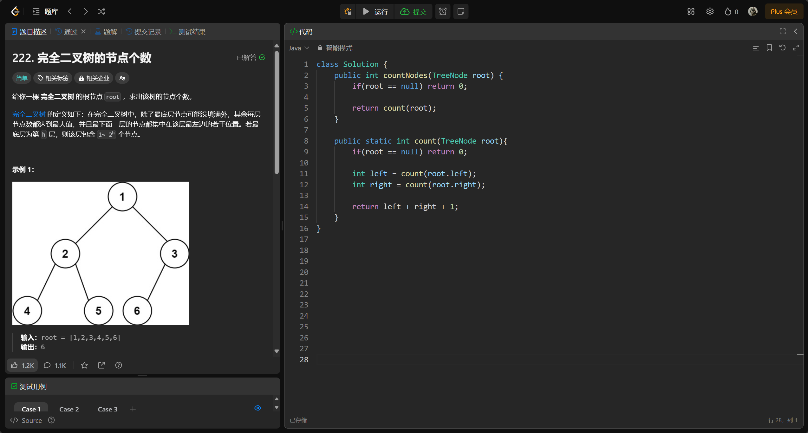

```java
class Solution {
    public int countNodes(TreeNode root) {
        if(root == null) return 0;

        return count(root);
    }

    public static int count(TreeNode root){
        if(root == null) return 0;

        int left = count(root.left);
        int right = count(root.right);
        
        return left + right + 1;
    }
}
```

## ⭐110.平衡二叉树

[110. 平衡二叉树 - 力扣（LeetCode）](https://leetcode.cn/problems/balanced-binary-tree/description/)

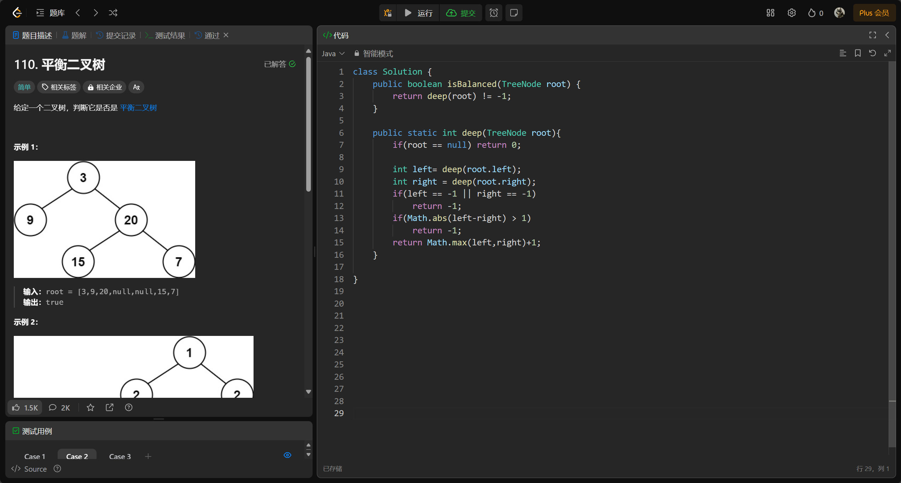

```java
class Solution {
    public boolean isBalanced(TreeNode root) {
        return deep(root) != -1;
    }

    public static int deep(TreeNode root){
        if(root == null) return 0;

        int left= deep(root.left);
        int right = deep(root.right);
        if(left == -1 || right == -1)
            return -1;
        if(Math.abs(left-right) > 1)
            return -1;
        return Math.max(left,right)+1;
    }

}
```

还是求最大高度，但是高度差>1的时候返回-1，判定为非平衡树。

## ⭐257. 二叉树的所有路径


```java
class Solution {
    List<String> list = new ArrayList<>();
    List<Integer> path = new ArrayList<>();//回溯

    public List<String> binaryTreePaths(TreeNode root) {
        backTracing(root);
        return list;
    }

    public void backTracing(TreeNode root){
        path.add(root.val);

        if(root.left == null && root.right == null){
            StringBuilder sb = new StringBuilder();
            for(int i = 0; i < path.size(); i++){
                if(i != 0){
                    sb.append("->");
                }
                sb.append(path.get(i));
            }
            list.add(sb.toString());
            return;
        }
        
        if(root.left != null){
            backTracing(root.left);
            path.removeLast();
        }

        if(root.right != null){
            backTracing(root.right);
            path.removeLast();
        }
    }
}
```

## 404.左叶子之和

[404. 左叶子之和 - 力扣（LeetCode）](https://leetcode.cn/problems/sum-of-left-leaves/description/)

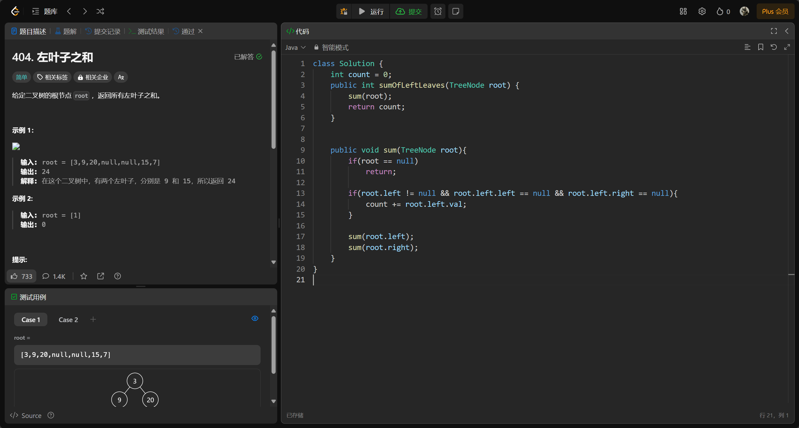

```java
class Solution {
    int count = 0;
    public int sumOfLeftLeaves(TreeNode root) {
        sum(root);
        return count;
    }


    public void sum(TreeNode root){
        if(root == null)
            return;
            
        if(root.left != null && root.left.left == null && root.left.right == null){
            count += root.left.val;
        }

        sum(root.left);
        sum(root.right);
    }
}

```

##  513.找树左下角的值

[513. 找树左下角的值 - 力扣（LeetCode）](https://leetcode.cn/problems/find-bottom-left-tree-value/description/)


```java
class Solution {
    public int findBottomLeftValue(TreeNode root) {
        int left = root.val;
        Queue<TreeNode> queue = new LinkedList<>();
        queue.offer(root);

        while(!queue.isEmpty()){
            int len = queue.size();
            for(int i = 0; i < len; i++){
                TreeNode p = queue.poll();
                if(i == 0) left = p.val;
                if(p.left != null) queue.offer(p.left);
                if(p.right != null) queue.offer(p.right);
            }
        }
        return left;
    }
}
```

## 112. 路径总和

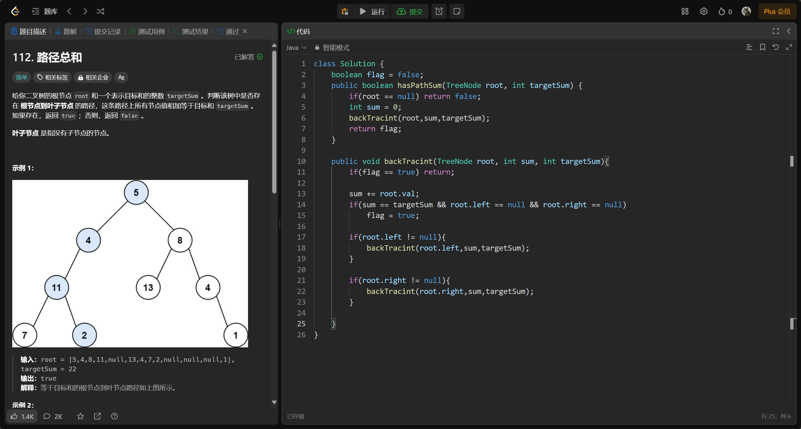

```java
class Solution {
    boolean flag = false;
    public boolean hasPathSum(TreeNode root, int targetSum) {
        if(root == null) return false;
        int sum = 0;
        backTracint(root,sum,targetSum);
        return flag;
    }

    public void backTracint(TreeNode root, int sum, int targetSum){
        if(flag == true) return;

        sum += root.val;
        if(sum == targetSum && root.left == null && root.right == null)
            flag = true;

        if(root.left != null){
            backTracint(root.left,sum,targetSum);
        }

        if(root.right != null){
            backTracint(root.right,sum,targetSum);
        }

    }
}
```

和上一题类似，有点像回溯但是不用回溯

## ⭐106.从中序与后序遍历序列构造二叉树

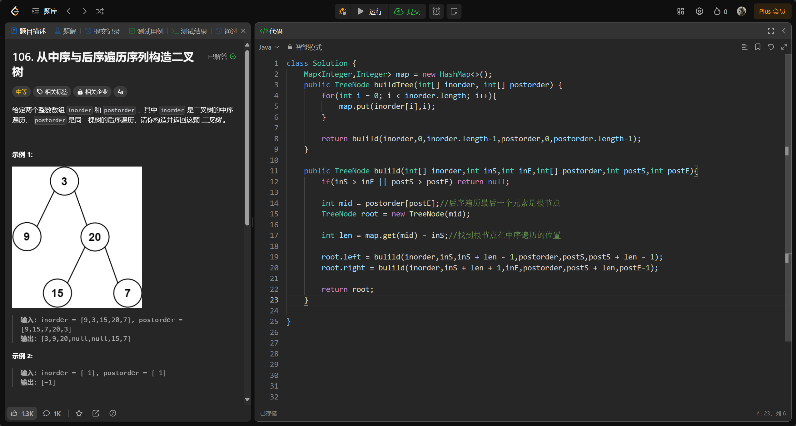

```java
class Solution {
    Map<Integer,Integer> map = new HashMap<>();
    public TreeNode buildTree(int[] inorder, int[] postorder) {
        for(int i = 0; i < inorder.length; i++){
            map.put(inorder[i],i);
        }

        return bulild(inorder,0,inorder.length-1,postorder,0,postorder.length-1);
    }

    public TreeNode bulild(int[] inorder,int inS,int inE,int[] postorder,int postS,int postE){
        if(inS > inE || postS > postE) return null;

        int mid = postorder[postE];//后序遍历最后一个元素是根节点
        TreeNode root = new TreeNode(mid);

        int len = map.get(mid) - inS;//找到根节点在中序遍历的位置

        root.left = bulild(inorder,inS,inS + len - 1,postorder,postS,postS + len - 1);
        root.right = bulild(inorder,inS + len + 1,inE,postorder,postS + len,postE-1);

        return root;
    }

}
```

## ⭐105.从前序与中序遍历序列构造二叉树

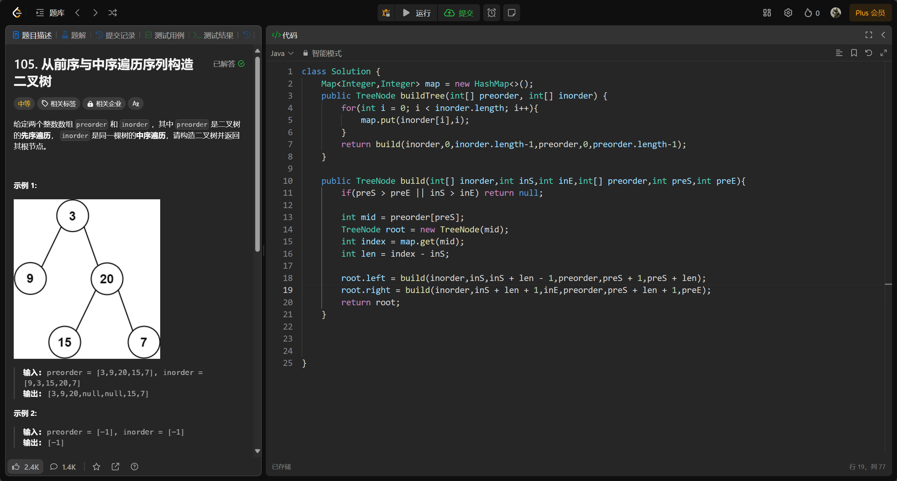

```java
class Solution {
    Map<Integer,Integer> map = new HashMap<>();
    public TreeNode buildTree(int[] preorder, int[] inorder) {
        for(int i = 0; i < inorder.length; i++){
            map.put(inorder[i],i);
        }
        return build(inorder,0,inorder.length-1,preorder,0,preorder.length-1);
    }

    public TreeNode build(int[] inorder,int inS,int inE,int[] preorder,int preS,int preE){
        if(preS > preE || inS > inE) return null;

        int mid = preorder[preS];
        TreeNode root = new TreeNode(mid);
        int index = map.get(mid);
        int len = index - inS;

        root.left = build(inorder,inS,inS + len - 1,preorder,preS + 1,preS + len);
        root.right = build(inorder,inS + len + 1,inE,preorder,preS + len + 1,preE);
        return root;
    }

}
```

这两道题请勿不自己画出来啊！！！

算数关系很复杂，头痛

而且记得要算len，不要用index

## 654.最大二叉树

[654. 最大二叉树 - 力扣（LeetCode）](https://leetcode.cn/problems/maximum-binary-tree/description/)

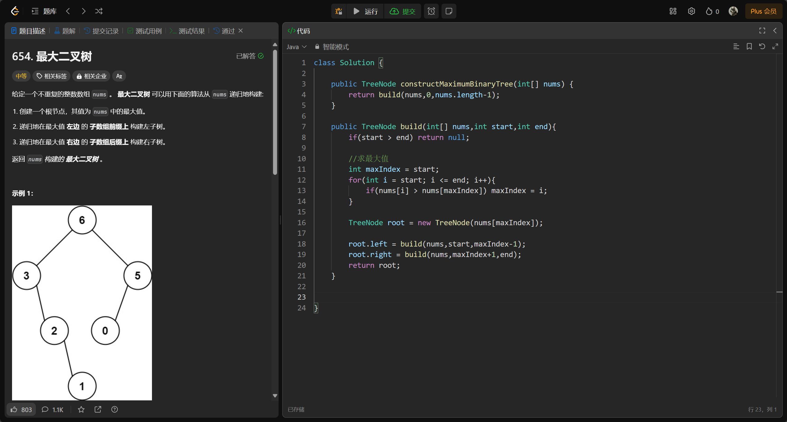

```java
class Solution {

    public TreeNode constructMaximumBinaryTree(int[] nums) {
        return build(nums,0,nums.length-1);
    }   

    public TreeNode build(int[] nums,int start,int end){
        if(start > end) return null;

        //求最大值
        int maxIndex = start;
        for(int i = start; i <= end; i++){
            if(nums[i] > nums[maxIndex]) maxIndex = i;
        }
        
        TreeNode root = new TreeNode(nums[maxIndex]);

        root.left = build(nums,start,maxIndex-1);
        root.right = build(nums,maxIndex+1,end);
        return root;
    }
}
```

和上题类似，也是根据数组建树。


​	
