#  不常用API

## HashMap

hashmap如何判断是否包含某一个元素？一定注意时containsKey()

```java
HashMap<Integer, String> map = new HashMap<>();
map.put(1, "one");
map.put(2, "two");

if (map.containsKey(1)) {
    System.out.println("Map contains key 1.");
}
```

hashmap获取值，如果不存在就为默认值

```java
map.put(sum, map.getOrDefault(sum, 0) + 1);
```

hashmap遍历

```java
for(Integer key : map.keySet()){
    int[] arr = new int[2];
    arr[0] = key;
    arr[1] = map.get(key);
    queue.offer(arr);
}
```

## 字符串

如何去除字符串前后的空格？

```java
s.trim()
```

判断字符串是否以某个字符串开头，切记是start**s**With()()

```java
str.startsWith("0")
```

## 堆栈

栈的使用

```java
Stack<Integer> a = new Stack<>();
a.push(x);
a.pop();
a.peek();
```

队列的使用

```java
LinkedList<Integer> queue = new LinkedList<>();
queue1.offer(x);
queue1.poll();
queue1.peek();
```

## 队列

优先级队列使用

```java
PriorityQueue<int[]> queue = new PriorityQueue<>((o1,o2) -> o2[1] - o1[1]);
```

## StringBuilder

移除元素

```java
StringBuilder sb = new StringBuilder("Hello!");
sb.deleteCharAt(sb.length() - 1); // 移除最后一个字符
```

## for循环

```java
for(int i = x-1, j = y-1; i >= 0 && j >= 0; i--,j--){   //正确
```

```java
for(int i = x-1, int j = y-1; i >= 0 && j >= 0; i--,j--){    //错误
```

for循环定义只能用一次，保证类型相同

## List

一维数组转列表

```java
自己for循环吧
```

二维数组转列表

```java
list.toArray(new int[people.length][]);
```

排序

```java
Arrays.sort(people,(a,b) -> {
    if(b[0] == a[0])
        return a[1] - b[1];
    return b[0] - a[0];
});
```

如果位置0元素相同，那么就用位置1排序。

## Integer

比较大小

```java
Integer.compare(a[0], b[0])
```

# Java Scanner 类

## **读取字符串**

```java
import java.util.Scanner;
public class Main {
    public static void main(String[] args) {

        Scanner scanner = new Scanner(System.in);
        //读取一行字符串，包括空格。
        String name = scanner.nextLine();
        System.out.println(name);

        //读取下一个单词（以空格或换行符分隔）。
        String s = scanner.next();
        System.out.println(s);
        
    }
}
```

## **读取基本类型**

```java
import java.util.Scanner;
public class Main {
    public static void main(String[] args) {

        Scanner scanner = new Scanner(System.in);
        //nextInt()：读取一个整数。
        int a = scanner.nextInt();
        System.out.println(a);
        //nextDouble()：读取一个双精度浮点数。
        double b = scanner.nextDouble();
        System.out.println(b);
        //nextBoolean()：读取一个布尔值。
        boolean c = scanner.nextBoolean();
        System.out.println(c);
        
    }
}
```

## 分隔符

### 默认分隔符

Scanner类默认使用空白字符（如空格、制表符、换行符等）作为分隔符。这意味着next()方法会读取下一个以空白字符分隔的单词。

你可以使用`useDelimiter()`方法来自定义分隔符。

### **自定义分隔符**

你可以使用`useDelimiter()`方法来自定义分隔符。

```java
import java.util.Scanner;
public class Main {
    public static void main(String[] args) {

        Scanner scanner = new Scanner(System.in);
        scanner.useDelimiter(",");

        while(scanner.hasNext()) {
            int a = scanner.nextInt();
            System.out.println(a);
        }

    }
}
```

## **获取整型数组**

```java
import java.util.Scanner;
public class Main {
    public static void main(String[] args) {

        Scanner scanner = new Scanner(System.in);
        String str = scanner.nextLine();
        String[] s = str.split(",");
        int[] nums= new int[s.length];
        for(int i=0;i<s.length;i++){
            nums[i]= Integer.parseInt(s[i]);
        }
    }
}
```

## [A+B(1)](https://ac.nowcoder.com/acm/contest/5652/A)


## [A+B(2)](https://ac.nowcoder.com/acm/contest/5652/B)


## [A+B(3)](https://ac.nowcoder.com/acm/contest/5652/C)


## [A+B(4)](https://ac.nowcoder.com/acm/contest/5652/D)


# 数组

## 704. 二分查找

https://leetcode.cn/problems/binary-search/


```java
class Solution {
    public int search(int[] nums, int target) {
        int left = 0;
        int right = nums.length-1;
        int mid = 0;
        while(left <= right && n·ums[mid] != target){
            mid = (left+right)>>1;
            if(nums[mid] > target){
                right = mid - 1;
            }else{
                left = mid + 1;
            }
        }
        return nums[mid] == target ? mid : -1;
    }
}
```

##  27. 移除元素

[27. 移除元素 - 力扣（LeetCode）](https://leetcode.cn/problems/remove-element/description/)

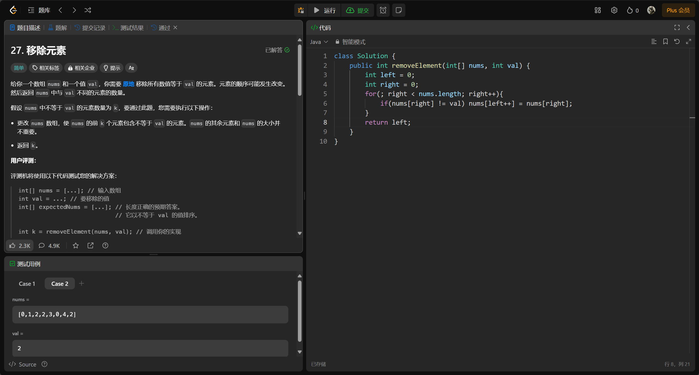

```java
class Solution {
    public int removeElement(int[] nums, int val) {
        int left = 0;
        int right = 0;
        for(; right < nums.length; right++){
            if(nums[right] != val) nums[left++] = nums[right];
        }
        return left;
    }
}
```

快慢指针法

## 977.有序数组的平方

[977. 有序数组的平方 - 力扣（LeetCode）](https://leetcode.cn/problems/squares-of-a-sorted-array/)

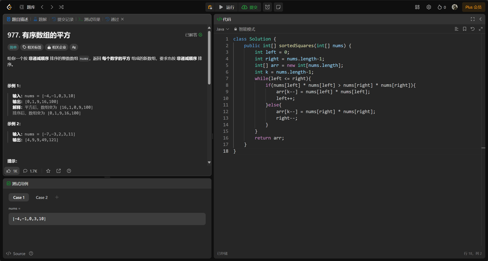

```java
class Solution {
    public int[] sortedSquares(int[] nums) {
        int left = 0;
        int right = nums.length-1;
        int[] arr = new int[nums.length];
        int k = nums.length-1;
        while(left <= right){
            if(nums[left] * nums[left] > nums[right] * nums[right]){
                arr[k--] = nums[left] * nums[left];
                left++;
            }else{
                arr[k--] = nums[right] * nums[right];
                right--;
            }
        }
        return arr;
    }
}
```

双指针法，两边指针

##  209.长度最小的子数组

[209. 长度最小的子数组](https://leetcode.cn/problems/minimum-size-subarray-sum/)

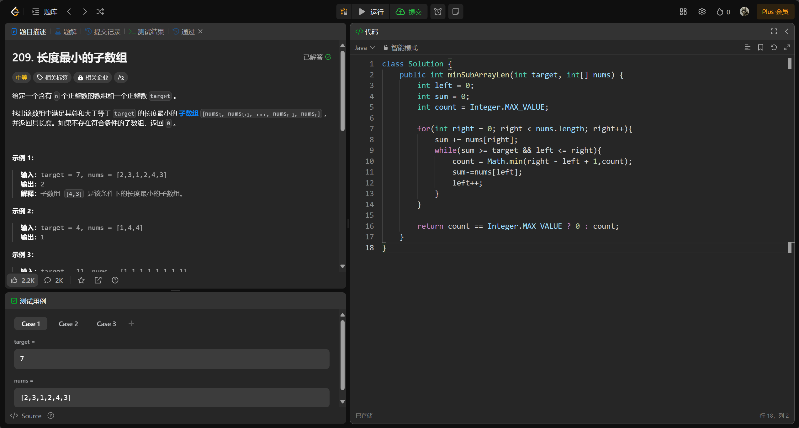

```java
class Solution {
    public int minSubArrayLen(int target, int[] nums) {
        int left = 0;
        int sum = 0;
        int count = Integer.MAX_VALUE;

        for(int right = 0; right < nums.length; right++){
            sum += nums[right];
            while(sum >= target && left <= right){
                count = Math.min(right - left + 1,count);
                sum-=nums[left];
                left++;
            }
        }

        return count == Integer.MAX_VALUE ? 0 : count;
    }
}
```

快慢指针，for循环的快指针嵌套while循环的慢指针

## 59.螺旋矩阵II

[59. 螺旋矩阵 II - 力扣（LeetCode）](https://leetcode.cn/problems/spiral-matrix-ii/description/)


```java
class Solution {
    public int[][] generateMatrix(int n) {
        int[][] nums = new int[n][n];
        int count = 0;
        int x = 0,y = 0;
        int i = 1;
        while(count < n/2){
            //从左到右
            for(; y <  n-count - 1; y++){
                nums[x][y] = i++;
            }
            //从上到下
            for(; x < n-count - 1; x++){
                nums[x][y] = i++;
            }
            //从右到左
            for(;y > count; y--){
                nums[x][y] = i++;
            }
            //从下到上
            for(;x > count; x--){
                nums[x][y] = i++;
            }
            count++;
            x++;
            y++;
        }
        if(n % 2 != 0) nums[n/2][n/2] = i;
        return nums;
    }
}
```

一定要注意，第一个循环x不动，y增加，因为这个问题耽误了很久时间！！！

# 链表

## 203.移除链表元素

[203. 移除链表元素 - 力扣（LeetCode）](https://leetcode.cn/problems/remove-linked-list-elements/description/)

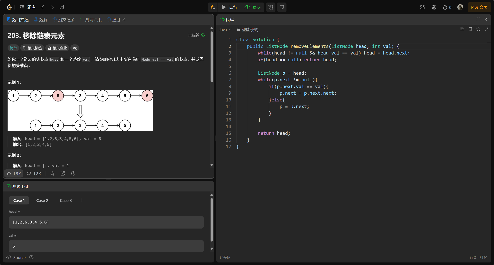

## 707.设计链表

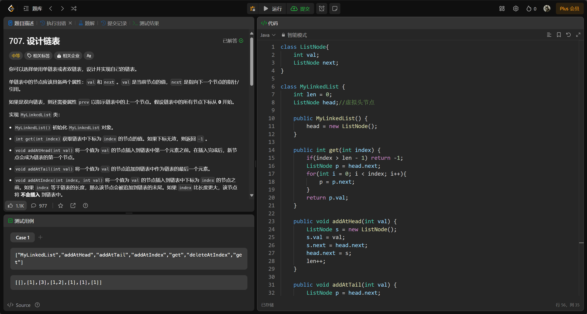

```java
class ListNode{
    int val;
    ListNode next;
}

class MyLinkedList {
    int len = 0;
    ListNode head;//虚拟头节点

    public MyLinkedList() {
        head = new ListNode();
    }
    
    public int get(int index) {
        if(index > len - 1) return -1;
        ListNode p = head.next;
        for(int i = 0; i < index; i++){
            p = p.next;
        }
        return p.val;
    }
    
    public void addAtHead(int val) {
        ListNode s = new ListNode();
        s.val = val;
        s.next = head.next;
        head.next = s;
        len++;
    }
    
    public void addAtTail(int val) {
        ListNode p = head.next;
        for(int i = 0; i < len-1; i++){
            p = p.next;
        }
        ListNode s = new ListNode();
        s.val = val;
        p.next = s;
        len++;
    }
    
    public void addAtIndex(int index, int val) {
        if(index > len - 1) return;
        ListNode s = new ListNode();
        s.val = val;
        ListNode p = head.next;
        for(int i = 0; i < index - 1; i++){
            p = p.next;
        }
        s.next = p.next;
        p.next = s;
        len++;
    }
    
    public void deleteAtIndex(int index) {
        if(index > len - 1) return;
        ListNode p = head.next;
        for(int i = 0; i < index - 1; i++){
            p = p.next;
        }
        p.next = p.next.next;
        len--;
    }
}
```

注意要设置一个虚拟头节点

##  206.反转链表

[206. 反转链表 - 力扣（LeetCode）](https://leetcode.cn/problems/reverse-linked-list/description/)

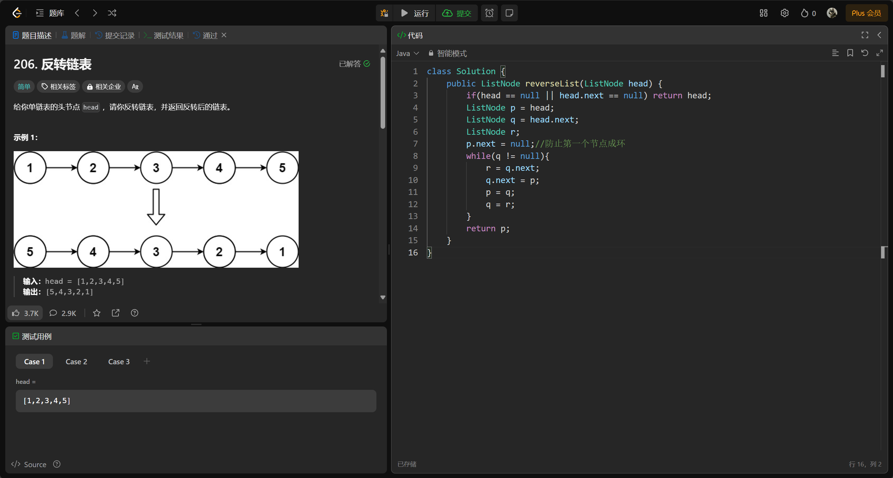

```java
class Solution {
    public ListNode reverseList(ListNode head) {
        if(head == null || head.next == null) return head;
        ListNode p = head;
        ListNode q = head.next;
        ListNode r;
        p.next = null;//防止第一个节点成环
        while(q != null){
            r = q.next;
            q.next = p;
            p = q;
            q = r;
        }
        return p;
    }
}
```

三个节点，前两个节点反转指针，最后一个节点记录q的下一个节点位置

## 24. 两两交换链表中的节点

[24. 两两交换链表中的节点 - 力扣（LeetCode）](https://leetcode.cn/problems/swap-nodes-in-pairs/description/)


```java
class Solution {
    public ListNode swapPairs(ListNode head) {
        if(head == null || head.next == null) return head;
        ListNode xuniHead = new ListNode();
        xuniHead.next = head;
        ListNode q;
        ListNode p = xuniHead;
        while(p.next!=null && p.next.next!=null){
            q = p.next;
            p.next = q.next;
            q.next = p.next.next;
            p.next.next = q;

            p = q;
        }

        return xuniHead.next;
    }
}
```

创建一个虚拟头，加双指针，会方便许多

## 19.删除链表的倒数第N个节点

[19. 删除链表的倒数第 N 个结点 - 力扣（LeetCode）](https://leetcode.cn/problems/remove-nth-node-from-end-of-list/description/)


```java
class Solution {
    public ListNode removeNthFromEnd(ListNode head, int n) {
        ListNode xuniHead = new ListNode();
        xuniHead.next = head;

        ListNode left = xuniHead;
        ListNode right = xuniHead;
        for(int i = 0; i < n; i++)
            right = right.next;
        while(right.next != null){
            left = left.next;
            right = right.next;
        }
        left.next = left.next.next;

        return xuniHead.next;
    }
}
```

设置虚拟头，然后快慢指针法，快指针先移动n次

## 面试题 02.07. 链表相交

[面试题 02.07. 链表相交 - 力扣（LeetCode）](https://leetcode.cn/problems/intersection-of-two-linked-lists-lcci/description/)


```java
public class Solution {
    public ListNode getIntersectionNode(ListNode headA, ListNode headB) {
        ListNode p = headA;
        ListNode q = headB;
        int lenA = 0;
        int lenB = 0;
        while(p != null){
            lenA++;
            p = p.next;
        }
        while(q != null){
            lenB++;
            q = q.next;
        }
        p = headA;
        q = headB;
        if(lenA > lenB){
            int step = lenA - lenB;
            for(int i = 0; i < step; i++){
                p = p.next;
            }
        }else{
            int step = lenB - lenA;
            for(int i = 0; i < step; i++){
                q = q.next;
            }
        }
        while(p != null && p != q){
            p = p.next;
            q = q.next;
        }
        
        return p == q ? p : null;
    }
}
```

先计算长度，比较长的链表先走step次。

##  ⭐142.环形链表II

[142. 环形链表 II - 力扣（LeetCode）](https://leetcode.cn/problems/linked-list-cycle-ii/description/)

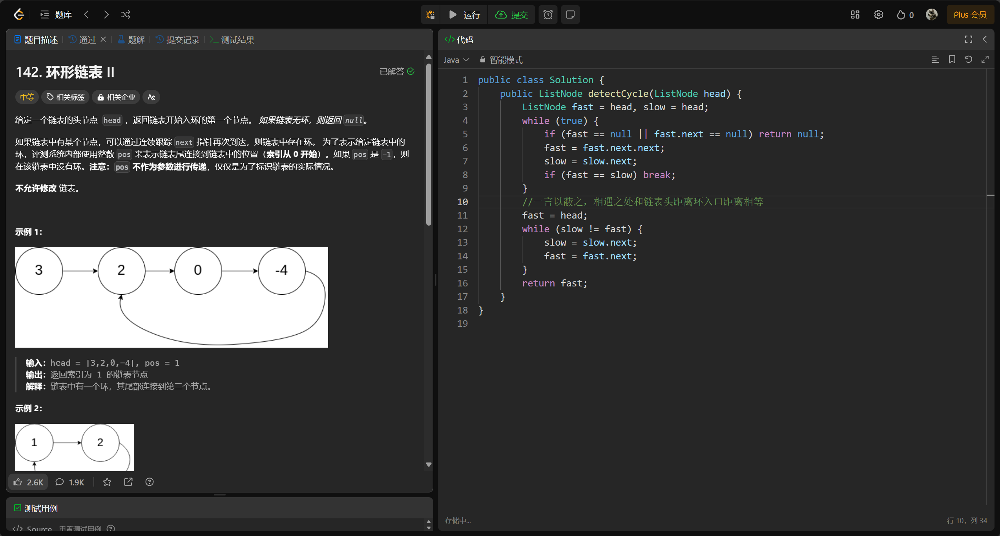

```java
public class Solution {
    public ListNode detectCycle(ListNode head) {
        ListNode fast = head, slow = head;
        while (true) {
            if (fast == null || fast.next == null) return null;
            fast = fast.next.next;
            slow = slow.next;
            if (fast == slow) break;
        }
        //一言以蔽之，相遇之处和链表头距离环入口距离相等
        fast = head;
        while (slow != fast) {
            slow = slow.next;
            fast = fast.next;
        }
        return fast;
    }
}

```

快指针一次走两步，慢指针一次走一步，到达相遇点以后，有一个指针回到头节点，然后两个指针同时往下走，相遇点就是入口。


一言以蔽之，相遇之处和链表头距离环入口距离相等

# 哈希表

## 242.有效的字母异位词

[242. 有效的字母异位词 - 力扣（LeetCode）](https://leetcode.cn/problems/valid-anagram/description/)

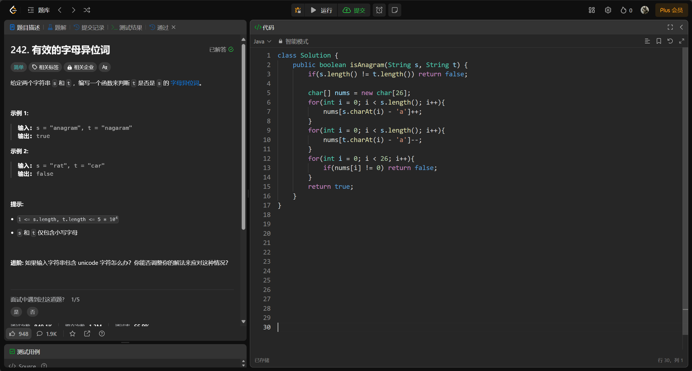

```java
class Solution {
    public boolean isAnagram(String s, String t) { 
        if(s.length() != t.length()) return false;

        char[] nums = new char[26];
        for(int i = 0; i < s.length(); i++){
            nums[s.charAt(i) - 'a']++;
        }
        for(int i = 0; i < s.length(); i++){
            nums[t.charAt(i) - 'a']--;
        }
        for(int i = 0; i < 26; i++){
            if(nums[i] != 0) return false;
        }
        return true;
    }
}
```

三个循环解决问题，用一个字母数组存放每个字母个数。

##  349. 两个数组的交集

[349. 两个数组的交集 - 力扣（LeetCode）](https://leetcode.cn/problems/intersection-of-two-arrays/description/)


```java
class Solution {
    public int[] intersection(int[] nums1, int[] nums2) {
        Set<Integer> set1 = new HashSet<>();
        Set<Integer> set2 = new HashSet<>();

        for(int i = 0; i < nums1.length; i++){
            set1.add(nums1[i]);
        }
        for(int i = 0; i < nums2.length; i++){
            if(set1.contains(nums2[i])) set2.add(nums2[i]);
        }
        int[] result = new int[set2.size()];
        int i = 0;
        for(int k : set2){
            result[i++] = k;
        }
        return result;
    }
}
```

使用两个set，第一个用于存放数组1，第二个用于遍历数组2的时候判断是否时交集，是的话就放第二个set中

## 第202题. 快乐数

[202. 快乐数 - 力扣（LeetCode）](https://leetcode.cn/problems/happy-number/description/)


```java
class Solution {
    public boolean isHappy(int n) {
        Set<Integer> set = new HashSet<>();
        int sum = 0;
        int i;
        while(true){
            while(n != 0){
                i = n % 10;
                n = n / 10;
                sum += i * i;
            }
            if(sum == 1){
                return true;
            }else if(set.contains(sum)){
                return false;
            }else{
                set.add(sum);
            }
            n = sum;
            sum = 0;
        }

    }
}
```

这道题的关键在于，在循环求sum过程中，一旦重复说明必定不是快乐数，所以可以把循环过程中的sum放入set中，以后判断是否重复，用两个while循环判断，外循环判断sum，内循环计算sum。

## 1. 两数之和

[1. 两数之和 - 力扣（LeetCode）](https://leetcode.cn/problems/two-sum/description/)


```java
class Solution {
    public int[] twoSum(int[] nums, int target) {
        Map<Integer,Integer> map = new HashMap<>();
        for(int i = 0; i < nums.length; i++){
            map.put(nums[i],i);
        }

        int[] result = new int[2];
        for(int i = 0; i < nums.length; i++){
            int k = target - nums[i];
            //!!!!!!!!!!!!!!!!!!!map的contain方法是containsKey！！！！！
            if(map.containsKey(k) && i != map.get(k)){
                result[0] = i;
                result[1] = map.get(k);
                return result;
            }
        }
        return result;
    }
}
```

用一个HashMap，key是数字，value是下标，一定注意map的contain方法是containsKey！！！！！

## 第454题.四数相加II

[454. 四数相加 II - 力扣（LeetCode）](https://leetcode.cn/problems/4sum-ii/description/)


前两个数放到map中，key是两数值和，value是次数。两个双层循环。

## 383. 赎金信

[383. 赎金信 - 力扣（LeetCode）](https://leetcode.cn/problems/ransom-note/description/)


```java
class Solution {
    public boolean canConstruct(String ransomNote, String magazine) {
        int[] nums = new int[26];
        for(int i = 0; i < magazine.length(); i++){
            nums[magazine.charAt(i) - 'a']++;
        }

        for(int i = 0; i < ransomNote.length(); i++){
            nums[ransomNote.charAt(i) - 'a']--;
        }

        for(int i = 0; i < 26; i++){
            if(nums[i] < 0) return false;
        }
        return true;
    }
}
```

和前面有效的字母异位词很像，三次循环，第一次循环放值，第二次取值，第三次判断，因为字母固定，所以可以用int数组代替hash。

## ⭐第15题. 三数之和

[15. 三数之和 - 力扣（LeetCode）](https://leetcode.cn/problems/3sum/description/)


```java
class Solution {
    public List<List<Integer>> threeSum(int[] nums) {
        List<List<Integer>> list = new ArrayList<>();
        Arrays.sort(nums);

        for(int k = 0; k < nums.length - 2; k++){
            if(nums[k] > 0) break;
            if(k!= 0 && nums[k] == nums[k-1]) continue;
            int i = k+1;
            int j = nums.length-1;
            while(i < j){
                int sum = nums[k] + nums[i] + nums[j];
                if(sum < 0){
                    i++;
                }else if(sum > 0){
                    j--;
                }else{
                    List<Integer> t = new ArrayList<>(Arrays.asList(nums[k],nums[i],nums[j]));
                    list.add(t);
                    while(i < j && nums[i+1] == nums[i]) i++;
                    while(i < j && nums[j-1] == nums[j]) j--;
                    i++;
                    j--;
                }
            }

        }
        return list;
    }
}
```

三数之和，不用hash！！！用三指针法， 先排序，然后，后面两个指针往中间移动。

## ⭐第18题. 四数之和

[18. 四数之和 - 力扣（LeetCode）](https://leetcode.cn/problems/4sum/description/)


```java
class Solution {
    public List<List<Integer>> fourSum(int[] nums, int target) {
        List<List<Integer>> list = new ArrayList<>();
        Arrays.sort(nums);

        for(int i = 0; i < nums.length-3; i++){
            if((long)nums[i] + nums[i+1] + nums[i+2] + nums[i+3]> target) break;
            if(i != 0 && nums[i] == nums[i-1]) continue;
            for(int j = i+1; j < nums.length-2; j++){
                if((long)nums[i] + nums[j] + nums[j+1] + nums[j+2]> target) break;
                if(j != i+1 && nums[j] == nums[j-1]) continue;

                int m = j+1;
                int n = nums.length-1;

                while(m < n){
                    int sum = nums[i] + nums[j] + nums[m] + nums[n];
                    if(sum < target){
                        m++;
                    }else if(sum > target){
                        n--;
                    }else{
                        List<Integer> t = new ArrayList(Arrays.asList(nums[i],nums[j],nums[m],nums[n]));
                        list.add(t);
                        while(m < n && nums[m+1] == nums[m]) m++;
                        while(m < n && nums[n-1] == nums[n]) n--;
                        m++;
                        n--;
                    }
                }

            }
        }

        return list;
    }
}
```

还是用双指针法，注意！！！有几个过不了的案例，是因为超出int范围了，要转为long。

# 字符串

## 344.反转字符串

[344. 反转字符串 - 力扣（LeetCode）](https://leetcode.cn/problems/reverse-string/)

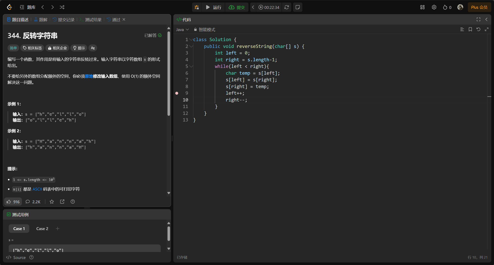

```java
class Solution {
    public void reverseString(char[] s) {
        int left = 0;
        int right = s.length-1;
        while(left < right){
            char temp = s[left];
            s[left] = s[right];
            s[right] = temp;
            left++;
            right--;
        }
    }
}
```

## ⭐541. 反转字符串II

[541. 反转字符串 II - 力扣（LeetCode）](https://leetcode.cn/problems/reverse-string-ii/description/)


```java
class Solution {
    public String reverseStr(String s, int k) {
        char[] str = s.toCharArray();

        for(int i = 0; i < s.length(); i += 2*k){
            int j = Math.min(i + k - 1,s.length()-1);
            swap(str,i,j);
        }
        
        return new String(str);
    }

    public static void swap(char[] str, int left, int right){
        while(left < right){
            char temp = str[left];
            str[left] = str[right];
            str[right] = temp;
            left++;
            right--;
        }
    }
}
```

for循环套swap函数，注意j的值为int j = **Math.min(i + k - 1,s.length()-1);**

## ⭐151.翻转字符串里的单词

[151. 反转字符串中的单词 - 力扣（LeetCode）](https://leetcode.cn/problems/reverse-words-in-a-string/)


```java
class Solution {
    public String reverseWords(String s) {
        char[] str = delSpace(s.trim()).toCharArray();
        swap(str,0,str.length-1);

        for(int i = 0; i < str.length;){
            int j = i+1;
            while(j < str.length && str[j] != ' ') j++;
            swap(str,i,j-1);
            i = j+1;
        }
        return new String(str);
    }
    //去除多余空格
    public static String delSpace(String s){
        StringBuffer sb = new StringBuffer();
        int i = 0;
        for(; i < s.length(); i++){
            if(s.charAt(i) == ' '){
                sb.append(' ');
                while(s.charAt(i+1) == ' ') i++;
            }else{
                sb.append(s.charAt(i));
            }
        }
        return new String(sb);
    }
    //反转字符串
    public static void swap(char[] str,int left, int right){
        while(left < right){
            char temp = str[left];
            str[left] = str[right];
            str[right] = temp;
            left++;
            right--;
        }
    }
}
```

第一步：去除字符串前后的空格和重点多余的空格

第二步：反转整个字符串

第三步：逐个单词反转

##  ⭐28. 实现 strStr()

[28. 找出字符串中第一个匹配项的下标 - 力扣（LeetCode）](https://leetcode.cn/problems/find-the-index-of-the-first-occurrence-in-a-string/description/)


```java
class Solution {
    //前缀表（不减一）Java实现
    public int strStr(String haystack, String needle) {
        if (needle.length() == 0) return 0;
        int[] next = new int[needle.length()];
        getNext(next, needle);

        int j = 0;
        for (int i = 0; i < haystack.length(); i++) {
            while (j > 0 && needle.charAt(j) != haystack.charAt(i)) 
                j = next[j - 1];
            if (needle.charAt(j) == haystack.charAt(i)) 
                j++;
            if (j == needle.length()) 
                return i - needle.length() + 1;
        }
        return -1;

    }
    
    private void getNext(int[] next, String s) {
        int j = 0;
        next[0] = 0;
        for (int i = 1; i < s.length(); i++) {
            while (j > 0 && s.charAt(j) != s.charAt(i)) 
                j = next[j - 1];
            if (s.charAt(j) == s.charAt(i)) 
                j++;
            next[i] = j; 
        }
    }
}
```

## ⭐459.重复的子字符串

[459. 重复的子字符串 - 力扣（LeetCode）](https://leetcode.cn/problems/repeated-substring-pattern/description/)


```java
class Solution {
    public boolean repeatedSubstringPattern(String s) {
        String str = s + s;
        return str.substring(1,str.length()-1).contains(s);
    }
}
```

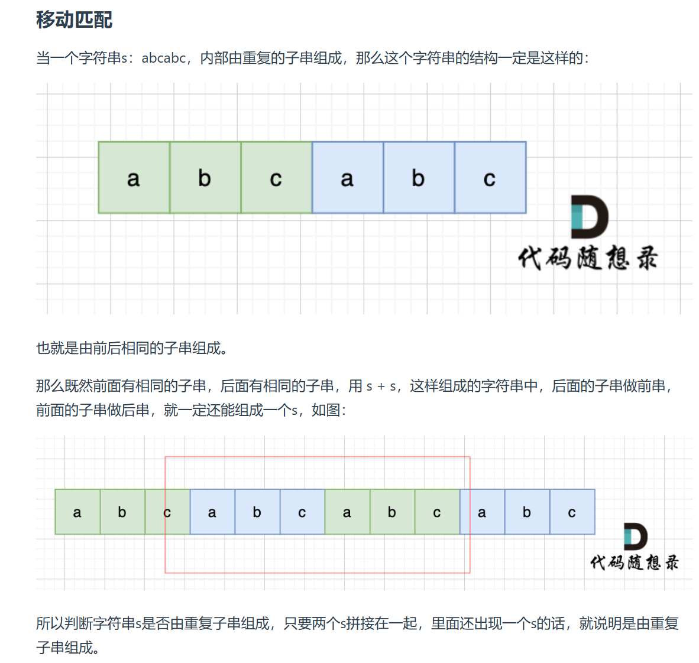

# 栈与队列

## ⭐232.用栈实现队列

[232. 用栈实现队列 - 力扣（LeetCode）](https://leetcode.cn/problems/implement-queue-using-stacks/description/)


```java
class MyQueue {
    Stack<Integer> a;
    Stack<Integer> b;

    public MyQueue() {
        a = new Stack<>();
        b = new Stack<>();
    }
    
    public void push(int x) {
        a.push(x);
    }
    
    public int pop() {
        if(b.isEmpty()){
            while(!a.isEmpty()){
                b.push(a.pop());
            }
        }
        return b.pop();
    }
    
    public int peek() {
        if(b.isEmpty()){
            while(!a.isEmpty()){
                b.push(a.pop());
            }
        }
        return b.peek();
    }
    
    public boolean empty() {
        if(a.isEmpty() && b.isEmpty()) return true;
        return false;
    }
}
```

## ⭐225. 用队列实现栈

[225. 用队列实现栈 - 力扣（LeetCode）](https://leetcode.cn/problems/implement-stack-using-queues/description/)

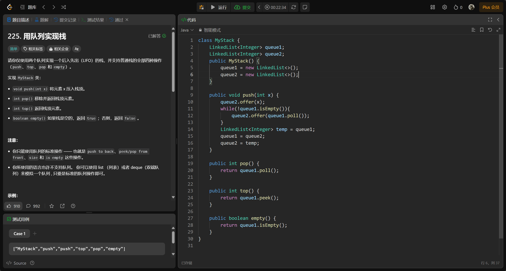

```java
class MyStack {
    LinkedList<Integer> queue1;
    LinkedList<Integer> queue2;
    public MyStack() {
        queue1 = new LinkedList<>();
        queue2 = new LinkedList<>();
    }
    
    public void push(int x) {
        queue2.offer(x);
        while(!queue1.isEmpty()){
            queue2.offer(queue1.poll());
        }
        LinkedList<Integer> temp = queue1;
        queue1 = queue2;
        queue2 = temp;
    }
    
    public int pop() {
        return queue1.poll();
    }
    
    public int top() {
        return queue1.peek();
    }
    
    public boolean empty() {
        return queue1.isEmpty();
    }
}
```

**用两个队列que1和que2实现队列的功能，que2其实完全就是一个备份的作用**，把que1最后面的元素以外的元素都备份到que2，然后弹出最后面的元素，再把q1和q2互换，主队列变从队列，从队列变主队列。

##  20. 有效的括号

[20. 有效的括号 - 力扣（LeetCode）](https://leetcode.cn/problems/valid-parentheses/description/)

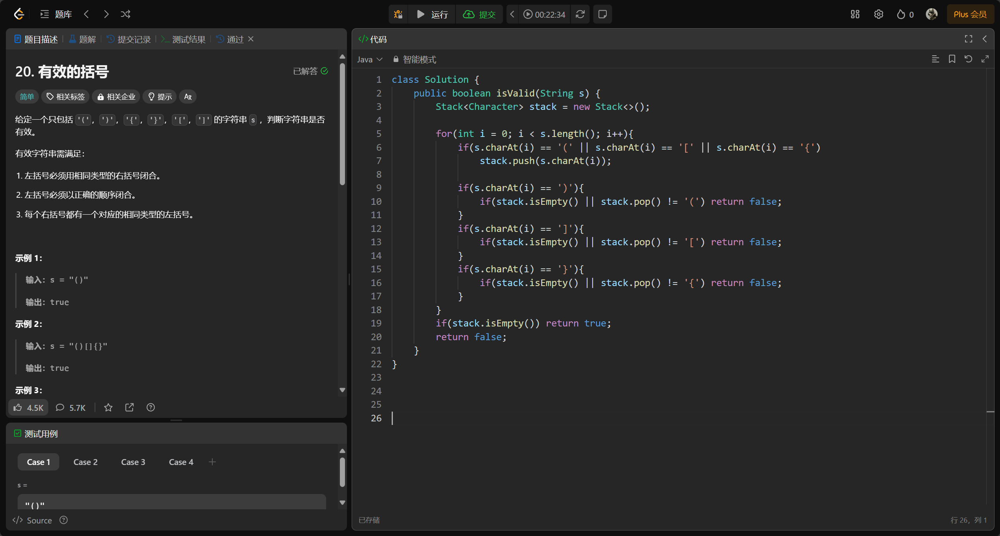

```java
class Solution {
    public boolean isValid(String s) {
        Stack<Character> stack = new Stack<>();

        for(int i = 0; i < s.length(); i++){
            if(s.charAt(i) == '(' || s.charAt(i) == '[' || s.charAt(i) == '{')
                stack.push(s.charAt(i));

            if(s.charAt(i) == ')'){
                if(stack.isEmpty() || stack.pop() != '(') return false;
            }
            if(s.charAt(i) == ']'){
                if(stack.isEmpty() || stack.pop() != '[') return false;
            }
            if(s.charAt(i) == '}'){
                if(stack.isEmpty() || stack.pop() != '{') return false;
            }
        }
        if(stack.isEmpty()) return true;
        return false;
    }
}
```

## 1047. 删除字符串中的所有相邻重复项

[1047. 删除字符串中的所有相邻重复项 - 力扣（LeetCode）](https://leetcode.cn/problems/remove-all-adjacent-duplicates-in-string/description/)


```java
class Solution {
    public String removeDuplicates(String s) {
        Stack<Character> stack = new Stack<>();

        for(int i = 0; i < s.length(); i++){
            if(!stack.isEmpty() && s.charAt(i) == stack.peek()){
                stack.pop();
            }else{
                stack.push(s.charAt(i));
            }
        }
        char[] str = new char[stack.size()];
        for(int i = str.length-1; i >= 0; i--){
            str[i] = stack.pop();
        }
        return new String(str);
    }
}
```

栈

## 150. 逆波兰表达式求值


```java
class Solution {
    public int evalRPN(String[] tokens) {
        Stack<Integer> stack = new Stack<>();
        for(int i = 0; i < tokens.length; i++){
            if(tokens[i].equals("+")){
                int a = stack.pop();
                int b =  stack.pop();
                stack.push(a+b);
            }else if(tokens[i].equals("-")){
                int a = stack.pop();
                int b =  stack.pop(); 
                stack.push(b-a);
            }else if(tokens[i].equals("*")){
                int a = stack.pop();
                int b =  stack.pop();
                stack.push(a*b);
            }else if(tokens[i].equals("/")){
                int a = stack.pop();
                int b =  stack.pop();
                stack.push(b/a);
            }else{
                System.out.println(tokens[i]);
                stack.push(Integer.parseInt(tokens[i]));
            }
        }
        return stack.pop();
    }
}
```

切记！字符串判等要用equals

##  239. 滑动窗口最大值

[239. 滑动窗口最大值 - 力扣（LeetCode）](https://leetcode.cn/problems/sliding-window-maximum/description/)

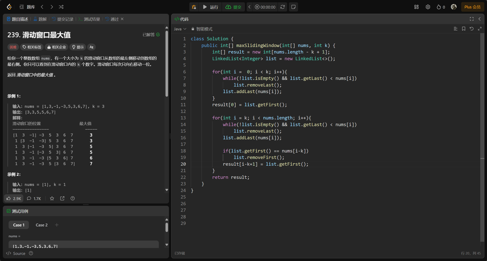

```java
class Solution {
    public int[] maxSlidingWindow(int[] nums, int k) {
        int[] result = new int[nums.length - k + 1];
        LinkedList<Integer> list = new LinkedList<>();

        for(int i =  0; i < k; i++){
            while(!list.isEmpty() && list.getLast() < nums[i]) 
                list.removeLast();
            list.addLast(nums[i]);
        }
        result[0] = list.getFirst();

        for(int i = k; i < nums.length; i++){
            while(!list.isEmpty() && list.getLast() < nums[i]) 
                list.removeLast();
            list.addLast(nums[i]);

            if(list.getFirst() == nums[i-k])
                list.removeFirst();
            result[i-k+1] = list.getFirst();
        }
        return result;
    }
}
```


想像成在飞机上往下看,如果有更高的山峰出现在视野中,那么这座山之前的所有山都可以去掉了,因为他们肯定更先消失且最高峰不可能是他们,使用双端队列(递减)实现,进值一个个从右边进入(进入前出队比当前值小的),取值一个个从左边取(不出队只是取值)

## ⭐347.前 K 个高频元素

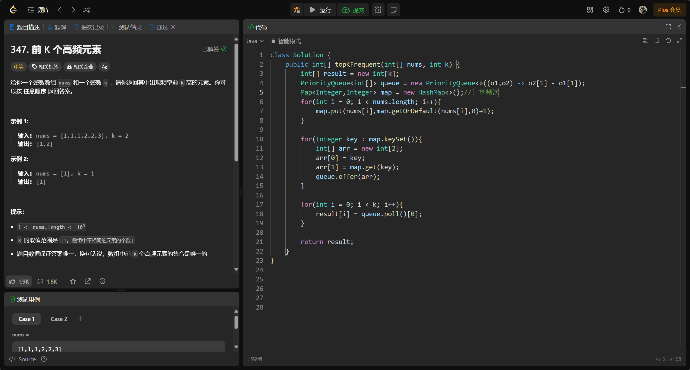

```java
class Solution {
    public int[] topKFrequent(int[] nums, int k) {
        int[] result = new int[k];
        PriorityQueue<int[]> queue = new PriorityQueue<>((o1,o2) -> o2[1] - o1[1]);
        Map<Integer,Integer> map = new HashMap<>();//计算频次
        for(int i = 0; i < nums.length; i++){
            map.put(nums[i],map.getOrDefault(nums[i],0)+1);
        }

        for(Integer key : map.keySet()){
            int[] arr = new int[2];
            arr[0] = key;
            arr[1] = map.get(key);
            queue.offer(arr);
        }
        
        for(int i = 0; i < k; i++){
            result[i] = queue.poll()[0];
        }

        return result;
    }
}
```

一个HashMap计算频次，一个PriorityQueue比较。

# 二叉树

下次刷按照这个顺序[算法笔记 (programmercarl.com)](https://www.programmercarl.com/二叉树总结篇.html#二叉树的修改与构造)

## 方法论

1. **确定递归函数的参数和返回值：** 确定哪些参数是递归的过程中需要处理的，那么就在递归函数里加上这个参数， 并且还要明确每次递归的返回值是什么进而确定递归函数的返回类型。
2. **确定终止条件：** 写完了递归算法, 运行的时候，经常会遇到栈溢出的错误，就是没写终止条件或者终止条件写的不对，操作系统也是用一个栈的结构来保存每一层递归的信息，如果递归没有终止，操作系统的内存栈必然就会溢出。
3. **确定单层递归的逻辑：** 确定每一层递归需要处理的信息。在这里也就会重复调用自己来实现递归的过程。


## 二叉树前中后序遍历（递归）

[144. 二叉树的前序遍历](https://leetcode.cn/problems/binary-tree-preorder-traversal/)


```java
class Solution {
    public List<Integer> preorderTraversal(TreeNode root) {
        List<Integer> list = new ArrayList<>();
        preorder(root,list);
        return list;
    }
    public static void preorder(TreeNode root,List<Integer> list ){
        if(root == null)
            return;
        
        list.add(root.val);
        preorder(root.left,list);
        preorder(root.right,list);
    }
}
```

[145. 二叉树的后序遍历 - 力扣（LeetCode）](https://leetcode.cn/problems/binary-tree-postorder-traversal/description/)


```java
class Solution {
    public List<Integer> postorderTraversal(TreeNode root) {
        List<Integer> list = new ArrayList<>();
        postorder(root,list);
        return list;
    }
    public static void postorder(TreeNode root,List<Integer> list){
        if(root == null)
            return;
        postorder(root.left,list);
        postorder(root.right,list);
        list.add(root.val);
    }
}
```

[94. 二叉树的中序遍历 - 力扣（LeetCode）](https://leetcode.cn/problems/binary-tree-inorder-traversal/description/)


```java
class Solution {
    public List<Integer> inorderTraversal(TreeNode root) {
        List<Integer> list = new ArrayList<>();
        inorder(root,list);
        return list;
    }
    public static void inorder(TreeNode root,List<Integer> list){
        if(root == null)
            return;
        inorder(root.left,list);
        list.add(root.val);
        inorder(root.right,list);
    }
}
```

## ⭐二叉树前中后序遍历（迭代）

[144. 二叉树的前序遍历 - 力扣（LeetCode）](https://leetcode.cn/problems/binary-tree-preorder-traversal/description/)

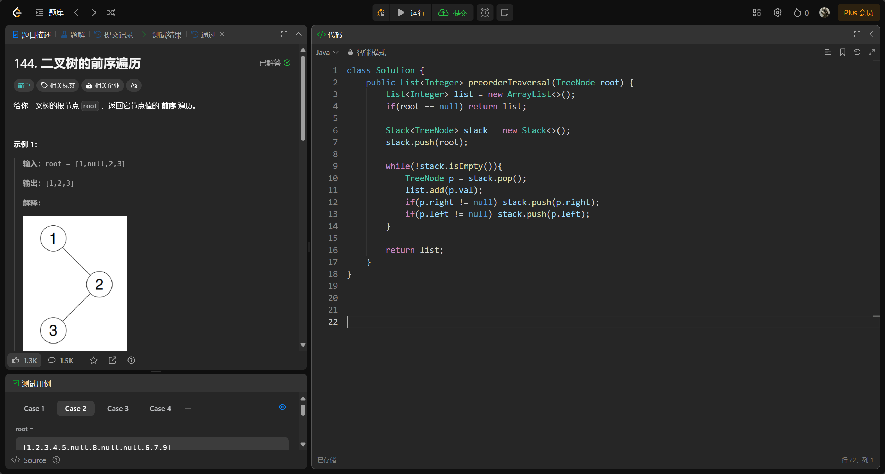

```java
class Solution {
    public List<Integer> preorderTraversal(TreeNode root) {
        List<Integer> list = new ArrayList<>();
        if(root == null) return list;

        Stack<TreeNode> stack = new Stack<>();
        stack.push(root);

        while(!stack.isEmpty()){
            TreeNode p = stack.pop();
            list.add(p.val);
            if(p.right != null) stack.push(p.right);
            if(p.left != null) stack.push(p.left);
        }

        return list;
    }
}
```

前序遍历是中左右，每次先处理的是中间节点，那么先将根节点放入栈中，然后将右孩子加入栈，再加入左孩子。

为什么要先加入 右孩子，再加入左孩子呢？ 因为这样出栈的时候才是中左右的顺序。

[145. 二叉树的后序遍历 - 力扣（LeetCode）](https://leetcode.cn/problems/binary-tree-postorder-traversal/description/)


```java
class Solution {
    public List<Integer> postorderTraversal(TreeNode root) {
        List<Integer> list = new ArrayList<>();
        if(root == null) return list;

        Stack<TreeNode> stack = new Stack<>();
        stack.push(root);

        while(!stack.isEmpty()){

            TreeNode p = stack.pop();
            list.add(p.val);

            if(p.left != null) stack.push(p.left);
            if(p.right != null) stack.push(p.right);

        }
        Collections.reverse(list);
        return list;
    }
}
```

再来看后序遍历，先序遍历是中左右，后序遍历是左右中，那么我们只需要调整一下先序遍历的代码顺序，就变成中右左的遍历顺序，然后在反转result数组，输出的结果顺序就是左右中了，如下图：


[94. 二叉树的中序遍历 - 力扣（LeetCode）](https://leetcode.cn/problems/binary-tree-inorder-traversal/description/)

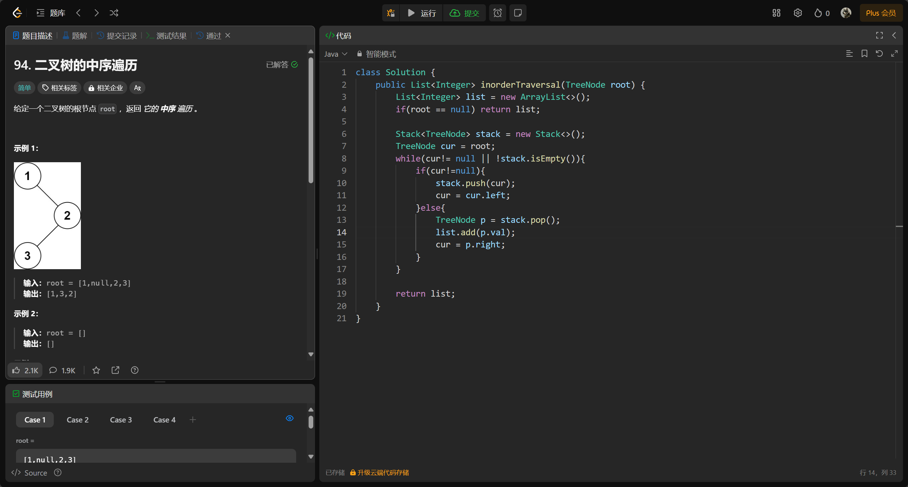

```java
class Solution {
    public List<Integer> inorderTraversal(TreeNode root) {
        List<Integer> list = new ArrayList<>();
        if(root == null) return list;

        Stack<TreeNode> stack = new Stack<>();
        TreeNode cur = root;
        while(cur!= null || !stack.isEmpty()){
            if(cur!=null){
                stack.push(cur);
                cur = cur.left;
            }else{
                TreeNode p = stack.pop();
                list.add(p.val);
                cur = p.right;
            }
        }

        return list;
    }
}
```

**在使用迭代法写中序遍历，就需要借用指针的遍历来帮助访问节点，栈则用来处理节点上的元素。**

如果cur!=null就一直向左找，找不到就pop数据，并把cur指向pop出节点的右子树。

## 二叉树层序遍历	

- [102.二叉树的层序遍历(opens new window)](https://leetcode.cn/problems/binary-tree-level-order-traversal/)


```java
class Solution {
    public List<List<Integer>> levelOrder(TreeNode root) {
        List<List<Integer>> list = new ArrayList<>();
        if(root == null) return list;

        Queue<TreeNode> queue = new LinkedList<>();
        queue.offer(root);
        while(!queue.isEmpty()){
            List<Integer> temp = new ArrayList<>();
            int len = queue.size();

            for(int i = 0; i < len; i++){
                TreeNode p = queue.poll();
                temp.add(p.val);
                
                if(p.left != null)  queue.offer(p.left);
                if(p.right != null)  queue.offer(p.right);
            }
            list.add(temp);
        }
        return list;
    }
}
```

用队列！！！

- [107.二叉树的层次遍历II(opens new window)](https://leetcode.cn/problems/binary-tree-level-order-traversal-ii/)

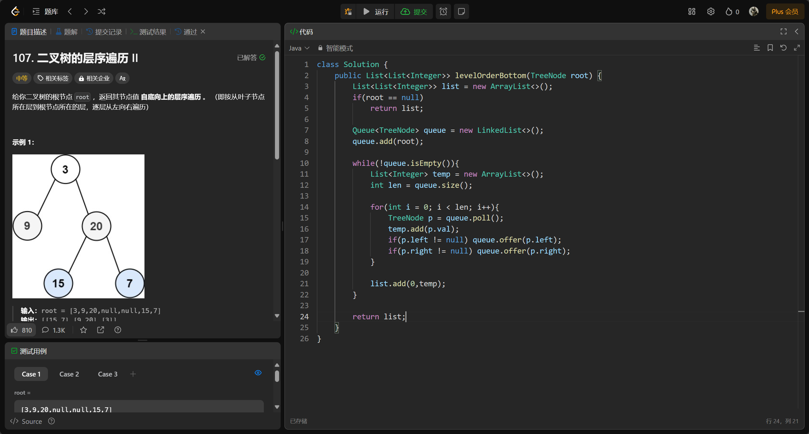

```java
class Solution {
    public List<List<Integer>> levelOrderBottom(TreeNode root) {
        List<List<Integer>> list = new ArrayList<>();
        if(root == null)
            return list;

        Queue<TreeNode> queue = new LinkedList<>();
        queue.add(root);

        while(!queue.isEmpty()){
            List<Integer> temp = new ArrayList<>();
            int len = queue.size();

            for(int i = 0; i < len; i++){
                TreeNode p = queue.poll();
                temp.add(p.val);
                if(p.left != null) queue.offer(p.left);
                if(p.right != null) queue.offer(p.right);
            }

            list.add(0,temp);
        }

        return list;
    }
}
```

插入list的时候采用头插法即可，或者最后反转一下list

- [199.二叉树的右视图(opens new window)](https://leetcode.cn/problems/binary-tree-right-side-view/)

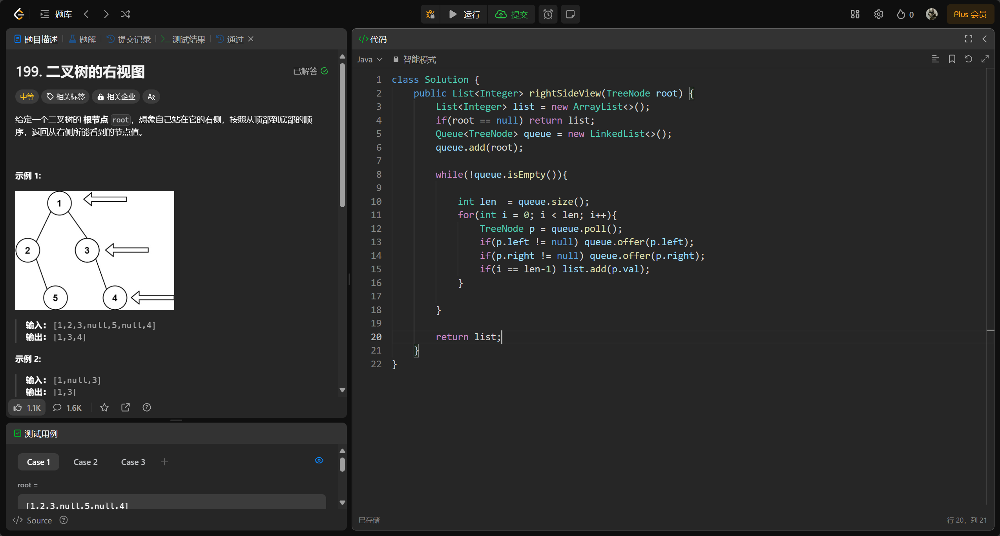

```java
class Solution {
    public List<Integer> rightSideView(TreeNode root) {
        List<Integer> list = new ArrayList<>();
        if(root == null) return list;
        Queue<TreeNode> queue = new LinkedList<>();
        queue.add(root);

        while(!queue.isEmpty()){

            int len  = queue.size();
            for(int i = 0; i < len; i++){
                TreeNode p = queue.poll();
                if(p.left != null) queue.offer(p.left);
                if(p.right != null) queue.offer(p.right);
                if(i == len-1) list.add(p.val);
            }
            
        }

        return list;
    }
}
```

- [637.二叉树的层平均值(opens new window)](https://leetcode.cn/problems/average-of-levels-in-binary-tree/)


```java
class Solution {
    public List<Double> averageOfLevels(TreeNode root) {
        List<Double> list = new ArrayList<>();
        Queue<TreeNode> queue = new LinkedList<>();
        queue.add(root);

        while(!queue.isEmpty()){
            int len = queue.size();
            double sum = 0;
            for(int i = 0; i < len; i++){
                TreeNode p = queue.poll();
                sum += p.val;
                if(p.left != null) queue.offer(p.left);
                if(p.right != null) queue.offer(p.right);
            }
            list.add(sum/len);

        }
        return list;

    }
}
```

- [429.N叉树的层序遍历(opens new window)](https://leetcode.cn/problems/n-ary-tree-level-order-traversal/)

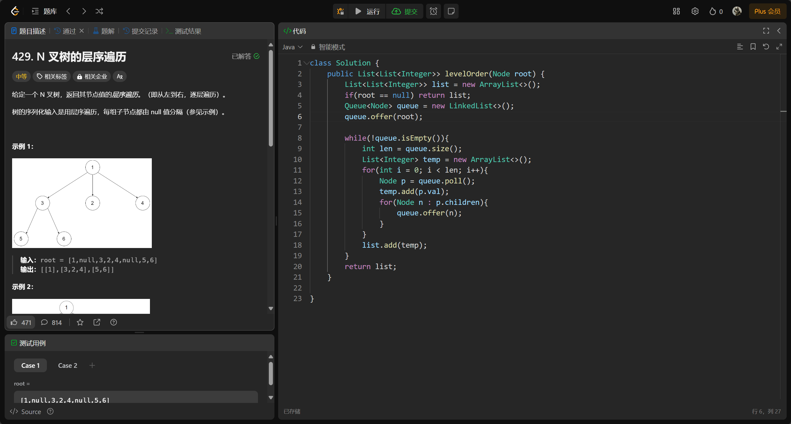

```java
class Solution {
    public List<List<Integer>> levelOrder(Node root) {
        List<List<Integer>> list = new ArrayList<>();
        if(root == null) return list;
        Queue<Node> queue = new LinkedList<>();
        queue.offer(root);

        while(!queue.isEmpty()){
            int len = queue.size();
            List<Integer> temp = new ArrayList<>();
            for(int i = 0; i < len; i++){
                Node p = queue.poll();
                temp.add(p.val);
                for(Node n : p.children){
                    queue.offer(n);
                }
            }
            list.add(temp);
        }
        return list;
    }

}
```

- [515.在每个树行中找最大值(opens new window)](https://leetcode.cn/problems/find-largest-value-in-each-tree-row/)


```java
class Solution {
    public List<Integer> largestValues(TreeNode root) {
        List<Integer> list = new ArrayList<>();
        if(root == null) return list;
        Queue<TreeNode> queue = new LinkedList<>();
        queue.add(root);

        while(!queue.isEmpty()){
            int len = queue.size();
            int max = Integer.MIN_VALUE;

            for(int i = 0; i < len; i++){
                TreeNode p = queue.poll();
                max = Math.max(max,p.val);
                if(p.left != null) queue.offer(p.left);
                if(p.right != null) queue.offer(p.right);
            }
            list.add(max);

        }
        return list;
    }
}
```

- [116.填充每个节点的下一个右侧节点指针(opens new window)](https://leetcode.cn/problems/populating-next-right-pointers-in-each-node/)

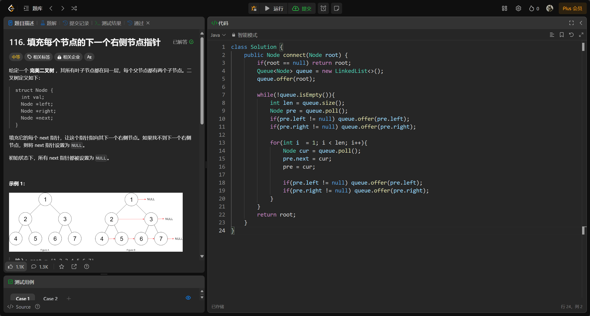

```java
class Solution {
    public Node connect(Node root) {
        if(root == null) return root;
        Queue<Node> queue = new LinkedList<>();
        queue.offer(root);

        while(!queue.isEmpty()){
            int len = queue.size();
            Node pre = queue.poll();
            if(pre.left != null) queue.offer(pre.left);
            if(pre.right != null) queue.offer(pre.right);
            
            for(int i  = 1; i < len; i++){
                Node cur = queue.poll();
                pre.next = cur;
                pre = cur;

                if(pre.left != null) queue.offer(pre.left);
                if(pre.right != null) queue.offer(pre.right);
            }
        }
        return root;
    }
}
```

- [117.填充每个节点的下一个右侧节点指针II(opens new window)](https://leetcode.cn/problems/populating-next-right-pointers-in-each-node-ii/)


```java
class Solution {
    public Node connect(Node root) {
        if(root == null) return root;
        Queue<Node> queue = new LinkedList<>();
        queue.offer(root);

        while(!queue.isEmpty()){
            int len = queue.size();
            Node pre = queue.poll();
            if(pre.left != null) queue.offer(pre.left);
            if(pre.right != null) queue.offer(pre.right);
            
            for(int i  = 1; i < len; i++){
                Node cur = queue.poll();
                pre.next = cur;
                pre = cur;

                if(pre.left != null) queue.offer(pre.left);
                if(pre.right != null) queue.offer(pre.right);
            }
        }
        return root;
    }
}
```

- [104.二叉树的最大深度(opens new window)](https://leetcode.cn/problems/maximum-depth-of-binary-tree/)


```java
class Solution {
    public int maxDepth(TreeNode root) {
        if(root == null) return 0;
        Queue<TreeNode> queue = new LinkedList<>();
        queue.offer(root);

        int count = 0;
        while(!queue.isEmpty()){
            int len = queue.size();
            for(int i = 0; i < len; i++){
                TreeNode p = queue.poll();
                if(p.left != null) queue.offer(p.left);
                if(p.right != null) queue.offer(p.right);
            }
            count++;
        }
        return count;
    }
}
```

- [111.二叉树的最小深度](https://leetcode.cn/problems/minimum-depth-of-binary-tree/)

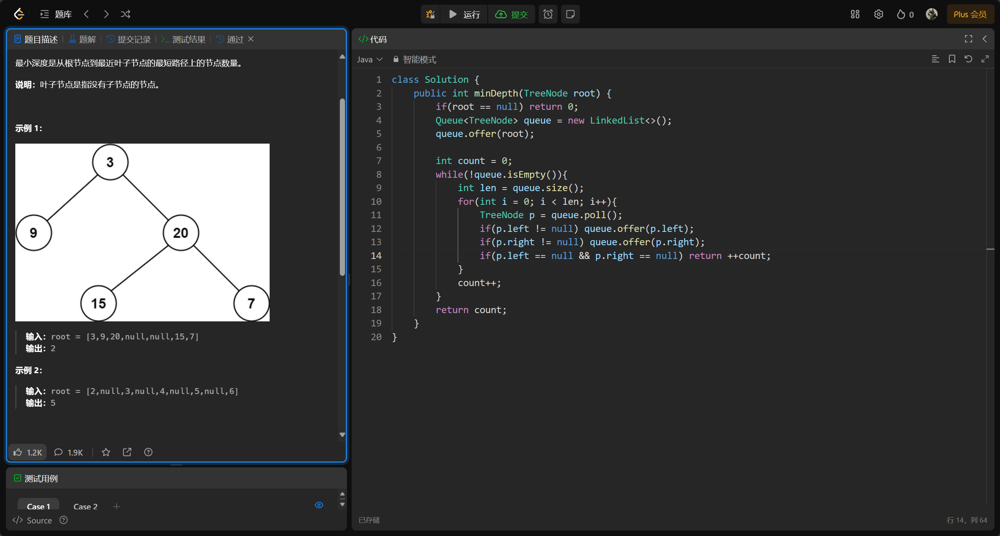

```java
class Solution {
    public int minDepth(TreeNode root) {
        if(root == null) return 0;
        Queue<TreeNode> queue = new LinkedList<>();
        queue.offer(root);
        
        int count = 0;
        while(!queue.isEmpty()){
            int len = queue.size();
            for(int i = 0; i < len; i++){
                TreeNode p = queue.poll();
                if(p.left != null) queue.offer(p.left);
                if(p.right != null) queue.offer(p.right);
                if(p.left == null && p.right == null) return ++count;
            }
            count++;
        }
        return count;
    }
}
```

## 226.翻转二叉树

[226. 翻转二叉树 - 力扣（LeetCode）](https://leetcode.cn/problems/invert-binary-tree/description/)

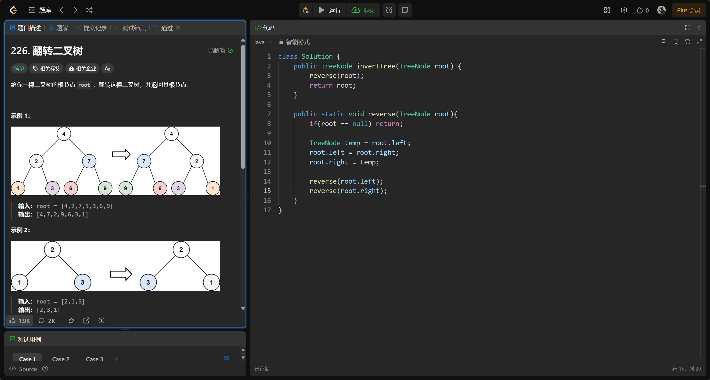

```java
class Solution {
    public TreeNode invertTree(TreeNode root) {
        reverse(root);
        return root;
    }

    public static void reverse(TreeNode root){
        if(root == null) return;

        TreeNode temp = root.left;
        root.left = root.right;
        root.right = temp;

        reverse(root.left);
        reverse(root.right);
    }
}
```

##  ⭐101. 对称二叉树

[101. 对称二叉树 - 力扣（LeetCode）](https://leetcode.cn/problems/symmetric-tree/description/)

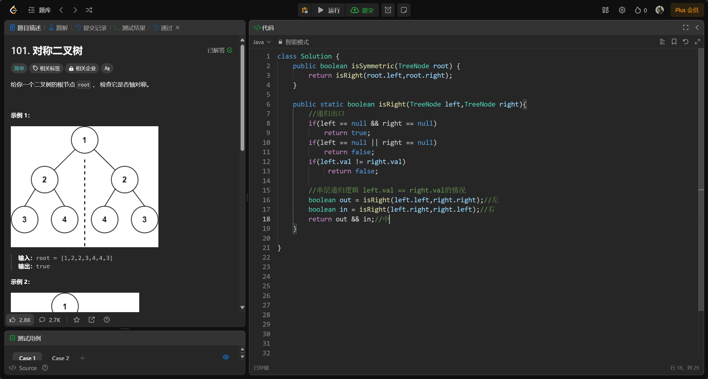

```java
class Solution {
    public boolean isSymmetric(TreeNode root) {
        return isRight(root.left,root.right);
    }

    public static boolean isRight(TreeNode left,TreeNode right){
        //递归出口
        if(left == null && right == null)
            return true;
        if(left == null || right == null)
            return false;
        if(left.val != right.val)
             return false;

        //单层递归逻辑 left.val == right.val的情况
        boolean out = isRight(left.left,right.right);//左
        boolean in = isRight(left.right,right.left);//右
        return out && in;//中
    }

}
```

## ⭐104.二叉树的最大深度

[104. 二叉树的最大深度 - 力扣（LeetCode）](https://leetcode.cn/problems/maximum-depth-of-binary-tree/description/)

递归

```java
class Solution {
    public int maxDepth(TreeNode root) {
        return max(root);
    }

    public static int max(TreeNode root){
        if(root == null) return 0;

        int left = max(root.left);
        int right = max(root.right);
        return Math.max(left,right)+1;
    }

}
```

层次遍历

```java
class Solution {
    public int maxDepth(TreeNode root) {
        if(root == null) return 0;
        Queue<TreeNode> queue = new LinkedList<>();
        queue.offer(root);

        int count = 0;
        while(!queue.isEmpty()){
            int len = queue.size();
            for(int i = 0; i < len; i++){
                TreeNode p = queue.poll();
                if(p.left != null) queue.offer(p.left);
                if(p.right != null) queue.offer(p.right);
            }
            count++;
        }
        return count;
    }
}
```

## ⭐111.二叉树的最小深度

递归

```java
class Solution {
    public int minDepth(TreeNode root) {
        return min(root);
    }

    public static int min(TreeNode root){
        if(root == null) return 0;

        int left = min(root.left);
        int right = min(root.right);

        if(left != 0 && right != 0)
            return Math.min(left,right)+1;
        else
            return left+right+1;
    }

}
```

层次遍历

```java
class Solution {
    public int minDepth(TreeNode root) {
        if(root == null) return 0;
        Queue<TreeNode> queue = new LinkedList<>();
        queue.offer(root);
        
        int count = 0;
        while(!queue.isEmpty()){
            int len = queue.size();
            for(int i = 0; i < len; i++){
                TreeNode p = queue.poll();
                if(p.left != null) queue.offer(p.left);
                if(p.right != null) queue.offer(p.right);
                if(p.left == null && p.right == null) return ++count;
            }
            count++;
        }
        return count;
    }
}
```

## 222.完全二叉树的节点个数

[222. 完全二叉树的节点个数 - 力扣（LeetCode）](https://leetcode.cn/problems/count-complete-tree-nodes/description/)

层次遍历

```java
class Solution {
    public int countNodes(TreeNode root) {
        if(root == null) return 0;
        Queue<TreeNode> queue = new LinkedList<>();
        queue.offer(root);
        int count = 0;
        while(!queue.isEmpty()){
            int len = queue.size();
            for(int i = 0; i < len; i++){
                TreeNode p = queue.poll();
                if(p.left != null) queue.offer(p.left);
                if(p.right != null) queue.offer(p.right);
            }
            count+=len;
        }
        return count;
    }
}
```


```java
class Solution {
    public int countNodes(TreeNode root) {
        if(root == null) return 0;

        return count(root);
    }

    public static int count(TreeNode root){
        if(root == null) return 0;

        int left = count(root.left);
        int right = count(root.right);
        
        return left + right + 1;
    }
}
```

## ⭐110.平衡二叉树

[110. 平衡二叉树 - 力扣（LeetCode）](https://leetcode.cn/problems/balanced-binary-tree/description/)


```java
class Solution {
    public boolean isBalanced(TreeNode root) {
        return deep(root) != -1;
    }

    public static int deep(TreeNode root){
        if(root == null) return 0;

        int left= deep(root.left);
        int right = deep(root.right);
        if(left == -1 || right == -1)
            return -1;
        if(Math.abs(left-right) > 1)
            return -1;
        return Math.max(left,right)+1;
    }

}
```

还是求最大高度，但是高度差>1的时候返回-1，判定为非平衡树。

## ⭐257. 二叉树的所有路径

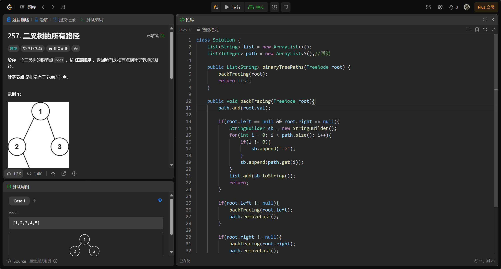

```java
class Solution {
    List<String> list = new ArrayList<>();
    List<Integer> path = new ArrayList<>();//回溯

    public List<String> binaryTreePaths(TreeNode root) {
        backTracing(root);
        return list;
    }

    public void backTracing(TreeNode root){
        path.add(root.val);

        if(root.left == null && root.right == null){
            StringBuilder sb = new StringBuilder();
            for(int i = 0; i < path.size(); i++){
                if(i != 0){
                    sb.append("->");
                }
                sb.append(path.get(i));
            }
            list.add(sb.toString());
            return;
        }
        
        if(root.left != null){
            backTracing(root.left);
            path.removeLast();
        }

        if(root.right != null){
            backTracing(root.right);
            path.removeLast();
        }
    }
}
```

## 404.左叶子之和

[404. 左叶子之和 - 力扣（LeetCode）](https://leetcode.cn/problems/sum-of-left-leaves/description/)


```java
class Solution {
    int count = 0;
    public int sumOfLeftLeaves(TreeNode root) {
        sum(root);
        return count;
    }


    public void sum(TreeNode root){
        if(root == null)
            return;
            
        if(root.left != null && root.left.left == null && root.left.right == null){
            count += root.left.val;
        }

        sum(root.left);
        sum(root.right);
    }
}

```

##  513.找树左下角的值

[513. 找树左下角的值 - 力扣（LeetCode）](https://leetcode.cn/problems/find-bottom-left-tree-value/description/)

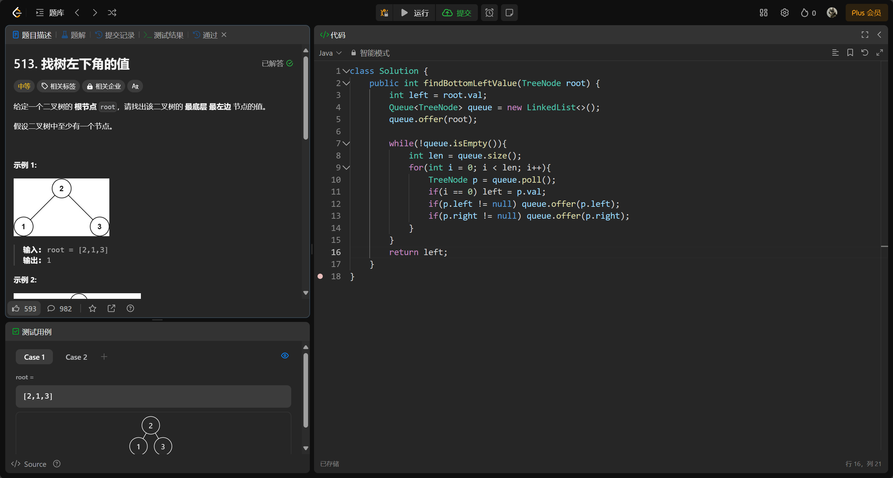

```java
class Solution {
    public int findBottomLeftValue(TreeNode root) {
        int left = root.val;
        Queue<TreeNode> queue = new LinkedList<>();
        queue.offer(root);

        while(!queue.isEmpty()){
            int len = queue.size();
            for(int i = 0; i < len; i++){
                TreeNode p = queue.poll();
                if(i == 0) left = p.val;
                if(p.left != null) queue.offer(p.left);
                if(p.right != null) queue.offer(p.right);
            }
        }
        return left;
    }
}
```

## 112. 路径总和


```java
class Solution {
    boolean flag = false;
    public boolean hasPathSum(TreeNode root, int targetSum) {
        if(root == null) return false;
        int sum = 0;
        backTracint(root,sum,targetSum);
        return flag;
    }

    public void backTracint(TreeNode root, int sum, int targetSum){
        if(flag == true) return;

        sum += root.val;
        if(sum == targetSum && root.left == null && root.right == null)
            flag = true;

        if(root.left != null){
            backTracint(root.left,sum,targetSum);
        }

        if(root.right != null){
            backTracint(root.right,sum,targetSum);
        }

    }
}
```

和上一题类似，有点像回溯但是不用回溯

## ⭐106.从中序与后序遍历序列构造二叉树


```java
class Solution {
    Map<Integer,Integer> map = new HashMap<>();
    public TreeNode buildTree(int[] inorder, int[] postorder) {
        for(int i = 0; i < inorder.length; i++){
            map.put(inorder[i],i);
        }

        return bulild(inorder,0,inorder.length-1,postorder,0,postorder.length-1);
    }

    public TreeNode bulild(int[] inorder,int inS,int inE,int[] postorder,int postS,int postE){
        if(inS > inE || postS > postE) return null;

        int mid = postorder[postE];//后序遍历最后一个元素是根节点
        TreeNode root = new TreeNode(mid);

        int len = map.get(mid) - inS;//找到根节点在中序遍历的位置

        root.left = bulild(inorder,inS,inS + len - 1,postorder,postS,postS + len - 1);
        root.right = bulild(inorder,inS + len + 1,inE,postorder,postS + len,postE-1);

        return root;
    }

}
```

## ⭐105.从前序与中序遍历序列构造二叉树


```java
class Solution {
    Map<Integer,Integer> map = new HashMap<>();
    public TreeNode buildTree(int[] preorder, int[] inorder) {
        for(int i = 0; i < inorder.length; i++){
            map.put(inorder[i],i);
        }
        return build(inorder,0,inorder.length-1,preorder,0,preorder.length-1);
    }

    public TreeNode build(int[] inorder,int inS,int inE,int[] preorder,int preS,int preE){
        if(preS > preE || inS > inE) return null;

        int mid = preorder[preS];
        TreeNode root = new TreeNode(mid);
        int index = map.get(mid);
        int len = index - inS;

        root.left = build(inorder,inS,inS + len - 1,preorder,preS + 1,preS + len);
        root.right = build(inorder,inS + len + 1,inE,preorder,preS + len + 1,preE);
        return root;
    }

}
```

这两道题请勿不自己画出来啊！！！

算数关系很复杂，头痛

而且记得要算len，不要用index

## 654.最大二叉树

[654. 最大二叉树 - 力扣（LeetCode）](https://leetcode.cn/problems/maximum-binary-tree/description/)


```java
class Solution {

    public TreeNode constructMaximumBinaryTree(int[] nums) {
        return build(nums,0,nums.length-1);
    }   

    public TreeNode build(int[] nums,int start,int end){
        if(start > end) return null;

        //求最大值
        int maxIndex = start;
        for(int i = start; i <= end; i++){
            if(nums[i] > nums[maxIndex]) maxIndex = i;
        }
        
        TreeNode root = new TreeNode(nums[maxIndex]);

        root.left = build(nums,start,maxIndex-1);
        root.right = build(nums,maxIndex+1,end);
        return root;
    }
}
```

和上题类似，也是根据数组建树。

## ⭐617.合并二叉树

[617. 合并二叉树 - 力扣（LeetCode）](https://leetcode.cn/problems/merge-two-binary-trees/description/)

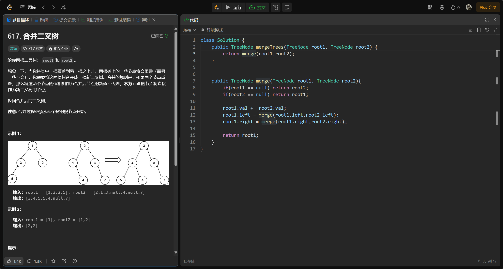

```java
class Solution {
    public TreeNode mergeTrees(TreeNode root1, TreeNode root2) {
        return merge(root1,root2);
    }


    public TreeNode merge(TreeNode root1, TreeNode root2){
        if(root1 == null) return root2;
        if(root2 == null) return root1;

        root1.val += root2.val;
        root1.left = merge(root1.left,root2.left);
        root1.right = merge(root1.right,root2.right);

        return root1;
    }
}
```

##  700.二叉搜索树中的搜索

[700. 二叉搜索树中的搜索 - 力扣（LeetCode）](https://leetcode.cn/problems/search-in-a-binary-search-tree/description/)

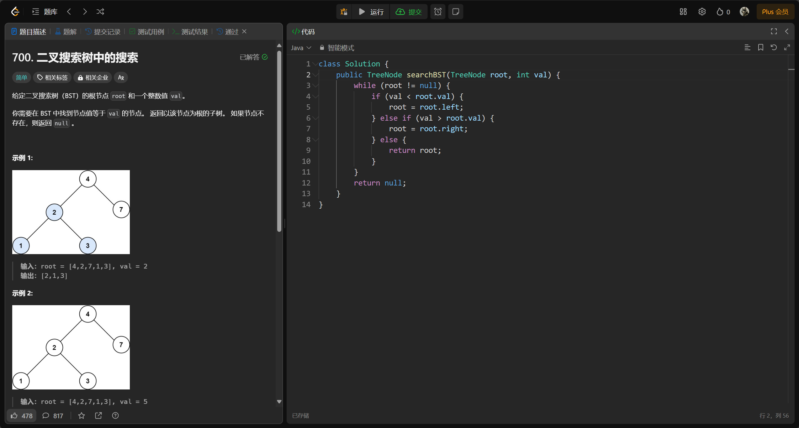

```java
class Solution {
    public TreeNode searchBST(TreeNode root, int val) {
        while (root != null) {
            if (val < root.val) {
                root = root.left;
            } else if (val > root.val) {
                root = root.right;
            } else {
                return root;
            }
        }
        return null;
    }
}
```

## ⭐98.验证二叉搜索树

[98. 验证二叉搜索树 - 力扣（LeetCode）](https://leetcode.cn/problems/validate-binary-search-tree/description/)

```java
class Solution {
    TreeNode pre;
    boolean flag = true;
    public boolean isValidBST(TreeNode root) {
        isTrue(root);
        return flag;
    }

    public void isTrue(TreeNode root){
        if(root == null) return;

        isTrue(root.left);

        if(pre != null && root.val <= pre.val)
            flag = false;
        pre = root;

        isTrue(root.right);
    }
}
```

二叉搜索树重要性质！！！中序遍历是递归的，可以用这条性质判断其是否是搜索树。

## 530.二叉搜索树的最小绝对差

[530. 二叉搜索树的最小绝对差 - 力扣（LeetCode）](https://leetcode.cn/problems/minimum-absolute-difference-in-bst/)


```java
class Solution {
    TreeNode pre;
    int min = Integer.MAX_VALUE;

    public int getMinimumDifference(TreeNode root) {
        get(root);
        return min;
    }

    public void get(TreeNode root) {
        if(root == null) return;

        get(root.left);

        if (pre != null) {
            min = Math.min(min, root.val - pre.val);
        }
        pre = root;

        get(root.right);
    }

}
```

## 501.二叉搜索树中的众数

[501. 二叉搜索树中的众数 - 力扣（LeetCode）](https://leetcode.cn/problems/find-mode-in-binary-search-tree/description/)


```java
class Solution {
    int maxCount = 0;
    int curCount = 0;
    TreeNode pre;
    List<Integer> list = new ArrayList<>();

    public int[] findMode(TreeNode root) {
        find(root);
        int[] nums = new int[list.size()];
        for(int i = 0; i < nums.length; i++){
            nums[i] = list.get(i);
        }
        return nums;
    }

    public void find(TreeNode root){
        if(root == null) return;

        findMode(root.left);

        if(pre == null){
            curCount = 1;
        }else if(pre != null && root.val == pre.val){
            curCount++;
        }else{
            curCount = 1;
        }
        pre = root;
        if(curCount == maxCount)
            list.add(pre.val);
        if(curCount > maxCount){
            list.clear();
            list.add(pre.val);
            maxCount = curCount;
        }
        findMode(root.right);
    }

}
```

## ⭐236. 二叉树的最近公共祖先

[236. 二叉树的最近公共祖先 - 力扣（LeetCode）](https://leetcode.cn/problems/lowest-common-ancestor-of-a-binary-tree/description/)

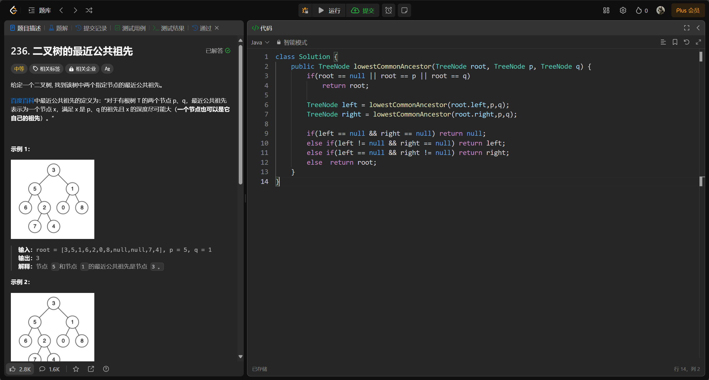

```java
class Solution {
    public TreeNode lowestCommonAncestor(TreeNode root, TreeNode p, TreeNode q) {
        if(root == null || root == p || root == q)
            return root;

        TreeNode left = lowestCommonAncestor(root.left,p,q);
        TreeNode right = lowestCommonAncestor(root.right,p,q);
        
        if(left == null && right == null) return null;
        else if(left != null && right == null) return left;
        else if(left == null && right != null) return right;
        else  return root;
    }   
}
```

##  235. 二叉搜索树的最近公共祖先

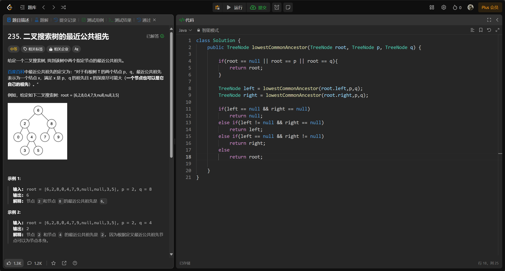

```java
class Solution {
    public TreeNode lowestCommonAncestor(TreeNode root, TreeNode p, TreeNode q) {
        
        if(root == null || root == p || root == q){
            return root;
        }

        TreeNode left = lowestCommonAncestor(root.left,p,q);
        TreeNode right = lowestCommonAncestor(root.right,p,q);

        if(left == null && right == null)
            return null;
        else if(left != null && right == null)
            return left;
        else if(left == null && right != null)
            return right;
        else
            return root;

    }
}
```

##  701.二叉搜索树中的插入操作

[701. 二叉搜索树中的插入操作 - 力扣（LeetCode）](https://leetcode.cn/problems/insert-into-a-binary-search-tree/description/)

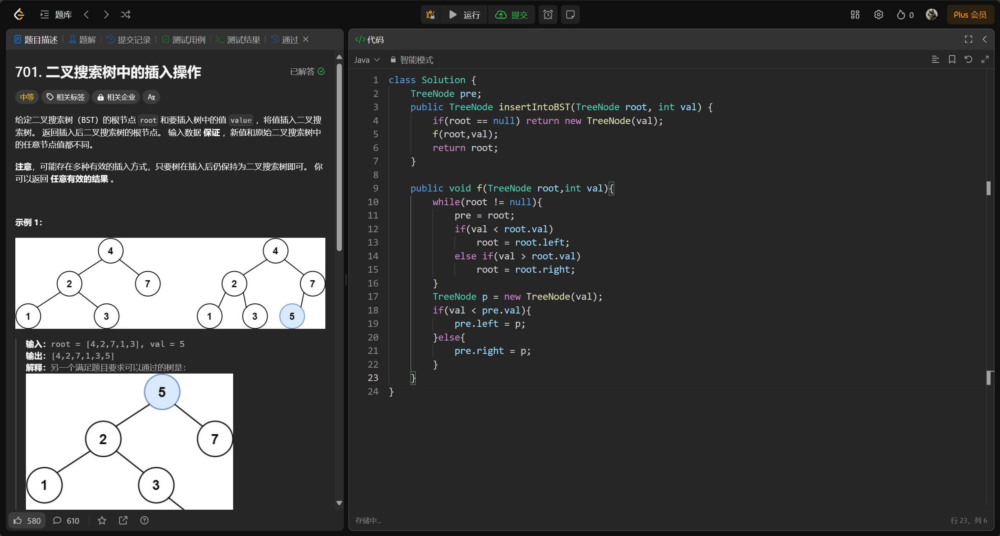

```java
class Solution {
    TreeNode pre;
    public TreeNode insertIntoBST(TreeNode root, int val) {
        if(root == null) return new TreeNode(val);
        f(root,val);
        return root;
    }

    public void f(TreeNode root,int val){
        while(root != null){
            pre = root;
            if(val < root.val)
                root = root.left;
            else if(val > root.val)
                root = root.right;
        }
        TreeNode p = new TreeNode(val);
        if(val < pre.val){
            pre.left = p;
        }else{
            pre.right = p;
        }
    }
}
```

## ⭐450.删除二叉搜索树中的节点

[450. 删除二叉搜索树中的节点 - 力扣（LeetCode）](https://leetcode.cn/problems/delete-node-in-a-bst/description/)


```java
class Solution {
    public TreeNode deleteNode(TreeNode root, int key) {
        if(root == null) return null;

        if(root.val == key){
            if(root.left == null && root.right == null) 
                return null;
            else if(root.left != null && root.right == null)
                return root.left;
            else if(root.left == null && root.right != null)
                return  root.right;
            else{
                TreeNode left = root.left;
                root.left = null;
                TreeNode right = root.right;
                TreeNode jilu = right;
                while(right.left != null) right = right.left;
                right.left = left;
                return jilu;
            }
        }


        if(key < root.val) root.left = deleteNode(root.left,key);
        if(key > root.val) root.right = deleteNode(root.right,key);
        
        return root;
    }
}
```

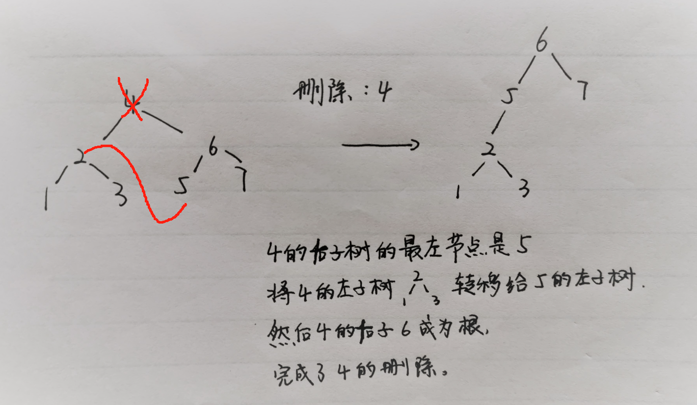

## ⭐669. 修剪二叉搜索树

[669. 修剪二叉搜索树 - 力扣（LeetCode）](https://leetcode.cn/problems/trim-a-binary-search-tree/description/)

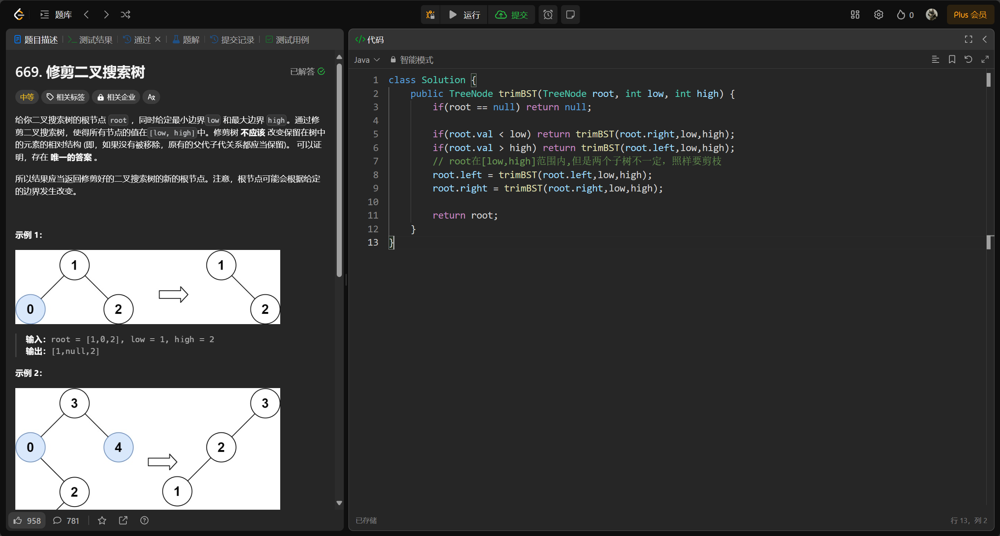

```java
class Solution {
    public TreeNode trimBST(TreeNode root, int low, int high) {
        if(root == null) return null;
        
        if(root.val < low) return trimBST(root.right,low,high);
        if(root.val > high) return trimBST(root.left,low,high);
        // root在[low,high]范围内,但是两个子树不一定，照样要剪枝
        root.left = trimBST(root.left,low,high);
        root.right = trimBST(root.right,low,high);

        return root;
    }
}
```

##  108.将有序数组转换为二叉搜索树

[108. 将有序数组转换为二叉搜索树 - 力扣（LeetCode）](https://leetcode.cn/problems/convert-sorted-array-to-binary-search-tree/)


```java
class Solution {
    public TreeNode sortedArrayToBST(int[] nums) {
        return build(nums, 0, nums.length - 1);
    }

    public TreeNode build(int nums[], int start, int end) {
        if (start > end)
            return null;

        int mid = (start + end) >> 1;
        TreeNode root = new TreeNode(nums[mid]);

        root.left = build(nums, start, mid - 1);
        root.right = build(nums, mid + 1, end);
        return root;
    }

}
```

## 538.把二叉搜索树转换为累加树

[538. 把二叉搜索树转换为累加树 - 力扣（LeetCode）](https://leetcode.cn/problems/convert-bst-to-greater-tree/description/)


```java
class Solution {
    int sum = 0;

    public TreeNode convertBST(TreeNode root) {
        convert(root);
        return root;
    }

    public void convert(TreeNode root) {
        if (root == null)
            return;
        convert(root.right);

        int val = root.val;
        root.val += sum;
        sum += val;

        convert(root.left);
    }
}
```

#  回溯算法理论

## 回溯算法理论基础

### **组合问题**

```java
class Solution {
    List<List<Integer>> list = new ArrayList<>();
    List<Integer> path = new ArrayList<>();
    public List<List<Integer>> subsetsWithDup(int[] nums) {
        backTracing(nums,0);
        return list;
    }

    public void backTracing(int[] nums,int index){
        //终止条件
        if(index == nums.length){
            list.add(new ArrayList<>(path));
            return; 
        }
        //横向循环
        for(int i = index; i < nums.length; i++){

            path.add(nums[i]);
            backTracing(nums,i+1);//纵向深入
            path.removeLast();
        }

    }
}
```

### 排列问题

```java
class Solution {
    List<List<Integer>> list = new ArrayList<>();
    List<Integer> path = new ArrayList<>();
    boolean used[];
    public List<List<Integer>> permute(int[] nums) {
        used = new boolean[nums.length];
        backTracing(nums);
        return list;
    }

    public void backTracing(int[] nums){
        if(path.size() == nums.length){
            list.add(new ArrayList<>(path));
            return;
        }

        for(int i = 0; i <nums.length; i++){
            if(used[i]) continue;

            used[i] = true;
            path.add(nums[i]);
            backTracing(nums);
            path.removeLast();
            used[i] = false;
        }
    }
}
```

1.要加一个used数组判断该数字是否被用过了

2.for循环要从0开始

3.不需要index了，因为有used数组判断了

### 去重方法

1.可以对集合先排序的话


2.不可以对集合排序的话就用hash


## 第77题. 组合

[77. 组合 - 力扣（LeetCode）](https://leetcode.cn/problems/combinations/description/)


```java
class Solution {
    List<List<Integer>> list = new ArrayList<>();//存放结果列表
    List<Integer> path = new ArrayList<>();//路径列表
    public List<List<Integer>> combine(int n, int k) {
        backTracing(n,1,k);
        return list;
    }

    public void backTracing(int n,int index,int k){
        if(path.size() == k){//出口
            list.add(new ArrayList<>(path));
            return;//一定要记得获取结构要终止方法
        }
            
        for(int i = index; i <= n; i++){
            //剪枝
            //还需要k - path.size()个数字
            //还能提供 n - i + 1 个数字
            if(n - i + 1 < k - path.size())
                break;

            path.add(i);
            backTracing(n,i+1,k);
            path.removeLast();
        }
    }
}
```

注意这道题能在模板的基础上剪枝

## 216.组合总和III


```java
class Solution {
    List<List<Integer>> list = new ArrayList<>();
    List<Integer> path = new ArrayList<>();
    public List<List<Integer>> combinationSum3(int k, int n) {
        backTracing(k, n, 1, 0);
        return list;
    }

    public void backTracing(int k, int n, int index, int sum) {
        if (sum == n && path.size() == k) {
            list.add(new ArrayList<>(path));
            return;
        }
        if (sum >= n) {
            return;
        }

        for (int i = index; i <= 9; i++) {
            //剪枝
            if(9 - i + 1 < k - path.size())
                break;
            sum += i;
            path.add(i);
            backTracing(k, n, i + 1, sum);
            path.removeLast();
            sum-=i;
        }
    }
}
```

## ⭐17.电话号码的字母组合

[17. 电话号码的字母组合 - 力扣（LeetCode）](https://leetcode.cn/problems/letter-combinations-of-a-phone-number/description/)


```java、
class Solution {
    List<String> list = new ArrayList<>();
    StringBuilder sb = new StringBuilder();

    public List<String> letterCombinations(String digits) {
        if(digits == null || digits.length() == 0) return list;

        String[] str = {"","","abc","def","ghi","jkl","mno","pqrs","tuv","wxyz"};
        backTracint(0,digits,str);
        return list;
    }

    public void backTracint(int index,String digits,String[] str){
        if(index == digits.length()){
            list.add(sb.toString());
            return;
        }

        String numString = str[digits.charAt(index) - '0'];
        for(int i = 0; i < numString.length(); i++){
            sb.append(numString.charAt(i));
            backTracint(index+1,digits,str);
            sb.deleteCharAt(sb.length()-1);
        }
    }
}
```

## ⭐39. 组合总和

[39. 组合总和 - 力扣（LeetCode）](https://leetcode.cn/problems/combination-sum/description/)


```java
class Solution {
    List<List<Integer>> list = new ArrayList<>();
    List<Integer> path = new ArrayList<>();
    public List<List<Integer>> combinationSum(int[] candidates, int target) {
        backTracing(candidates,target,0,0);
        return list;
    }

    public void backTracing(int[] candidates, int target,int index,int sum){
        if(sum > target) 
            return;
        if(sum == target){
            list.add(new ArrayList<>(path));
            return;
        }

        for(int i = index; i < candidates.length; i++){
            sum += candidates[i];
            path.add(candidates[i]);
            backTracing(candidates,target,i,sum);//可以重复读取，不用+1
            path.removeLast();
            sum -= candidates[i];
        }

    }
}
```


## 40.组合总和II

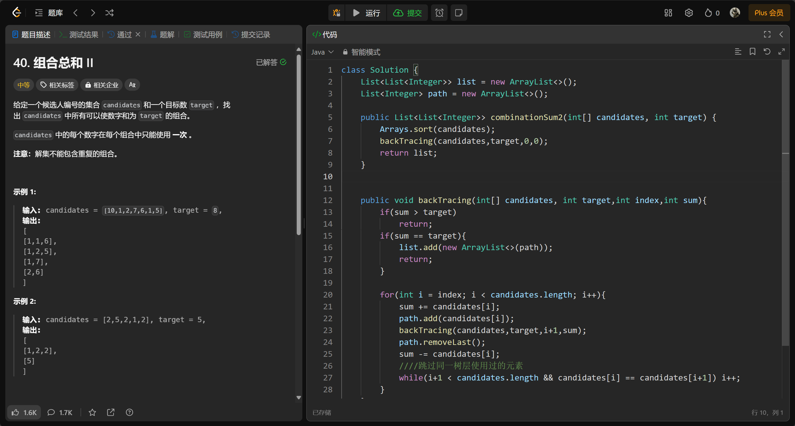

```java
class Solution {
    List<List<Integer>> list = new ArrayList<>();
    List<Integer> path = new ArrayList<>();

    public List<List<Integer>> combinationSum2(int[] candidates, int target) {
        Arrays.sort(candidates);
        backTracing(candidates,target,0,0);
        return list;
    }


    public void backTracing(int[] candidates, int target,int index,int sum){
        if(sum > target)
            return;
        if(sum == target){
            list.add(new ArrayList<>(path));
            return;
        }

        for(int i = index; i < candidates.length; i++){
            sum += candidates[i];
            path.add(candidates[i]);
            backTracing(candidates,target,i+1,sum);
            path.removeLast();
            sum -= candidates[i];        
            ////跳过同一树层使用过的元素
            while(i+1 < candidates.length && candidates[i] == candidates[i+1]) i++;
        }
    }
}
```


## 131.分割回文串

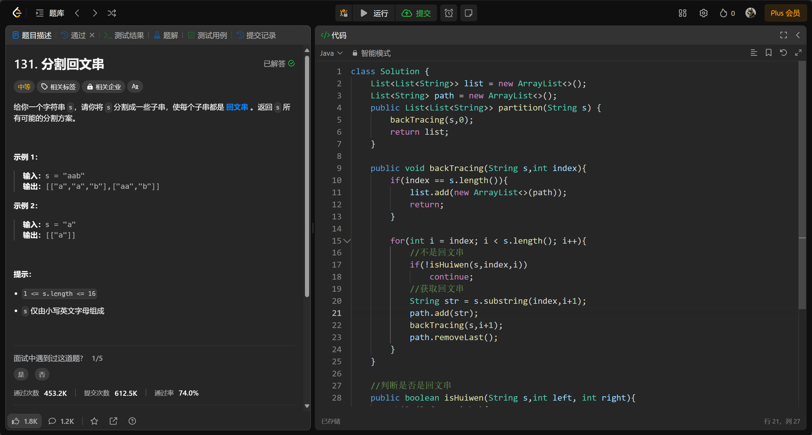

```java
class Solution {
    List<List<String>> list = new ArrayList<>();
    List<String> path = new ArrayList<>();
    public List<List<String>> partition(String s) {
        backTracing(s,0);
        return list;
    }

    public void backTracing(String s,int index){
        if(index == s.length()){
            list.add(new ArrayList<>(path));
            return;
        }

        for(int i = index; i < s.length(); i++){
            //不是回文串            
            if(!isHuiwen(s,index,i))
                continue;
            //获取回文串
            String str = s.substring(index,i+1);
            path.add(str);
            backTracing(s,i+1);
            path.removeLast();
        }
    }

    //判断是否是回文串
    public boolean isHuiwen(String s,int left, int right){
        while(left < right){
            if(s.charAt(left) != s.charAt(right)) return false;
            left++;
            right--;
        }
        return true;
    }
}
```


判断是否是回文串一定要记得left++、right--，又浪费很久时间

## 93.复原IP地址

[93. 复原 IP 地址 - 力扣（LeetCode）](https://leetcode.cn/problems/restore-ip-addresses/description/)

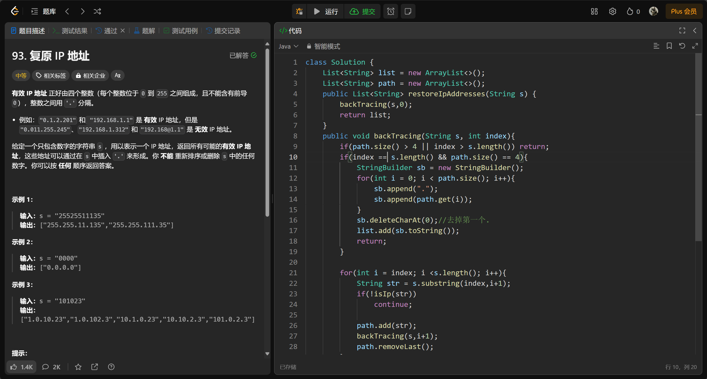

```java
class Solution {
    List<String> list = new ArrayList<>();
    List<String> path = new ArrayList<>();
    public List<String> restoreIpAddresses(String s) {
        backTracing(s,0);
        return list;
    }
    public void backTracing(String s, int index){
        if(path.size() > 4 || index > s.length()) return;
        if(index == s.length() && path.size() == 4){
            StringBuilder sb = new StringBuilder();
            for(int i = 0; i < path.size(); i++){
                sb.append(".");
                sb.append(path.get(i));
            }
            sb.deleteCharAt(0);//去掉第一个.
            list.add(sb.toString());
            return;
        }

        for(int i = index; i <s.length(); i++){
            String str = s.substring(index,i+1);
            if(!isIp(str))
                continue;

            path.add(str);
            backTracing(s,i+1);
            path.removeLast();
        }
    }
    public boolean isIp(String ip){
        if(ip.length() > 4)
            return false;
        if(ip.startsWith("0") && ip.length() != 1)
            return false; 
        int k = Integer.parseInt(ip);
        if(k >= 0 && k <= 255)
            return true;
        else
            return false;
    }
}
```

就是分割字符串

## 78.子集

[78. 子集 - 力扣（LeetCode）](https://leetcode.cn/problems/subsets/description/)

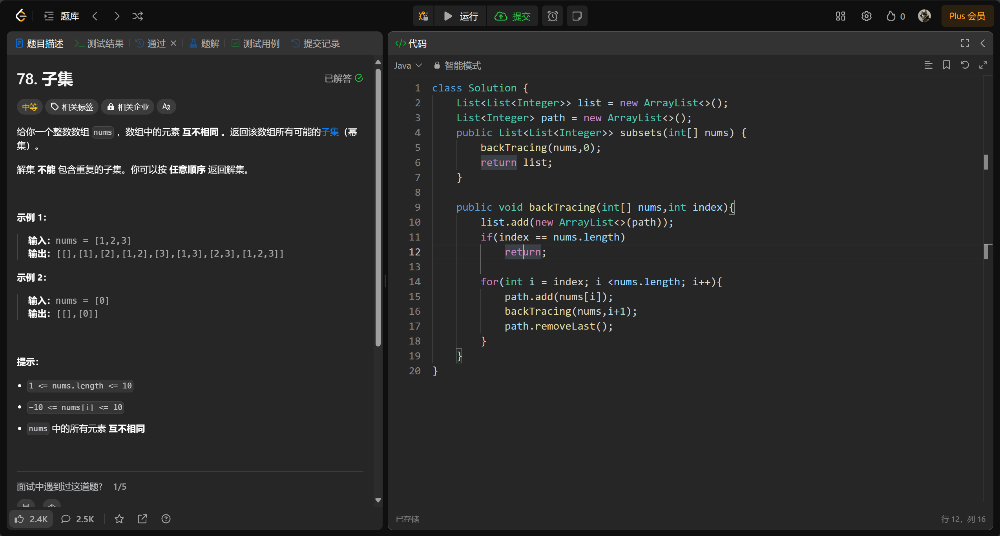

```java
class Solution {
    List<List<Integer>> list = new ArrayList<>();
    List<Integer> path = new ArrayList<>();
    public List<List<Integer>> subsets(int[] nums) {
        backTracing(nums,0);
        return list;
    }

    public void backTracing(int[] nums,int index){
        list.add(new ArrayList<>(path));
        if(index == nums.length)
            return;
        
        for(int i = index; i <nums.length; i++){
            path.add(nums[i]);
            backTracing(nums,i+1);
            path.removeLast();
        }
    }
}
```

## 90.子集II

[90. 子集 II - 力扣（LeetCode）](https://leetcode.cn/problems/subsets-ii/description/)

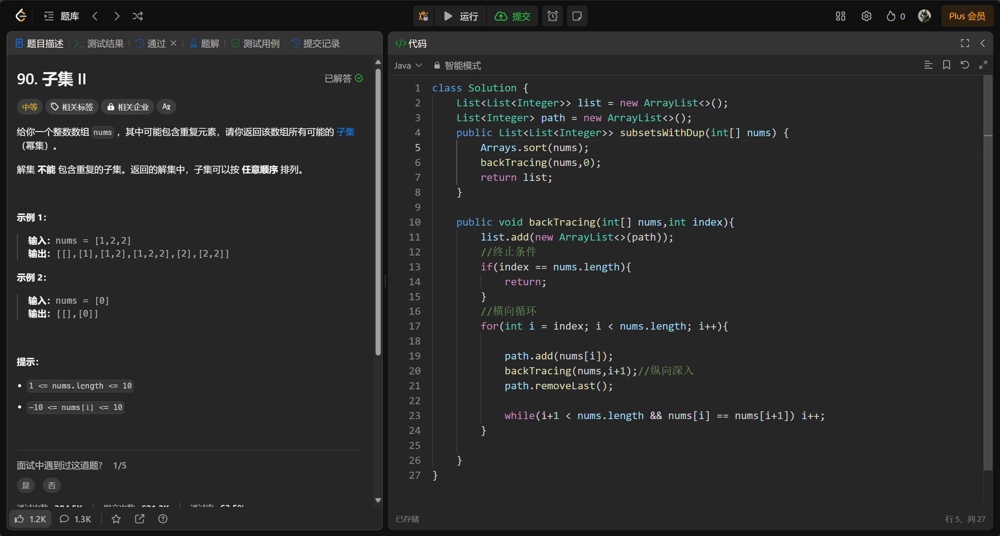

```java
class Solution {
    List<List<Integer>> list = new ArrayList<>();
    List<Integer> path = new ArrayList<>();
    public List<List<Integer>> subsetsWithDup(int[] nums) {
        Arrays.sort(nums);
        backTracing(nums,0);
        return list;
    }

    public void backTracing(int[] nums,int index){
        list.add(new ArrayList<>(path));
        //终止条件
        if(index == nums.length){
            return; 
        }
        //横向循环
        for(int i = index; i < nums.length; i++){

            path.add(nums[i]);
            backTracing(nums,i+1);//纵向深入
            path.removeLast();

            while(i+1 < nums.length && nums[i] == nums[i+1]) i++;
        }

    }
}
```

 while(i+1 < nums.length && nums[i] == nums[i+1]) i++;使用这行代码跳过横向遍历相同的数字

## ⭐491.递增子序列

[491. 非递减子序列 - 力扣（LeetCode）](https://leetcode.cn/problems/non-decreasing-subsequences/description/)


```java
class Solution {
    List<List<Integer>> list = new ArrayList<>();
    List<Integer> path = new ArrayList<>();
    public List<List<Integer>> findSubsequences(int[] nums) {
        backTracing(nums,0);
        return list;
    }

    public void backTracing(int[] nums, int index){
        if(path.size() > 1) 
            list.add(new ArrayList<>(path));
        if(index == nums.length)
            return;
        Set<Integer> set = new HashSet<>();
        for(int i = index; i < nums.length; i++){
            if(!path.isEmpty() && nums[i] < path.getLast()){
                continue;
            }
            if(set.contains(nums[i]))
                continue;
            else
                set.add(nums[i]);
            path.add(nums[i]);
            backTracing(nums,i+1);
            path.removeLast();
        }
    }
}
```

hash去重，之前是用 while(i+1 < nums.length && nums[i] == nums[i+1]) i++;跳过相同数字，但是这次相同数字不挨着，或者没办法让他们挨着，因为要求序列，所以只能用hash。

## ⭐46.全排列

[46. 全排列 - 力扣（LeetCode）](https://leetcode.cn/problems/permutations/description/)


```java
class Solution {
    List<List<Integer>> list = new ArrayList<>();
    List<Integer> path = new ArrayList<>();
    boolean used[];
    public List<List<Integer>> permute(int[] nums) {
        used = new boolean[nums.length];
        backTracing(nums);
        return list;
    }

    public void backTracing(int[] nums){
        if(path.size() == nums.length){
            list.add(new ArrayList<>(path));
            return;
        }

        for(int i = 0; i <nums.length; i++){
            if(used[i]) continue;

            used[i] = true;
            path.add(nums[i]);
            backTracing(nums);
            path.removeLast();
            used[i] = false;
        }
    }
}
```

全排列要加一个boolean used[]; 并且不用再写index了，因为used[]数组记录了哪些数字已经被用过，而且for循环从0开始

## 47.全排列 II

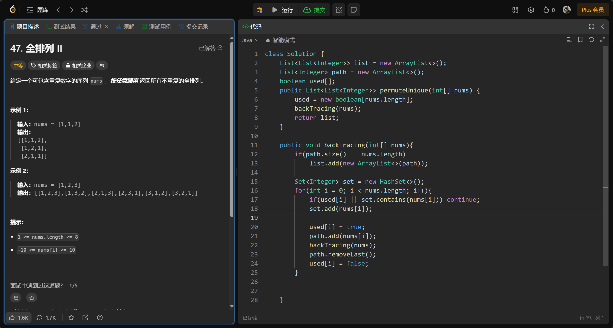

```java
class Solution {
    List<List<Integer>> list = new ArrayList<>();
    List<Integer> path = new ArrayList<>();
    boolean used[];
    public List<List<Integer>> permuteUnique(int[] nums) {
        used = new boolean[nums.length];
        backTracing(nums);
        return list;
    }

    public void backTracing(int[] nums){
        if(path.size() == nums.length)
            list.add(new ArrayList<>(path));

        Set<Integer> set = new HashSet<>();
        for(int i = 0; i < nums.length; i++){
            if(used[i] || set.contains(nums[i])) continue;
            set.add(nums[i]);

            used[i] = true;
            path.add(nums[i]);
            backTracing(nums);
            path.removeLast();
            used[i] = false;
        }
    }
}
```

全排列+hahs去重

⭐332.重新安排行程

[332. 重新安排行程 - 力扣（LeetCode）](https://leetcode.cn/problems/reconstruct-itinerary/)

```java
class Solution {
    List<String> list = new ArrayList<>();
    List<String> path = new ArrayList<>();
    boolean used[];

    public List<String> findItinerary(List<List<String>> tickets) {
        used = new boolean[tickets.size()];
        Collections.sort(tickets, (a, b) -> a.get(1).compareTo(b.get(1)));
        path.add("JFK");

        backTracing(tickets);
        return list;
    }

    public boolean  backTracing(List<List<String>> tickets) {
        if (path.size() == tickets.size() + 1) {
            list = new ArrayList<>(path);
            return true;
        }

        for (int i = 0; i < tickets.size(); i++) {
            if (!used[i] && tickets.get(i).get(0).equals(path.getLast())) {
                used[i] = true;
                path.add(tickets.get(i).get(1));
                if(backTracing(tickets)) return true;
                path.removeLast();
                used[i] = false;
            }

        }
        return false;
    }
}
```

有一个案例超时

## ⭐51. N皇后

[51. N 皇后 - 力扣（LeetCode）](https://leetcode.cn/problems/n-queens/description/)


```java
class Solution {
    List<List<String>> list = new ArrayList<>();
    List<String> path = new ArrayList<>();
    char[][] nums;
    public List<List<String>> solveNQueens(int n) {
        nums = new char[n][n];
        for (char[] singleNums : nums)
            Arrays.fill(singleNums, '.');
        backTracing(n, 0);
        return list;
    }

    public void backTracing(int n, int y) {
        if (path.size() == n) {
            list.add(new ArrayList<>(path));
            return;
        }
        // 横着一行一行放
        for (int x = 0; x < n; x++) {
            if(!isTrue(x, y, n))
                continue;

            nums[x][y] = 'Q';
            StringBuilder sb = new StringBuilder();
            for (int i = 0; i < n; i++) {
                sb.append(nums[i][y]);
            }
            path.add(sb.toString());
            backTracing(n, y + 1);
            path.removeLast();
            nums[x][y] = '.';
        }
    }

    public boolean isTrue(int x, int y, int n) {
        // 竖着
        for (int k = 0; k < y; k++) {
            if (nums[x][k] == 'Q')
                return false;
        }
        // 135度
        for(int i = x-1, j = y-1; i >= 0 && j >= 0; i--,j--){
            if(nums[i][j] == 'Q')
                return false;
        }
        // 45度
        for(int i = x+1, j = y-1; i < n && j >= 0; i++,j--){
            if(nums[i][j] == 'Q')
                return false;
        }
        return true;
    }
}
```

## ⭐37. 解数独

[37. 解数独 - 力扣（LeetCode）](https://leetcode.cn/problems/sudoku-solver/description/)


```java
class Solution {
    public void solveSudoku(char[][] board) {
        solveSudokuHelper(board);
    }

    private boolean solveSudokuHelper(char[][] board){
        //「一个for循环遍历棋盘的行，一个for循环遍历棋盘的列，
        // 一行一列确定下来之后，递归遍历这个位置放9个数字的可能性！」
        for (int i = 0; i < 9; i++){ // 遍历行
            for (int j = 0; j < 9; j++){ // 遍历列
                if (board[i][j] != '.'){ // 跳过原始数字
                    continue;
                }
                for (char k = '1'; k <= '9'; k++){ // (i, j) 这个位置放k是否合适
                    if (isValidSudoku(i, j, k, board)){
                        board[i][j] = k;
                        if (solveSudokuHelper(board)){ // 如果找到合适一组立刻返回
                            return true;
                        }
                        board[i][j] = '.';
                    }
                }
                // 9个数都试完了，都不行，那么就返回false
                return false;
                // 因为如果一行一列确定下来了，这里尝试了9个数都不行，说明这个棋盘找不到解决数独问题的解！
                // 那么会直接返回， 「这也就是为什么没有终止条件也不会永远填不满棋盘而无限递归下去！」
            }
        }
        // 遍历完没有返回false，说明找到了合适棋盘位置了
        return true;
    }

    /**
     * 判断棋盘是否合法有如下三个维度:
     *     同行是否重复
     *     同列是否重复
     *     9宫格里是否重复
     */
    private boolean isValidSudoku(int row, int col, char val, char[][] board){
        // 同行是否重复
        for (int i = 0; i < 9; i++){
            if (board[row][i] == val){
                return false;
            }
        }
        // 同列是否重复
        for (int j = 0; j < 9; j++){
            if (board[j][col] == val){
                return false;
            }
        }
        // 9宫格里是否重复
        int startRow = (row / 3) * 3;
        int startCol = (col / 3) * 3;
        for (int i = startRow; i < startRow + 3; i++){
            for (int j = startCol; j < startCol + 3; j++){
                if (board[i][j] == val){
                    return false;
                }
            }
        }
        return true;
    }
}
```

数独每行不只填一个，所以要x和y双层for循环

# 贪心算法

**贪心的本质是选择每一阶段的局部最优，从而达到全局最优**。 

## 455.分发饼干

[455. 分发饼干 - 力扣（LeetCode）](https://leetcode.cn/problems/assign-cookies/)

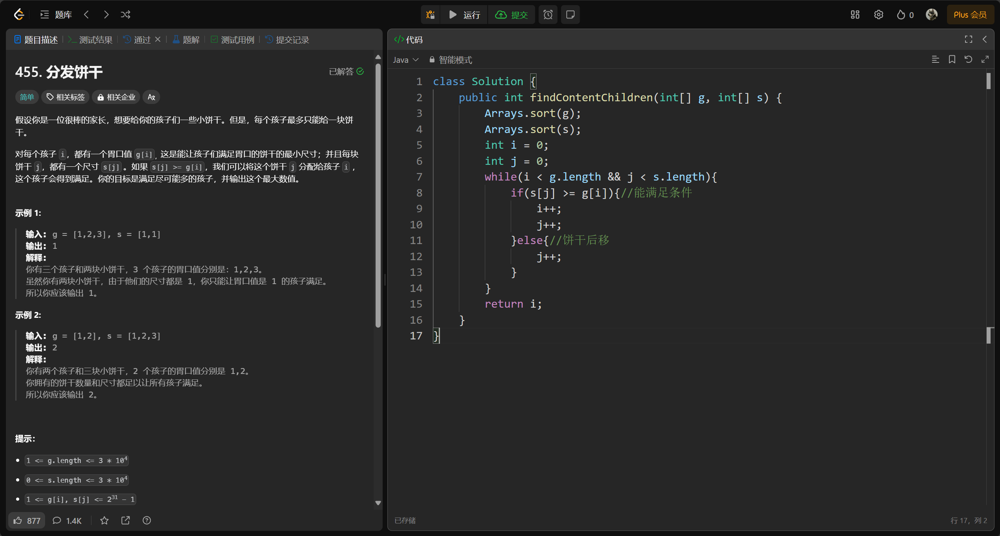

```java
class Solution {
    public int findContentChildren(int[] g, int[] s) {
        Arrays.sort(g);
        Arrays.sort(s);
        int i = 0;
        int j = 0;
        while(i < g.length && j < s.length){
            if(s[j] >= g[i]){//能满足条件
                i++;
                j++;
            }else{//饼干后移
                j++;
            }
        }
        return i;
    }
}
```

## 376. 摆动序列

[376. 摆动序列 - 力扣（LeetCode）](https://leetcode.cn/problems/wiggle-subsequence/description/)

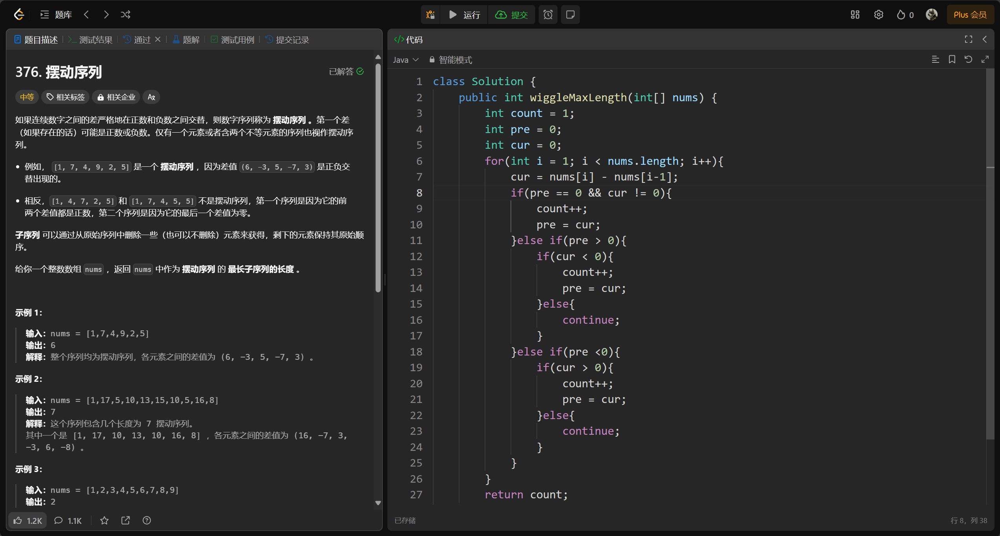

```java
class Solution {
    public int wiggleMaxLength(int[] nums) {
        int count = 1;
        int pre = 0;
        int cur = 0;
        for(int i = 1; i < nums.length; i++){
            cur = nums[i] - nums[i-1];
            if(pre == 0 && cur != 0){
                count++;
                pre = cur;
            }else if(pre > 0){
                if(cur < 0){
                    count++;
                    pre = cur;
                }else{
                    continue;
                }
            }else if(pre <0){
                if(cur > 0){
                    count++;
                    pre = cur;
                }else{
                    continue;
                }
            }
        }
        return count;
    }
}
```

## 53. 最大子序和

[53. 最大子数组和 - 力扣（LeetCode）](https://leetcode.cn/problems/maximum-subarray/description/)

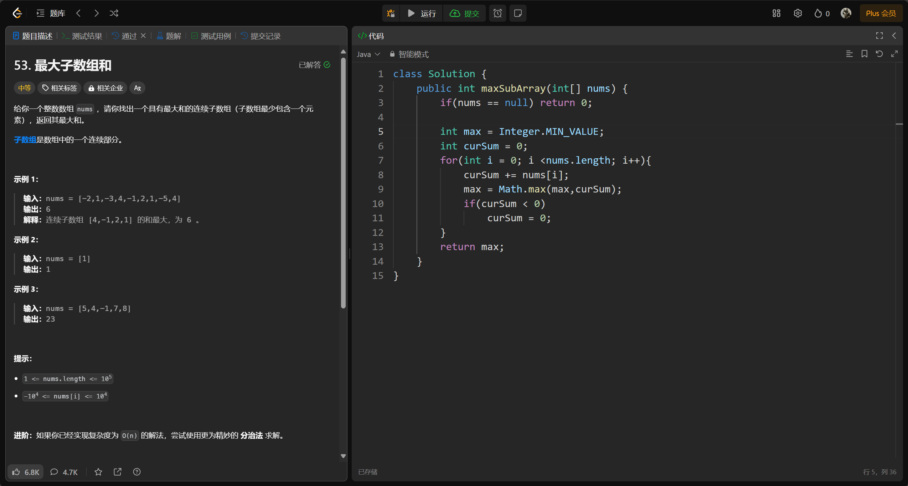

```java
class Solution {
    public int maxSubArray(int[] nums) {
        if(nums == null) return 0;

        int max = Integer.MIN_VALUE;
        int curSum = 0;
        for(int i = 0; i <nums.length; i++){
            curSum += nums[i];
            max = Math.max(max,curSum);
            if(curSum < 0)
                curSum = 0;
        }
        return max;
    }
}
```

## 122.买卖股票的最佳时机 II

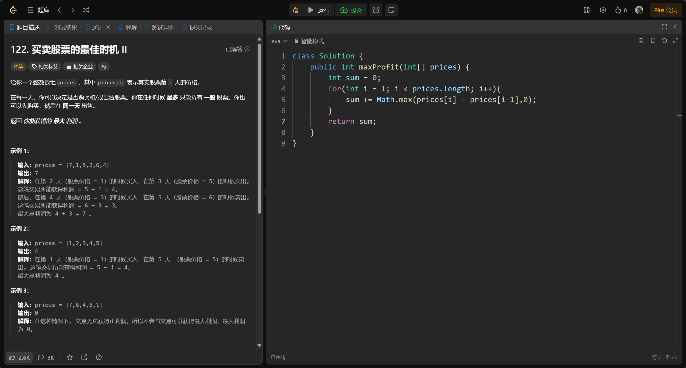

```java
class Solution {
    public int maxProfit(int[] prices) {
        int sum = 0;
        for(int i = 1; i < prices.length; i++){
            sum += Math.max(prices[i] - prices[i-1],0);
        }
        return sum;
    }
}
```

## 55. 跳跃游戏

[55. 跳跃游戏 - 力扣（LeetCode）](https://leetcode.cn/problems/jump-game/description/)

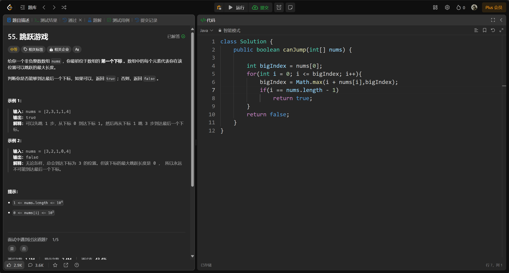

```java
class Solution {
    public boolean canJump(int[] nums) {
        
        int bigIndex = nums[0];
        for(int i = 0; i <= bigIndex; i++){
            bigIndex = Math.max(i + nums[i],bigIndex);
            if(i == nums.length - 1)
                return true;
        }
        return false;
    }
}
```

## 45.跳跃游戏 II

[45. 跳跃游戏 II - 力扣（LeetCode）](https://leetcode.cn/problems/jump-game-ii/description/)

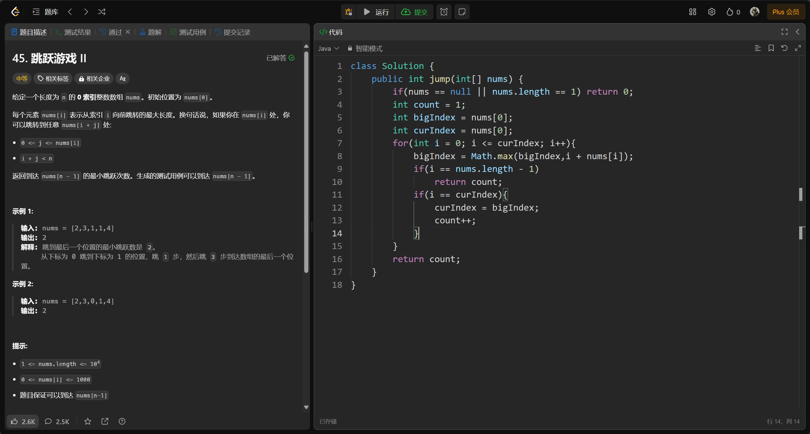

```java
class Solution {
    public int jump(int[] nums) {
        if(nums == null || nums.length == 1) return 0;
        int count = 1;
        int bigIndex = nums[0];
        int curIndex = nums[0];
        for(int i = 0; i <= curIndex; i++){
            bigIndex = Math.max(bigIndex,i + nums[i]);
            if(i == nums.length - 1)
                return count;
            if(i == curIndex){
                curIndex = bigIndex;
                count++;
            }
        }
        return count;
    }
}
```

## 1005.K次取反后最大化的数组和

[1005. K 次取反后最大化的数组和 - 力扣（LeetCode）](https://leetcode.cn/problems/maximize-sum-of-array-after-k-negations/description/)

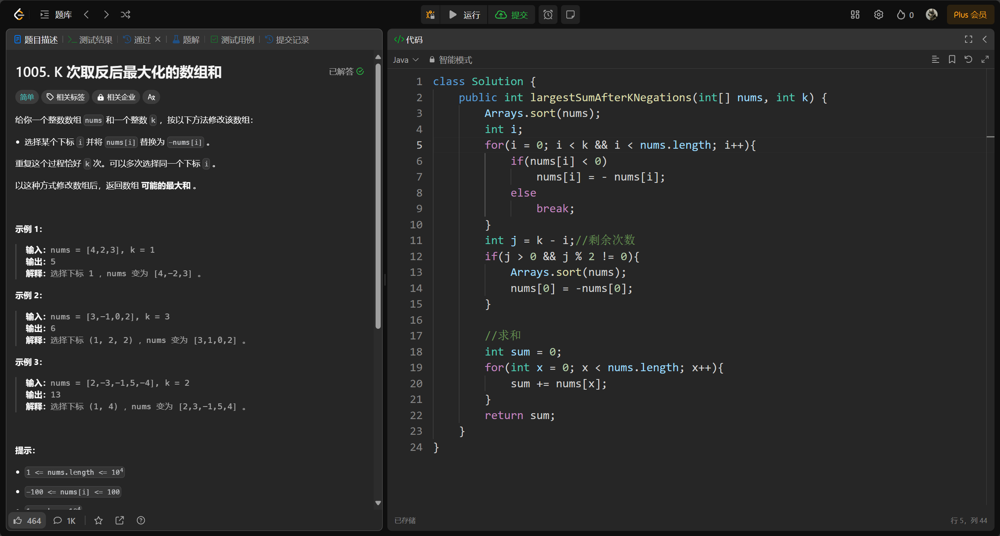

```java
class Solution {
    public int largestSumAfterKNegations(int[] nums, int k) {
        Arrays.sort(nums);
        int i;
        for(i = 0; i < k && i < nums.length; i++){
            if(nums[i] < 0)
                nums[i] = - nums[i];
            else
                break;
        }
        int j = k - i;//剩余次数
        if(j > 0 && j % 2 != 0){
            Arrays.sort(nums);
            nums[0] = -nums[0];
        }

        //求和
        int sum = 0;
        for(int x = 0; x < nums.length; x++){
            sum += nums[x];
        }
        return sum;
    }
}
```

## 134. 加油站

[134. 加油站 - 力扣（LeetCode）](https://leetcode.cn/problems/gas-station/description/)

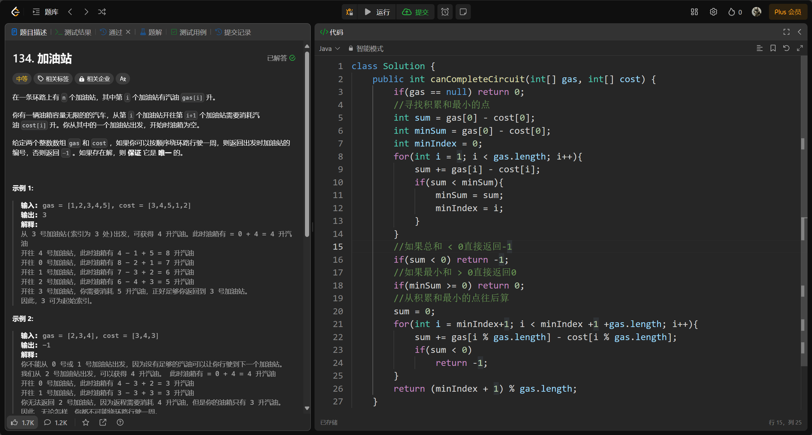

```java
class Solution {
    public int canCompleteCircuit(int[] gas, int[] cost) {
        if(gas == null) return 0;
        //寻找积累和最小的点
        int sum = gas[0] - cost[0];
        int minSum = gas[0] - cost[0];
        int minIndex = 0;
        for(int i = 1; i < gas.length; i++){
            sum += gas[i] - cost[i];
            if(sum < minSum){
                minSum = sum;
                minIndex = i;
            }
        }
        //如果总和 < 0直接返回-1
        if(sum < 0) return -1;
        //如果最小和 > 0直接返回0   
        if(minSum >= 0) return 0;
        //从积累和最小的点往后算
        sum = 0;
        for(int i = minIndex+1; i < minIndex +1 +gas.length; i++){
            sum += gas[i % gas.length] - cost[i % gas.length];
            if(sum < 0)
                return -1;
        }
        return (minIndex + 1) % gas.length;
    }   
}
```

亏空最严重的一个点必须放在最后一步走，等着前面剩余的救助

## 135. 分发糖果

[135. 分发糖果 - 力扣（LeetCode）](https://leetcode.cn/problems/candy/description/)

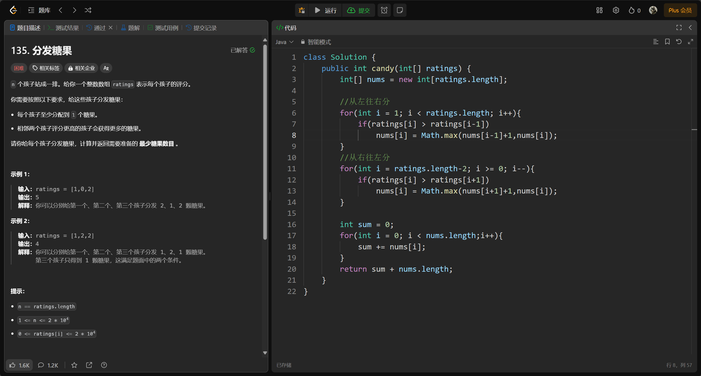

```java
class Solution {
    public int candy(int[] ratings) {
        int[] nums = new int[ratings.length];
        
        //从左往右分
        for(int i = 1; i < ratings.length; i++){
            if(ratings[i] > ratings[i-1])
                nums[i] = Math.max(nums[i-1]+1,nums[i]);
        }
        //从右往左分
        for(int i = ratings.length-2; i >= 0; i--){
            if(ratings[i] > ratings[i+1])
                nums[i] = Math.max(nums[i+1]+1,nums[i]);
        }

        int sum = 0;
        for(int i = 0; i < nums.length;i++){
            sum += nums[i];
        }
        return sum + nums.length;
    }
}
```

## 860.柠檬水找零

[860. 柠檬水找零 - 力扣（LeetCode）](https://leetcode.cn/problems/lemonade-change/description/)

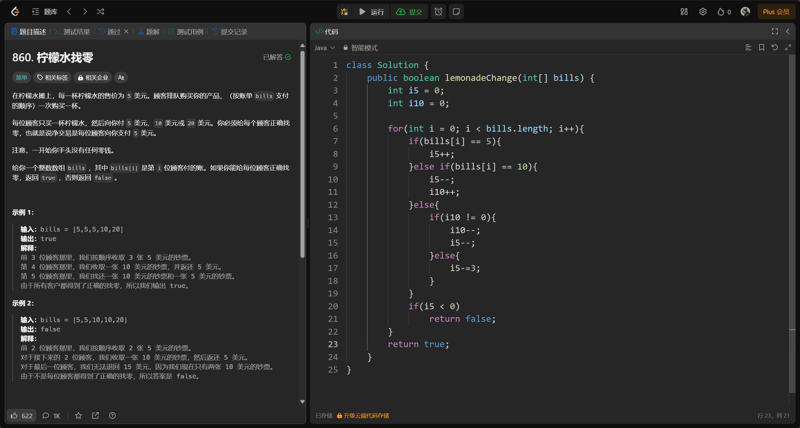

```java
class Solution {
    public boolean lemonadeChange(int[] bills) {
        int i5 = 0;
        int i10 = 0;

        for(int i = 0; i < bills.length; i++){
            if(bills[i] == 5){
                i5++;
            }else if(bills[i] == 10){
                i5--;
                i10++;
            }else{
                if(i10 != 0){
                    i10--;
                    i5--;
                }else{
                    i5-=3;
                }
            }
            if(i5 < 0)
                return false;    
        }
        return true;
    }
}
```

## ⭐406.根据身高重建队列

[406. 根据身高重建队列 - 力扣（LeetCode）](https://leetcode.cn/problems/queue-reconstruction-by-height/description/)

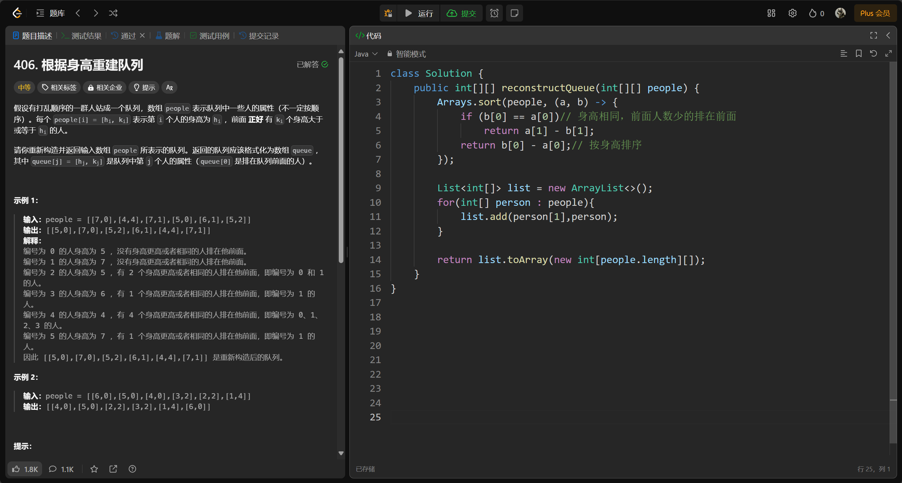

```java
class Solution {
    public int[][] reconstructQueue(int[][] people) {
        Arrays.sort(people, (a, b) -> {
            if (b[0] == a[0])// 身高相同，前面人数少的排在前面
                return a[1] - b[1];
            return b[0] - a[0];// 按身高排序
        });

        List<int[]> list = new ArrayList<>();
        for(int[] person : people){
            list.add(person[1],person);
        }

        return list.toArray(new int[people.length][]);
    }
}
```


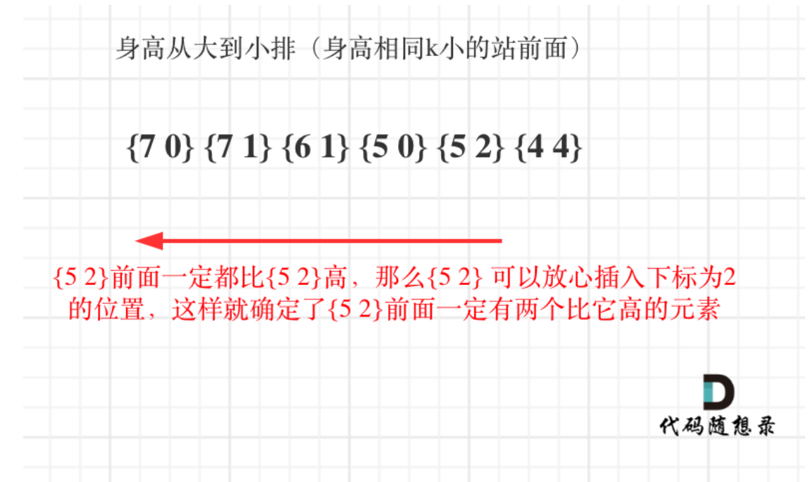

## 452. 用最少数量的箭引爆气球

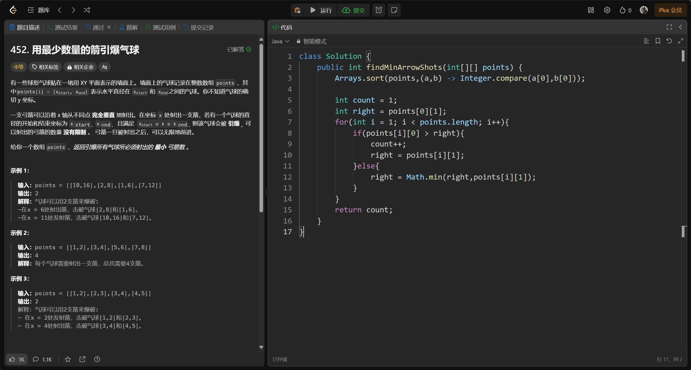

```java
class Solution {
    public int findMinArrowShots(int[][] points) {
        Arrays.sort(points,(a,b) -> Integer.compare(a[0],b[0]));
        
        int count = 1;
        int right = points[0][1];
        for(int i = 1; i < points.length; i++){
            if(points[i][0] > right){
                count++;
                right = points[i][1];
            }else{
                right = Math.min(right,points[i][1]);
            }
        }
        return count;
    }
}
```

##  ⭐435. 无重叠区间

[435. 无重叠区间 - 力扣（LeetCode）](https://leetcode.cn/problems/non-overlapping-intervals/description/)

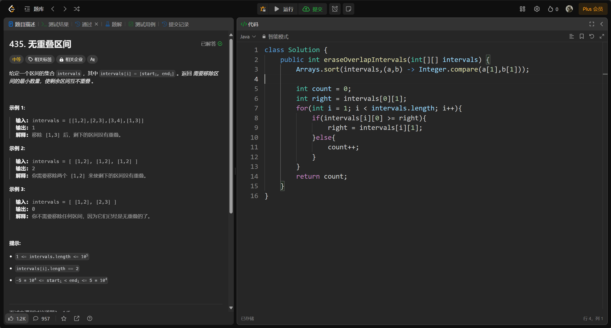

```java
class Solution {
    public int eraseOverlapIntervals(int[][] intervals) {
        Arrays.sort(intervals,(a,b) -> Integer.compare(a[1],b[1]));

        int count = 0;
        int right = intervals[0][1];
        for(int i = 1; i < intervals.length; i++){
            if(intervals[i][0] >= right){
                right = intervals[i][1];
            }else{
                count++;
            }
        }
        return count;    
    }
}
```

官解里对这个描述的非常清楚了，这个题其实是预定会议的一个问题，给你若干时间的会议，然后去预定会议，那么能够预定的最大的会议数量是多少？核心在于我们要找到最大不重叠区间的个数。 如果我们把本题的区间看成是会议，那么按照右端点排序，我们一定能够找到一个最先结束的会议，而这个会议一定是我们需要添加到最终结果的的首个会议。（这个不难贪心得到，因为这样能够给后面预留的时间更长）。

## 763.划分字母区间

[763. 划分字母区间 - 力扣（LeetCode）](https://leetcode.cn/problems/partition-labels/description/)

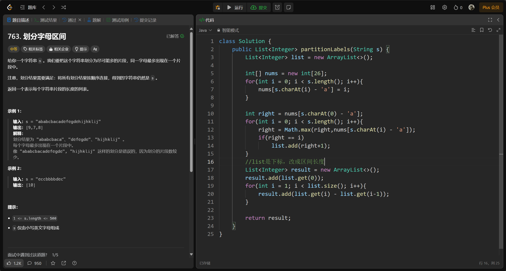

```java
class Solution {
    public List<Integer> partitionLabels(String s) {
        List<Integer> list = new ArrayList<>();

        int[] nums = new int[26];
        for(int i = 0; i < s.length(); i++){
            nums[s.charAt(i) - 'a'] = i;
        }

        int right = nums[s.charAt(0) - 'a'];
        for(int i = 0; i < s.length(); i++){
            right = Math.max(right,nums[s.charAt(i) - 'a']);
            if(right == i)
                list.add(right+1);
        }
        //list是下标，改成区间长度
        List<Integer> result = new ArrayList<>();
        result.add(list.get(0));
        for(int i = 1; i < list.size(); i++){
            result.add(list.get(i) - list.get(i-1));
        }

        return result;
    }
}
```

## 56. 合并区间

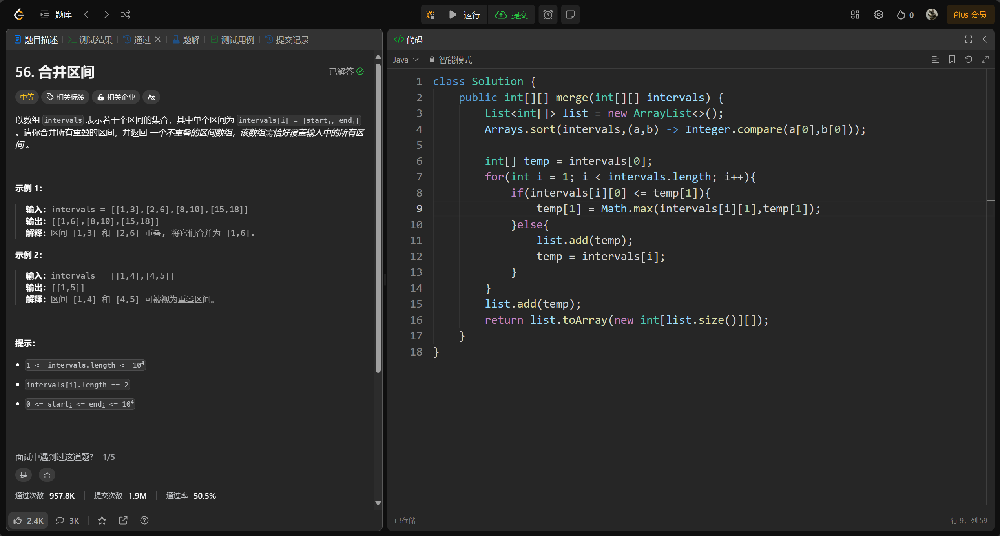

```java
class Solution {
    public int[][] merge(int[][] intervals) {
        List<int[]> list = new ArrayList<>();
        Arrays.sort(intervals,(a,b) -> Integer.compare(a[0],b[0]));

        int[] temp = intervals[0];
        for(int i = 1; i < intervals.length; i++){
            if(intervals[i][0] <= temp[1]){
                temp[1] = Math.max(intervals[i][1],temp[1]);
            }else{
                list.add(temp);
                temp = intervals[i];
            }
        }
        list.add(temp);
        return list.toArray(new int[list.size()][]);
    }
}
```

这几个合并区间的题，几乎都会用到Math.max或者Math.min！！！

## ⭐738.单调递增的数字

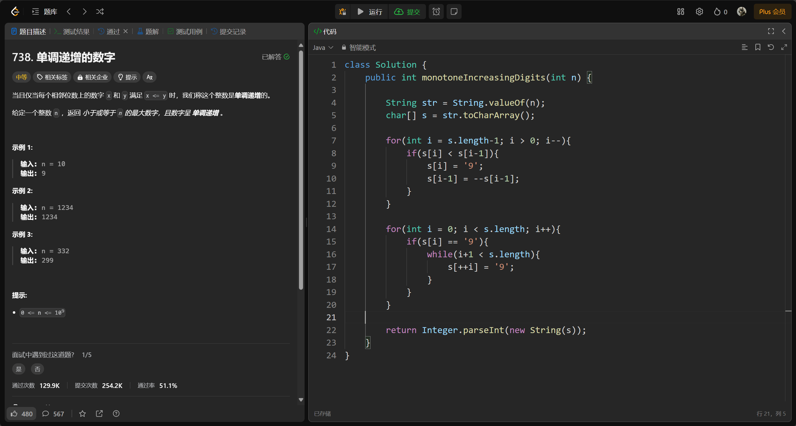

```java
class Solution {
    public int monotoneIncreasingDigits(int n) {

        String str = String.valueOf(n);
        char[] s = str.toCharArray();
        
        for(int i = s.length-1; i > 0; i--){
            if(s[i] < s[i-1]){
                s[i] = '9';
                s[i-1] = --s[i-1];
            }
        }
        
        for(int i = 0; i < s.length; i++){
            if(s[i] == '9'){
                while(i+1 < s.length){
                    s[++i] = '9';
                }
            }
        }
    
        return Integer.parseInt(new String(s));
    }
}
```

反向遍历一遍 + 正向遍历一遍，因为只要有数组改到9，后面都要变成9

整型转字符串

```java
String str = String.valueOf(n);
```

## ⭐968.监控二叉树

[算法笔记 (programmercarl.com)](https://www.programmercarl.com/0968.监控二叉树.html#算法公开课)

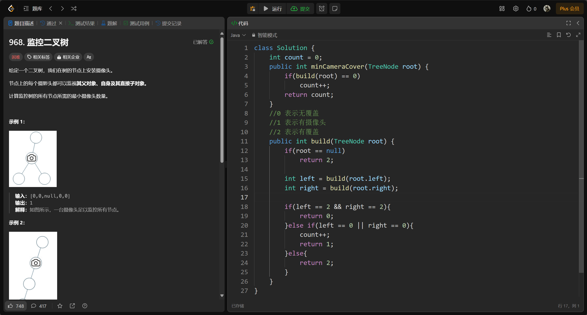

```java
class Solution {
    int count = 0;
    public int minCameraCover(TreeNode root) {
        if(build(root) == 0)
            count++;
        return count;
    }
    //0 表示无覆盖
    //1 表示有摄像头
    //2 表示有覆盖
    public int build(TreeNode root) {
        if(root == null)
            return 2;

        int left = build(root.left);
        int right = build(root.right);

        if(left == 2 && right == 2){
            return 0;
        }else if(left == 0 || right == 0){
            count++;
            return 1;
        }else{
            return 2;
        }
    }
}
```

  **//0 表示无覆盖**

  **//1 表示有摄像头**

  **//2 表示有覆盖**

# 单调栈

## 739. 每日温度⭐

[739. 每日温度 - 力扣（LeetCode）](https://leetcode.cn/problems/daily-temperatures/description/)

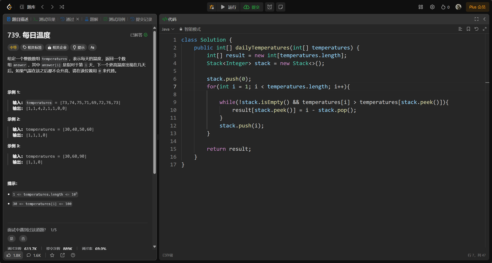

```java
class Solution {
    public int[] dailyTemperatures(int[] temperatures) {
        int[] result = new int[temperatures.length];
        Stack<Integer> stack = new Stack<>();

        stack.push(0);
        for(int i = 1; i < temperatures.length; i++){
            
            while(!stack.isEmpty() && temperatures[i] > temperatures[stack.peek()]){
                result[stack.peek()] = i - stack.pop();
            }
            stack.push(i);
        }
        
        return result;
    }
}
```

## 496.下一个更大元素 I⭐

[496. 下一个更大元素 I - 力扣（LeetCode）](https://leetcode.cn/problems/next-greater-element-i/description/)

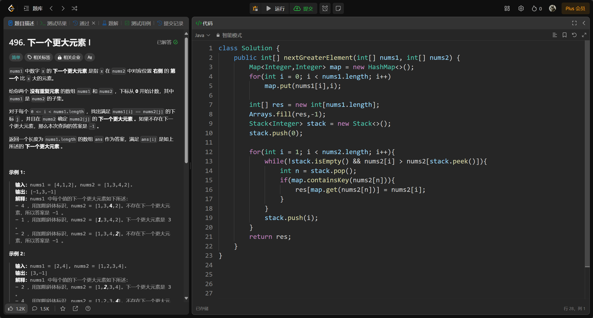

## 503.下一个更大元素II

[503. 下一个更大元素 II - 力扣（LeetCode）](https://leetcode.cn/problems/next-greater-element-ii/description/)

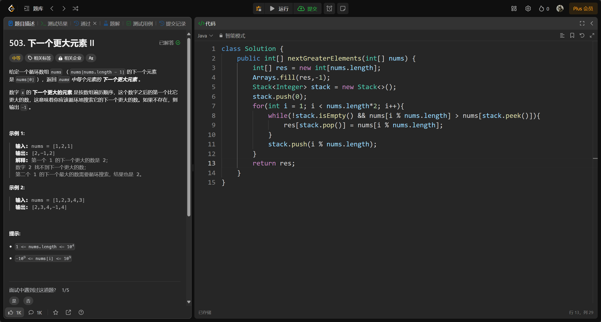

```java
class Solution {
    public int[] nextGreaterElements(int[] nums) {
        int[] res = new int[nums.length];
        Arrays.fill(res,-1);
        Stack<Integer> stack = new Stack<>();
        stack.push(0);
        for(int i = 1; i < nums.length*2; i++){
            while(!stack.isEmpty() && nums[i % nums.length] > nums[stack.peek()]){
                res[stack.pop()] = nums[i % nums.length]; 
            }
            stack.push(i % nums.length);
        }
        return res;         
    }
}
```

# 动态规划基础

## 理论基础

**1. 穷举分析**

- 当台阶数是1的时候，有一种跳法，f（1） =1
- 当只有2级台阶时，有两种跳法，第一种是直接跳两级，第二种是先跳一级，然后再跳一级。即f(2) = 2;

**2. 确定边界**

通过穷举分析，我们发现，当台阶数是1的时候或者2的时候，可以明确知道青蛙跳法。f（1） =1，f(2) = 2，当台阶n>=3时，已经呈现出规律f(3) = f(2) + f(1) =3，因此f（1） =1，f(2) = 2就是青蛙跳阶的边界。

**3. 找规律，确定最优子结构**

n>=3时，已经呈现出规律 f(n) = f(n-1) + f(n-2) ，因此，f(n-1)和f(n-2) 称为 f(n) 的最优子结构。什么是最优子结构？有这么一个解释：

**4， 写出状态转移方程**

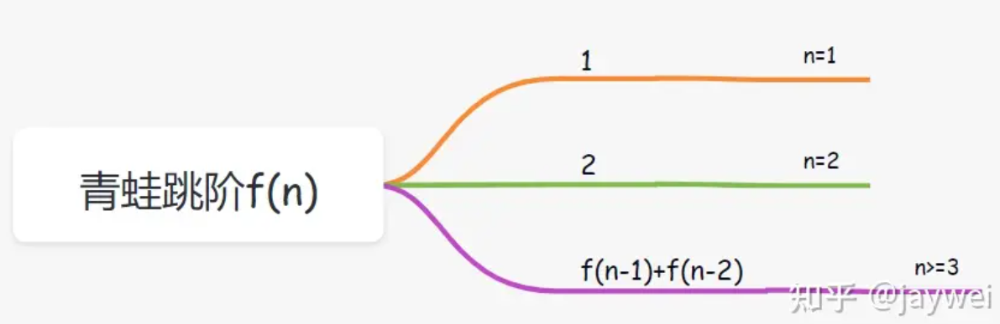

**5. 代码实现**

我们实现代码的时候，一般注意从底往上遍历哈，然后关注下边界情况，空间复杂度，也就差不多啦。动态规划有个框架的，大家实现的时候，可以考虑适当参考一下：

```java
dp[0][0][...] = 边界值
for(状态1 ：所有状态1的值){
    for(状态2 ：所有状态2的值){
        for(...){
          //状态转移方程
          dp[状态1][状态2][...] = 求最值
        }
    }
}
```

##  509. 斐波那契数

[509. 斐波那契数 - 力扣（LeetCode）](https://leetcode.cn/problems/fibonacci-number/)

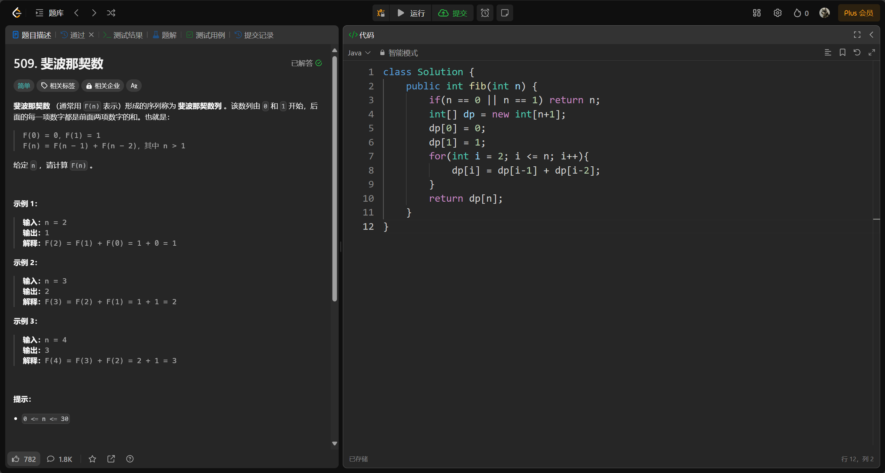

```java
class Solution {
    public int fib(int n) {
        if(n == 0 || n == 1) return n;
        int[] dp = new int[n+1];
        dp[0] = 0;
        dp[1] = 1;
        for(int i = 2; i <= n; i++){
            dp[i] = dp[i-1] + dp[i-2];
        }
        return dp[n];
    }
}
```

##  70. 爬楼梯

[70. 爬楼梯 - 力扣（LeetCode）](https://leetcode.cn/problems/climbing-stairs/description/)

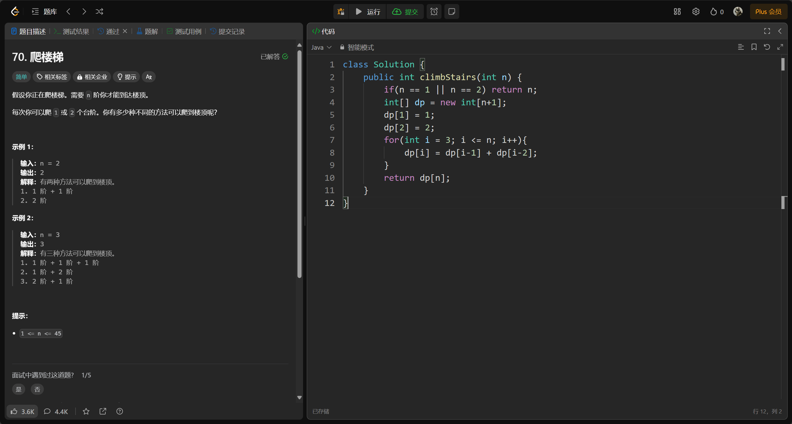

```java
class Solution {
    public int climbStairs(int n) {
        if(n == 1 || n == 2) return n;
        int[] dp = new int[n+1];
        dp[1] = 1;
        dp[2] = 2; 
        for(int i = 3; i <= n; i++){
            dp[i] = dp[i-1] + dp[i-2];
        }
        return dp[n];
    }
}
```

## 746. 使用最小花费爬楼梯

[746. 使用最小花费爬楼梯 - 力扣（LeetCode）](https://leetcode.cn/problems/min-cost-climbing-stairs/description/)


```java
class Solution {
    public int minCostClimbingStairs(int[] cost) {
        int n = cost.length;
        int[] dp = new int[n+1];
        dp[1] = 0;
        dp[2] = Math.min(cost[0],cost[1]);
        for(int i = 3; i < n+1; i++){
            dp[i] = Math.min(dp[i-1] + cost[i-1],dp[i-2] + cost[i-2]);
        }
        return dp[n];
    }
}
```

##  62.不同路径

[62. 不同路径 - 力扣（LeetCode）](https://leetcode.cn/problems/unique-paths/description/)

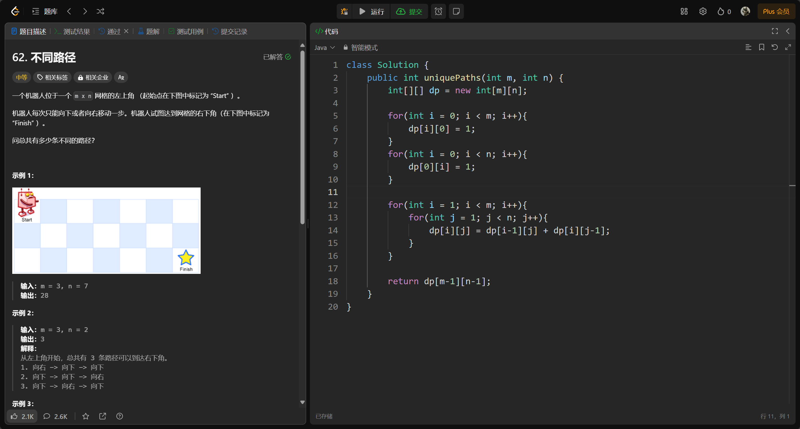

```java
class Solution {
    public int uniquePaths(int m, int n) {
        int[][] dp = new int[m][n];

        for(int i = 0; i < m; i++){
            dp[i][0] = 1;
        }
        for(int i = 0; i < n; i++){
            dp[0][i] = 1;
        }

        for(int i = 1; i < m; i++){
            for(int j = 1; j < n; j++){
                dp[i][j] = dp[i-1][j] + dp[i][j-1];
            }
        }

        return dp[m-1][n-1];
    }
}
```

##  63. 不同路径 II

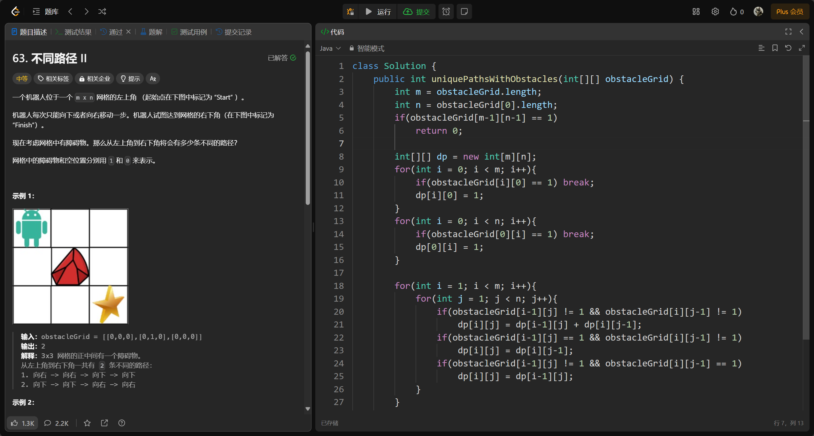

```java
class Solution {
    public int uniquePathsWithObstacles(int[][] obstacleGrid) {
        int m = obstacleGrid.length;
        int n = obstacleGrid[0].length;
        if(obstacleGrid[m-1][n-1] == 1)
            return 0;
            
        int[][] dp = new int[m][n];
        for(int i = 0; i < m; i++){
            if(obstacleGrid[i][0] == 1) break;
            dp[i][0] = 1;
        }
        for(int i = 0; i < n; i++){
            if(obstacleGrid[0][i] == 1) break;
            dp[0][i] = 1;
        }
        
        for(int i = 1; i < m; i++){
            for(int j = 1; j < n; j++){
                if(obstacleGrid[i-1][j] != 1 && obstacleGrid[i][j-1] != 1)
                    dp[i][j] = dp[i-1][j] + dp[i][j-1];
                if(obstacleGrid[i-1][j] == 1 && obstacleGrid[i][j-1] != 1)
                    dp[i][j] = dp[i][j-1];          
                if(obstacleGrid[i-1][j] != 1 && obstacleGrid[i][j-1] == 1)
                    dp[i][j] = dp[i-1][j];
            }
        }

        return dp[m-1][n-1];
    }
}
```

## ⭐343. 整数拆分

[343. 整数拆分 - 力扣（LeetCode）](https://leetcode.cn/problems/integer-break/description/)


```java
class Solution {
    public int integerBreak(int n) {
        int[] dp = new int[n+1];
        
        dp[2] = 1;
        for(int i = 3; i < n+1; i++){
            for(int j = 1; j < i; j++)
                dp[i] = Math.max(dp[i],Math.max(j*(i-j),j*dp[i-j]));
        }
        return dp[n];
    }
}
```

要不拆分成两部分相乘，要不拆分成多部分相乘。

## ⭐96.不同的二叉搜索树

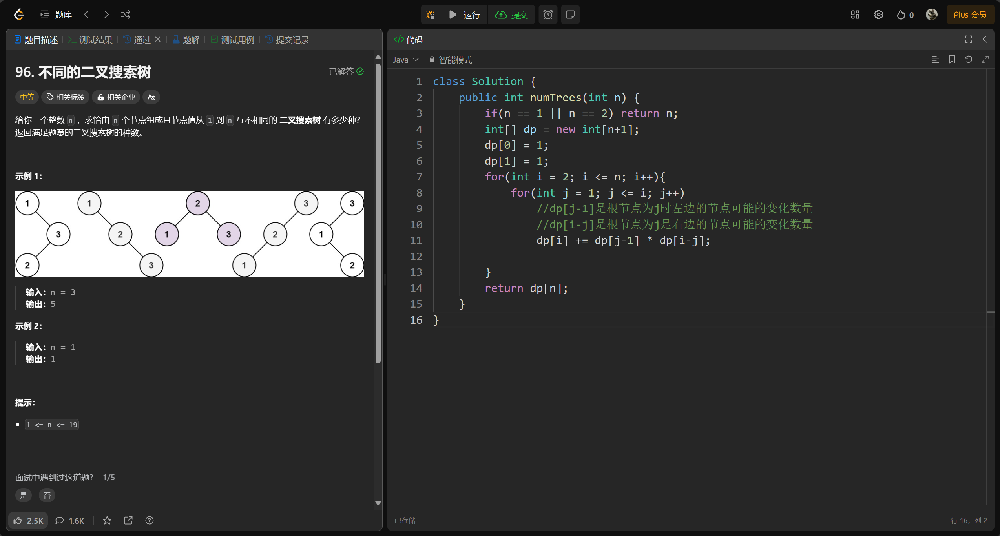

```java
class Solution {
    public int numTrees(int n) {
        if(n == 1 || n == 2) return n;
        int[] dp = new int[n+1];
        dp[0] = 1;
        dp[1] = 1;
        for(int i = 2; i <= n; i++){
            for(int j = 1; j <= i; j++)
                //dp[j-1]是根节点为j时左边的节点可能的变化数量
                //dp[i-j]是根节点为j是右边的节点可能的变化数量
                dp[i] += dp[j-1] * dp[i-j];

        }
        return dp[n];
    }
}
```

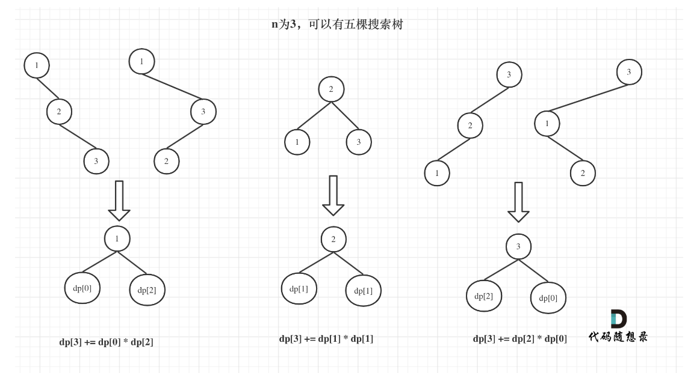

# 背包问题系列

## 01背包理论

01 背包：有n件物品和一个最多能背重量为w 的背包。第i件物品的重量是weight[i]，得到的价值是value[i] 。**每件物品只能用一次**，求解将哪些物品装入背包里物品价值总和最大。

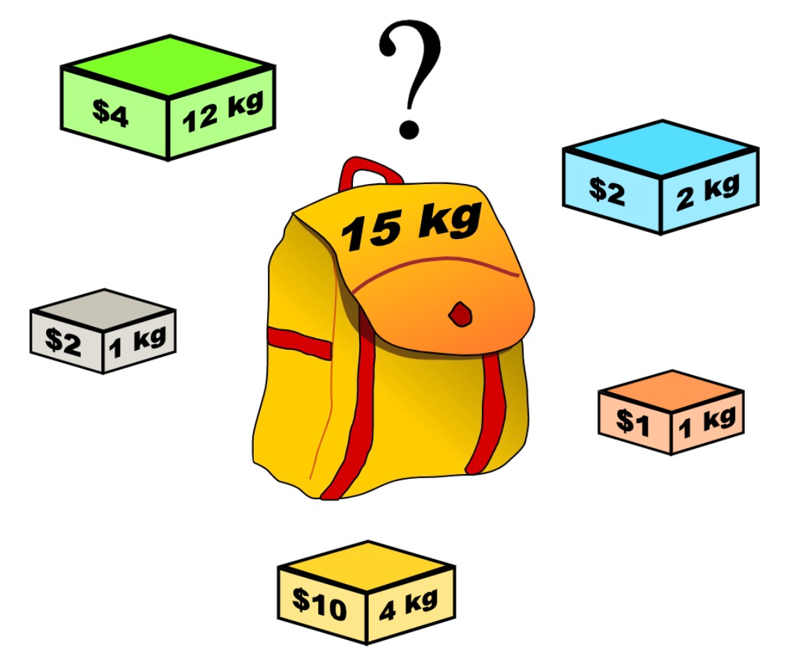

### **二维数组**

题目描述：问背包能背的物品最大价值是多少？

| 重量  | 价值 |      |
| ----- | ---- | ---- |
| 物品0 | 1    | 15   |
| 物品1 | 3    | 20   |
| 物品2 | 4    | 30   |

dp数组


1.确定dp数组以及下标的含义

```java
dp[i][j] 表示从下标为[0-i]的物品里任意取，放进容量为j的背包，价值总和最大是多少。
```

2.确定递推公式

```java
dp[i][j] = max(dp[i - 1][j], dp[i - 1][j - weight[i]] + value[i]);// 不放物品i or 放物品i
```

3.dp数组如何初始化

```java
所有值都是从上边和左上角推出来的，所以对于i，i-1一定要初始化。
dp[0][j]，即：i为0，存放编号0的物品的时候，各个容量的背包所能存放的最大价值。
那么很明显当 `j < weight[0]`的时候，dp[0][j] 应该是 0，因为背包容量比编号0的物品重量还小。
当`j >= weight[0]`时，dp[0][j] 应该是value[0]，因为背包容量放足够放编号0物品。
```

4.确定遍历顺序

```java
先遍历物品和先遍历背包重量都可以，因为是从左上角推理
```

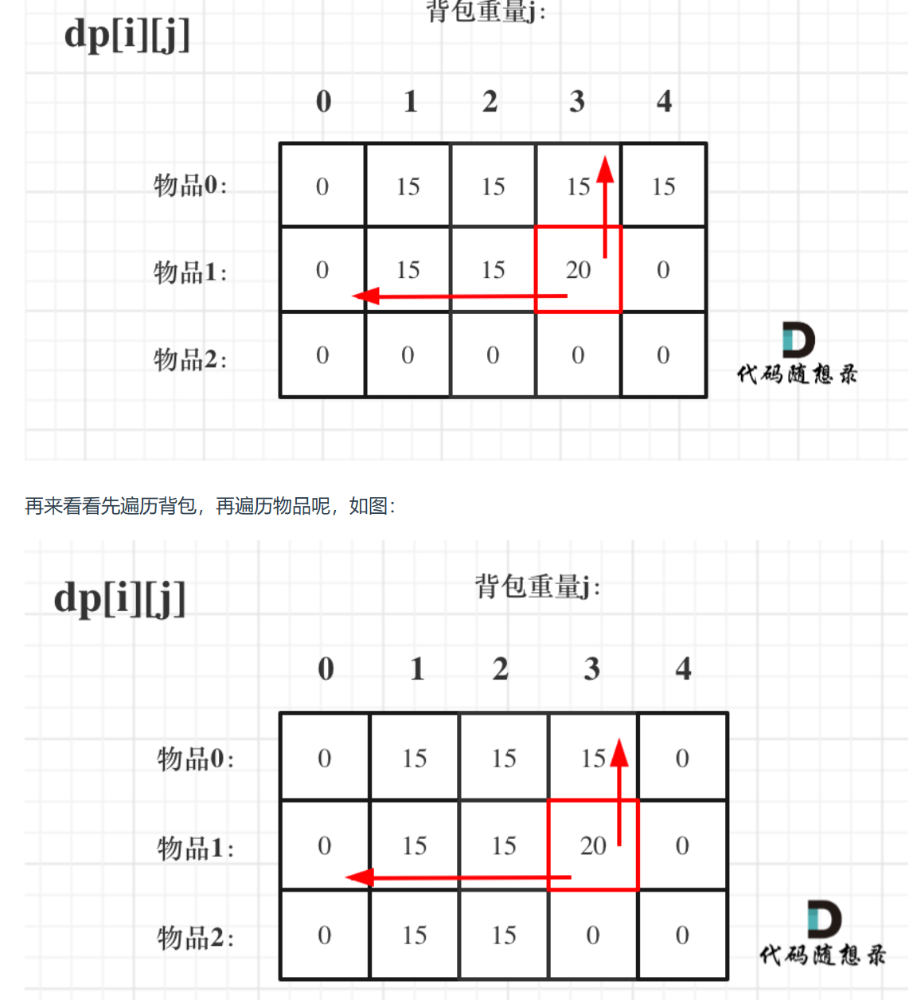

5.举例推导dp数组

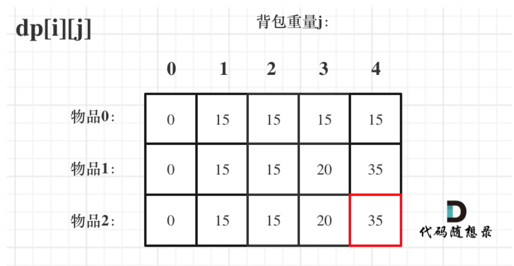

### 一维数组

01背包中二维dp数组的两个for遍历的先后循序是可以颠倒了，一维dp数组的两个for循环先后循序一定是先遍历物品，再遍历背包容量，因为他从右往左遍历，如果是上下扫描填数（先背包）的话，前面都为0，没意义。

1.确定dp数组的定义

```java
在一维dp数组中，dp[j]表示：容量为j的背包，所背的物品价值可以最大为dp[j]。
```

2.一维dp数组的递推公式

```java
dp[j] = max(dp[j], dp[j - weight[i]] + value[i]);
```

3.一维dp数组如何初始化

```java
那么我假设物品价值都是大于0的，所以dp数组初始化的时候，都初始为0就可以了。
```

4.一维dp数组遍历顺序

```java
二维dp遍历的时候，背包容量是从小到大，而一维dp遍历的时候，背包是从大到小。
要知道二维数组到一维数组转换的关键点在于一维数组是在原先数组的基础上更改的,并不是像二维数组那样重新用了一行来存储新的数据,从dp[i - 1][w] ->dp[w],dp[i-1][w-wi] ->dp[w - wi]可以看出其实二维变为一维的数据主要就是要使用i-1行的数据,而对于一维数据来说就是使用上一轮的数据,所以当使用一维的数据时要确保数据是上一轮的,没有被更改的，所以需要倒序遍历！！！
```

5.举例推导dp数组

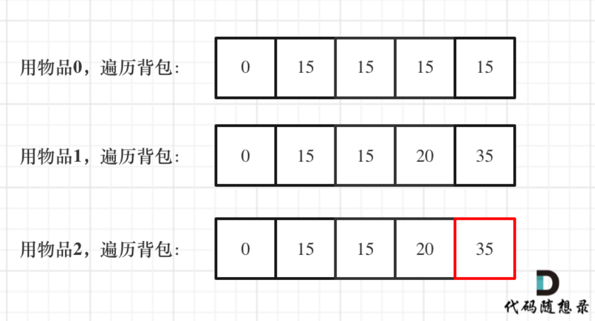

##  416. 分割等和子集

[416. 分割等和子集 - 力扣（LeetCode）](https://leetcode.cn/problems/partition-equal-subset-sum/description/)

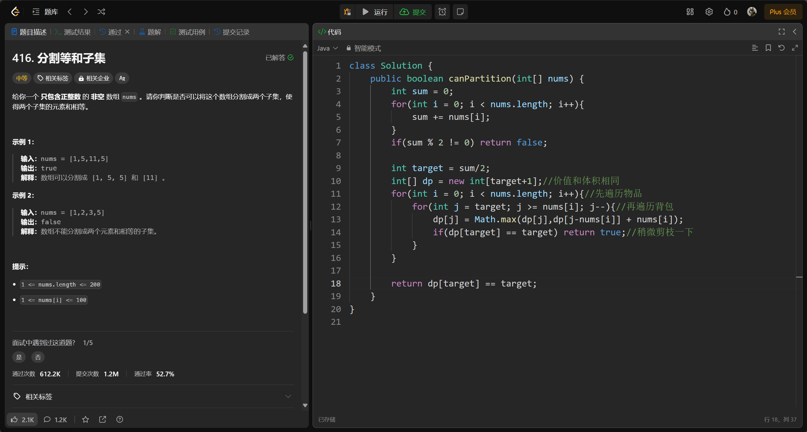

```java
class Solution {
    public boolean canPartition(int[] nums) {
        int sum = 0;
        for(int i = 0; i < nums.length; i++){
            sum += nums[i];
        }
        if(sum % 2 != 0) return false;

        int target = sum/2;
        int[] dp = new int[target+1];//价值和体积相同
        for(int i = 0; i < nums.length; i++){//先遍历物品
            for(int j = target; j >= nums[i]; j--){//再遍历背包
                dp[j] = Math.max(dp[j],dp[j-nums[i]] + nums[i]);
                if(dp[target] == target) return true;//稍微剪枝一下
            }
        }

        return dp[target] == target;
    }
}
```

这一题的价值和体积相同，目的是找到一半的值

## 1049.最后一块石头的重量II

[1049. 最后一块石头的重量 II - 力扣（LeetCode）](https://leetcode.cn/problems/last-stone-weight-ii/description/)

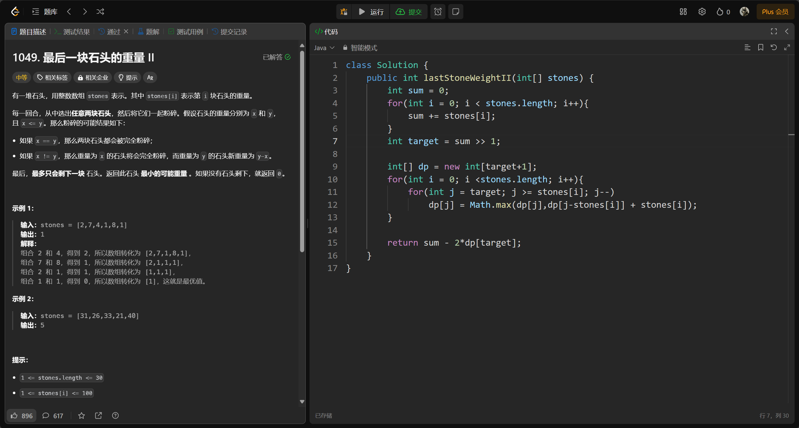

```java
class Solution {
    public int lastStoneWeightII(int[] stones) {
        int sum = 0;
        for(int i = 0; i < stones.length; i++){
            sum += stones[i];
        }
        int target = sum >> 1;

        int[] dp = new int[target+1];
        for(int i = 0; i <stones.length; i++){
            for(int j = target; j >= stones[i]; j--)
                dp[j] = Math.max(dp[j],dp[j-stones[i]] + stones[i]);
        }

        return sum - 2*dp[target];
    }
}
```

##  ⭐494.目标和

[494. 目标和 - 力扣（LeetCode）](https://leetcode.cn/problems/target-sum/description/)

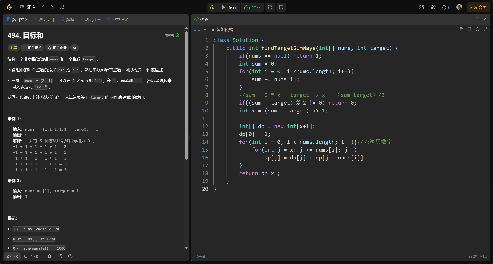

```java
class Solution {
    public int findTargetSumWays(int[] nums, int target) {
        if(nums == null) return 1;
        int sum = 0;
        for(int i = 0; i <nums.length; i++){
            sum += nums[i];
        }
        //sum - 2 * x = target -> x = （sum-target）/2
        if((sum - target) % 2 != 0) return 0;
        int x = (sum - target) >> 1;

        int[] dp = new int[x+1];
        dp[0] = 1;
        for(int i = 0; i < nums.length; i++){//先遍历数字
            for(int j = x; j >= nums[i]; j--)
                dp[j] = dp[j] + dp[j - nums[i]];
        }
        return dp[x];
    }
}
```

多少次的问题必须要初始化dp[0]=1，普通背包问题就不用初始化dp[0]；

**二维数组**

1.确定dp数组以及下标的含义

```java
dp[i][j]：使用 下标为[0, i]的nums[i]能够凑满j（包括j）这么大容量的包，有dp[i][j]种方法。
```

2.递推公式

```java
不放物品i：即背包容量为j，里面不放物品i，装满有dp[i - 1][j]中方法。
放物品i： 即：先空出物品i的容量，背包容量为（j - 物品i容量），放满背包有 dp[i - 1][j - 物品i容量] 种方法。
dp[i][j] = dp[i - 1][j] + dp[i - 1][j - nums[i]];
```

3.dp数组如何初始化

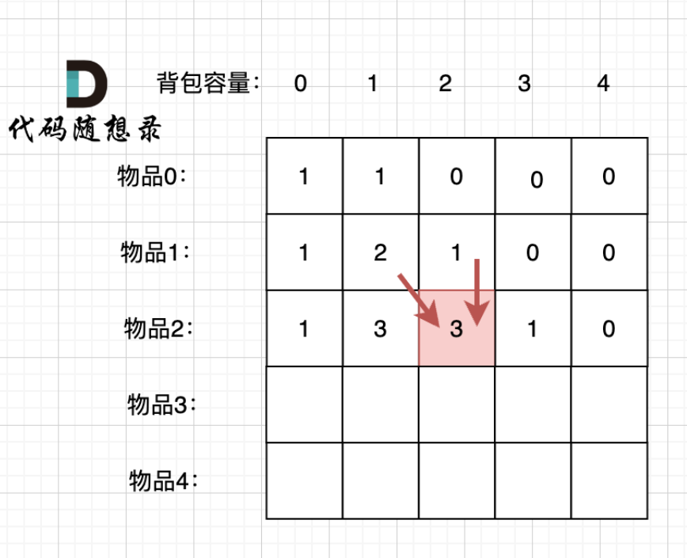

```java
先明确递推的方向，如图，求解 dp[2][2] 是由上方和左上方推出，那么二维数组的最上行一定要初始化，这是递推公式推导的基础。
dp[0][j]：只放物品0， 把容量为j的背包填满有几种方法？
    只有背包容量为 物品0 的容量的时候，方法为1，正好装满。
    其他情况下，要不是装不满，要不是装不下。
    所以初始化：dp[0][nums[0]] = 1 ，其他均为0 。
但这里有例外，就是如果 物品数值就是0呢？那么dp[0][0]就要修改。
    如果有两个物品，物品0为0， 物品1为0，装满背包容量为0的方法有几种。
        放0件物品
        放物品0
        放物品1
        放物品0 和 物品1
        此时是有4种方法。
    其实就是算数组里有t个0，然后按照组合数量求，即 2^t 。
```

4.确定遍历顺序

```java
先遍历哪个都行
```

5.举例推导dp数组

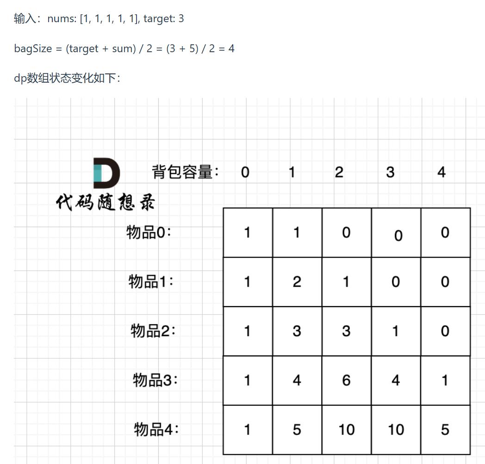

## ⭐474.一和零

[474. 一和零 - 力扣（LeetCode）](https://leetcode.cn/problems/ones-and-zeroes/description/)

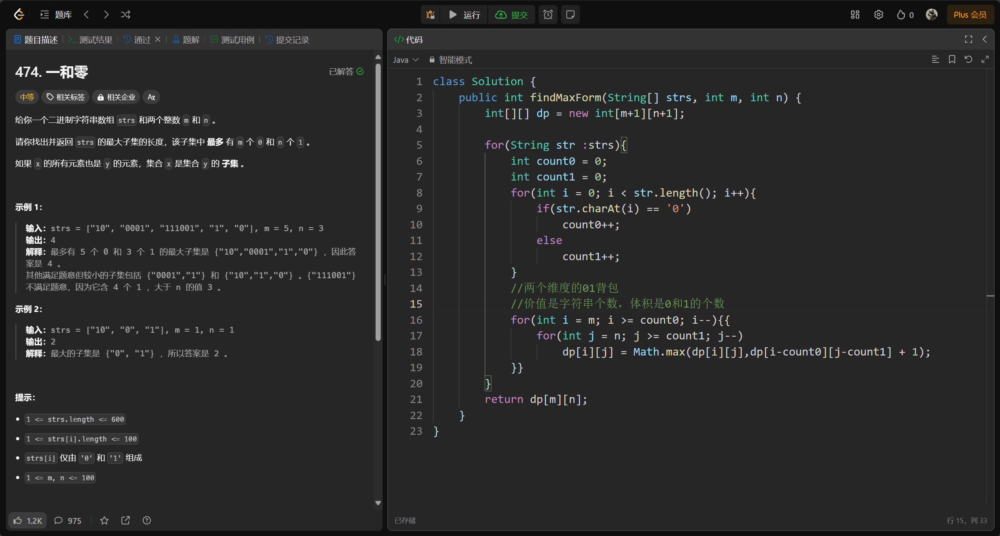

```java
class Solution {
    public int findMaxForm(String[] strs, int m, int n) {
        int[][] dp = new int[m+1][n+1];

        for(String str :strs){
            int count0 = 0;
            int count1 = 0;
            for(int i = 0; i < str.length(); i++){
                if(str.charAt(i) == '0')
                    count0++;
                else
                    count1++;
            }
            //两个维度的01背包
            //价值是字符串个数，体积是0和1的个数
            for(int i = m; i >= count0; i--){{
                for(int j = n; j >= count1; j--)
                    dp[i][j] = Math.max(dp[i][j],dp[i-count0][j-count1] + 1);
            }}
        }
        return dp[m][n];
    }
}
```

字符串的zeroNum和oneNum相当于物品的重量（weight[i]），字符串本身的个数相当于物品的价值（value[i]）。**这就是一个典型的01背包！** 只不过物品的重量有了两个维度而已。

## 完全背包理论基础

有N件物品和一个最多能背重量为W的背包。第i件物品的重量是weight[i]，得到的价值是value[i] 。**每件物品都有无限个（也就是可以放入背包多次）**，求解将哪些物品装入背包里物品价值总和最大，完全背包和01背包问题唯一不同的地方就是，每种物品有无限件。

```java
我们知道01背包内嵌的循环是从大到小遍历，为了保证每个物品仅被添加一次。

而完全背包的物品是可以添加多次的，所以要从小到大去遍历。
```

```java
01背包中二维dp数组的两个for遍历的先后循序是可以颠倒了，一维dp数组的两个for循环先后循序一定是先遍历物品，再遍历背包容量。
在完全背包中，对于一维dp数组来说，其实两个for循环嵌套顺序是无所谓的！
因为dp[j]是根据下标j之前所对应的dp[j]计算出来的。 只要保证下标j之前的dp[j]都是经过计算的就可以了。
```

## ⭐518.零钱兑换II

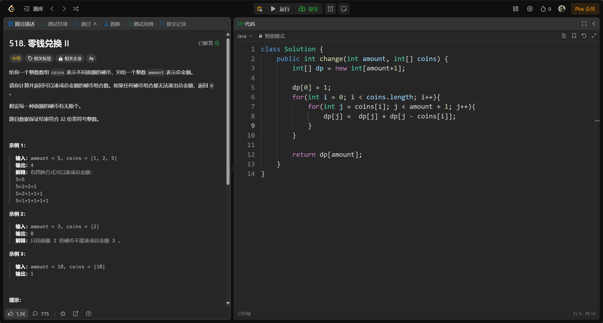

```java
class Solution {
    public int change(int amount, int[] coins) {
        int[] dp = new int[amount+1];

        dp[0] = 1;
        for(int i = 0; i < coins.length; i++){
            for(int j = coins[i]; j < amount + 1; j++){
                //不用当前硬币有多少种 or 用当前硬币有多少种
                dp[j] =  dp[j] + dp[j - coins[i]];
            }
        }

        return dp[amount];
    }
}
```

## 377. 组合总和 Ⅳ

[377. 组合总和 Ⅳ - 力扣（LeetCode）](https://leetcode.cn/problems/combination-sum-iv/description/)

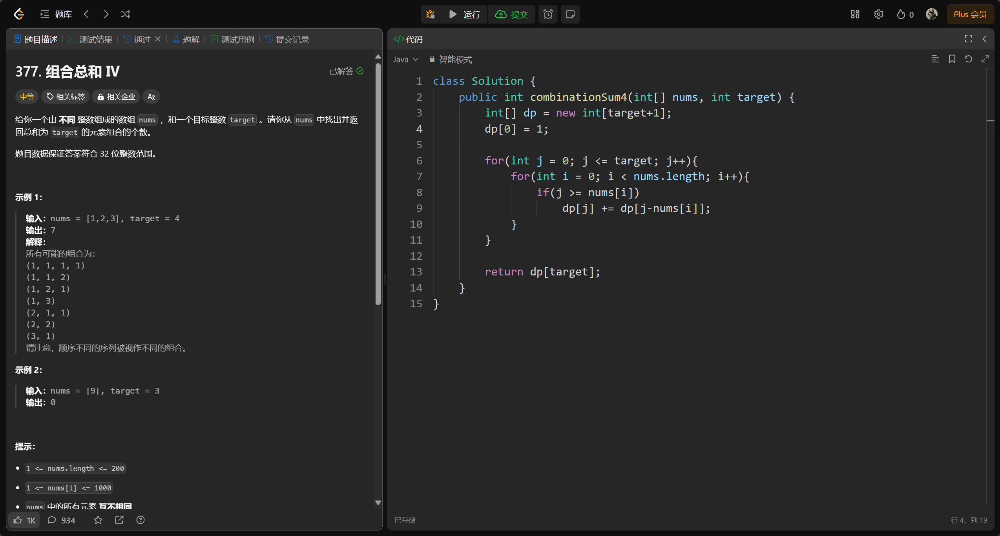

```java
class Solution {
    public int combinationSum4(int[] nums, int target) {
        int[] dp = new int[target+1];
        dp[0] = 1;

        for(int j = 0; j <= target; j++){
            for(int i = 0; i < nums.length; i++){
                if(j >= nums[i])
                    dp[j] += dp[j-nums[i]];
            }
        }

        return dp[target];
    }
}
```

## 70. 爬楼梯（进阶版）


```java
import java.util.*;
public class Main{
    public static void main(String[] args){
        Scanner in = new Scanner(System.in);
        int n = in.nextInt();
        int m = in.nextInt();
        
        
        int[] dp = new int[n+1];
        dp[0] = 1;
        for(int j = 0; j <= n; j++){
            for(int i = 1; i <= m; i++){
                if(j >= i)
                    dp[j] += dp[j-i];
            }
        }
          
        System.out.println(dp[n]);
    }
}

```

##  322. 零钱兑换

[322. 零钱兑换 - 力扣（LeetCode）](https://leetcode.cn/problems/coin-change/description/)

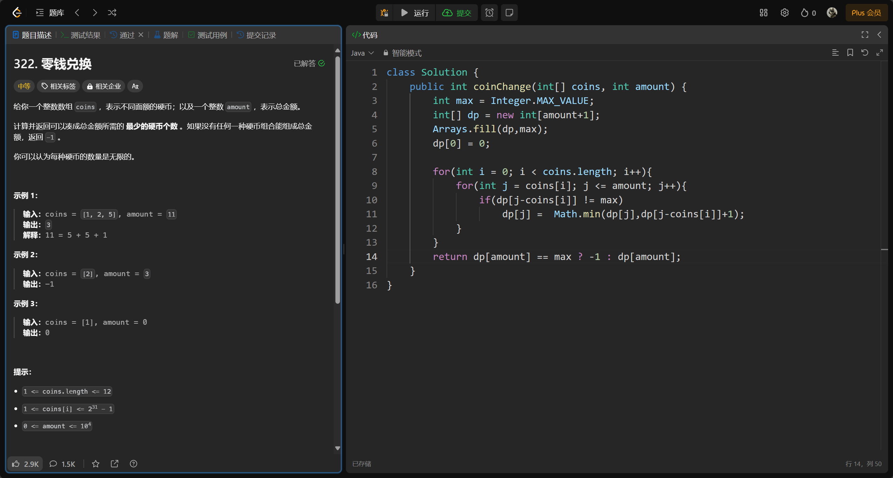

```java
class Solution {
    public int coinChange(int[] coins, int amount) {
        int max = Integer.MAX_VALUE;
        int[] dp = new int[amount+1];
        Arrays.fill(dp,max);
        dp[0] = 0;

        for(int i = 0; i < coins.length; i++){
            for(int j = coins[i]; j <= amount; j++){
                if(dp[j-coins[i]] != max)
                    dp[j] =  Math.min(dp[j],dp[j-coins[i]]+1);
            }
        }
        return dp[amount] == max ? -1 : dp[amount];
    }
}
```

## 279.完全平方数

[279. 完全平方数 - 力扣（LeetCode）](https://leetcode.cn/problems/perfect-squares/description/)

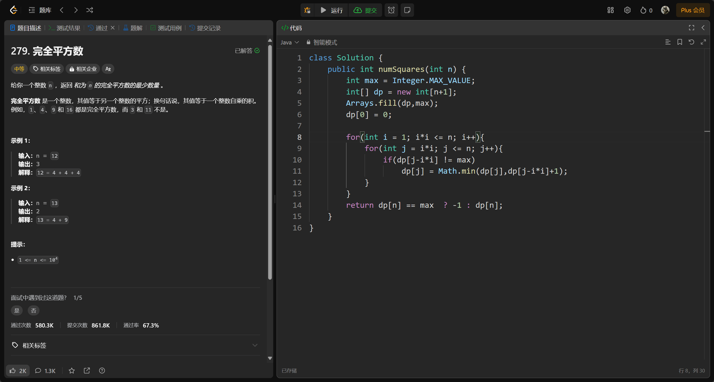

```java
class Solution {
    public int numSquares(int n) {
        int max = Integer.MAX_VALUE;
        int[] dp = new int[n+1];
        Arrays.fill(dp,max);
        dp[0] = 0;

        for(int i = 1; i*i <= n; i++){
            for(int j = i*i; j <= n; j++){
                if(dp[j-i*i] != max)
                    dp[j] = Math.min(dp[j],dp[j-i*i]+1);
            }
        }
        return dp[n] == max  ? -1 : dp[n];
    }
}
```

## ⭐139.单词拆分

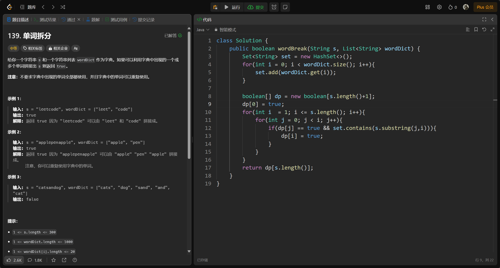

```java
class Solution {
    public boolean wordBreak(String s, List<String> wordDict) {
        Set<String> set = new HashSet<>();
        for(int i = 0; i < wordDict.size(); i++){
            set.add(wordDict.get(i));
        }
            
        boolean[] dp = new boolean[s.length()+1];
        dp[0] = true;
        for(int i  = 1; i <= s.length(); i++){
            for(int j = 0; j < i; j++){
                if(dp[j] == true && set.contains(s.substring(j,i))){
                    dp[i] = true;
                }
            }
        }
        return dp[s.length()];
    }
}
```

## 背包问题总结

### 递推公式

#### 问能否能装满背包（或者最多装多少） ，对应题目如下：

```java
dp[j] = Math.max(dp[j], dp[j - nums[i]] + nums[i]);
```

- [动态规划：416.分割等和子集(opens new window)](https://programmercarl.com/0416.分割等和子集.html)
- [动态规划：1049.最后一块石头的重量 II](https://programmercarl.com/1049.最后一块石头的重量II.html)

#### 问背包装满最大价值 ，对应题目如下：

```java
dp[j] = Math.max(dp[j], dp[j - weight[i]] + value[i]);
```

- [动态规划：474.一和零](https://programmercarl.com/0474.一和零.html)

#### 问装满背包有几种方法，对应题目如下：

```java
dp[j] += dp[j - nums[i]] 
```

- [动态规划：494.目标和(opens new window)](https://programmercarl.com/0494.目标和.html)
- [动态规划：518. 零钱兑换 II(opens new window)](https://programmercarl.com/0518.零钱兑换II.html)
- [动态规划：377.组合总和Ⅳ(opens new window)](https://programmercarl.com/0377.组合总和Ⅳ.html)
- [动态规划：70. 爬楼梯进阶版（完全背包）](https://programmercarl.com/0070.爬楼梯完全背包版本.html)

#### 问装满背包所有物品的最小个数，对应题目如下：

```java
dp[j] = Math.min(dp[j - coins[i]] + 1, dp[j]); 
```

- [动态规划：322.零钱兑换(opens new window)](https://programmercarl.com/0322.零钱兑换.html)
- [动态规划：279.完全平方数](https://programmercarl.com/0279.完全平方数.html)

### 遍历顺序

#### 01背包

外层物品，内层容量，内层反向遍历从而保留状态

```java
for(int i = 0; i <stones.length; i++){
    for(int j = target; j >= stones[i]; j--)
        dp[j] = Math.max(dp[j],dp[j-stones[i]] + stones[i]);
}
```

#### 完全背包

组合问题外层物品，内层容量

排列问题外层容量，内层物品

求最小数就无所谓了，但是要注意初始化为Integer.MAX_VALUE，且

```java
if(dp[j-i*i] != max)
    dp[j] = Math.min(dp[j],dp[j-i*i]+1);
```

正向遍历，因为可以多次使用同一物品

```java
dp[0] = 1;
for(int i = 0; i < coins.length; i++){
    for(int j = coins[i]; j < amount + 1; j++){
        //不用当前硬币有多少种 or 用当前硬币有多少种
        dp[j] =  dp[j] + dp[j - coins[i]];
    }
}
```


# 打家劫舍系列

##  198.打家劫舍

[198. 打家劫舍 - 力扣（LeetCode）](https://leetcode.cn/problems/house-robber/description/)

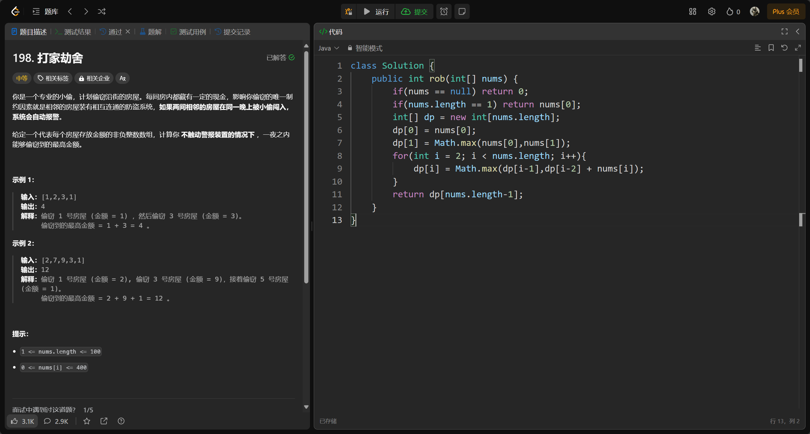

```java
class Solution {
    public int rob(int[] nums) {
        if(nums == null) return 0;
        if(nums.length == 1) return nums[0];
        int[] dp = new int[nums.length];
        dp[0] = nums[0];
        dp[1] = Math.max(nums[0],nums[1]);
        for(int i = 2; i < nums.length; i++){
            dp[i] = Math.max(dp[i-1],dp[i-2] + nums[i]);
        }
        return dp[nums.length-1];
    }
}
```

## 213.打家劫舍II

[213. 打家劫舍 II - 力扣（LeetCode）](https://leetcode.cn/problems/house-robber-ii/)

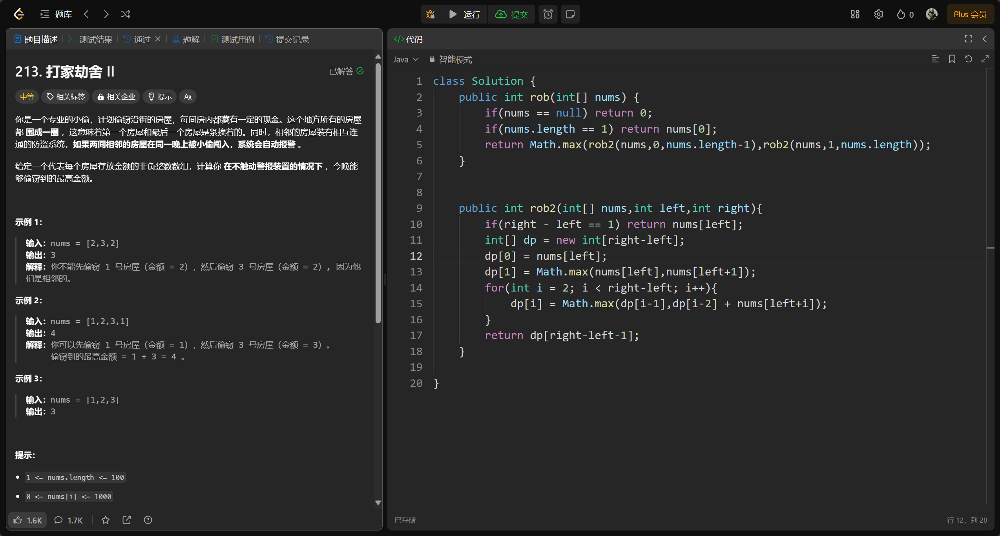

```java
class Solution {
    public int rob(int[] nums) {
        if(nums == null) return 0;
        if(nums.length == 1) return nums[0];
        return Math.max(rob2(nums,0,nums.length-1),rob2(nums,1,nums.length));
    }


    public int rob2(int[] nums,int left,int right){
        if(right - left == 1) return nums[left];
        int[] dp = new int[right-left];
        dp[0] = nums[left];
        dp[1] = Math.max(nums[left],nums[left+1]);
        for(int i = 2; i < right-left; i++){
            dp[i] = Math.max(dp[i-1],dp[i-2] + nums[left+i]);
        }
        return dp[right-left-1];
    }

}
```

## ⭐337.打家劫舍 III

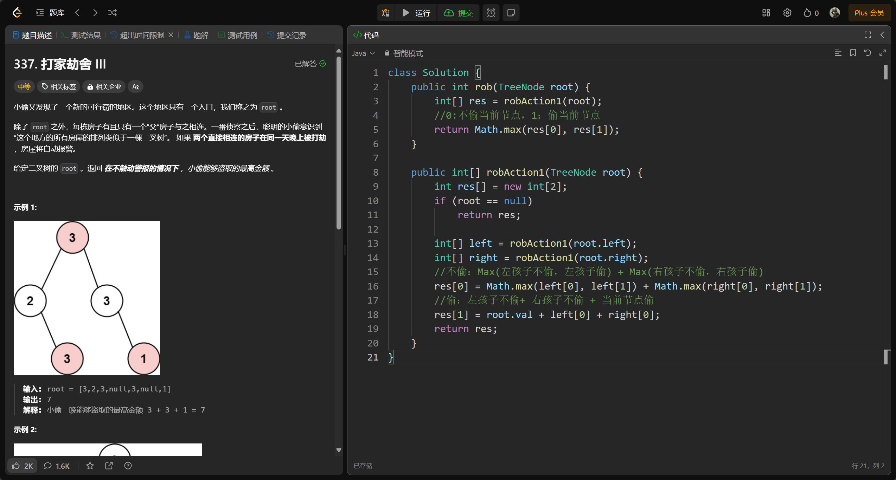

```java
class Solution {
    public int rob(TreeNode root) {
        int[] res = robAction1(root);
        //0:不偷当前节点，1：偷当前节点
        return Math.max(res[0], res[1]);
    }
    
    public int[] robAction1(TreeNode root) {
        int res[] = new int[2];
        if (root == null)
            return res;

        int[] left = robAction1(root.left);
        int[] right = robAction1(root.right);
        //不偷：Max(左孩子不偷，左孩子偷) + Max(右孩子不偷，右孩子偷)
        res[0] = Math.max(left[0], left[1]) + Math.max(right[0], right[1]);
        //偷：左孩子不偷+ 右孩子不偷 + 当前节点偷
        res[1] = root.val + left[0] + right[0];
        return res;
    }
}
```

如果是偷当前节点，那么左右孩子就不能偷，val1 = cur->val + left[0] + right[0]; （**如果对下标含义不理解就再回顾一下dp数组的含义**）

如果不偷当前节点，那么左右孩子就可以偷，至于到底偷不偷一定是选一个最大的，所以：val2 = max(left[0], left[1]) + max(right[0], right[1]);

# 股票系列

## 121. 买卖股票的最佳时机

```java
想通这一招，搞定所有股票买卖问题，包括买卖股票的最佳时机（1,2,3,4）、含冷冻期、含手续费。

我们要跳出固有的思维模式，并不是要考虑买还是卖，而是要最大化手里持有的钱。
买股票手里的钱减少，卖股票手里的钱增加，无论什么时刻，我们要保证手里的钱最多。

我们这一次买还是卖只跟上一次我们卖还是买的状态有关。

你听懂了吗？管你听没听懂，看就完了！

我们先看前两个问题的代码，其中buy和sell都代表操作之后手里的钱。

作者：洛必达泉
链接：https://leetcode.cn/problems/best-time-to-buy-and-sell-stock-iv/solutions/740596/5xing-dai-ma-gao-ding-suo-you-gu-piao-ma-j6zo/
来源：力扣（LeetCode）
著作权归作者所有。商业转载请联系作者获得授权，非商业转载请注明出处。
```

[121. 买卖股票的最佳时机 - 力扣（LeetCode）](https://leetcode.cn/problems/best-time-to-buy-and-sell-stock/)

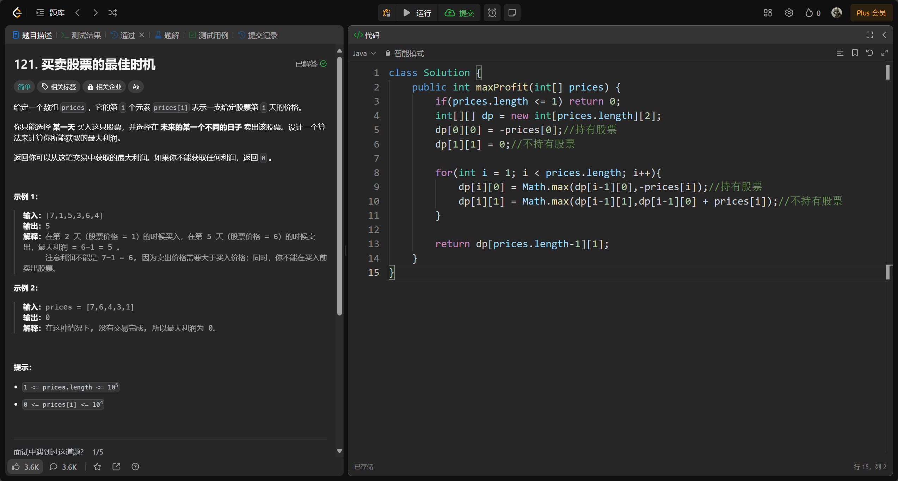

```java
class Solution {
    public int maxProfit(int[] prices) {
        if(prices.length <= 1) return 0;
        int[][] dp = new int[prices.length][2];
        dp[0][0] = -prices[0];//持有股票
        dp[1][1] = 0;//不持有股票

        for(int i = 1; i < prices.length; i++){
            dp[i][0] = Math.max(dp[i-1][0],-prices[i]);//持有股票
            dp[i][1] = Math.max(dp[i-1][1],dp[i-1][0] + prices[i]);//不持有股票
        }

        return dp[prices.length-1][1];
    }
}
```

## 122.买卖股票的最佳时机II

[122. 买卖股票的最佳时机 II - 力扣（LeetCode）](https://leetcode.cn/problems/best-time-to-buy-and-sell-stock-ii/description/)

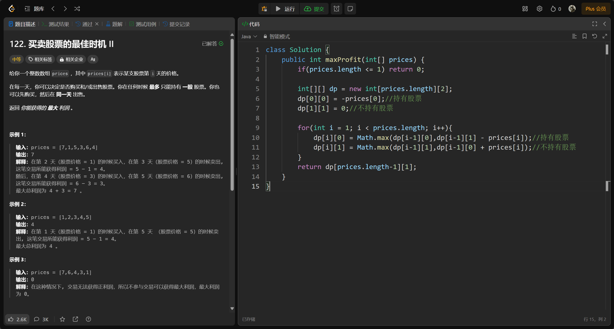

```java
class Solution {
    public int maxProfit(int[] prices) {
        if(prices.length <= 1) return 0;

        int[][] dp = new int[prices.length][2];
        dp[0][0] = -prices[0];//持有股票
        dp[1][1] = 0;//不持有股票

        for(int i = 1; i < prices.length; i++){
            dp[i][0] = Math.max(dp[i-1][0],dp[i-1][1] - prices[i]);//持有股票
            dp[i][1] = Math.max(dp[i-1][1],dp[i-1][0] + prices[i]);//不持有股票
        }
        return dp[prices.length-1][1];
    }
}
```

## ⭐123.买卖股票的最佳时机III

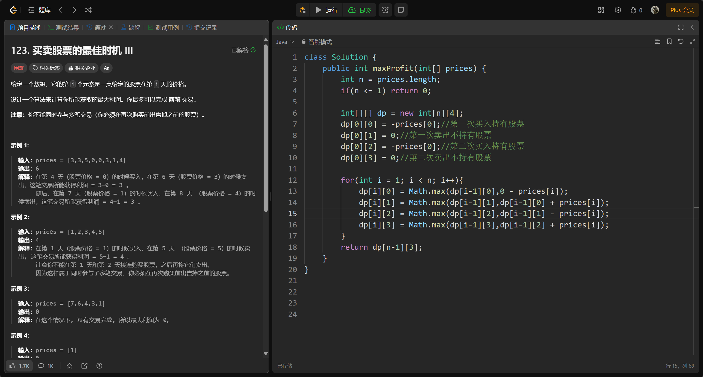

```java
class Solution {
    public int maxProfit(int[] prices) {
        int n = prices.length;
        if(n <= 1) return 0;

        int[][] dp = new int[n][4];
        dp[0][0] = -prices[0];//第一次买入持有股票
        dp[0][1] = 0;//第一次卖出不持有股票
        dp[0][2] = -prices[0];//第二次买入持有股票
        dp[0][3] = 0;//第二次卖出不持有股票

        for(int i = 1; i < n; i++){
            dp[i][0] = Math.max(dp[i-1][0],0 - prices[i]);//第一次买入持有股票
            dp[i][1] = Math.max(dp[i-1][1],dp[i-1][0] + prices[i]);//第一次卖出不持有股票
            dp[i][2] = Math.max(dp[i-1][2],dp[i-1][1] - prices[i]);//第二次买入持有股票
            dp[i][3] = Math.max(dp[i-1][3],dp[i-1][2] + prices[i]);//第二次卖出不持有股票
        }
        return dp[n-1][3];
    }
}
```

##  ⭐188.买卖股票的最佳时机IV

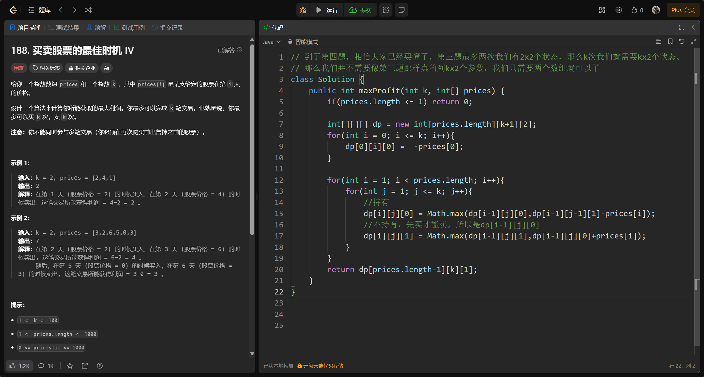

```java
// 到了第四题，相信大家已经要懂了，第三题最多两次我们有2x2个状态，那么k次我们就需要kx2个状态。
// 那么我们并不需要像第三题那样真的列kx2个参数，我们只需要两个数组就可以了
class Solution {
    public int maxProfit(int k, int[] prices) {
        if(prices.length <= 1) return 0;

        int[][][] dp = new int[prices.length][k+1][2];
        for(int i = 0; i <= k; i++){
            dp[0][i][0] =  -prices[0];
        }

        for(int i = 1; i < prices.length; i++){
            for(int j = 1; j <= k; j++){
                //持有
                dp[i][j][0] = Math.max(dp[i-1][j][0],dp[i-1][j-1][1]-prices[i]);
                //不持有，先买才能卖，所以是dp[i-1][j][0]
                dp[i][j][1] = Math.max(dp[i-1][j][1],dp[i-1][j][0]+prices[i]);
            }
        }
        return dp[prices.length-1][k][1];
    }
}
```

## 309.最佳买卖股票时机含冷冻期

[309. 买卖股票的最佳时机含冷冻期 - 力扣（LeetCode）](https://leetcode.cn/problems/best-time-to-buy-and-sell-stock-with-cooldown/description/)

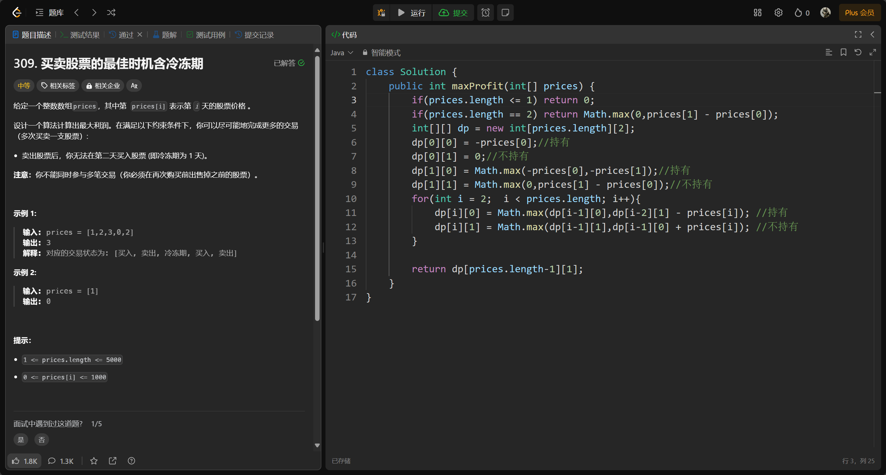

```java
class Solution {
    public int maxProfit(int[] prices) {
        if(prices.length <= 1) return 0;
        if(prices.length == 2) return Math.max(0,prices[1] - prices[0]);
        int[][] dp = new int[prices.length][2];
        dp[0][0] = -prices[0];//持有
        dp[0][1] = 0;//不持有
        dp[1][0] = Math.max(-prices[0],-prices[1]);//持有
        dp[1][1] = Math.max(0,prices[1] - prices[0]);//不持有        
        for(int i = 2;  i < prices.length; i++){
            dp[i][0] = Math.max(dp[i-1][0],dp[i-2][1] - prices[i]); //持有
            dp[i][1] = Math.max(dp[i-1][1],dp[i-1][0] + prices[i]); //不持有
        }

        return dp[prices.length-1][1];
    }
}
```

## 714.买卖股票的最佳时机含手续费

[714. 买卖股票的最佳时机含手续费 - 力扣（LeetCode）](https://leetcode.cn/problems/best-time-to-buy-and-sell-stock-with-transaction-fee/description/)

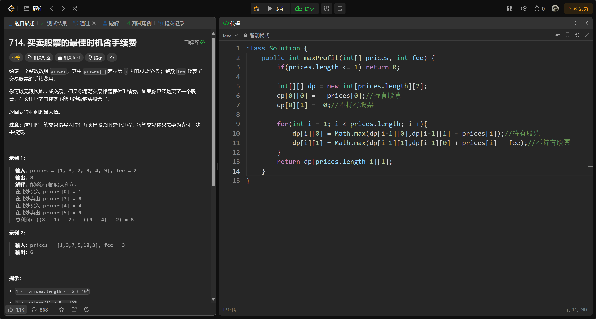

```java
class Solution {
    public int maxProfit(int[] prices, int fee) {
        if(prices.length <= 1) return 0;

        int[][] dp = new int[prices.length][2];
        dp[0][0] =  -prices[0];//持有股票
        dp[0][1] =  0;//不持有股票

        for(int i = 1; i < prices.length; i++){
            dp[i][0] = Math.max(dp[i-1][0],dp[i-1][1] - prices[i]);//持有股票
            dp[i][1] = Math.max(dp[i-1][1],dp[i-1][0] + prices[i] - fee);//不持有股票
        }   
        return dp[prices.length-1][1];
    }
}
```

# 子序列系列

## 300.最长递增子序列

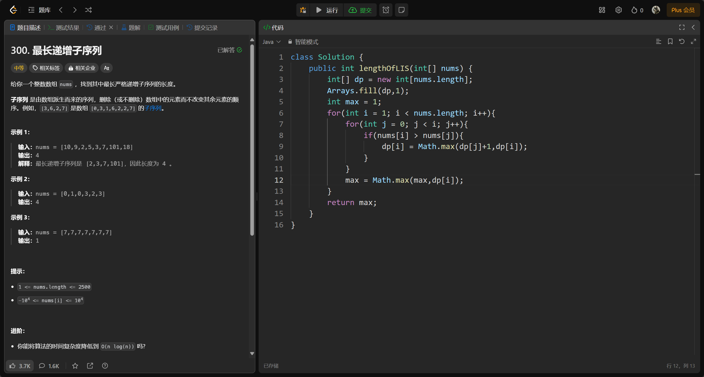

```java
class Solution {
    public int lengthOfLIS(int[] nums) {
        int[] dp = new int[nums.length];
        Arrays.fill(dp,1);
        int max = 1;
        for(int i = 1; i < nums.length; i++){
            for(int j = 0; j < i; j++){
                if(nums[i] > nums[j]){
                    dp[i] = Math.max(dp[j]+1,dp[i]);
                }
            }
            max = Math.max(max,dp[i]);
        }
        return max;
    }
}
```

## 674. 最长连续递增序列

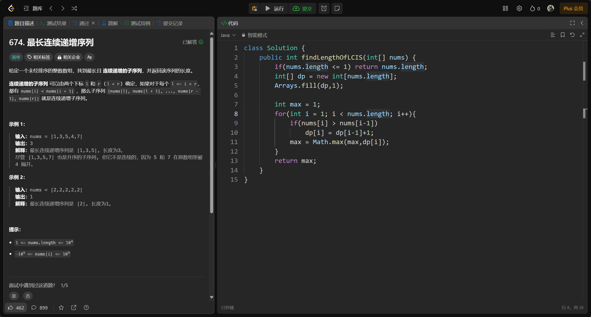

```java
class Solution {
    public int findLengthOfLCIS(int[] nums) {
        if(nums.length <= 1) return nums.length;
        int[] dp = new int[nums.length];
        Arrays.fill(dp,1);
        
        int max = 1;
        for(int i = 1; i < nums.length; i++){
            if(nums[i] > nums[i-1]) 
                dp[i] = dp[i-1]+1;
            max = Math.max(max,dp[i]);
        }
        return max;
    }
}
```

## ⭐ 718. 最长重复子数组

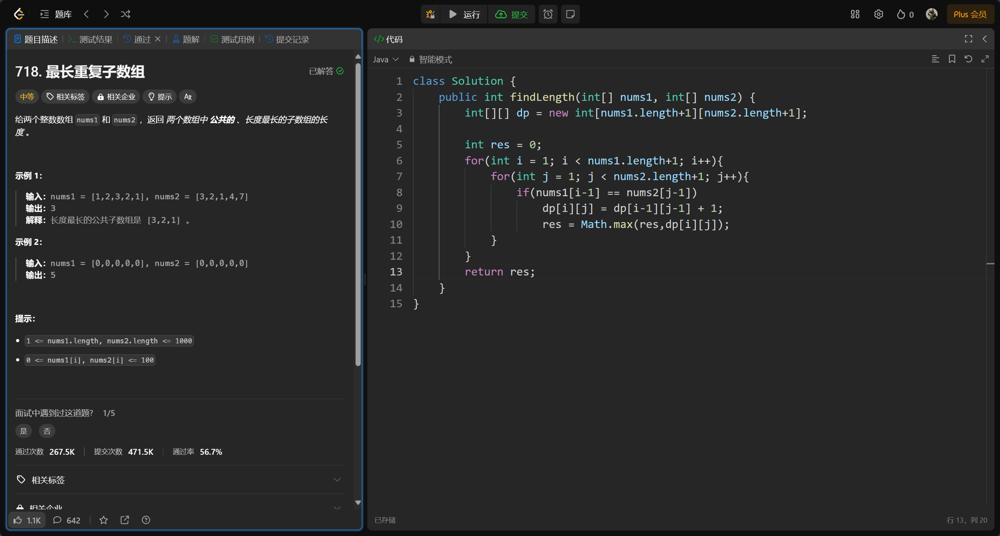

```java
class Solution {
    public int findLength(int[] nums1, int[] nums2) {
        int[][] dp = new int[nums1.length+1][nums2.length+1];

        int res = 0;
        for(int i = 1; i < nums1.length+1; i++){
            for(int j = 1; j < nums2.length+1; j++){
                if(nums1[i-1] == nums2[j-1])
                    dp[i][j] = dp[i-1][j-1] + 1;
                    res = Math.max(res,dp[i][j]);
            }
        }
        return res;
    }
}
```

## ⭐1143.最长公共子序列

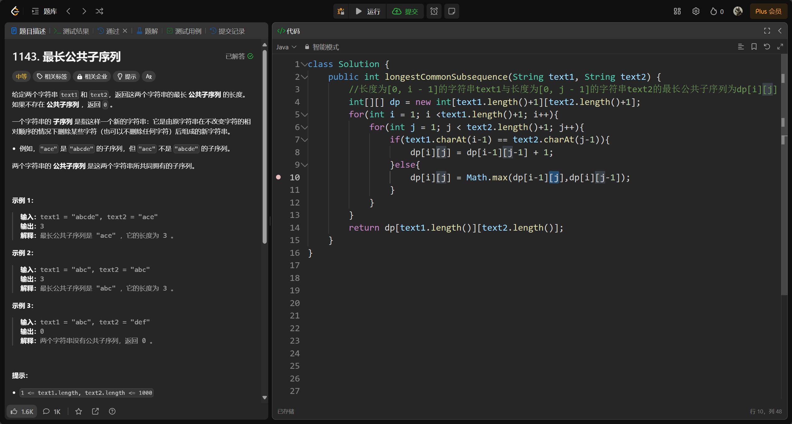

```java
class Solution {
    public int longestCommonSubsequence(String text1, String text2) {
        //长度为[0, i - 1]的字符串text1与长度为[0, j - 1]的字符串text2的最长公共子序列为dp[i][j]
        int[][] dp = new int[text1.length()+1][text2.length()+1];
        for(int i = 1; i <text1.length()+1; i++){
            for(int j = 1; j < text2.length()+1; j++){
                if(text1.charAt(i-1) == text2.charAt(j-1)){
                    dp[i][j] = dp[i-1][j-1] + 1;
                }else{
                    dp[i][j] = Math.max(dp[i-1][j],dp[i][j-1]);
                }
            }
        }
        return dp[text1.length()][text2.length()];
    }
}
```

##  1035.不相交的线


```java
class Solution {
    public int maxUncrossedLines(int[] nums1, int[] nums2) {
        int[][] dp = new int[nums1.length+1][nums2.length+1];
        
        for(int i = 1; i < nums1.length+1; i++){
            for(int j = 1; j < nums2.length+1; j++){
                if(nums1[i-1] == nums2[j-1])
                    dp[i][j] = dp[i-1][j-1] + 1;
                else
                    dp[i][j] = Math.max(dp[i-1][j],dp[i][j-1]);
            }   
        }
        return dp[nums1.length][nums2.length];
    }
}
```

## 53. 最大子序和

[53. 最大子数组和 - 力扣（LeetCode）](https://leetcode.cn/problems/maximum-subarray/description/)

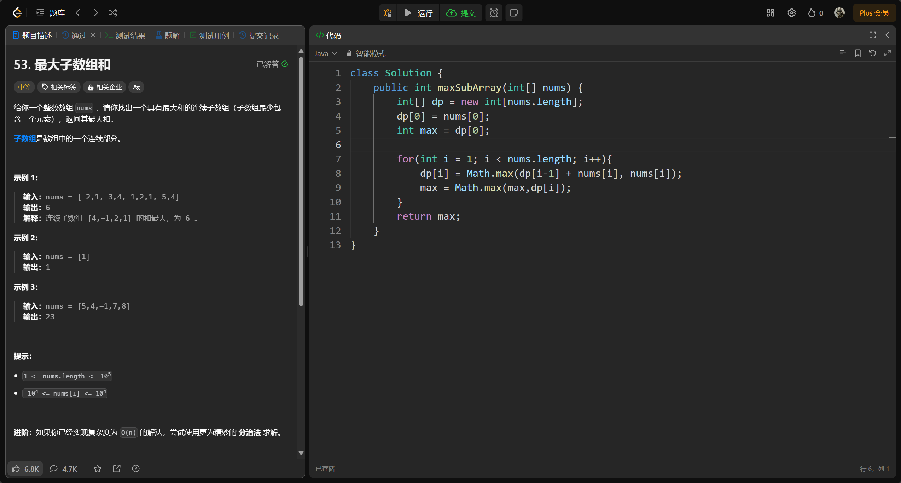

```java
class Solution {
    public int maxSubArray(int[] nums) {
        int[] dp = new int[nums.length];
        dp[0] = nums[0];
        int max = dp[0];

        for(int i = 1; i < nums.length; i++){
            dp[i] = Math.max(dp[i-1] + nums[i], nums[i]);
            max = Math.max(max,dp[i]);
        }
        return max;
    }
}
```

## 392.判断子序列

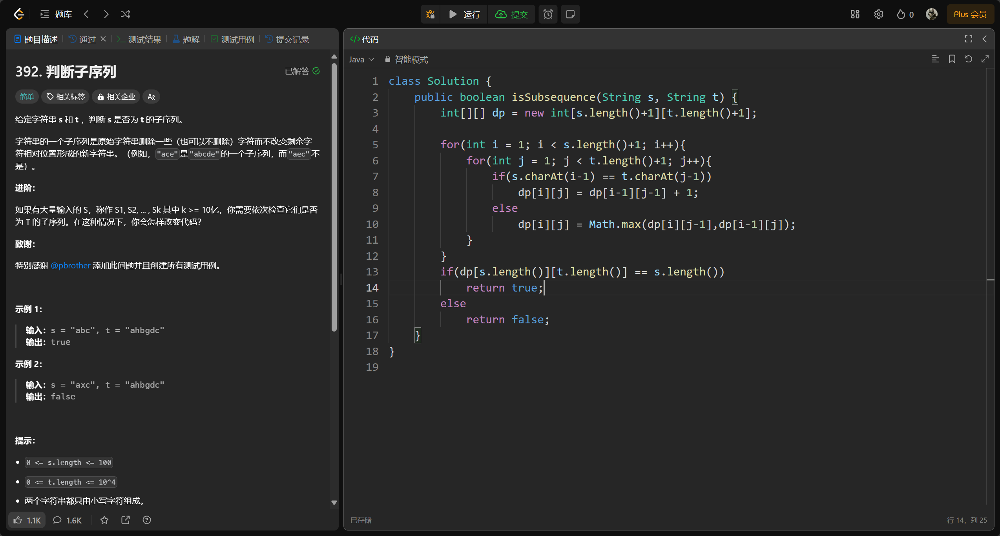

```java
class Solution {
    public boolean isSubsequence(String s, String t) {
        int[][] dp = new int[s.length()+1][t.length()+1];

        for(int i = 1; i < s.length()+1; i++){
            for(int j = 1; j < t.length()+1; j++){
                if(s.charAt(i-1) == t.charAt(j-1))
                    dp[i][j] = dp[i-1][j-1] + 1;
                else
                    dp[i][j] = Math.max(dp[i][j-1],dp[i-1][j]);
            }
        }
        if(dp[s.length()][t.length()] == s.length())
            return true;
        else 
            return false;
    }
}
```

**双指针法**

```java
class Solution {
    public boolean isSubsequence(String s, String t) {
        if(s.length() == 0) return true;
        int i = 0;
        int j = 0;
        while(j < t.length()){
            int start = j;
            if(s.charAt(i) == t.charAt(j)){
                i++;
                j++;
                if(i == s.length())
                    return true;
            }else{
                j++;
            }
        }
        return false;
    }
}
```

## ⭐115.不同的子序列

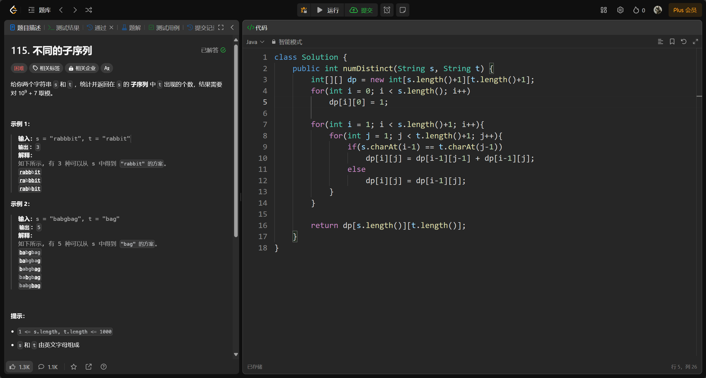

```java
class Solution {
    public int numDistinct(String s, String t) {
        int[][] dp = new int[s.length()+1][t.length()+1];
        for(int i = 0; i < s.length(); i++)
            dp[i][0] = 1;

        for(int i = 1; i < s.length()+1; i++){
            for(int j = 1; j < t.length()+1; j++){
                if(s.charAt(i-1) == t.charAt(j-1))
                    dp[i][j] = dp[i-1][j-1] + dp[i-1][j];
                else
                    dp[i][j] = dp[i-1][j];
            }
        }

        return dp[s.length()][t.length()];
    }
}
```

[代码随想录 (programmercarl.com)](https://www.programmercarl.com/0115.不同的子序列.html#思路)

## 583. 两个字符串的删除操作

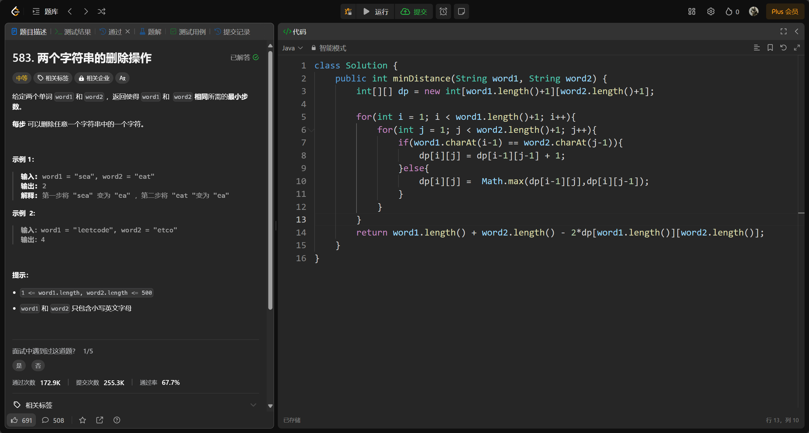

```java
class Solution {
    public int minDistance(String word1, String word2) {
        int[][] dp = new int[word1.length()+1][word2.length()+1];

        for(int i = 1; i < word1.length()+1; i++){
            for(int j = 1; j < word2.length()+1; j++){
                if(word1.charAt(i-1) == word2.charAt(j-1)){
                    dp[i][j] = dp[i-1][j-1] + 1;
                }else{
                    dp[i][j] =  Math.max(dp[i-1][j],dp[i][j-1]);
                }
            }
        }
        return word1.length() + word2.length() - 2*dp[word1.length()][word2.length()];
    }
}
```

## 72. 编辑距离⭐

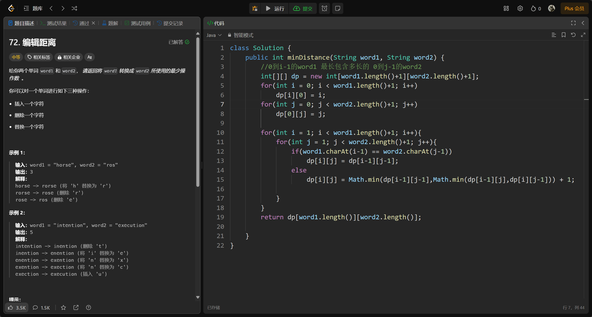

```java
class Solution {
    public int minDistance(String word1, String word2) {
        //0到i-1的word1 最长包含多长的 0到j-1的word2
        int[][] dp = new int[word1.length()+1][word2.length()+1];
        for(int i = 0; i < word1.length()+1; i++)
            dp[i][0] = i;
        for(int j = 0; j < word2.length()+1; j++)
            dp[0][j] = j;

        for(int i = 1; i < word1.length()+1; i++){
            for(int j = 1; j < word2.length()+1; j++){
                if(word1.charAt(i-1) == word2.charAt(j-1))
                    dp[i][j] = dp[i-1][j-1];
                else
                    dp[i][j] = Math.min(dp[i-1][j-1],Math.min(dp[i-1][j],dp[i][j-1])) + 1;

            }
        }
        return dp[word1.length()][word2.length()];
        
    }
}
```

## 647. 回文子串⭐

[647. 回文子串 - 力扣（LeetCode）](https://leetcode.cn/problems/palindromic-substrings/)

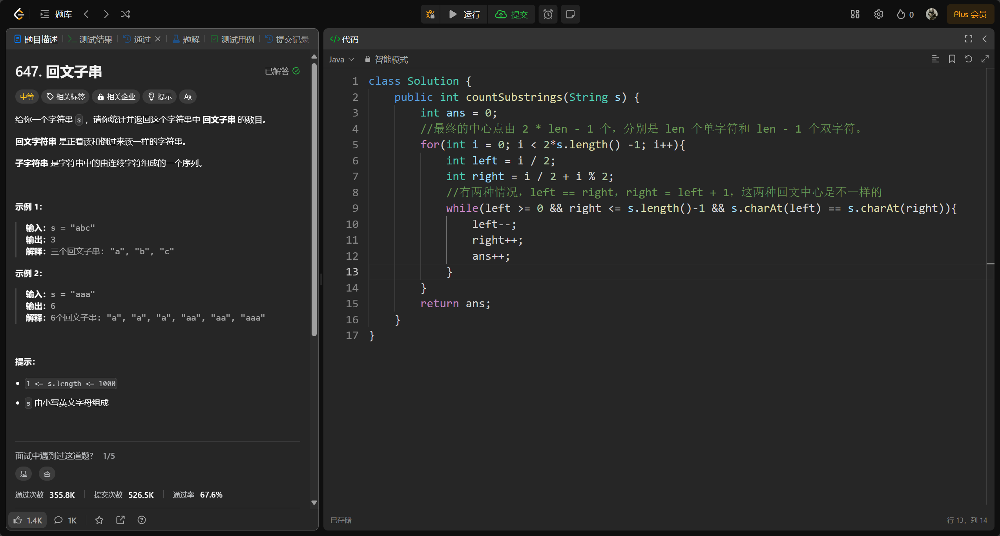

```java
class Solution {
    public int countSubstrings(String s) {
        int ans = 0;
        //最终的中心点由 2 * len - 1 个，分别是 len 个单字符和 len - 1 个双字符。
        for(int i = 0; i < 2*s.length() -1; i++){
            int left = i / 2;
            int right = i / 2 + i % 2;
            //有两种情况，left == right，right = left + 1，这两种回文中心是不一样的
            while(left >= 0 && right <= s.length()-1 && s.charAt(left) == s.charAt(right)){
                left--;
                right++;
                ans++;
            }
        }
        return ans;
    }
}
```

## 516.最长回文子序列⭐

[516. 最长回文子序列 - 力扣（LeetCode）](https://leetcode.cn/problems/longest-palindromic-subsequence/description/)


```java
class Solution {
    public int longestPalindromeSubseq(String s) {
        int[][] dp = new int[s.length()][s.length()];

        for(int i = 0; i < s.length(); i++)
            dp[i][i] = 1;
        for(int i = s.length()-1; i >= 0; i--){
            for(int j = i+1; j < s.length(); j++){
                if(s.charAt(i) == s.charAt(j))
                    dp[i][j] = dp[i+1][j-1] + 2;
                else
                    dp[i][j] = Math.max(dp[i+1][j],dp[i][j-1]);
            }
        }
        return dp[0][s.length()-1];
    }
}
```


​	
